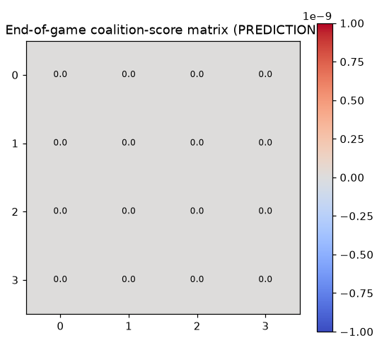

<!--
OFFICIAL PhD TITLE (keep consistent across all documents):
EN: Research on the possibilities for applying Artificial Intelligence in computer games
BG: Изследване на възможностите за приложение на изкуствения интелект в компютърни игри
-->
---
title: "Step 11 Summary — Dynamic Coalition Formation in Competitive FFA Games (So Long Sucker)"
subtitle: "Research on the possibilities for applying Artificial Intelligence in computer games"
author: "Alexander Andreev"
date: "July 2026"
lang: en
vars:
  research_focus: "Adaptive Strategy Learning in Multi-Agent Imperfect-Information Environments"
---

# Step 11 — Dynamic Coalition Formation in Competitive FFA Games

This is a ground-up chapter on the thing that only exists once a game has a **third player**:
temporary **alliances** that form, get exploited, and get betrayed. It builds the first
coalition-aware reinforcement-learning treatment of **So Long Sucker (SLS)** — the 1950 game Nash,
Shapley, Shubik & Hausner designed to study exactly this — and uses it to internalize the jump from
$N=2$ to $N\ge 3$, where **Nash and exploitability stop being tractable *and* stop being
meaningful**, so "did it work?" can no longer be a single number. It serves two purposes — a
self-contained primer for later steps and a primary source for the thesis's multi-agent
contributions. It is written to be read on its own. **All experimental numbers reported here were
measured** on reproducible runs and, wherever possible, are bounded by *exact* references (textbook
Shapley/core values for the cooperative-game toys; an exact 2-player minimax solver for the SLS
endgame). Where a run contradicted what I expected — including a real engine bug — I keep the
original expectation and reconcile it with what happened; those gaps are the most instructive parts
of the step.

**Where this sits in the thesis.** Steps 2-10 all leaned on a 2-player game with an *exact*
best-response oracle. Step 11 removes it and enters the frontier. Three thesis hooks live here. The
**coalition detector** lifts opponent modeling from "what kind of player is this?" to "who is allied
with whom?" (Contribution #1). The **safe baseline loses its Nash anchor** — with an empty core there
is no stable allocation, so "safe" must become behavioral/population-based (piKL), the gap this step
frames but does not close (Contribution #2). And the **EGTA meta-game + Shapley credit** replaces
exploitability, which has no meaning against a coalition (Contribution #3).

---

## 1. Why the third player changes everything

With two players, a zero-sum game has a *value*: there is a minimax-optimal strategy, and "how far
from optimal are you?" (exploitability) is a single, meaningful number that anchored every step since
Step 2. Add a third player and the ground shifts. Now two players can **gang up** on the third, and
the interesting question is not "what is the equilibrium?" but "who allies with whom, for how long,
and who betrays first?" Nash equilibrium in a 4-player free-for-all is both **intractable** to
compute and **strategically empty** — it says nothing about the coalitions that actually decide the
game.

A picture to hold onto: a **dinner party** with four guests and one house. Everyone pairs up to get
things done, but the smartest move is to have quietly betrayed your partner one turn *before* they
betray you. So Long Sucker makes this literal: you hold coloured chips, you place them into other
players' piles (a handshake) or capture their piles (the knife), and you are eliminated when you run
out. The whole alliance is **encoded in the moves themselves** — there is no separate negotiation
phase to model, which is exactly why a detector can read the coalition straight off the move stream.

The consequence for methodology is the single most important idea in the step: **at $N\ge 3$ you
trade exact evaluation for empirical evaluation.** No exploitability; instead win-rate, a coalition
score from the detector, and the cyclic ratio of an empirical meta-game — all anchored by the one
subgame that *is* exactly solvable, the 2-player endgame.

> **Read more:** Nash, Shapley, Shubik & Hausner (1950s), *So Long Sucker* (the game itself); and De
> Carufel, J. & Jerade, M. — the 2-player SLS endgame analysis that gives the one exact anchor.

---

## 2. The coalition detector — reading alliances off the moves

The first tool generalizes opponent modeling. Instead of inferring a hidden *type* or *hand* (Step
7), the detector infers a hidden *social structure*. It watches the move log and accumulates two
matrices: **help** (player $i$ placed a chip into player $j$'s pile) and **harm** (player $i$
captured player $j$'s pile). Their difference is **net support**; the pair with the highest mutual
net support is the strongest coalition.

Does it work? We script two players to systematically help each other and harm the rest, tell the
detector nothing, and ask it to name the coalition. Measured, it recovers the planted $\{0,1\}$
alliance **exactly**, with a well-separated score ($10.0$ on the allied pair, $0$ or $-1$ everywhere
else). The alliance is fully legible from chip placement alone.

> **Read more:** the Step 07 opponent-modeling engine (this repo) — the "observe actions -> update
> beliefs" principle the detector re-derives as help/harm matrices.

---

## 3. Shapley credit for a competitive game

If we want an agent to *learn* to form coalitions, we need a reward signal that says "you contributed
to a coalition." The classical tool is the **Shapley value**: the unique fair way to split a
coalition's worth among its members, averaging each member's marginal contribution over all join
orders. Two textbook toys pin down what "fair" and "stable" mean, and both reproduce exactly:

| Cooperative-game toy | Shapley value | Core (stability) |
|---|---|---|
| Glove game | $(2/3,1/6,1/6)$ | **non-empty** (a stable split exists) |
| 3-player majority | $(1/3,1/3,1/3)$ | **empty** (no stable split) |

The **empty core** of the majority game is the conceptual heart of the step: it is a game where *any*
allocation can be overturned by some coalition, so cooperation is *inherently unstable*. That is the
SLS situation — and the reason N-player "safe" play cannot be anchored to a stable equilibrium
(Contribution #2).

SLS is competitive, not cooperative — there is no shared pot to split — so we **redefine the coalition
value** as *the probability that a member of the coalition wins*, estimated by Monte-Carlo rollouts.
Each player's credit is then the Shapley value of that win-probability function. Measured on SLS
positions: a genuinely symmetric position gives near-equal credit (spread $0.013$), and an asymmetric
$[8,8,1,1]$ position hands *all* credit to the strong pair (coalition value $1.0$). The symmetric
result is reported **after** a bug fix — see the reconciliation below.

![Shapley credit attribution on SLS positions: near-flat across seats in the symmetric case (spread 0.013, post-fix), and fully concentrated on the strong pair in the asymmetric [8,8,1,1] case. Credit tracks real contribution once the engine tie-break is unbiased.](impl_shapley_attribution.png)

> **Reconciliation (kept prediction -> what actually happened).** I predicted a symmetric position
> would give a symmetric credit spread ($<0.15$). The first run gave $0.54$ — a red FAIL — with
> Player 0 winning ~2x its fair share across three independent scripts. Suspecting the engine before
> the prediction, I found the mechanism: **~99.5% of random SLS games end in a deadlock** (all live
> hands empty), so the winner is decided by a most-chips **tie-break** — whose lowest-index rule
> quietly handed seat 0 its edge. An **unbiased random tie-break** fixed it: symmetric spread
> $0.54\to 0.013$, all-random winners now uniform. It also revealed that an impressive $\sim 0.87$
> hero win-rate had been the *same* artifact (the hero always sat in seat 0); the fair number is
> $\sim 0.41$. The lesson: in a game that almost always ends in a near-tie, the tie-break rule is the
> most load-bearing line in the engine, and a symmetric *position* is not a symmetric *outcome* until
> it is unbiased.

> **Read more:** Shapley, L. S. (1953). "A value for n-person games." *Contributions to the Theory of
> Games*; Chalkiadakis, Elkind & Wooldridge (2011), *Computational Aspects of Cooperative Game
> Theory* (core, Shapley, nucleolus); and Wang et al. on Shapley-based credit assignment in MARL.

---

## 4. Coalition-aware MAPPO — and when coalitions actually emerge

Now we train. Each SLS seat is a masked, episodic PPO agent learning by self-play. The reward is a
**blend**:
$$ r = (1-\alpha)\,r_{\text{sparse}} \;+\; \alpha\,\text{(Shapley coalition credit)}, $$
where $r_{\text{sparse}}$ is the sparse winner-takes-all reward and the credit term is the
win-probability Shapley value from §3 (a cheap critic-value **proxy**, or an expensive rollout
**counterfactual**). The blend weight $\alpha$ dials between "just win" and "form coalitions."

Do coalition-aware agents form coalitions more than sparse agents? The honest answer required a
**5-seed paired sweep** over $\alpha\times$ credit-mode $\times$ synergy, because a single config
misled me badly (below). Measured (paired gap = coalition score of Shapley agents minus sparse
agents; `**` = significant at $>2\times$ SE):

| Regime | Paired gap (Shapley - sparse) |
|---|---|
| scale, proxy, $\alpha=0$, synergy $0.3$ | **$+0.0376 \pm 0.0103$** (~4.4x the sparse baseline) |
| scale, counterfactual, $\alpha=0$ | **$+0.0128 \pm 0.0026$** |
| any tier, $\alpha \ge 0.3$ | $-0.001 \ldots -0.004$ (negative) |
| smoke, proxy, $\alpha=0$, synergy $0.1$ | **$+0.0024 \pm 0.0008$** (tiny) |

> **Reconciliation (kept prediction -> what actually happened).** My single-config runs used the
> default $\alpha=0.3$ and showed the coalition signal collapse at scale — which I first read as "the
> proxy credit is too weak once training is longer." The sweep overturned that completely: **$\alpha$
> is the dominant knob, and $0.3$ is a dead zone.** Coalitions emerge significantly *only at low
> $\alpha$* (at $\alpha\approx 0$ the Shapley agent beats sparse by $+0.038$, ~4.4x), while *every*
> $\alpha\ge 0.3$ cell is negative — the sparse winner-takes-all term drowns the coalition signal.
> Two further surprises: the effect **grows with game size** (opposite to my "smoke-positive /
> scale-null" read, which was an artifact of holding $\alpha=0.3$ at both tiers), and the **cheap
> proxy beats the expensive counterfactual**. So the primary thesis signal (coalition-forming) is
> real and robust — I had simply measured it in the one regime where the sparse term hides it. The
> fix is "weight the coalition credit heavily," not "compute a truer credit."

There is no free lunch: pure coalition credit ($\alpha=0$) drops win-rate to $\sim 0.29$ (near the
$0.25$ random floor), while $\alpha\ge 0.1$ keeps it $\sim 0.52$. Coalition-*forming* is the primary
target and winning is secondary — exactly the raw step's framing, now quantified.

> **Read more:** the Step 09 MARL stack (this repo) for MAPPO with a centralized critic; and Bakhtin
> et al. (2022) on **piKL** — regularizing toward a behavioral prior instead of Nash, the N-player
> safe-play recipe this step points at.

---

## 5. EGTA and the spinning top — is SLS a wheel or a ladder?

The final tool evaluates the *population*. **Empirical game-theoretic analysis (EGTA)** treats whole
strategies as the atoms of a meta-game, plays every pair to fill an empirical payoff matrix, and
analyzes its structure. To reuse Step 9's meta-Nash solver and Step 10's **spinning-top** (Hodge)
decomposition — both 2-player tools — the 4-player payoff *tensor* is **projected** to a pairwise
matchup matrix, then split into a **transitive** (skill-ladder) component and a **cyclic**
(rock-paper-scissors) component.

Step 10 predicted FFA coalition games would be strongly cyclic. Measured, it depends entirely on
**which population you decompose** — the same lesson Step 10 taught:

| Population | Cyclic ratio | Structure |
|---|---|---|
| Skill-ladder pool | $0.25$-$0.31$ | transitive-dominant (a ladder) |
| Coalition pool (ally/betray strategies) | $\sim 0.57$-$0.69$ | strongly cyclic (a wheel) |

> **Reconciliation (kept prediction -> what actually happened).** I expected a large cyclic
> component and, at first, saw a near-perfect skill ladder (cyclic $\sim 0.07$). That was partly the
> seat-0 bug (§3) and partly **pool composition**: the default baseline pool *is* a skill ladder. A
> coalition pool (fixed-ally + betrayer strategies) pushes the cyclic ratio to $\sim 0.57$-$0.69$ — a
> large non-transitive component that strongly confirms the *direction* of the prediction, but stays
> **honestly short of strict dominance** (cyclic$^2$ just under $0.5$). The prime suspect for the
> residual is that the **2-type projection discards 3-/4-player coalition effects** — a tensor-native
> decomposition is the open question. Neither reading is a bug; which population you build decides
> whether SLS looks like a wheel or a ladder.

> **Read more:** Balduzzi, D. et al. (2019). "Open-ended Learning in Symmetric Zero-sum Games."
> *ICML* (the spinning top); and Lanctot, M. et al. (2017), the PSRO / EGTA line (Step 9-10 stack).

---

## 6. Honest notes, limitations, and where this hands off

**What held up.** The exact anchors are solid: the SLS engine matches the 2-player minimax endgame
with **zero** mismatches; the detector recovers a planted coalition **exactly** ($\{0,1\}$, score
$10.0$); the Shapley code reproduces the glove and majority toys — *including their core* — to four
decimals. And the headline learning claim survives a 5-seed sweep: coalition-aware training produces
significantly more coalition behavior ($+0.038$, ~4.4x) in the low-$\alpha$ regime.

**What did not, and why it matters.** Two honest corrections travel forward. (1) The "symmetric" game
was not symmetric — a most-chips **tie-break bug** handed seat 0 ~2x its fair share and inflated the
hero win-rate from a true $\sim 0.41$ to a false $\sim 0.87$; fixed, but it proves the engine's
*rules*, not its solver, are where the risk lives. (2) "Coalitions don't emerge at scale" was a
**mis-set blend weight** ($\alpha=0.3$ is a dead zone), not a failure of the method. A methodological
echo of Steps 9-10: **a single config hides what a seeded sweep reveals.**

**Trust.** Every exact target (endgame minimax, cooperative-GT toys) is deterministic and
reproducible; the training claims rest on a 5-seed paired sweep with error bars, so the *directions*
are the trustworthy claims, not third-decimal magnitudes. The standing caveat is **engine fidelity**:
the engine is certified against its own ruleset, not a transcription of De Carufel & Jerade — and the
tie-break bug shows that reconciliation is not cosmetic. (The committed `scale_results.json` is a
pre-fix artifact, cited only as evidence of the bug; authoritative scale numbers come from the
sweep.)

**Backward and forward connections.** Backward: the detector is Step 7's opponent model lifted to
social structure; the meta-Nash and spinning-top are Steps 9-10 reused on the projected meta-game;
the empty core makes Step 8's "safe = bounded deviation from Nash" impossible, forcing piKL's
behavioral prior. Forward: the behavioral-prior safety gap points at **Step 12** (language /
negotiation, CICERO / Welfare-Diplomacy), and the EGTA-tensor evaluation is the multi-agent
generalization of exploitability that **Step 14** inherits (Contribution #3).

**Open questions.** Does the SLS engine match De Carufel & Jerade's exact rules (the tie-break bug
says this matters)? Does a 3-/4-player-aware EGTA projection push the cyclic ratio past strict
dominance? Is the cheap proxy credit "good enough" in general, or only on SLS? And underneath all of
it: with no Nash value and an empty core, **what does "safe" even mean** for an N-player coalition
setting — the Contribution #2 gap this step frames but does not close.

---

## Key takeaways for the thesis synthesis

- **At $N\ge 3$, exact evaluation is gone.** Nash is intractable and strategically empty in 4-player
  FFA; evaluation becomes empirical (win-rate + coalition score + EGTA cyclic ratio), anchored by the
  one exactly-solvable subgame (the 2-player minimax endgame, $0$ mismatches).
- **Coalitions can be *learned* — but only if you weight the credit.** The Shapley coalition signal
  beats sparse reward by $+0.038$ (~4.4x, 5 seeds) at low $\alpha$, and is *suppressed* at
  $\alpha\ge 0.3$; the effect grows with game size, and the cheap proxy beats the expensive
  counterfactual.
- **Coalition-forming costs winning.** $\alpha=0$ drops win-rate to the $\sim 0.25$ floor; $\alpha\ge
  0.1$ restores $\sim 0.52$ — forming is primary, winning secondary, quantified.
- **Empty core $\Rightarrow$ structural instability.** The majority game's empty core is the SLS
  situation: no stable allocation exists, so coalitions *will* break — which is why N-player "safe"
  play needs a behavioral prior (piKL), not a Nash/core anchor (Contribution #2).
- **Which population you decompose decides ladder-vs-wheel** (the Step-10 lesson, confirmed): a
  skill-ladder pool looks transitive ($\sim 0.3$ cyclic), a coalition pool looks strongly cyclic
  ($\sim 0.57$-$0.69$).
- **Engine rule fidelity outranks solver code.** Both remaining weaknesses (the seat bias, the
  sub-dominant cyclic ratio) live in the engine's simplifications, not in the Shapley/EGTA math —
  which passed its textbook checks exactly.
