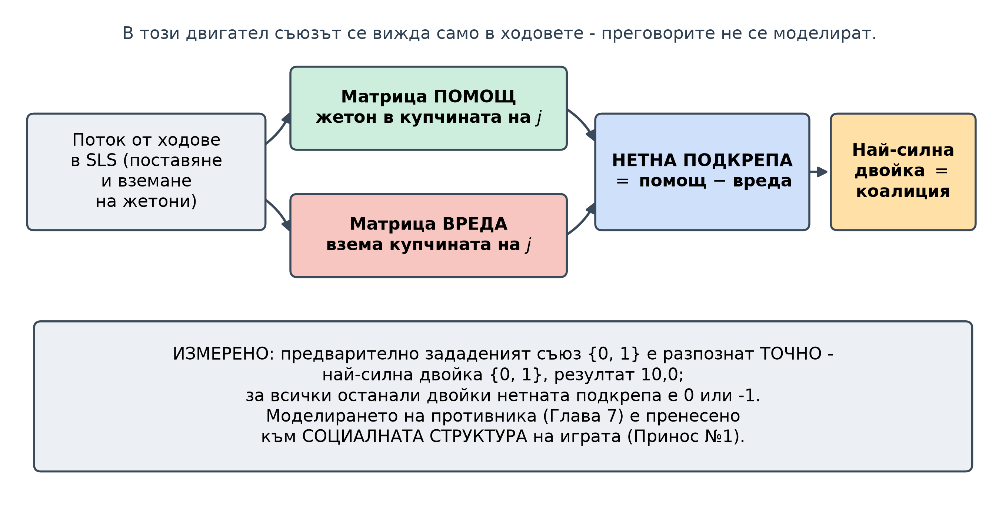
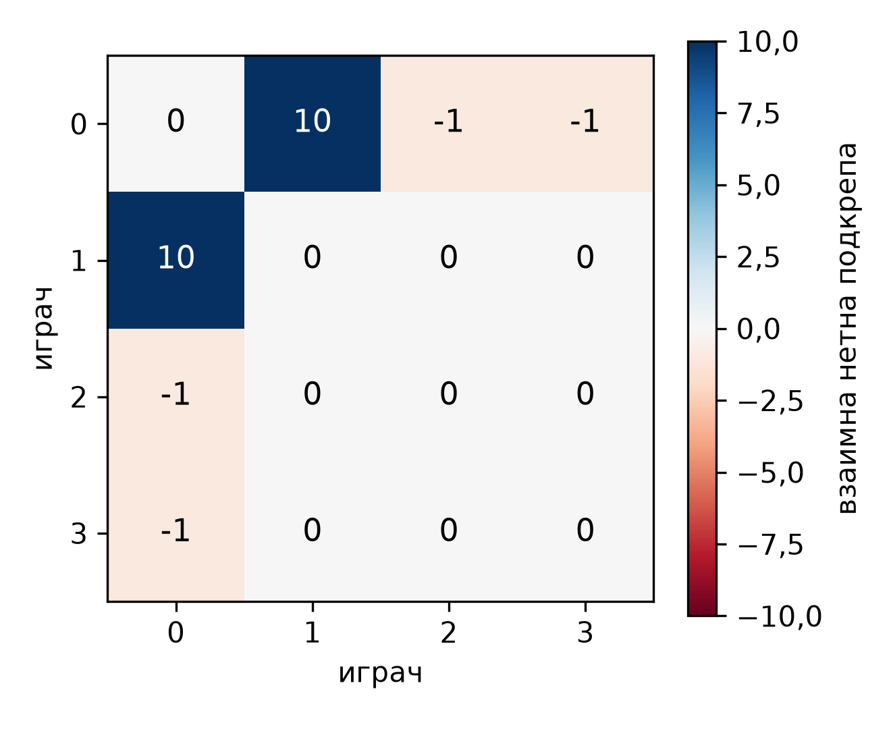
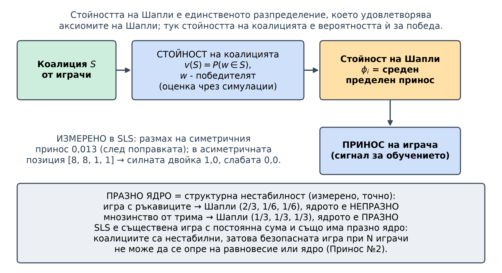
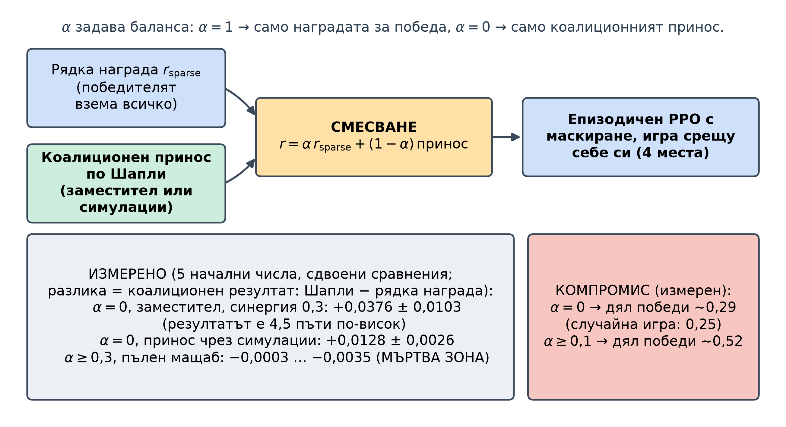
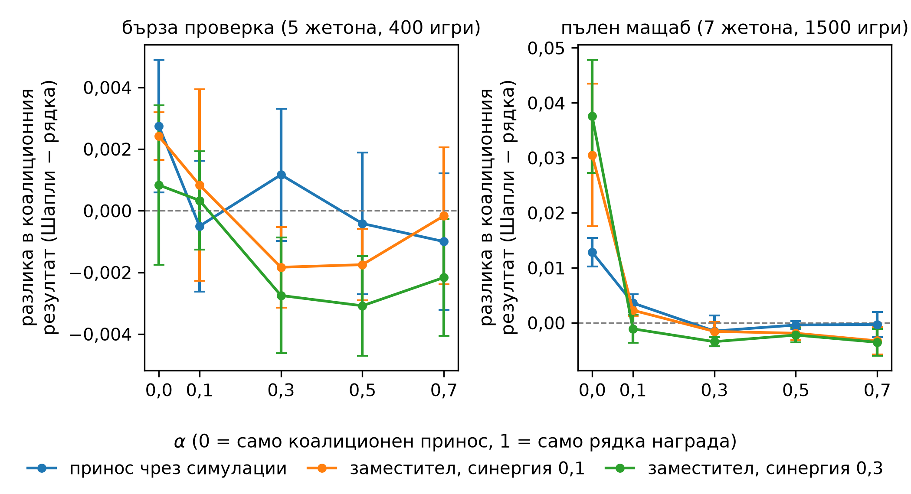
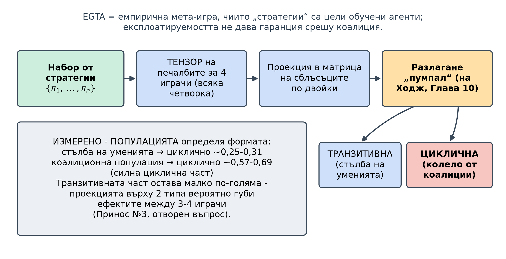

<!--
OFFICIAL PhD TITLE (keep consistent across all documents):
EN: Research on the possibilities for applying Artificial Intelligence in computer games
BG: Изследване на възможностите за приложение на изкуствения интелект в компютърни игри
-->

---
title: "Глава 11 Обобщение – Формиране и засичане на коалиции"
subtitle: "Изследване на възможностите за приложение на изкуствения интелект в компютърни игри"
author: "Alexander Andreev"
date: "July 2026"
lang: bg
vars:
  research_focus: "Adaptive Strategy Learning in Multi-Agent Imperfect-Information Environments"
---

# Глава 11 – Формиране и засичане на коалиции

Тази глава е за нещо, което възниква едва когато една игра има **трети играч**: временни **съюзи**, които се формират, експлоатират и предават. Тя използва **So Long Sucker (SLS)** – играта за четирима на Hausner, Nash, Shapley и Shubik, публикувана през 1964 г., в която изходът зависи почти изцяло от договарянето между играчите[^hausner1964], – и допълва единствения публикуван подход с обучение с подкрепление за нея[^sharan2024], чиито агенти не отчитат **коалициите**, с детектор на коалиции и награда по Шапли. При $N\ge 3$ **равновесието на Наш и експлоатируемостта стават изчислително непосилни *и* губят смисъла си**, така че на въпроса „проработи ли?“ вече не може да се отговори с едно-единствено число. Числата са измерени и, когато е възможно, са поставени в рамките на *точни* еталонни стойности (учебниковите стойности на Шапли и ядрото; точен минимаксен решавач за крайната фаза на SLS с двама играчи). Когато някое изпълнение противоречи на очакванията ми – включително истинска грешка в двигателя на играта – запазвам очакването и го съпоставям с действителния резултат.

**Къде се вписва това в дисертацията.** Глава 11 се отказва от *точния* предсказвач за най-добър отговор при двама играчи, на който разчитаха глави 2–10. **Детекторът на коалиции** пренася моделирането на противника от въпроса „какъв тип играч е това?“ към въпроса „кой с кого е в съюз?“ (Принос №1). **Безопасната базова линия губи опората си в равновесието на Наш** – без минимаксна стойност и при празно ядро няма стабилно разпределение, на което да се опре безопасността; поведенческа опорна стратегия по подобие на piKL е кандидат без гаранция – празнина, която главата очертава, но не запълва (Принос №2). Мета-играта на **EGTA** и **приносът по Шапли** заместват експлоатируемостта, която при повече от двама играчи вече не показва какво е гарантирано на агента, още по-малко срещу коалиция (Принос №3).

---

## Защо появата на трети играч е повратна точка

С двама играчи една игра с нулева сума има *стойност*: съществува оптимална по минимакс стратегия и „колко далеч сте от оптималната?“ (експлоатируемост) е едно-единствено смислено число, на което се опираше всяка глава от Глава 2 насам. С трети играч двама играчи могат да **се обединят** срещу третия и интересният въпрос става „с кого се съюзява кой, за колко дълго и кой предава пръв?“. Равновесието на Наш в игра всеки срещу всеки с четирима играчи е едновременно **изчислително непосилно** и **лишено от гаранции**: намирането му е поне толкова трудно, колкото при общите игри с двама играчи[^daskalakis2009], ако всеки играч избере равновесие независимо от другите, получената комбинация може изобщо да не е равновесие[^pluribus], а освен това то защитава само от едностранни отклонения, а не от съвместните отклонения на коалициите, които всъщност определят изхода от играта[^bernheim1987].

Полезна аналогия: **вечеря** с четирима гости и една къща. Всеки се съюзява по двойки, за да свърши работата, но най-умният ход е тихо да предадете партньора си един ход *преди* той да ви предаде. So Long Sucker прави това буквално: държите цветни **жетони**, поставяте ги в купчините на други играчи (ръкостискане) или вземате техните купчини (ножът), и бивате елиминирани, когато останете без **жетони**. В двигателя на тази глава съюзът е **кодиран изцяло в ходовете**: преговорите, които в истинската игра са свободни и необвързващи, не се моделират, затова детекторът може да прочете коалицията директно от потока от ходове.

Последствието за методологията е най-важната идея в тази глава: **при $N\ge 3$ точната оценка отстъпва място на емпиричната.** Вместо експлоатируемост се използват делът на победите, коалиционният резултат от детектора и цикличното съотношение на емпиричната мета-игра, закотвени в единствената подигра, която *е* точно решима: крайната фаза с двама играчи.

---

## Детекторът на коалиции – извличане на съюзи от ходовете

Вместо да извежда скрит *тип* или *ръка* (Глава 7), детекторът извежда скрита *социална структура*. Той следи дневника на ходовете и натрупва две матрици: **помощ** (играч $i$ поставя жетон в купчината на играч $j$) и **вреда** (играч $i$ взема купчината на играч $j$). Разликата между тях е **нетна подкрепа**, а двойката с най-висока взаимна нетна подкрепа представлява най-силната коалиция.

Когато двама програмирани играчи систематично си помагат и вредят на останалите, детекторът, без да получи никаква информация, разпознава **точно** предварително зададената коалиция $\{0,1\}$, с отчетливо по-висок резултат ($10{,}0$ за съюзническата двойка, $0$ или $-1$ навсякъде другаде). Това е проверка срещу една програмирана, открито действаща двойка; честотата на фалшивите тревоги при игра без съюзи и разпознаването на прикрити съучастници не са проверявани.

---

## Принос по Шапли в състезателна игра

За да се *научи* да формира коалиции, **агентът** се нуждае от **награда**, която да показва „ти допринесе за една коалиция“. Класическият инструмент е **стойността на Шапли**: единственото разпределение на стойността на коалицията между членовете ѝ, което удовлетворява аксиомите на Шапли (ефективност, симетрия, нулев играч, адитивност); то осреднява пределния принос на всеки член по всички възможни редове на присъединяване. Две учебникови игри определят какво означават „справедливо“ и „стабилно“, като и двете се възпроизвеждат точно:

| Опростена кооперативна игра | Стойност на Шапли | Ядро (стабилност) |
|---|---|---|
| Игра с ръкавиците | $(2/3,1/6,1/6)$ | **непразно** (съществува стабилно разпределение) |
| Мнозинство от трима играчи | $(1/3,1/3,1/3)$ | **празно** (няма стабилно разпределение) |

: Стойност на Шапли и стабилност на ядрото при два опростени кооперативни модела.

**Празното ядро** на играта на мнозинството е ключовата идея на главата: *всяко* разпределение може да бъде оспорено от някаква коалиция, така че сътрудничеството е *по своята същност нестабилно*. SLS е игра с постоянна сума (печели само един), а всяка съществена игра с постоянна сума има празно ядро[^ferguson]; следователно и коалиционната игра на SLS, в която стойността на коалицията е гарантираната ѝ вероятност за победа, няма стабилно разпределение (играта е съществена, защото никой играч не може сам да си гарантира победа). Заедно с липсата на минимаксна стойност при повече от двама играчи това обяснява защо „безопасната“ игра при N играчи не може да се опре на стабилно равновесие (Принос №2).

В SLS няма обща печалба, която да се поделя, затова **предефинираме стойността на коалицията** като *вероятността неин член да спечели*, оценена чрез симулации по метода Монте Карло; приносът на всеки играч е стойността на Шапли на тази функция на вероятността за победа. Резултати върху позиции в SLS: наистина симетрична позиция дава почти равни приноси (размах $0{,}013$), а асиметричната позиция $[8,8,1,1]$ приписва *целия* принос на силната двойка (стойност на коалицията $1{,}0$). Симетричният резултат е получен **след** отстраняване на грешка.[^shapley1953]

![Принос по Шапли в две позиции на SLS: почти равен в симетричната позиция (размах 0,013 след поправката) и изцяло съсредоточен върху силната двойка в [8, 8, 1, 1].](impl_shapley_attribution_bg.png)

> **Съпоставка (запазена прогноза → действителен резултат).** Прогнозирах, че симетрична позиция
> ще даде симетрично разпределение на приноса (размах $<0{,}15$). Първото изпълнение даде $0{,}54$ (неуспешна проверка), като
> играч 0 печелеше около два пъти повече от справедливия си дял в три независими скрипта. Механизмът: **~99,5% от случайните игри в този двигател завършват с пат** (всички играчи, останали в играта,
> са без жетони в ръка – опростените правила пропускат играч с празна ръка), затова победителят се определя от правилото при равенство по брой жетони, а то тихомълком даваше предимство на място 0, защото избираше играча с най-малък индекс. **Безпристрастното случайно разрешаване на равенството** отстрани проблема: размахът на симетричния принос спадна от $0{,}54$ на $0{,}013$, а победите вече се разпределят равномерно. Това разкри също, че впечатляващият дял победи $\sim 0{,}87$ на собствения агент е бил *същият* артефакт (агентът винаги е заемал място 0); реалната стойност е
> $\sim 0{,}41$. В игра, която почти винаги завършва с почти равен резултат, правилото при равенство е най-важният ред в кода на двигателя.

---

## MAPPO с отчитане на коалициите – и кога всъщност расте коалиционният резултат

Всяко място в SLS се заема от отделен агент PPO с маскиране на недопустимите ходове, който се обучава по цели епизоди чрез игра срещу себе си. Наградата е **смес**:
$$ r = \alpha\,r_{\text{sparse}} \;+\; (1-\alpha)\,\text{(коалиционен принос по Шапли)}, $$
където $r_{\text{sparse}}$ е рядката награда „победителят взема всичко“, а вторият член е центрираният принос по Шапли от раздел 11.3 – изчислен или евтино, от оценките на оценителя (заместител), или по-скъпо, чрез симулации (в кода `counterfactual`). Теглото $\alpha$ определя баланса между „просто победи“ ($\alpha=1$) и „формирай коалиции“ ($\alpha=0$).

Формират ли агентите, обучени с коалиционен принос, повече коалиции от агентите с рядка награда? Отговорът изискваше **сдвоени сравнения с 5 начални числа** за всички комбинации на $\alpha$, вида на приноса и синергията, тъй като една-единствена конфигурация ме подведе сериозно. Сравненията са на две нива: бърза проверка (5 жетона, 400 игри за обучение) и пълен мащаб (7 жетона, 1500 игри). Сдвоена разлика = коалиционен резултат на агентите с принос по Шапли минус този на агентите с рядка награда; `**` = разлика, по-голяма от две стандартни грешки, което при 5 начални числа отговаря приблизително на $p<0{,}12$:

| Режим | Сдвоена разлика (Шапли – рядка награда) |
|---|---|
| пълен мащаб, заместител, $\alpha=0$, синергия $0{,}3$ | **$+0{,}0376 \pm 0{,}0103$** (резултатът на агентите с принос е ~4,5 пъти този на базовата линия) |
| пълен мащаб, чрез симулации, $\alpha=0$ | **$+0{,}0128 \pm 0{,}0026$** |
| пълен мащаб, $\alpha \ge 0{,}3$ | $-0{,}0003 \ldots -0{,}0035$ (навсякъде отрицателна; при бързата проверка: $-0{,}003 \ldots +0{,}001$, без значими) |
| бърза проверка, заместител, $\alpha=0$, синергия $0{,}1$ | **$+0{,}0024 \pm 0{,}0008$** (много малка) |

: Сдвоена разлика в коалиционния резултат между агентите с принос по Шапли и базовата линия с рядка награда, по режим.

> **Съпоставка (запазена прогноза → действителен резултат).** Експериментите ми с една-единствена конфигурация използваха стойността по подразбиране $\alpha=0{,}3$ и показаха, че коалиционният сигнал изчезва при пълния мащаб, което първоначално тълкувах като „приносът от заместителя е твърде слаб при по-дълго обучение“. Серията експерименти обърна този извод: **$\alpha$ е доминиращият параметър, а $0{,}3$ е мъртва зона.** Коалиционният резултат нараства статистически значимо *само при ниски стойности на $\alpha$* (при $\alpha\approx 0$ агентите с принос по Шапли надминават базовата линия с $+0{,}038$), докато *всяка* клетка с $\alpha\ge 0{,}3$ при пълния мащаб е отрицателна – членът с рядка награда заглушава коалиционния сигнал. Ефектът е също **по-голям при пълния мащаб** (там размерът на играта и продължителността на обучението не са разделени), а **евтиният заместител дава по-силен ефект от скъпата оценка чрез симулации**. Решението е „да се даде голяма тежест на коалиционния принос“, а не „да се изчисли по-точен принос“; дали ефектът отразява формиране на коалиции, още не е проверено.

**Уговорка за механизма.** В `shapley.py` стойността от симулациите е $v(S)=\sum_{i\in S}P(i \text{ печели})$ – адитивна игра, в която стойността на Шапли на всеки играч е просто собствената му вероятност за победа (а в обучението тя се изчислява веднъж за партида, от началното състояние). Центрираният принос на заместителя е пропорционален на собствената оценка на оценителя за агента минус средната за масата; синергията само го мащабира. Нито един от двата сигнала не показва кой на кого помага, а коалиционният резултат е средната *абсолютна* взаимна нетна подкрепа и расте и при взаимна враждебност. Ефектът при ниско $\alpha$ следователно показва, че замяната на наградата за победа с плътен сигнал променя взаимодействията между агентите; дали така възникват коалиции, изисква контролен експеримент с еднакво плътна награда без коалиционна информация.

Няма безплатен обяд: при изцяло коалиционен принос ($\alpha=0$) делът на победите спада до $\sim 0{,}29$ (близо до нивото на случайната игра $0{,}25$), докато $\alpha\ge 0{,}1$ го запазва на $\sim 0{,}52$. Основната цел е формирането на коалиции, а победата е второстепенна, както беше заложено в плана на главата – вече количествено.[^chapter2022]

---

## EGTA и въртящият се пумпал – SLS колело ли е, или стълба?

Крайният инструмент оценява *популацията* чрез **емпиричния игровотеоретичен анализ (EGTA)**, както в раздел 10.7. За да се използват повторно решавачът за мета-равновесие на Наш от Глава 9 и разлагането „пумпал“ (на Ходж) от Глава 10 – и двата инструмента за игри с двама играчи – тензорът на печалбите за четирима играчи се **проецира** в матрица на сблъсъците по двойки, която след това се разлага на **транзитивна** (стълба на уменията) и **циклична** (камък-ножица-хартия) компонента.

Глава 10 предвиди, че коалиционните игри всеки срещу всеки ще бъдат силно циклични. Измерванията показват, че това зависи изцяло от **популацията, която се разлага**:[^balduzzi2019]

| Популация | Циклично съотношение | Структура |
|---|---|---|
| Популация тип „стълба на уменията“ | $0{,}25$–$0{,}31$ | преобладаващо транзитивна (стълба) |
| Коалиционна популация (стратегии „съюзник/предател“) | $\sim 0{,}57$–$0{,}69$ | силна циклична компонента; транзитивната е малко по-голяма |

: Циклично съотношение и структура на две популации в SLS.

> **Съпоставка (запазена прогноза → действителен резултат).** Очаквах голяма циклична компонента и първоначално видях почти съвършена стълба на уменията (циклично съотношение $\sim 0{,}07$). Причината беше отчасти грешката с място 0 (раздел 11.3) и отчасти **съставът на популацията**: базовата популация по подразбиране *е* стълба на уменията. Популация с коалиции (фиксиран съюзник + стратегии „предател“) повишава цикличното съотношение до стойности между $\sim 0{,}57$ и $0{,}69$, което потвърждава *посоката* на прогнозата, но остава **под прага на строго доминиране** (квадратът на цикличното съотношение е малко под $0{,}5$). Основната вероятна причина е, че **проекцията върху двойки типове губи коалиционните ефекти между трима и четирима играчи**; разлагането директно на тензора остава отворен въпрос.

---

## Бележки, ограничения и връзка със следващите глави

Точните опорни точки са надеждни: двигателят съвпада с минимаксното решение на крайната фаза с двама играчи без **нито едно** несъответствие, а кодът за стойността на Шапли възпроизвежда опростените кооперативни игри, *включително тяхното ядро*, с точност до четвъртия знак след десетичната запетая.

**Две поправки остават в сила и за следващите глави.** (1) „Симетричната“ игра не беше симетрична – **грешка в правилото при равенство** по брой жетони даде на място 0 около два пъти по-голям дял от справедливия и завиши дела на победите на собствения агент от реалните $\sim 0{,}41$ до фалшивите $\sim 0{,}87$; грешката е поправена, но показва, че рискът се крие в *правилата* на двигателя, а не в решавача. (2) „Коалициите не възникват при пълния мащаб“ се оказа следствие от **неподходящо тегло на смесване** ($\alpha=0{,}3$ е мъртва зона), а не провал на метода. Както в глави 9–10, **една-единствена конфигурация скрива онова, което разкрива серия експерименти с няколко начални числа.**

**Доверие.** Точните проверки са детерминирани; твърденията за обучението се основават на сдвоени сравнения с 5 начални числа и интервали на грешката, така че *посоките* са надеждните твърдения, а не величините до третия знак след десетичната запетая. Основната уговорка остава **верността на двигателя спрямо правилата**: двигателят е сертифициран спрямо собствения си правилник, а не спрямо формализацията на De Carufel & Jerade[^decarufel2024], и грешката в правилото при равенство показва, че тази сверка не е козметична.

**Връзки.** Назад: моделът на противника от Глава 7 е пренесен към социалната структура; мета-равновесието на Наш и разлагането „пумпал“ от глави 9–10 се прилагат повторно върху проецираната мета-игра; определението от Глава 8 „безопасно = ограничено отклонение от равновесието на Наш“ губи опората си. Напред: Глава 12 разглежда езиковите модели като стратегически агенти, но не и договарянето; безопасността при N играчи (Принос №2) и оценката чрез EGTA върху тензора на печалбите като многоагентно обобщение на експлоатируемостта (Принос №3) остават задачи на дисертацията.

---

## Основни изводи за синтеза на дисертацията

- **При $N\ge 3$ точната оценка отпада.** Оценката става емпирична (дял на победите, коалиционен резултат и циклично съотношение от EGTA), закотвена в минимаксното решение на крайната фаза с двама играчи ($0$ несъответствия).
- **Плътният принос повишава коалиционния резултат, но това още не доказва научени коалиции.** При $\alpha\approx 0$ разликата е $+0{,}038$ (5 начални числа, пълен мащаб), а при $\alpha\ge 0{,}3$ изчезва. Както е реализиран, приносът не показва кой на кого помага; нужна е контролна плътна награда без коалиционна информация (раздел 11.4).
- **Голямата тежест на приноса намалява дела на победите.** $\alpha=0$ понижава дела на победите до $\sim 0{,}29$, близо до нивото на случайната игра ($0{,}25$); при $\alpha\ge 0{,}1$ той се възстановява до $\sim 0{,}52$.
- **Празното ядро означава структурна нестабилност.** Няма стабилно разпределение, затова коалициите *ще* се разпадат, а „безопасната“ игра при N играчи се нуждае от опора, различна от равновесието на Наш или ядрото (Принос №2).
- **Съставът на разлаганата популация определя дали се вижда стълба, или колело** (урокът от Глава 10): популацията „стълба на уменията“ има циклично съотношение $\sim 0{,}3$, а коалиционната – между $\sim 0{,}57$ и $0{,}69$, като транзитивната компонента остава малко по-голяма.
- **Верността към правилата на двигателя е по-важна от кода на решавача.** Пристрастието към място 0 и цикличното съотношение под прага на доминиране се дължат на опростяванията на двигателя; математиката на Шапли и EGTA издържа точно учебниковите проверки.

<!-- Бележки към източниците. Заглавията на чуждоезични източници не се
     превеждат (правило 7 от terminology_EN_BG.md). -->

[^shapley1953]: Shapley, L. S. (1953). "A value for n-person games." В *Contributions to the Theory of Games II* (Annals of Mathematics Studies 28), 307–318. Princeton University Press; Chalkiadakis, G., Elkind, E. & Wooldridge, M. (2011). *Computational Aspects of Cooperative Game Theory*. Morgan & Claypool (ядро, стойност на Шапли, нуклеолус); Wang, J., Zhang, Y., Kim, T.-K. & Gu, Y. (2020). "Shapley Q-Value: A Local Reward Approach to Solve Global Reward Games." *AAAI* 34(5), 7285–7292 (разпределяне на приноса в MARL чрез стойността на Шапли).

[^chapter2022]: Реализацията на MAPPO с централизиран оценител е от Глава 9. piKL (регуларизация на търсенето към стратегия, наподобяваща човешката игра) е въведен от Jacob, A. P. и др. (2022). "Modeling Strong and Human-Like Gameplay with KL-Regularized Search." *ICML*, arXiv:2112.07544, и е приложен в Diplomacy от Bakhtin, A. и др. (2023). "Mastering the Game of No-Press Diplomacy via Human-Regularized Reinforcement Learning and Planning." *ICLR*, arXiv:2210.05492. Опорната стратегия там е имитация на човешка игра и не дава гаранция за безопасност; използването ѝ като опора за безопасна експлоатация при N играчи е предложение на дисертацията.

[^balduzzi2019]: Balduzzi, D. et al. (2019). "Open-ended Learning in Symmetric Zero-sum Games." *ICML*, PMLR 97, 434–443 – разлагане на транзитивна и циклична компонента; Czarnecki, W. M. и др. (2020). "Real World Games Look Like Spinning Tops." *NeurIPS*, arXiv:2004.09468 – геометрията „пумпал“.

[^hausner1964]: Hausner, M., Nash, J., Shapley, L. & Shubik, M. (1964). "So Long Sucker – A Four-Person Game." В M. Shubik (Ed.), *Game Theory and Related Approaches to Social Behavior*, 359–361. New York: Wiley.

[^sharan2024]: Sharan, M. & Adak, C. (2024). "Reinforcing Competitive Multi-Agents for Playing 'So Long Sucker'." *arXiv:2411.11057*.

[^daskalakis2009]: Daskalakis, C., Goldberg, P. W. & Papadimitriou, C. H. (2009). "The Complexity of Computing a Nash Equilibrium." *SIAM Journal on Computing*, 39(1), 195–259.

[^pluribus]: Brown, N. & Sandholm, T. (2019). "Superhuman AI for multiplayer poker." *Science*, 365(6456), 885–890.

[^bernheim1987]: Bernheim, B. D., Peleg, B. & Whinston, M. D. (1987). "Coalition-Proof Nash Equilibria I. Concepts." *Journal of Economic Theory* 42(1), 1–12. DOI 10.1016/0022-0531(87)90099-8.

[^decarufel2024]: De Carufel, J.-L. & Jerade, M. R. (2024). "So Long Sucker: Endgame Analysis." *arXiv:2403.17302*.

[^ferguson]: Ferguson, T. S. *Game Theory* (лекционни записки, UCLA), Part IV "Games in Coalitional Form", § 2.3, Theorem 1.
