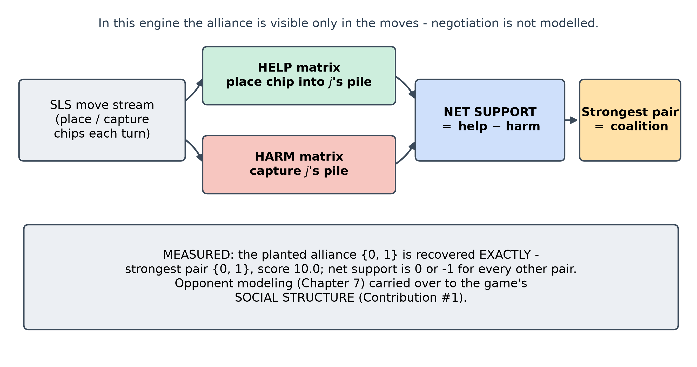
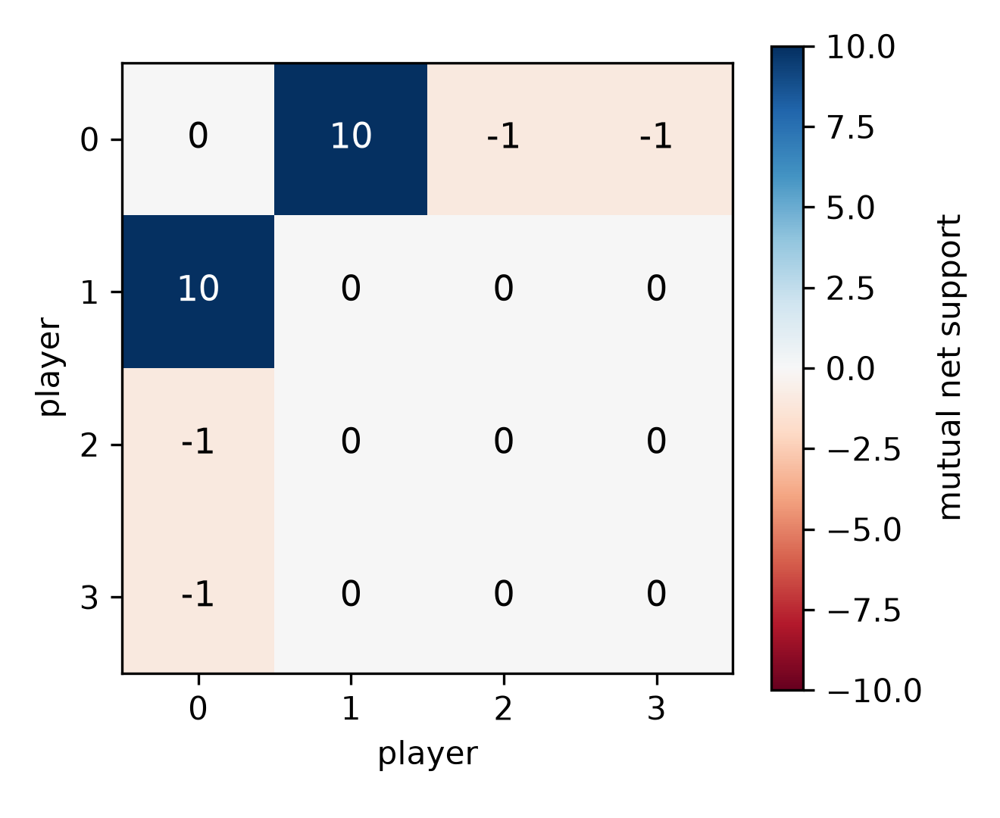
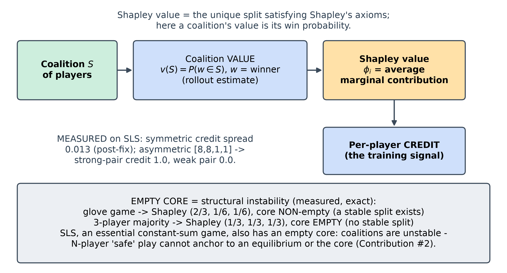
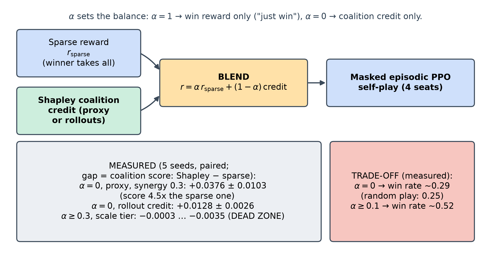
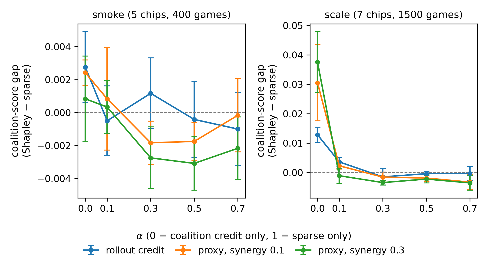
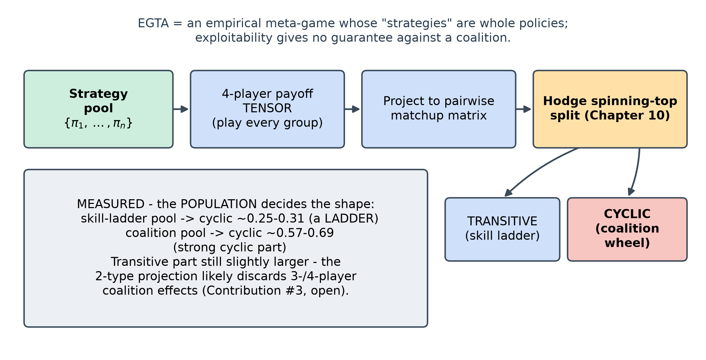

<!--
OFFICIAL PhD TITLE (keep consistent across all documents):
EN: Research on the possibilities for applying Artificial Intelligence in computer games
BG: Изследване на възможностите за приложение на изкуствения интелект в компютърни игри
-->
---
title: "Chapter 11 Summary — Coalition Formation and Detection (So Long Sucker)"
subtitle: "Research on the possibilities for applying Artificial Intelligence in computer games"
author: "Alexander Andreev"
date: "July 2026"
lang: en
vars:
  research_focus: "Adaptive Strategy Learning in Multi-Agent Imperfect-Information Environments"
---

# Chapter 11 — Coalition Formation and Detection

This chapter is about the thing that only exists once a game has a **third player**: temporary
**alliances** that form, get exploited, and get betrayed. It uses **So Long Sucker (SLS)** — the
four-player game of Hausner, Nash, Shapley & Shubik, published in 1964, whose outcome depends almost
entirely on bargaining between the players[^hausner1964] — and extends the only published RL
treatment of it[^sharan2024], whose agents are coalition-blind, with a coalition detector and a
Shapley-based reward. At $N\ge 3$ **Nash and exploitability stop being tractable *and* stop being
meaningful**, so "did it work?" can no longer be a single number. Numbers are measured and, where
possible, bounded by *exact* references (textbook Shapley/core values; an exact 2-player minimax
solver for the SLS endgame); where a run contradicted my expectation, including a real engine bug,
the expectation is kept and reconciled.

**Where this sits in the thesis.** Chapter 11 removes the *exact* 2-player best-response oracle that
Chapters 2-10 leaned on. The **coalition detector** lifts opponent modeling from
"what kind of player is this?" to "who is allied with whom?" (Contribution #1). The **safe baseline
loses its Nash anchor** — with no minimax value and an empty core there is no stable allocation for
safety to rest on; a behavioral anchor in the spirit of piKL is a candidate without a guarantee — the
gap this chapter frames but does not close (Contribution #2). And the **EGTA meta-game + Shapley
credit** stand in for exploitability, which with more than two players no longer measures what an
agent is guaranteed, least of all against a coalition (Contribution #3).

---

## Why the third player changes everything

With two players, a zero-sum game has a *value*: there is a minimax-optimal strategy, and "how far
from optimal are you?" (exploitability) is a single, meaningful number that anchored every chapter since
Chapter 2. Add a third player and two players can **gang up** on the third; the interesting question
becomes "who allies with whom, for how long, and who betrays first?" Nash equilibrium in a 4-player
free-for-all is both **intractable** to compute and **without guarantees**: finding one is at least as
hard as in general two-player games[^daskalakis2009], equilibria chosen independently need not form an
equilibrium[^pluribus], and it guards only against unilateral deviations, not against the coalitions
that actually decide the game[^bernheim1987].

A picture to hold onto: a **dinner party** with four guests and one house. Everyone pairs up to get
things done, but the smartest move is to have quietly betrayed your partner one turn *before* they
betray you. So Long Sucker makes this literal: you hold coloured chips, you place them into other
players' piles (a handshake) or capture their piles (the knife), and you are eliminated when you run
out. In this chapter's engine the alliance is **encoded entirely in the moves**: the free, unenforceable
negotiation of the real game is not modelled, which is why a detector can read the coalition straight
off the move stream.

The methodological consequence is the most important idea in the chapter: **at $N\ge 3$ you trade
exact evaluation for empirical evaluation.** No exploitability; instead win-rate, a coalition score
from the detector, and the cyclic ratio of an empirical meta-game — all anchored by the one subgame
that *is* exactly solvable, the 2-player endgame.

---

## The coalition detector — reading alliances off the moves

Instead of inferring a hidden *type* or *hand* (Chapter 7), the detector infers a hidden *social
structure*. It watches the move log and accumulates two matrices: **help** (player $i$ placed a chip
into player $j$'s pile) and **harm** (player $i$ captured player $j$'s pile). Their difference is
**net support**; the pair with the highest mutual net support is the strongest coalition.

Scripted with two players who systematically help each other and harm the rest, and told nothing,
the detector recovers the planted $\{0,1\}$ alliance **exactly**, with a well-separated score ($10.0$ on the allied pair, $0$ or $-1$ everywhere else).
This is a sanity check against one scripted, overt pair; false positives on non-colluding play and
covert colluders were not tested.

---

## Shapley credit for a competitive game

To *learn* to form coalitions, an agent needs a reward that says "you contributed to a coalition."
The classical tool is the **Shapley value**: the unique split of a coalition's worth that satisfies
Shapley's axioms (efficiency, symmetry, null player, additivity), averaging each member's marginal
contribution over all join orders. Two textbook toys pin down what "fair" and "stable" mean, and both
reproduce exactly:

| Cooperative-game toy | Shapley value | Core (stability) |
|---|---|---|
| Glove game | $(2/3,1/6,1/6)$ | **non-empty** (a stable split exists) |
| 3-player majority | $(1/3,1/3,1/3)$ | **empty** (no stable split) |

: Shapley value and core stability on two cooperative-game toys.

The **empty core** of the majority game is the conceptual heart of the chapter: *any* allocation can
be overturned by some coalition, so cooperation is *inherently unstable*. SLS is constant-sum (only
one player wins), and every essential constant-sum game has an empty core[^ferguson]; so the SLS
coalition game, in which a coalition's value is the win probability it can guarantee, has no stable
allocation either (it is essential because no player can guarantee a win alone). Together with the
absence of a minimax value beyond two players, this is why N-player "safe" play cannot be anchored to
a stable equilibrium (Contribution #2).

SLS has no shared pot to split, so we **redefine the coalition value** as *the probability that a
member of the coalition wins*, estimated by Monte-Carlo rollouts; each player's credit is the Shapley
value of that win-probability function. On SLS positions, a genuinely symmetric position gives
near-equal credit (spread $0.013$), and an asymmetric $[8,8,1,1]$ position hands *all* credit to the
strong pair (coalition value $1.0$). The symmetric result is reported **after** a bug fix.[^shapley1953]

![Shapley credit on two SLS positions: near-equal in the symmetric position (spread 0.013 after the fix), fully concentrated on the strong pair in [8, 8, 1, 1].](impl_shapley_attribution.png)

> **Reconciliation (kept prediction -> what actually happened).** I predicted a symmetric position
> would give a symmetric credit spread ($<0.15$). The first run gave $0.54$ — a red FAIL — with
> Player 0 winning ~2x its fair share across three independent scripts. The mechanism: **~99.5% of
> random games in this engine end in a deadlock**
> (all live hands empty — its simplified rules skip a player with an empty hand), so the winner is
> decided by a most-chips **tie-break** whose lowest-index rule quietly handed seat 0 its edge. An
> **unbiased random tie-break** fixed it: symmetric spread $0.54\to 0.013$, all-random winners now
> uniform. It also revealed that an impressive $\sim 0.87$ hero win-rate had been the *same* artifact
> (the hero always sat in seat 0); the fair number is $\sim 0.41$. In a game that almost always ends
> in a near-tie, the tie-break rule is the most load-bearing line in the engine.

---

## Coalition-aware MAPPO — and when the coalition score actually rises

Each SLS seat is a masked, episodic PPO agent learning by self-play. The reward is a **blend**:
$$ r = \alpha\,r_{\text{sparse}} \;+\; (1-\alpha)\,\text{(Shapley coalition credit)}, $$
where $r_{\text{sparse}}$ is the sparse winner-takes-all reward and the second term is the centered
Shapley credit from Section 11.3, computed either cheaply from critic values (**proxy**) or by
rollouts (**counterfactual** in the code). The weight $\alpha$ dials between "just win" ($\alpha=1$)
and "form coalitions" ($\alpha=0$).

Do coalition-aware agents form coalitions more than sparse agents? Answering required a **5-seed
paired sweep** over $\alpha\times$ credit-mode $\times$ synergy, because a single config misled me
badly. There are two tiers: smoke (5 chips, 400 training games) and scale (7 chips, 1500 games).
Paired gap = coalition score of Shapley agents minus sparse agents; `**` = gap above two standard
errors, which with 5 seeds corresponds to roughly $p<0.12$:

| Regime | Paired gap (Shapley - sparse) |
|---|---|
| scale, proxy, $\alpha=0$, synergy $0.3$ | **$+0.0376 \pm 0.0103$** (Shapley agents' score ~4.5x the sparse baseline's) |
| scale, rollout credit, $\alpha=0$ | **$+0.0128 \pm 0.0026$** |
| scale, $\alpha \ge 0.3$ | $-0.0003 \ldots -0.0035$ (all negative; smoke: $-0.003 \ldots +0.001$, none significant) |
| smoke, proxy, $\alpha=0$, synergy $0.1$ | **$+0.0024 \pm 0.0008$** (tiny) |

: Paired coalition-score gap of Shapley credit over the sparse baseline, per regime.

> **Reconciliation (kept prediction -> what actually happened).** My single-config runs used the
> default $\alpha=0.3$ and showed the coalition signal collapse at scale, which I first read as "the
> proxy credit is too weak once training is longer." The sweep overturned that: **$\alpha$ is the
> dominant knob, and $0.3$ is a dead zone.** The coalition score rises significantly *only at low
> $\alpha$* (at $\alpha\approx 0$ the Shapley agents exceed sparse by $+0.038$), while *every*
> scale-tier $\alpha\ge 0.3$ cell is negative — the sparse term drowns the coalition signal. The
> effect is also **larger in the scale tier** (game size and training length are confounded there),
> and the **cheap proxy beats the expensive rollout credit**. The fix is "weight the coalition credit
> heavily," not "compute a truer credit"; whether the effect reflects coalition formation is not yet
> tested.

**Mechanism caveat.** In `shapley.py` the rollout value is $v(S)=\sum_{i\in S}P(i\text{ wins})$ — an
additive game, in which each player's Shapley value is simply its own win probability (and in
training it is computed once per batch, from the initial state). The centered proxy credit is
proportional to the agent's own critic estimate minus the table mean; synergy only rescales it.
Neither signal encodes who helped whom, and the coalition score is the mean *absolute* mutual net
support, so it also rises with mutual hostility. The low-$\alpha$ effect therefore shows that
replacing the win reward with a dense signal changes how the agents interact; whether coalitions
form that way needs a control with an equally dense reward that carries no coalition information.

There is no free lunch: pure coalition credit ($\alpha=0$) drops win-rate to $\sim 0.29$ (near the
$0.25$ random floor), while $\alpha\ge 0.1$ keeps it $\sim 0.52$. Coalition-*forming* is the primary
target and winning is secondary, as the chapter's plan framed it — now quantified.[^chapter2022]

---

## EGTA and the spinning top — is SLS a wheel or a ladder?

The final tool evaluates the *population* with **empirical game-theoretic analysis (EGTA)**, as in
Section 10.7. To reuse Chapter 9's meta-Nash solver and Chapter 10's **spinning-top** (Hodge)
decomposition — both 2-player tools — the 4-player payoff *tensor* is **projected** to a pairwise
matchup matrix, then split into a **transitive** (skill-ladder) component and a **cyclic**
(rock-paper-scissors) component.

Chapter 10 predicted FFA coalition games would be strongly cyclic. Measured, it depends entirely on
**which population you decompose**:[^balduzzi2019]

| Population | Cyclic ratio | Structure |
|---|---|---|
| Skill-ladder pool | $0.25$-$0.31$ | transitive-dominant (a ladder) |
| Coalition pool (ally/betray strategies) | $\sim 0.57$-$0.69$ | strong cyclic component; transitive still slightly larger |

: Cyclic ratio and structure of two SLS populations.

> **Reconciliation (kept prediction -> what actually happened).** I expected a large cyclic
> component and, at first, saw a near-perfect skill ladder (cyclic $\sim 0.07$). That was partly the
> seat-0 bug (Section 11.3) and partly **pool composition**: the default baseline pool *is* a skill
> ladder. A coalition pool (fixed-ally + betrayer strategies) pushes the cyclic ratio to
> $\sim 0.57$-$0.69$, confirming the *direction* of the prediction but staying **short of strict
> dominance** (cyclic$^2$ just under $0.5$). The prime suspect is that the **2-type projection
> discards 3-/4-player coalition effects**; a tensor-native decomposition is the open question.

---

## Honest notes, limitations, and where this hands off

The exact anchors hold: the engine matches the 2-player minimax endgame with **zero** mismatches, and
the Shapley code reproduces the glove and majority toys, *including their core*, to four decimals.

**Two corrections travel forward.** (1) The "symmetric" game was not symmetric — a most-chips
**tie-break bug** handed seat 0 ~2x its fair share and inflated the hero win-rate from a true
$\sim 0.41$ to a false $\sim 0.87$; fixed, but it proves the engine's *rules*, not its solver, are
where the risk lives. (2) "Coalitions don't emerge at scale" was a **mis-set blend weight**
($\alpha=0.3$ is a dead zone), not a failure of the method. As in Chapters 9-10, **a single config
hides what a seeded sweep reveals.**

**Trust.** The exact targets are deterministic; the training claims rest on a 5-seed paired sweep
with error bars, so the *directions* are the trustworthy claims, not third-decimal magnitudes. The
standing caveat is **engine fidelity**: the engine is certified against its own ruleset, not against
the De Carufel & Jerade formalization[^decarufel2024], and the tie-break bug shows that reconciliation
is not cosmetic.

**Connections.** Backward: Chapter 7's opponent model is lifted to social structure; Chapters 9-10's
meta-Nash and spinning-top tools are reused on the projected meta-game; Chapter 8's "safe = bounded
deviation from Nash" loses its footing.
Forward: Chapter 12 treats language models as strategic agents but not negotiation; N-player safety
(Contribution #2) and EGTA on the payoff tensor as a multi-agent generalization of exploitability
(Contribution #3) remain tasks for the thesis.

---

## Key takeaways for the thesis synthesis

- **At $N\ge 3$, exact evaluation is gone.** Evaluation becomes empirical (win-rate + coalition
  score + EGTA cyclic ratio), anchored by the 2-player minimax endgame ($0$ mismatches).
- **A dense credit raises the coalition score, which is not yet evidence of learned coalitions.** At
  $\alpha\approx 0$ the gap is $+0.038$ (5 seeds, scale tier); at $\alpha\ge 0.3$ it vanishes. The
  credit as implemented does not encode who helped whom; a coalition-free dense-reward control is
  needed (Section 11.4).
- **Weighting the credit costs winning.** $\alpha=0$ drops win-rate to $\sim 0.29$, near the $0.25$
  random level; $\alpha\ge 0.1$ restores $\sim 0.52$.
- **Empty core $\Rightarrow$ structural instability.** No stable allocation exists, so coalitions
  *will* break and N-player "safe" play needs an anchor other than Nash or the core (Contribution #2).
- **Which population you decompose decides ladder-vs-wheel** (the Chapter 10 lesson): a skill-ladder
  pool is $\sim 0.3$ cyclic, a coalition pool $\sim 0.57$-$0.69$, with the transitive part still
  slightly larger.
- **Engine rule fidelity outranks solver code.** The seat bias and the sub-dominant cyclic ratio trace
  to the engine's simplifications; the Shapley/EGTA math passed its textbook checks exactly.

<!-- Source footnotes. Definitions may sit anywhere at top level; keeping them
     together here keeps the prose readable and the EN/BG pair easy to compare. -->

[^shapley1953]: Shapley, L. S. (1953). "A value for n-person games." In *Contributions to the Theory of Games II* (Annals of Mathematics Studies 28), 307–318. Princeton University Press; Chalkiadakis, G., Elkind, E. & Wooldridge, M. (2011). *Computational Aspects of Cooperative Game Theory*. Morgan & Claypool (core, Shapley value, nucleolus); Wang, J., Zhang, Y., Kim, T.-K. & Gu, Y. (2020). "Shapley Q-Value: A Local Reward Approach to Solve Global Reward Games." *AAAI* 34(5), 7285–7292 (Shapley-based credit assignment in MARL).

[^chapter2022]: The MAPPO implementation with a centralized critic is from Chapter 9. piKL (regularizing search toward a human-like policy) was introduced by Jacob, A. P. et al. (2022). "Modeling Strong and Human-Like Gameplay with KL-Regularized Search." *ICML*, arXiv:2112.07544, and applied to Diplomacy by Bakhtin, A. et al. (2023). "Mastering the Game of No-Press Diplomacy via Human-Regularized Reinforcement Learning and Planning." *ICLR*, arXiv:2210.05492. The anchor there imitates human play and carries no safety guarantee; using it as the anchor for N-player safe exploitation is this thesis's proposal.

[^balduzzi2019]: Balduzzi, D. et al. (2019). "Open-ended Learning in Symmetric Zero-sum Games." *ICML*, PMLR 97, 434–443 — the transitive/cyclic decomposition; Czarnecki, W. M. et al. (2020). "Real World Games Look Like Spinning Tops." *NeurIPS*, arXiv:2004.09468 — the spinning-top geometry.

[^hausner1964]: Hausner, M., Nash, J., Shapley, L. & Shubik, M. (1964). "So Long Sucker - A Four-Person Game." In M. Shubik (Ed.), *Game Theory and Related Approaches to Social Behavior*, 359–361. New York: Wiley.

[^sharan2024]: Sharan, M. & Adak, C. (2024). "Reinforcing Competitive Multi-Agents for Playing 'So Long Sucker'." *arXiv:2411.11057*.

[^daskalakis2009]: Daskalakis, C., Goldberg, P. W. & Papadimitriou, C. H. (2009). "The Complexity of Computing a Nash Equilibrium." *SIAM Journal on Computing*, 39(1), 195–259.

[^pluribus]: Brown, N. & Sandholm, T. (2019). "Superhuman AI for multiplayer poker." *Science*, 365(6456), 885–890.

[^bernheim1987]: Bernheim, B. D., Peleg, B. & Whinston, M. D. (1987). "Coalition-Proof Nash Equilibria I. Concepts." *Journal of Economic Theory* 42(1), 1–12. DOI 10.1016/0022-0531(87)90099-8.

[^decarufel2024]: De Carufel, J.-L. & Jerade, M. R. (2024). "So Long Sucker: Endgame Analysis." *arXiv:2403.17302*.

[^ferguson]: Ferguson, T. S. *Game Theory* (lecture notes, UCLA), Part IV "Games in Coalitional Form", § 2.3, Theorem 1.
