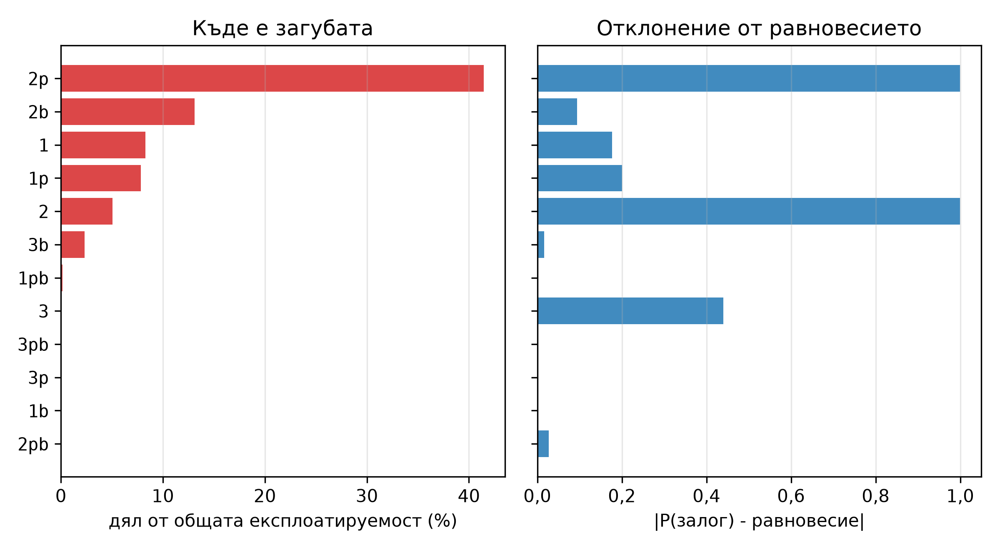
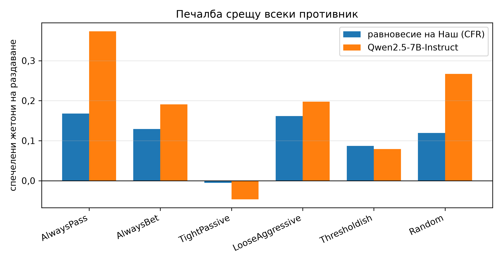
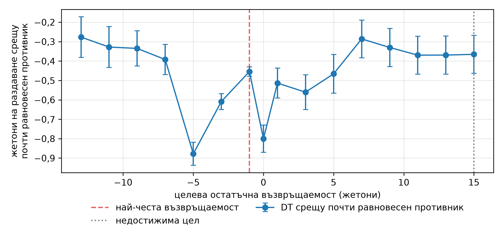
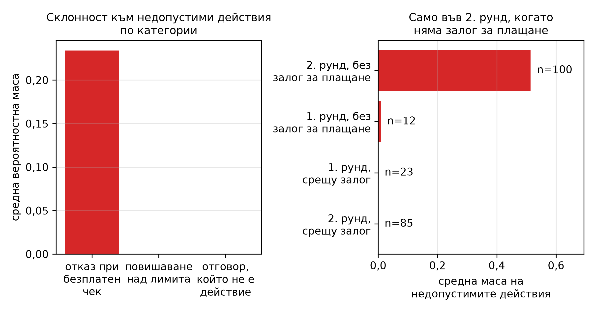

<!--
OFFICIAL PhD TITLE (keep consistent across all documents):
EN: Research on the possibilities for applying Artificial Intelligence in computer games
BG: Изследване на възможностите за приложение на изкуствения интелект в компютърни игри
-->

# Глава 12 – Модели на последователности и агенти с голям езиков модел в стратегически среди: Доклад от експеримента

**Тестова среда:** Кун покер (точно равновесие на Наш и точна експлоатируемост от глава 2), с ограничено пренасяне към Ледюк Холдем като проверка при по-сложна игра.  
**Сравнявани методи:** Nash-CFR · поведенческо клониране · Decision Transformer (DT) · Adversarially Robust Decision Transformer (ARDT) · четири варианта на агент с голям езиков модел (офлайн заглушка без езиков модел, gpt-oss-20b, Qwen2.5-7B-Instruct, OpenThinker3-7B).  
**Връзка с дисертацията:** Принос №1 (поведенческа адаптация), Принос №2 (безопасна експлоатация), Принос №3 (методология за оценяване).  
**Обхват на резултатите:** всички числа са собствени измервания при реални изпълнения (RTX 5090, локални модели с отворени тегла чрез LM Studio 0.4.20, температура 0,7; квантизацията на теглата не е записана). Всяка фигура е генерирана от записан JSON файл с резултати.

> **Забележка относно артефакта (прочетете веднъж).** Два резултата бяха **оттеглени по време на сесията** и се появяват тук само като оттегляния: резултат от обучение в контекста със затворена част от разликата `+1.59` (невъзможно – вж. „Съпоставка: прогноза и реалност“, R5) и резултат за Ледюк Холдем от голям езиков модел от `−0.83` жетона на раздаване, получен чрез дефектен декодер (R6). Експлоатируемостта на референтното равновесие зависи от бюджета на CFR – `0.0162` жетона при 5 000 итерации (сравнителна таблица), `0.0061` при 50 000 (последващи експерименти); и двете стойности са ≈0. Редът с `plain`-подкана на OpenThinker3 не е сравним с реда му с CoT (34% от вероятностната му маса отива към токени, които не са действия при обикновена подкана).
>
> **Как да четете този доклад.** Основният набор от резултати отговаря на петте цели за валидиране от първоначалния план на главата. Последващите експерименти бяха добавени, защото тези пет цели класират методите, без да ги обясняват. Всяко твърдение е свързано с именуван артефакт в `implementation/step12/implementation/`.

---

## За какво е предназначена тази глава

Два посткласически начина за игра на игра. **Моделирането на последователности** преформулира RL като условно предсказване на последователност: подават се тройки `(остатъчна възвръщаемост, състояние, действие)` на модел от типа GPT и се предсказва следващото **действие**, *обусловено от желаната бъдеща възвръщаемост* – без функция на стойността, без оператор на Белман, без игра срещу себе си. **ARDT** добавя минимаксно обуславяне по възвръщаемостта, така че стратегията да бъде устойчива спрямо най-лошия възможен противник, вместо да бъде настроена към този, който случайно се е оказал в данните. **Агентите с голям езиков модел** изцяло пропускат обучението: на езиковия модел се дават правилата на английски и той играе.

Кун покер е споделената тестова среда, тъй като нейното равновесие на Наш и експлоатируемост могат да бъдат изчислени *точно*, така че всеки метод получава резултат, проверен спрямо точна стойност, а не просто анекдот. Всички методи са приведени към формата на стратегия с 12 информационни множества от глава 2 и се оценяват с една и съща точна метрика.

## Основният резултат от сравнението

Експлоатируемост в жетони (по-ниска стойност означава по-голяма близост до равновесието на Наш); профил SMOKE (бърза проверка), офлайн заглушка за редовете с голям езиков модел.

| Метод | Експлоатируемост (жетони) | mbb/h | блъф(J) | стойностен залог(K) |
|---|---|---|---|---|
| Nash-CFR (референтен) | **0,0162** | 16,2 | 0,23 | 0,68 |
| **поведенческо клониране** | **0,0550** | 55,0 | 0,20 | 0,68 |
| ARDT | 0,4691 | 469,1 | 0,33 | 0,35 |
| Decision Transformer | 0,7992 | 799,2 | 1,00 | 0,64 |
| Голям езиков модел (заглушка) × 3 стила на подкана | 0,8333 | 833,3 | 1,00 | 1,00 |


**Обикновеното клониране превъзхожда и двата метода, на които е посветена главата** (както и реалните езикови модели по-долу, с 0,25–0,33; редът 0,833 е офлайн заглушката, а не езиков модел). Обикновеното поведенческо клониране – най-простата възможна базова линия – се оказва на 0,04 жетона от равновесието на Наш и превъзхожда DT, обусловен по възвръщаемостта, приблизително 14 пъти. При почти равновесни данни от игра срещу себе си поведенческото клониране просто копира почти равновесна стратегия, докато DT трябва да прекара същата стратегия през обуславяне по възвръщаемостта, което (както е показано по-долу) носи предимно късмет. **Обуславянето по възвръщаемостта тук активно унищожава информация.**

### Реални модели

Измерено при температура 0,7 с 24 проби на информационно множество – протоколна точка, която има значение; вижте *протокол за измерване* по-долу.

| Модел | стил | експл. (жетони) | блъф(J) | стойностен залог(K) | недопустим ход | адапт. |
|---|---|---|---|---|---|---|
| gpt-oss-20b | обикновен | 0,2760 | 0,00 | 1,00 | 0% | +0,67 |
| gpt-oss-20b | **CoT** | **0,2500** | 0,08 | 1,00 | 1% | +0,79 |
| gpt-oss-20b | теория на игрите | 0,3316 | 0,46 | 1,00 | 1% | +0,25 |
| Qwen2.5-7B | обикновен | 0,3125 | 0,00 | 1,00 | 0% | +0,00 |
| Qwen2.5-7B | CoT | 0,3183 | 0,58 | 1,00 | 0% | +0,42 |
| Qwen2.5-7B | теория на игрите | 0,3032 | 0,50 | 1,00 | 0% | +0,21 |
| OpenThinker3-7B | CoT (n=12) | 0,2882 | 0,33 | 1,00 | **16%** | +0,92 |

**Модел със 7 млрд. параметъра се представя наравно с gpt-oss-20b** – модел със смес от експерти с 21 млрд. параметъра общо, но само 3,6 млрд. активни при всеки токен; при три модела и една опростена игра това не позволява извод за ролята на мащаба. Две грешки са общи – всеки от тестваните реални модели залага за стойност с поп с вероятност 1,00, докато изчисленото с CFR равновесие смесва с 0,68, и при обикновена подкана нито един не блъфира с вале (24 опита на информационно множество). В Кун равновесията на първия играч образуват еднопараметрично семейство (блъф с вале с вероятност α ∈ [0, 1/3] и залог с поп с вероятност 3α; Kuhn, 1950), така че поотделно и двете поведения са равновесни; неравновесна е само комбинацията им. Езиковите модели определят правилно *ранга* на ръката, но грешат в *честотите*.

**Настройка на разсъжденията в изолирани условия.** OpenThinker3-7B е дообучаване за разсъждения (SFT) на *същия* базов модел Qwen2.5-7B, така че редовете с CoT изолират ефекта му: експлоатируемост `0.318 → 0.288`, блъф(J) `0.58 → 0.33` (при 0,23 за равновесието на Наш), адаптация `+0.42 → +0.92` – постигнато с **16% недопустими ходове** и **65 пъти повече токени** (~6 500 спрямо ~99 на решение).

## Петте цели за валидиране

`validate.py`, профил SMOKE: **3 УСПЕХА / 2 НЕУСПЕХА / 0 ПРОПУСНАТИ** (PyTorch и CUDA бяха активни, така че нищо не беше пропуснато).

| # | Цел | Измерено | Присъда |
|---|---|---|---|
| 1 | DT: по-висока остатъчна възвръщаемост → по-ниска експлоатируемост, отколкото при по-ниска | `high(+2) = 0.6981` срещу `low(−2) = 0.6928` жетона | **НЕУСПЕХ** |
| 2 | Действието на DT варира според картата (научава късмета) | `P(bet)` в корена за J/Q/K = `1.00/0.03/0.70`, разлика **0,97** | УСПЕХ |
| 3 | ARDT < стандартен DT върху същите смесени данни | `ARDT 0.5034` срещу `DT 0.7212` жетона | УСПЕХ |
| 4 | ARDT в рамките на ~50 mbb/h от равновесието на Наш | `0.5034` жетона срещу допустима стойност `0.05` | **НЕУСПЕХ** |
| 5 | Големият езиков модел е действително по-експлоатируем от равновесието на Наш | `0.8333` > `0.0162`; реални модели `0.25–0.33` | УСПЕХ |

И двата неуспеха са действителни констатации, а не проблеми с настройката, като и двата са разгледани по-долу.


Цел №1 не е изпълнена, защото реакцията на DT към целевата възвръщаемост **не е подредена според това колко добра е тази възвръщаемост**. Реакция има – при фина серия от целеви стойности `P(bet)` в корена с поп е `0.747 → 0.020 → 0.781` – но експлоатируемостта рязко скача точно при `R = −1`, където играта на DT се срива: той играе пас в **11 от 12** информационни множества и експлоатируемостта му е 1,98 жетона. `R = −1` е най-честата възвръщаемост в данните (41,7% от стъпките) и печалбата при пас.

## МАТЕМАТИЧЕСКИ ФЛАГ Б – посоката на експектила в ARDT

Първоначалният план на главата задава `τ = 0.9` и го определя като „песимистичен“. Реализацията отбелязва това като **обърнат** и по подразбиране използва `0.1`. **Статията потвърждава отбелязването**: Уравнение (6) в ARDT дефинира експектилната загуба, а Уравнение (7) гласи `lim_{α→0} g_α = min`, `lim_{α→1} g_α = max` и ред 1 в Алгоритъм 1 използва `α = 0.01`. Това беше независимо потвърдено от собствената самопроверка на модула, която възстановява *аналитичните* експектили на изкривена извадка (τ=0,1 → −1,951, τ=0,9 → 0,000).


**Емпиричната серия експерименти противоречи на теорията**, а най-вероятната причина е показателна. Целевата стойност при преетикетирането се изменя монотонно с τ (`−0.626 → +0.854`), което потвърждава, че механизмът е изграден коректно – но експлоатируемостта е **най-ниска при τ = 0,9**, оптимистичната страна. Вероятното обяснение е в Алгоритъм 1: ARDT преетикетира с `R̃_t = Q̃_ν(s_t, a_t)`, стойност на двойката състояние-**действие** от две свързани мрежи (уравнения 8–11), докато тази реализация преетикетира със стойност само на състоянието `V(s)`. Цел само по състояние не може да различи „това състояние е лошо“ от „*това действие* е лошо“ – точно разграничението, на което разчита ARDT – така че преместването на τ→0 подава на DT еднакво отрицателна стойност, което води до избор на линията с *пас* вместо на *устойчивата*. Вариант с $\tilde{Q}(s,a)$ още не е изпълнен, така че това е хипотеза, а не резултат. `EXPECTILE_TAU` умишлено е оставено на 0,1, теоретично правилната страна; промяната му на 0,9 за получаване на по-добър резултат би представлявала манипулация на изследването.

## Последващи експерименти: какво крие скаларната оценка

Петте цели класират методите, но не дават обяснение за тях. Проведени бяха още шест допълнителни експеримента.

### Извличане на точна стратегия, 24 пъти по-евтино

Четенето на разпределението на действията от **логаритмичните вероятности на токените** (logprobs; предварително попълване с `"Action:"`, сумиране на вероятностната маса върху повърхностните форми) замества 288 извадкови извиквания с **12**, като дисперсията на извадката е нула. Валидирано чрез извадка при идентични подкани: средната стойност на разликата `|P(bet)|` е **0,027** спрямо стандартна грешка на биномно разпределение от 0,102 (резултатът е съгласуван). Не е валидно при използване на подкана тип „верига от мисли“ – предварителното попълване противоречи на принципа „разсъждавай първо“, което води до извънразпределителна стратегия – граница, документирана в кода.

### Къде всъщност се проявява загубата



| Информационно множество | P(залог) | Равновесие на Наш | отклонение | **дял от загубата** |
|---|---|---|---|---|
| `2p` (Дама, опонентът е пасувал) | 1,000 | 0,000 | 1,000 | **41,4%** |
| `2b` (Дама, при залог от опонента) | 0,253 | 0,347 | 0,094 | 13,1% |
| `3` (Поп, начална позиция) | 1,000 | 0,561 | **0,439** | **0,1%** |

Това **коригира извод, заявен по-рано в тази глава**. „Всеки голям езиков модел залага за стойност с поп с вероятност 1,00, където равновесието смесва с 0,68“ беше представено като характерен провал – а струва **0,1%** от загубата. Прекомерното залагане на ръка, която никога не е по-слаба, е почти безплатно. Щетата идва от един възел Дама: винаги залагане на Дамата след като опонентът пасува е **41,4%** от общата експлоатируемост, а поправянето само на това едно решение премества модела от 0,357 на 0,209 жетона. **Величината на отклонението и цената са почти некорелирани**, което е точно това, което се скрива зад едно число.

### Моделите играят по-добре, отколкото могат да обяснят


Попитани, на същите информационни множества и с идентичен описателен текст за ситуацията, какъв процент от времето трябва да направят **залог**:

| | MAE спрямо равновесието (заявени) | MAE спрямо равновесието (изиграни) | експлоатируемост, ако играе това, което заявява | експлоатируемост при изиграната стратегия |
|---|---|---|---|---|
| Qwen2.5-7B | 0,353 | **0,246** | 0,921 жетона | **0,357** |
| gpt-oss-20b | 0,434 | **0,328** | 1,576 жетона | **0,392** |

И двата модела имат **заявени** стратегии, които са значително по-слаби от **изиграните** – съответно 2,6× и 4,0× по-експлоатируеми. Начините на провал се различават (Qwen отговаря „50%“ в 11 от 12 информационни множества; gpt-oss отговаря ~0% в 8 от 12, включително всичките три възела с Поп, където равновесието на Наш залага 100%), което подсилва общото заключение: **извличането на стратегия от голям езиков модел чрез задаване на въпроси води до резултат, по-лош от проучването на неговото поведение.**

### Експлоатиращ по подразбиране, но не адаптивен

Сесии от 120 **раздавания** срещу фиксиран архетип, с наблюдаемата история на предишни **раздавания** в контекста. Базовите линии се изчисляват **точно** върху реализираните **раздавания** на самия **агент**, така че нито късметът при раздаването, нито случайността на опонента участват в сравнението.

| Опонент | Равновесие на Наш | таван на най-добрия отговор | агент ± SE | затворена част от разликата | обучение (2‑ра – 1‑ва половина) |
|---|---|---|---|---|---|
| AlwaysPass | +0,229 | +0,981 | +0,850 ± 0,056 | **+0,83 ± 0,07** | +0,00 |
| AlwaysBet | +0,319 | +0,530 | +0,383 ± 0,169 | +0,31 ± 0,80 | −0,52 |
| TightPassive | +0,088 | +0,316 | +0,092 ± 0,122 | +0,02 ± 0,53 | −0,15 |

Средното обучение е **−0,22**, но тази средна стойност се определя от двете клетки с недостатъчна статистическа мощност. В единствената клетка с достатъчна мощност агентът (Qwen2.5-7B-Instruct, последните 20 раздавания в контекста) улавя 83% от наличната експлоатация още от първата половина и не се подобрява (0,824 срещу 0,827) – фиксирано априорно убеждение, благоприятстващо разпуснато-агресивна игра, а не моделиране на противника от историята. Когато обаче типът на противника е описан в подканата, моделите променят честотата на блъфиране с до 0,92 (колоната *адапт.* по-горе): липсва изводът от историята, а не способността да се реагира на описание.



Съотношението между експлоатация и експлоатируемост го потвърждава: големият езиков модел (Qwen2.5-7B-Instruct) **печели 0,177 жетона на раздаване срещу 0,110 за равновесието на Наш (с 61% повече), но експлоатируемостта му е 0,357 жетона срещу 0,006**, като близо 90% от предимството идва от *пасивния и случайния* противник (AlwaysPass 0,374 срещу 0,168, Random 0,267 срещу 0,119). Срещу двата най-компетентни архетипа той се представя **по-зле** от равновесието. Това е измереният компромис между безопасност и експлоатация, с който се занимава Принос №2.

### Директен сблъсък

20 000 раздавания на двойка, с редуване на позициите. Равновесната стратегия срещу себе си дава точно 0,0000 и не губи от никого, което валидира турнира.

| Играч по ред | срещу равновесието | срещу gpt-oss | срещу OpenThinker3 | срещу Qwen | средна стойност | експлоатируемост |
|---|---|---|---|---|---|---|
| Nash-CFR | 0,0000 | +0,1061 | +0,1245 | +0,0806 | **+0,104** | 0,0061 |
| Qwen2.5-7B | −0,0806 | **+0,1618** | +0,1817 | 0,0000 | **+0,088** | 0,3571 |
| gpt-oss-20b | −0,1061 | 0,0000 | +0,1535 | −0,1618 | −0,038 | 0,3917 |
| OpenThinker3-7B | −0,1245 | −0,1535 | 0,0000 | −0,1817 | −0,153 | 0,8940 |

**Qwen2.5-7B побеждава gpt-oss-20b** (3,6 млрд. активни параметъра), а подреждането е строго транзитивно и напълно съответства на подреждането по експлоатируемост – в тази популация експлоатируемостта предсказва резултатите от директен сблъсък.

## Ледюк Холдем – проверка на сложността

Ограничено пренасяне (кодировчик, набор от данни, обучение на DT и серия експерименти с обуславяне по възвръщаемостта, оценявани в жетони на раздаване срещу почти равновесен противник) плюс предварителна проверка на голям езиков модел. Ледюк разполага с **936** информационни множества спрямо 12 при Кун, **15** различни стойности на печалба спрямо 4, два рунда на залагане и една обща карта.



**Вдлъбнатината от Кун не се възпроизвежда** – при най-честата възвръщаемост DT е на 0,2 SE от средната стойност при останалите цели. **Обуславянето обаче пак не насочва**: Pearson `r = +0.062`, Spearman `ρ = −0.054`. То не е без ефект (разликата между целите е 0,60 жетона на раздаване, многократно по-голяма от стандартната грешка на точка), а просто не е подредено според качеството на целта. Недостижимата цел се насища – единственото предсказание от Кун, което се възпроизвежда чисто. Два спада остават необяснени: при 0 (`−0.80 ± 0.07`; втората по честота възвръщаемост, 17,4% от стъпките) и при −5 (`−0.88 ± 0.06`), и двата по-дълбоки от точката при най-честата възвръщаемост (`−0.45 ± 0.02`).

**Компетентността на големия езиков модел рязко намалява.** В **Ледюк** големият езиков модел постига `−0.463 ± 0.132` **жетона на раздаване** срещу почти равновесен противник – статистически неразличимо от `−0.454` на DT; срещу експлоатируемия зоопарк той постига `−0.071`, докато равновесието печели `+0.582`, като побеждава само двата пасивни типа противници и губи дори от **Random**. Само **31–54%** от 936-те информационни множества някога са били достигнати, поради което вероятността за достигане прави пълното изброяване ненужно.



Склонността му към недопустими действия (23,4% от вероятностната маса) е **едно систематично погрешно схващане**, а не обща обърканост: `FOLD_WHEN_FREE` (отказ при безплатен чек) формира **100%** от масата на недопустимите действия, докато `RAISE_AT_CAP` е `0.0000`, а отговорите, които не са действие (грешка във формата) – `0.0001`. Тя е съсредоточена във 2. рунд, когато няма залог за плащане (`0.5138`, до 0,99), при слаби ръце без чифт и висока обща карта – моделът бърка „ръката ми е слаба“ с „трябва да се откажа“, забравяйки, че чекът е безплатен. Почти нулевият дял в 1. рунд показва, че това се **задейства от състава на общите карти, а не от пропуск в правилата**, което го прави откритие за подканата, а не таван на възможностите.

## Съпоставка: прогноза и реалност

Предварителните прогнози се съхраняват; към тях се добавя и това, което действително е настъпило (работен процес §0.1).

**R1 – Обуславянето по възвръщаемостта никога не насочва, а предложеното обяснение беше наполовина вярно.** Обяснението за **Кун** (големината кодира **залога**, знакът е **късмет с картите**, така че модалната **печалба** при **пас** избира „**линията на пас“**) предсказа, че ефектът трябва да отслабне при по-богат **набор печалби**. **Ледюк** премахна вдлъбнатината точно както беше предсказано, **но насочването не се появи вместо това**. Механизмът обяснява *вдлъбнатината*, а не *провала*, който оцелява при 15 стойности на печалбата, два рунда и **обща карта**.

**R2 – Математическият флаг B беше правилен относно τ и подцени структурната разлика.** Потвърдено е спрямо ур. 6–7; най-вероятно реалната разлика е между `V(s)` и `Q(s,a)` от статията (Алгоритъм 1) – още непроверено. Цел №4 остава червена.

**R3 – Поведенческото клониране печели, а „провалът“ с поп беше почти безплатен.** Вижте *Основният резултат от сравнението* и *Къде всъщност се проявява загубата*.

**R4 – Първоначалната хипотеза беше опровергана.** „Знае честотата, но не може да я възпроизведе при избора на действие“ предсказваше заявени ≈ равновесието и изиграни ≠ равновесието. Измерено: заявените са *по-лоши* от изиграните и при двата модела.

**R5 – Резултатът от обучение в контекста `+1.59` беше оттеглен.** Затворена част от разликата над 1,0 означава да се победи точният най-добър отговор, което е невъзможно; таванът беше проверен ръчно (`K→+2, Q→0, J→−1 ⇒ +0.333`, съответстващо на изчисленото `+0.3387`), като така се установи, че стойността на агента е артефакт. Причина: сесия от 60 раздавания беше сравнена с базови линии, взети от *различни* раздавания, при което стандартното отклонение в Кун от ~1,2 на раздаване дава стандартна грешка, съпоставима с целия диапазон равновесие→най-добър отговор. При използване на точни двойки базови линии заключението **се обръща** към липса на обучение.

**R6 – Резултатът от голям езиков модел за Ледюк от `−0.83` беше оттеглен.** Токенизаторът разделя `RAISE` на `" RA"` и `FOLD` на `" F"`, докато `CALL`/`CHECK` остават цели, поради което съвпадението по цяла дума елиминира 70% от вероятностната маса и *обърна* стратегията – модел, който повишава с p=0,953, беше оценен като плащащ ~97% от времето. Коригирано със съвпадение, чувствително към представката, до `−0.463 ± 0.132`.

**R7 – Смесването на голям езиков модел не може да бъде измерено при температура 0.** При тази стойност реалният модел играе *чиста* стратегия, така че всяка измерена честота дегенерира до 0 или 1: блъф(J) отчете 0,75, 0,25 и 1,00 в три изпълнения на една и съща конфигурация, а увеличаването на броя проби от 4 на 24 не помогна. При температура 0,7 честотите стават междинни, а делът на недопустимите ходове става ненулев.

## Достоверност и достатъчност на извадката

Четири резултата в тази глава изглеждаха като открития и се оказаха измервателни артефакти (R5, R6, възвръщаемост от позиция 0, която беше на 1,7 стандартни грешки от шума от извадката, както и тенденция в Ледюк, която изчезна при 20 пъти повече раздавания). Всеки от тях беше засечен чрез евтина проверка за съгласуваност спрямо нещо, което може да се изчисли точно – точна стойност на играта, точен таван на най-добрия отговор, стандартна грешка или диагностика за запазване на вероятностната маса.

Поотделно, `plotting.py` първоначално съдържаше **само** самопроверка, която изчертаваше твърдо кодирани числа в директорията с резултати и представляваше единствения път за създаване на фигури в тази глава; буквалното следване на наръчника за изпълнение би довело до записване на фалшифицирана фигура. Той беше заменен с рендър, който чете **изключително** от записан JSON, което е начинът, по който всяка фигура в този доклад беше създадена.

Достатъчност на извадката: клетките за директен сблъсък използват 20 000 раздавания; мачовете срещу зоопарка – 4 000; серията в Ледюк – 4 000 на цел. Клетките за моделиране на противника AlwaysBet и TightPassive са **с недостатъчна статистическа мощност** (SE ±0,80 и ±0,53, тъй като диапазонът им от равновесието до най-добрия отговор е тесен), а убедителна е само клетката за AlwaysPass.

**Вариация на обучението при невронните модели.** Наборът от данни, CFR и офлайн заглушката използват фиксирани начални числа и се възпроизвеждат точно, но всяко извикване на сравнителната таблица **преобучава** невронните модели, поради което DT/BC/ARDT показват дисперсия от изпълнение до изпълнение. Измерено при две изпълнения на една и съща конфигурация, експлоатируемостта на DT се измести от **0,671 → 0,799** (колебание от ~19%), докато двата детерминистични реда (Nash-CFR 0,0162, заглушката на езиковия модел 0,8333) се възпроизведоха с точност до четири знака след десетичната запетая. Числата, цитирани тук, са тези от записания артефакт `results/comparison_SMOKE_stub.json`; качествената подредба остава непроменена, но **тези редове не бива да се сравняват с точност до три знака след десетичната запетая между различни изпълнения.**

## Ограничения (подредени според значимостта им за заключенията)

1. **Всички заключения за голям езиков модел в Ледюк се основават на един модел, един стил на подкана и 600 раздавания** (SE ±0,13). Достатъчно е да се каже, че предимството на Кун не се пренася; недостатъчно е за класиране на модели в Ледюк.  
2. **ARDT е документирано опростяване на публикувания метод** – едностранен, със стойност само на състоянието `V(s)` вместо свързаната стойност на двойката състояние-действие `Q̃(s,a)`. Целите #3–4 тестват заместителя, а не ARDT.  
3. **Няма точна експлоатируемост за Ледюк.** Метриката за Ледюк е в глава 3, чийто пакет също се нарича `cfr` и влиза в конфликт с пакета от глава 2; вместо нея са използвани жетони на раздаване срещу почти равновесен противник.  
4. **Резултатите на Кун са SMOKE-профил** (5 000 траектории, 5 000 итерации на CFR, малки мрежи). Качествената подредба е стабилна, но абсолютните стойности биха се изместили при по-голям мащаб.  
5. **Извличането на логаритмична вероятност е валидирано само за обикновени подкани**; цифрите за CoT са получени чрез извадка.  
6. **OpenThinker3 беше измерен само в реда на CoT** (n=12); пълното изпълнение е ~9 часа при ~38 s на решение.  
7. **Двете недостатъчно мощни клетки на B5** (по-горе) – затягането им изисква приблизително 30 пъти повече раздавания.

## Заключения и насоки за бъдещи изследвания

**Заключения.** Обуславянето по възвръщаемостта не насочва Decision Transformer в покер в нито една от двете игри, и причината не е размерът на набора печалби: в игра с нулева сума с непълна информация реализираната възвръщаемост се доминира от фактори, които агентът не контролира. Обикновеното поведенческо клониране превъзхожда и двата метода, на които тази глава е кръстена. Езиковите модели определят правилно класирането на ръка, но грешно честотите на смесване; не могат да вербализират стратегията, която всъщност прилагат, не извеждат противника от историята в контекста (макар да реагират, когато типът му е съобщен) и губят привидната си компетентност при добавяне на един рунд на залагане към играта.

**Насоки за бъдещи изследвания** (всяка от тях е свързана с измерен ефект):

- *Заменете преетикетирането само на състояние в ARDT с оценителите на състояние-действие, предложени в статията* (уравнения 8–11 плюс загрявката в Алгоритъм 1). Това е най-вероятната причина за слабото представяне на заместителя (още непроверена). При случайни ходове като раздаването минимаксната цел на ARDT е точна само при детерминирани преходи (Tang, Cheng & Kumar, 2025, arXiv:2510.11877, предлагат CART), така че при записани покер партии и това трябва да се отчете.
- *Разглеждайте DT, обусловен по възвръщаемостта, като неподходящ инструмент за офлайн покер* – стойността на преетикетирането в ARDT е, че заменя целева стойност, която агентът не контролира, с такава, която зависи главно от собствените му действия.
- *Представяйте разложения по решения, вместо скаларна величина*, когато се оценяват агенти; големината на отклонението не е заместител на цената.
- *Проучвайте поведението, вместо да задавате въпроси* във всеки компонент за моделиране на противник чрез езиков модел.
- *Тествайте едноредовото поправяне на подканата в Ледюк* („можете да направите чек безплатно“), преди да правите каквито и да било заключения относно възможностите на големите езикови модели при покер с няколко рунда на залагане.

## Възпроизвеждане

```bash
# from the repository root, with the venv active
cd implementation/step12/implementation

python validate.py                       # 5 validation targets -> 3 PASS / 2 FAIL / 0 SKIP
python comparison_table.py               # headline table -> results/comparison_SMOKE_<backend>.json
python tau_sweep.py --seeds 3            # MATH FLAG B, empirical half
python exploitability_decomposition.py --style plain --method logprob
python frequency_elicitation.py --repeats 3 --temp 0.7 --exec-style plain
python opponent_modeling.py --hands 120 --style cot
python exploitation_vs_zoo.py --style plain --hands 4000
python llm_head_to_head.py --tournament --hands 20000
python leduc_stage0.py                   # Leduc DT return-conditioning sweep
python leduc_llm.py --hands 600          # Leduc LLM scouting
python leduc_illegal_taxonomy.py         # illegal-action breakdown
python plotting.py                       # all 12 figures, from committed JSON only
```

Реалните изпълнения на модела изискват локален сървър, съвместим с OpenAI. Протоколът, който е от значение: **заредете точно един модел** (`lms unload --all`, след това `lms load <model>`), рестартирайте сървъра след всяко прекратено изпълнение (осиротелите връзки заемат всички паралелни слотове и по-късните изпълнения блокират безкрайно) и задайте `STEP12_LLM_TEMP=0.7` – при температура 0 измерените честоти са безсмислени (R7).

Детерминираност: наборите от данни, CFR и инициализацията на мрежите използват фиксирани начални числа; офлайн заглушката на езиковия модел е детерминистична, така че таблицата SMOKE и валидационната среда се възпроизвеждат точно без GPU или мрежа. Реалните резултати от модела **не** са битово възпроизводими (маршрутизацията в MoE при пакетно обслужване), поради което оценките на честотите използват 24 проби, а температурният протокол е посочен изрично.
