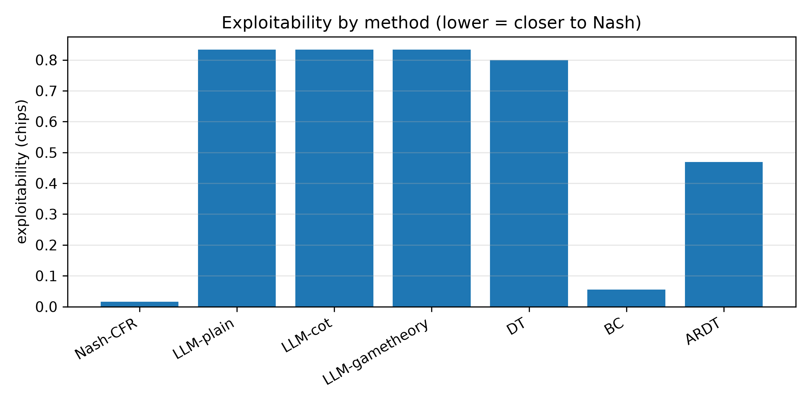
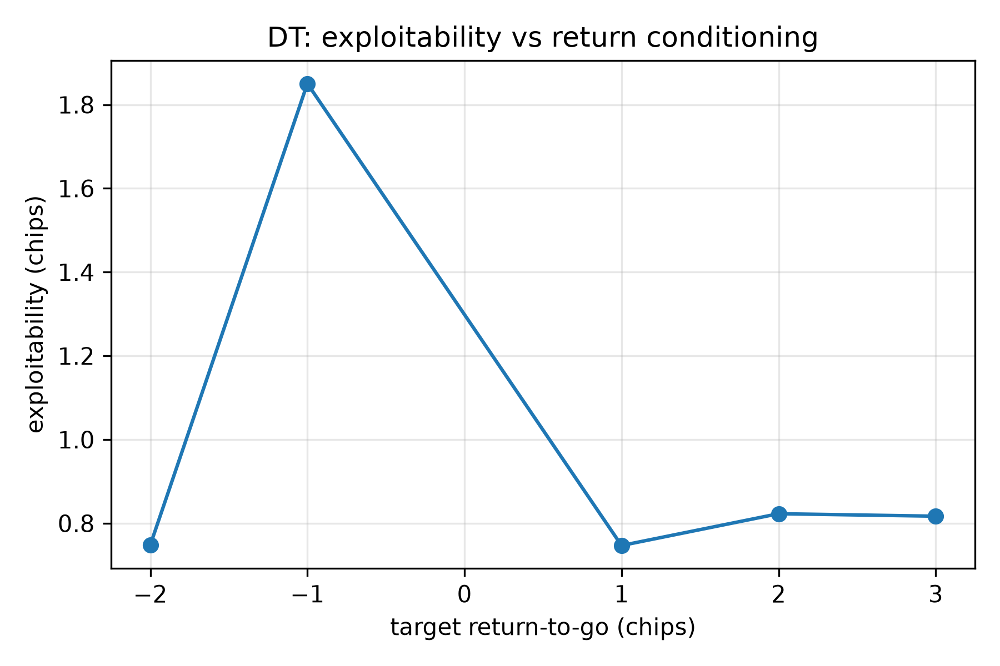
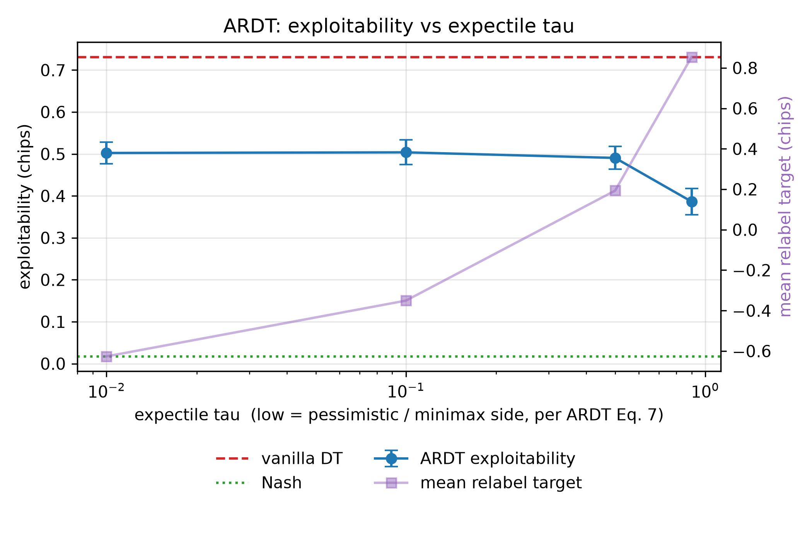
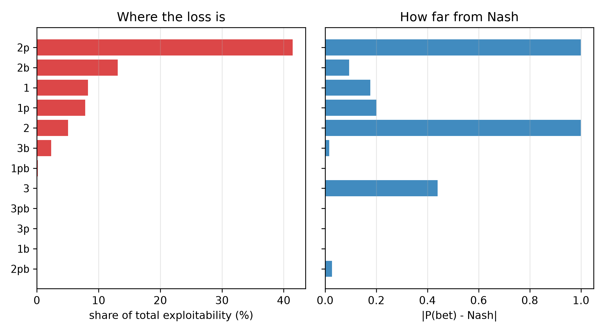
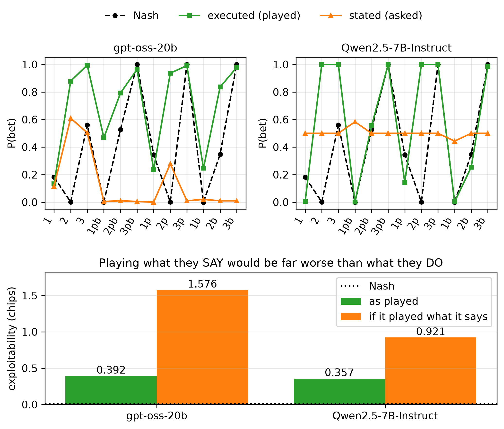
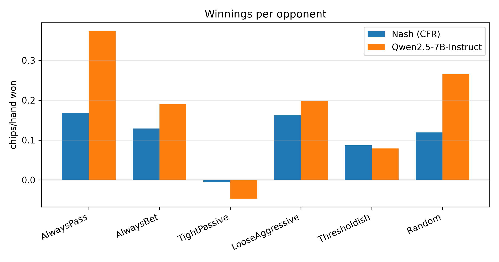
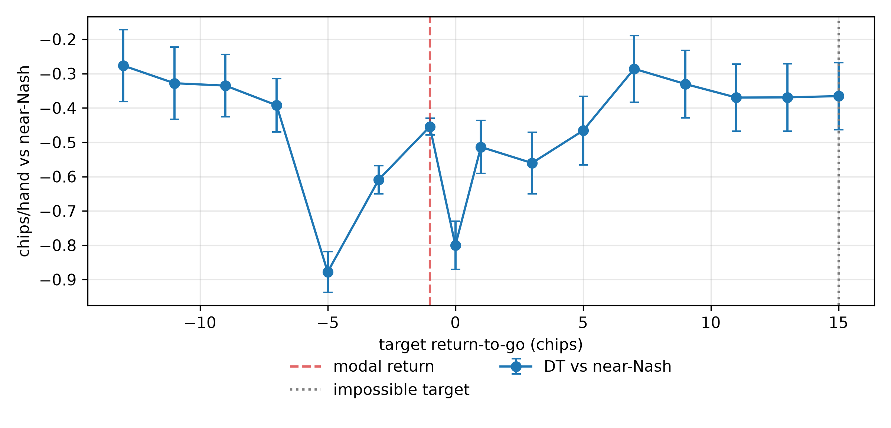

<!--
OFFICIAL PhD TITLE (keep consistent across all documents):
EN: Research on the possibilities for applying Artificial Intelligence in computer games
BG: Изследване на възможностите за приложение на изкуствения интелект в компютърни игри
-->

# Chapter 12 — Sequence Models and LLM Agents in Strategic Settings: Experiment Report

**Testbed:** Kuhn Poker (exact Nash and exact exploitability from Chapter 02), with a narrow port to
Leduc Hold'em as a complexity check.
**Methods compared:** Nash-CFR · Behavioural Cloning · Decision Transformer · Adversarially Robust
Decision Transformer (ARDT) · four LLM backends (offline stub, gpt-oss-20b, Qwen2.5-7B-Instruct,
OpenThinker3-7B).
**PhD connection:** Contribution #1 (behavioural adaptation), Contribution #2 (safe exploitation),
Contribution #3 (evaluation methodology).
**Scope of results:** all numbers are measured on real runs (RTX 5090, local models via LM Studio
0.4.20). Every figure is rendered from a committed results JSON.

> **Artifact caveat (read once).** Two results were **retracted mid-session** and appear here only
> as retractions: an in-context-learning result of `+1.59` gap closed (impossible — see §Prediction
> vs reality, R5) and a Leduc LLM score of `−0.83` chips/hand produced by a faulty decoder (R6).
> The Nash reference differs by CFR budget — `0.0162` chips at 5,000 iterations (comparison table),
> `0.0061` at 50,000 (follow-on experiments); both are ≈0. OpenThinker3's `plain`-prompt row is not
> comparable to its CoT row (34% of its probability mass goes to non-action tokens under a plain
> prompt).
>
> **How to read this report.** The core build answers the raw step's five validation targets. The
> follow-on experiments were added because those five targets rank the methods without explaining
> them. Every claim is tied to a named artifact under `implementation/step12/implementation/`.

---

## What this chapter is about

Two post-classical ways to play a game. **Sequence modelling** reframes RL as conditional sequence
prediction: feed a GPT-style model `(return-to-go, state, action)` triples and predict the next
action *conditioned on a desired future return* — no value function, no Bellman backup, no
self-play. **ARDT** adds minimax return conditioning so the policy is robust to the worst-case
opponent rather than tuned to whoever happened to be in the data. **LLM agents** skip training
entirely: give a language model the rules in English and let it play.

Kuhn Poker is the shared testbed because its Nash equilibrium and exploitability are *exactly*
computable, so every method gets a ground-truthed score rather than an anecdote. All methods are
coerced into Chapter 02's 12-info-set strategy format and measured with the same exact metric.

## The headline comparison

Exploitability in chips (lower is closer to Nash); SMOKE profile, offline stub for the LLM rows.

| Method | Exploitability (chips) | mbb/h | bluff(J) | value-bet(K) |
|---|---|---|---|---|
| Nash-CFR (reference) | **0.0162** | 16.2 | 0.23 | 0.68 |
| **Behavioural Cloning** | **0.0550** | 55.0 | 0.20 | 0.68 |
| ARDT | 0.4691 | 469.1 | 0.33 | 0.35 |
| Decision Transformer | 0.7992 | 799.2 | 1.00 | 0.64 |
| LLM (stub) × 3 prompt styles | 0.8333 | 833.3 | 1.00 | 1.00 |



**The two methods the step is about finish last.** Plain behavioural cloning — the simplest possible
baseline — lands within 0.04 chips of Nash and beats the return-conditioned Decision Transformer by
roughly 14×. On near-Nash self-play data BC simply copies a near-Nash policy, whereas the DT must
route that same policy through a return-conditioning channel that (as shown below) carries mostly
luck. **Return conditioning actively destroys information here.**

### Real models

Measured at temperature 0.7 with 24 samples per information set — a protocol point that matters, see
*Measurement protocol* below.

| Backend | style | expl. (chips) | bluff(J) | value-bet(K) | illegal | adapt |
|---|---|---|---|---|---|---|
| gpt-oss-20b | plain | 0.2760 | 0.00 | 1.00 | 0% | +0.67 |
| gpt-oss-20b | **CoT** | **0.2500** | 0.08 | 1.00 | 1% | +0.79 |
| gpt-oss-20b | game-theory | 0.3316 | 0.46 | 1.00 | 1% | +0.25 |
| Qwen2.5-7B | plain | 0.3125 | 0.00 | 1.00 | 0% | +0.00 |
| Qwen2.5-7B | CoT | 0.3183 | 0.58 | 1.00 | 0% | +0.42 |
| Qwen2.5-7B | game-theory | 0.3032 | 0.50 | 1.00 | 0% | +0.21 |
| OpenThinker3-7B | CoT (n=12) | 0.2882 | 0.33 | 1.00 | **16%** | +0.92 |

A **7B model matches a 20B model**: Kuhn rewards mixing at the right frequency, not knowledge or
scale. Two failures are universal — every backend value-bets the King at 1.00 where Nash mixes at
0.68, and none bluffs the Jack under a plain prompt. LLMs get hand *ranking* right and *frequencies*
wrong.

**Reasoning tuning, isolated.** OpenThinker3-7B is a reasoning-SFT of the *same* Qwen2.5-7B base, so
the CoT rows isolate its effect: exploitability `0.318 → 0.288`, bluff(J) `0.58 → 0.33` (against
Nash's 0.23), adaptation `+0.42 → +0.92` — bought with a **16% illegal-move rate** and **65× the
tokens** (~6,500 vs ~99 per decision).

## The five validation targets

`validate.py`, SMOKE profile: **3 PASS / 2 FAIL / 0 SKIP** (PyTorch and CUDA were live, so nothing
was skipped).

| # | Target | Measured | Verdict |
|---|---|---|---|
| 1 | DT: high return-to-go → lower exploitability than low | `high(+2) = 0.6981` vs `low(−2) = 0.6928` chips | **FAIL** |
| 2 | DT action varies by card (learns luck) | root `P(bet)` J/Q/K = `1.00/0.03/0.70`, spread **0.97** | PASS |
| 3 | ARDT < standard DT on the same mixed data | `ARDT 0.5034` vs `DT 0.7212` chips | PASS |
| 4 | ARDT within ~50 mbb/h of Nash | `0.5034` chips vs a `0.05` tolerance | **FAIL** |
| 5 | LLM honestly more exploitable than Nash | `0.8333` > `0.0162`; real models `0.25–0.33` | PASS |

Both failures are genuine findings rather than tuning problems, and both are reconciled below.



Target #1 fails because the DT's response to the conditioned return is **not ordered by how good
that return is**. It does respond — a fine sweep of root `P(bet)` with the King runs
`0.747 → 0.020 → 0.781` — but with a sharp collapse at exactly `R = −1`, where it passes at **11 of
12** information sets and scores 1.98 chips. `R = −1` is the modal return in the data (41.7% of
steps) and the payoff of *folding*.

## MATH FLAG B — the ARDT expectile direction

The raw step writes `τ = 0.9` and calls it "pessimistic". The implementation flagged this as
inverted and defaulted to `0.1`. **The paper confirms the flag**: ARDT's Eq. (6) defines the
expectile loss and Eq. (7) states `lim_{α→0} g_α = min`, `lim_{α→1} g_α = max`, and Algorithm 1
line 1 runs `α = 0.01`. This was independently corroborated by the module's own self-test, which
recovers the *analytic* expectiles of a skewed sample (τ=0.1 → −1.951, τ=0.9 → 0.000).



**The empirical sweep contradicts the theory**, and the reason is instructive. The relabel target
moves monotonically with τ (`−0.626 → +0.854`), confirming the mechanism is wired correctly — yet
exploitability is **lowest at τ = 0.9**, the optimistic side. Algorithm 1 line 7 explains it: ARDT
relabels with `R̃_t = Q̃_ν(s_t, a_t)`, a state-**action** value from two coupled networks
(Eqs. 8–11), whereas this implementation relabels with a state-only `V(s)`. A state-only target
cannot distinguish "this state is bad" from "*this action* is bad" — exactly the discrimination ARDT
depends on — so pushing τ→0 hands the DT a uniformly negative number, which selects the *folding*
line rather than the *robust* one. `EXPECTILE_TAU` is deliberately left at 0.1, the theoretically
correct side; changing it to 0.9 to obtain a better number would be rigging the result.

## Follow-on experiments: what the scalar score hides

The five targets rank the methods but do not explain them. Six further experiments were run.

### Exact strategy extraction, 24× cheaper

Reading the action distribution from **token logprobs** (prefill `"Action:"`, sum probability mass
over surface forms) replaces 288 sampled calls with **12**, with zero sampling variance. Validated
against sampling on identical prompts: mean `|P(bet)|` gap **0.027** against a binomial SE of 0.102
(consistent). It is *not* valid with a chain-of-thought prompt — the prefill contradicts "reason
first", giving an out-of-distribution policy — a boundary documented in the code.

### Where the loss actually is



| Information set | P(bet) | Nash | deviation | **share of leak** |
|---|---|---|---|---|
| `2p` (Queen, opponent checked) | 1.000 | 0.000 | 1.000 | **41.4%** |
| `2b` (Queen, facing a bet) | 0.253 | 0.347 | 0.094 | 13.1% |
| `3` (King, root) | 1.000 | 0.561 | **0.439** | **0.1%** |

This **corrects a headline stated earlier in this chapter**. "Every LLM value-bets the King at 1.00
where Nash mixes at 0.68" was reported as a signature failure — it costs **0.1%** of the leak.
Over-betting a hand that is never behind is nearly free. The damage is one Queen node: always
betting the Queen after the opponent checks is **41.4%** of total exploitability, and repairing that
single decision alone moves the model from 0.357 to 0.209 chips. **Deviation magnitude and cost are
nearly uncorrelated**, which is precisely what a single number hides.

### The models play better than they can explain



Asked, at the same information sets and with identical situation text, what percentage of the time
they should bet:

| | MAE vs Nash (stated) | MAE vs Nash (executed) | expl. if it played what it says | expl. as played |
|---|---|---|---|---|
| Qwen2.5-7B | 0.353 | **0.246** | 0.921 chips | **0.357** |
| gpt-oss-20b | 0.434 | **0.328** | 1.576 chips | **0.392** |

Both models' **stated** strategies are substantially worse than their **played** ones — 2.6× and
4.0× more exploitable respectively. The failure modes differ (Qwen answers "50%" at 11 of 12
information sets; gpt-oss answers ~0% at 8 of 12, including all three King nodes where Nash bets
100%), which strengthens the shared conclusion: **extracting a strategy from an LLM by asking it
yields something worse than probing its behaviour.**

### Exploitative by default, not adaptive

Sessions of 120 hands against a fixed archetype, with the observed history of previous hands in
context. Baselines are computed **exactly** on the agent's own realised deals, so neither deal luck
nor opponent randomness enters the comparison.

| Opponent | Nash | best-response ceiling | agent ± SE | gap closed | learning (2nd − 1st half) |
|---|---|---|---|---|---|
| AlwaysPass | +0.229 | +0.981 | +0.850 ± 0.056 | **+0.83 ± 0.07** | +0.00 |
| AlwaysBet | +0.319 | +0.530 | +0.383 ± 0.169 | +0.31 ± 0.80 | −0.52 |
| TightPassive | +0.088 | +0.316 | +0.092 ± 0.122 | +0.02 ± 0.53 | −0.15 |

Mean learning **−0.22**. Against the one well-powered cell the agent captures 83% of the available
exploitation **from the first half onward and never improves** — a fixed loose-aggressive prior, not
opponent modelling.



The exploitation/exploitability frontier corroborates it: the LLM **exploits 61% harder than Nash
while being 59× more exploitable** (0.177 vs 0.110 chips/hand), but the entire gain is against
*passive or random* opponents (AlwaysPass 0.374 vs 0.168). Against the two most competent archetypes
it is **worse** than Nash. This is the safe-exploitation trade-off of Contribution #2, measured.

### Head-to-head

20,000 hands per pair, seats alternated. Nash versus Nash is 0.0000 exactly and Nash loses to
nobody, which validates the tournament.

| Row player | vs Nash | vs gpt-oss | vs OpenThinker3 | vs Qwen | mean | exploitability |
|---|---|---|---|---|---|---|
| Nash-CFR | 0.0000 | +0.1061 | +0.1245 | +0.0806 | **+0.104** | 0.0061 |
| Qwen2.5-7B | −0.0806 | **+0.1618** | +0.1817 | 0.0000 | **+0.088** | 0.3571 |
| gpt-oss-20b | −0.1061 | 0.0000 | +0.1535 | −0.1618 | −0.038 | 0.3917 |
| OpenThinker3-7B | −0.1245 | −0.1535 | 0.0000 | −0.1817 | −0.153 | 0.8940 |

The **7B beats the 20B**, and the ordering is strictly transitive and matches the exploitability
ordering exactly — in this population, exploitability predicts head-to-head results.

## Leduc Hold'em — a complexity check

A narrow port (encoder, dataset, DT training, and a return-conditioning sweep scored by chips/hand
against a near-Nash opponent) plus an LLM scouting pass. Leduc has **936** information sets versus
Kuhn's 12, **15** distinct payoff values versus 4, two betting streets and a board card.



**The Kuhn notch does not reproduce** — at the modal return the DT is 0.2 SE from the mean of the
other targets. **But conditioning still does not steer**: Pearson `r = +0.062`, Spearman
`ρ = −0.054`. It is not inert (the spread across targets is 0.60 chips/hand, many times the
per-point SE), it is simply not ordered by target quality. The impossible target saturates, the one
Kuhn prediction that reproduces cleanly.

**LLM competence degrades sharply.** On Leduc the LLM scores `−0.463 ± 0.132` chips/hand against
near-Nash, statistically indistinguishable from the DT's `−0.454`; against the exploitable zoo it
manages `−0.071` where Nash makes `+0.582`, losing even to **Random**. Only **31–54%** of the 936
information sets were ever reached, so reach probability makes full enumeration unnecessary.


Its 23.4% illegal-action intent is **one systematic misconception**, not diffuse confusion:
`FOLD_WHEN_FREE` is **100%** of the illegal mass, while `RAISE_AT_CAP` is `0.0000` and non-action
(format failure) is `0.0001`. It is concentrated in round 2 with nothing due (`0.5138`, up to 0.99),
on weak unpaired hands against a high board — the model conflates "my hand is weak" with "I should
fold", forgetting that checking is free. The near-zero round-1 rate shows this is
**board-texture-triggered rather than a rules gap**, making it a prompting finding rather than a
capability ceiling.

## Prediction vs reality reconciliation

Pre-run predictions are kept; what actually happened is appended (WORKFLOW §0.1).

**R1 — Return conditioning never steers, and the proposed mechanism was half right.** The Kuhn
explanation (magnitude encodes the betting line, sign is card luck, so the modal fold payoff selects
"the folding line") predicted the effect should weaken with a richer payoff alphabet. Leduc removed
the notch exactly as predicted **but steering did not appear in its place**. The mechanism explains
the *notch*, not the *failure*, which survives 15 payoff values, two streets and a board card.

**R2 — MATH FLAG B was correct about τ and understated the structural gap.** Confirmed against
Eqs. 6–7; the real gap is `V(s)` versus the paper's `Q(s,a)` (Algorithm 1 line 7). Target #4 stays
red.

**R3 — Behavioural cloning wins, and the King "failure" was nearly free.** See *The headline
comparison* and *Where the loss actually is*.

**R4 — The going-in hypothesis was refuted.** "Knows the frequency but cannot sample it" predicted
stated ≈ Nash and executed ≠ Nash. Measured: stated is *worse* than executed on both models.

**R5 — An in-context-learning result of `+1.59` was retracted.** A gap closed above 1.0 means
beating the exact best response, which is impossible; the ceiling was verified by hand
(`K→+2, Q→0, J→−1 ⇒ +0.333`, matching the computed `+0.3387`), identifying the agent's figure as the
artefact. Cause: a 60-hand session compared against baselines sampled over *different* deals, where
Kuhn's per-hand standard deviation of ~1.2 gives an SE comparable to the entire Nash→BR span. With
exact paired baselines the conclusion **reverses** to no learning.

**R6 — A Leduc LLM score of `−0.83` was retracted.** The tokenizer splits `RAISE` into `" RA"` and
`FOLD` into `" F"` while `CALL`/`CHECK` stay whole, so whole-word matching discarded 70% of the
probability mass and *inverted* the policy — a model raising at p=0.953 was scored as calling ~97%
of the time. Corrected with prefix-aware matching to `−0.463 ± 0.132`.

**R7 — LLM mixing cannot be measured at temperature 0.** A real model plays a *pure* strategy there,
so every measured frequency degenerates to 0 or 1: bluff(J) read 0.75, 0.25 and 1.00 across three
runs of the same configuration, and raising the sample count from 4 to 24 did not help. At
temperature 0.7 the frequencies become intermediate and the illegal-move rate becomes nonzero.

## Trustworthiness and sample adequacy

Four results in this chapter looked like discoveries and were measurement artefacts (R5, R6, a seat-0
return that was 1.7 SE of sampling noise, and a Leduc trend that vanished at 20× the hands). Each was
caught by a cheap consistency check against something exactly computable — an exact game value, an
exact best-response ceiling, a standard error, or a probability-mass conservation diagnostic.

Separately, `plotting.py` originally contained **only** a self-test that plotted hard-coded numbers
into the results directory, and it was the sole figure-producing path in the step; following the
runbook literally would have committed a fabricated figure. It was replaced with a renderer that
reads exclusively from committed JSON, which is how every figure in this report was produced.

Sample adequacy: head-to-head cells use 20,000 hands; zoo matches 4,000; the Leduc sweep 4,000 per
target. The opponent-modelling cells for AlwaysBet and TightPassive are **underpowered** (SE ±0.80
and ±0.53, because their Nash→BR spans are narrow) and only the AlwaysPass cell is conclusive.

**Training variance in the neural rows.** The dataset, CFR and the offline stub are seeded and
reproduce exactly, but each invocation of the comparison table **retrains** the neural models, so
DT/BC/ARDT carry run-to-run variance. Measured across two runs of an identical configuration, DT
exploitability moved **0.671 → 0.799** (a ~19% swing) while the two deterministic rows (Nash-CFR
0.0162, LLM-stub 0.8333) reproduced to four decimal places. The numbers quoted here are those of the
committed artifact `results/comparison_SMOKE_stub.json`; the qualitative ordering is unaffected, but
**these rows should not be compared at three decimal places across runs.**

## Limitations (ranked by how much they affect the conclusions)

1. **Every Leduc LLM conclusion rests on one model, one prompt style, 600 hands** (SE ±0.13). Enough
   to say the Kuhn advantage does not transfer; not enough to rank models on Leduc.
2. **ARDT is a documented simplification of the published method** — single-sided, state-only
   `V(s)` instead of the coupled state-action `Q̃(s,a)`. Targets #3–4 test the proxy, not ARDT.
3. **No exact Leduc exploitability.** Leduc's metric lives in Chapter 03, whose package is also named
   `cfr` and collides with Chapter 02's; chips/hand against near-Nash was used instead.
4. **Kuhn results are SMOKE-profile** (5,000 trajectories, 5,000 CFR iterations, small networks). The
   qualitative ordering is robust, but absolute values would shift at scale.
5. **Logprob extraction is validated for plain prompts only**; CoT figures come from sampling.
6. **OpenThinker3 was measured on the CoT row only** (n=12); a full pass is ~9 hours at ~38 s per
   decision.
7. **B5's two underpowered cells** (above) — tightening them needs roughly 30× more hands.

## Conclusions and research directions

**Conclusions.** Return conditioning does not steer a Decision Transformer in poker, on either of two
games, and the reason is not the size of the payoff alphabet: in a zero-sum imperfect-information
game the realised return is dominated by factors the agent does not control. Plain behavioural
cloning beats both of the methods this chapter is named after. LLMs get hand ranking right and mixing
frequencies wrong, cannot verbalise the strategy they actually play, do not learn opponents from
observed play, and lose their apparent competence when the game grows by one street.

**Research directions** (each tied to a measured effect):

- *Replace ARDT's state-only relabeling with the paper's coupled state-action estimators* (Eqs. 8–11
  plus the Algorithm-1 warm-up). This is the named, evidence-backed reason the proxy underperforms
  and the change to make before Chapter 13's fixed logs.
- *Treat return-conditioned DT as the wrong instrument for offline poker* — the value of ARDT's
  relabeling is precisely that it swaps an uncontrollable conditioning target for a controllable one.
- *Report per-decision decompositions rather than a scalar* in the Chapter 14 evaluation framework;
  deviation magnitude is not a proxy for cost.
- *Probe behaviour rather than asking* in any LLM-based opponent-modelling component.
- *Test the one-line Leduc prompt fix* ("you may check for free") before drawing any conclusion about
  LLM capability at multi-street poker.

## Reproduction

```bash
# from the repository root, with the venv active
cd implementation/step12/implementation

python validate.py                       # 5 validation targets -> 3 PASS / 2 FAIL / 0 SKIP
python comparison_table.py               # headline table -> results/comparison_SMOKE_<backend>.json
python tau_sweep.py --seeds 3            # MATH FLAG B, empirical half
python exploitability_decomposition.py --style plain --method logprob
python frequency_elicitation.py --repeats 3 --temp 0.7 --exec-style plain
python opponent_modeling.py --hands 120 --style cot
python exploitation_vs_zoo.py --style plain --hands 4000
python llm_head_to_head.py --tournament --hands 20000
python leduc_stage0.py                   # Leduc DT return-conditioning sweep
python leduc_llm.py --hands 600          # Leduc LLM scouting
python leduc_illegal_taxonomy.py         # illegal-action breakdown
python plotting.py                       # all 12 figures, from committed JSON only
```

Real-model runs require a local OpenAI-compatible server. Protocol that matters: **load exactly one
model** (`lms unload --all` then `lms load <model>`), restart the server after any killed run
(orphaned connections hold all parallel slots and later runs hang indefinitely), and set
`STEP12_LLM_TEMP=0.7` — at temperature 0 the measured frequencies are meaningless (R7).

Determinism: datasets, CFR and network initialisation are seeded; the offline LLM stub is
deterministic, so the SMOKE table and validation harness reproduce exactly without a GPU or network.
Real-model numbers are **not** bit-reproducible (MoE routing under batched serving), which is why
frequency estimates use 24 samples and why the temperature protocol is stated explicitly.
