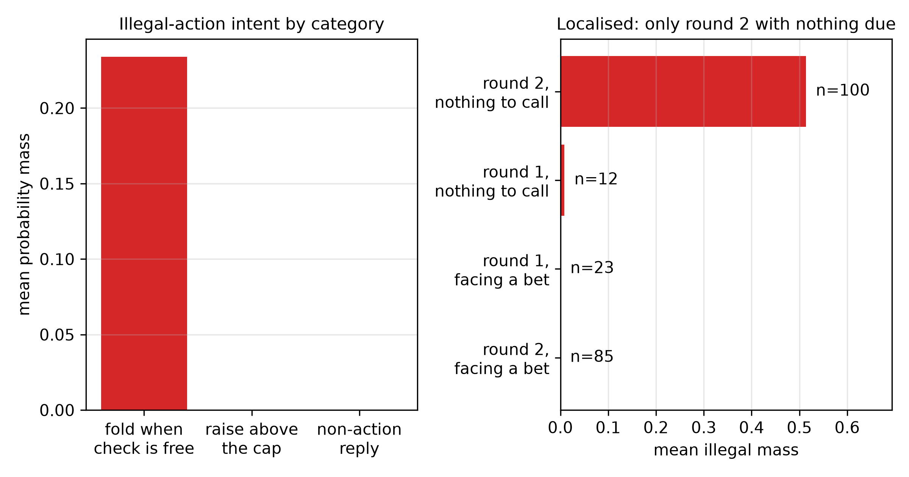

<!--
OFFICIAL PhD TITLE (keep consistent across all documents):
EN: Research on the possibilities for applying Artificial Intelligence in computer games
BG: Изследване на възможностите за приложение на изкуствения интелект в компютърни игри
-->

---
title: "Стъпка 12 Обобщение - Последователни модели и агенти с голям езиков модел в стратегически среди"
subtitle: "Изследване върху възможностите за прилагане на изкуствен интелект в компютърните игри"
author: "Alexander Andreev"
date: "July 2026"
lang: bg
vars:
  research_focus: "Adaptive Strategy Learning in Multi-Agent Imperfect-Information Environments"
---

# Стъпка 12 - Последователни модели и агенти с голям езиков модел в стратегически ситуации

## Защо да се разглежда обучението с подкрепление като прогнозиране на последователност

Класическото обучение с подкрепление оптимизира чрез оценка на функция на стойността, връщане на наградите и подобряване на стратегията. Трансформърът за вземане на решения (Chen и др., 2021) предлага различен подход - разглежда целия проблем като **супервизирано моделиране на последователности**. На gPT-style модел се подава траектория от тройки

$$(\hat{R}_1, s_1, a_1,\; \hat{R}_2, s_2, a_2,\; \dots)$$

където $\hat{R}_t = \sum_{t'\ge t} r_{t'}$ е *очакваната възвръщаемост до края*, моделът се обучава да предсказва $a_t$ въз основа на всичко, случващо се до $s_t$. Не се използва оператор на Белман и не се извършва стъпка за подобряване на стратегията. При извод просто **условие**: задайте желана висока очаквана възвръщаемост до края и моделът генерира действията, които исторически са я предшествали.

Привлекателността на тази теза е, че тя работи изцяло **извън линия**, върху фиксиран набор от данни - в режима, в който се намират логовете на Playtech на Step 13, където самообучението не е възможно.

> **Прочетете повече:** Chen и др., *Трансформър за вземане на решения: Обучение с подкрепление чрез моделиране на последователности*,
> neurIPS 2021 (arXiv:2106.01345).

## Капанът между късмета и умението

Преформулирането прикрива едно предположение: че очакваната възвръщаемост до края е нещо, което агентът *е заслужил*. В стохастична среда това не е вярно. Paster и др. (2022) показват, че стратегиите, обусловени от възвръщаемостта, систематично преследват късмета, а най-простият пример го прави очевидно.

Разгледайте едностъпков еднорък бандит. Действие А изплаща $0.5$ детерминистично, а действие B изплаща $1.0$ с вероятност $0.4$ и $0$ в останалите случаи, така че очакваната му стойност е $\mathbb{E}[B] = 0.4 < 0.5$. Действие А е оптимално по очаквана стойност. Единственият начин обаче една траектория да постигне възвръщаемост от $1.0$ е чрез избор на действие B и получаване на късмет. Ако обусловим върху „възвръщаемост $= 1.0$“, ще получим единствено траектории с действие B:

$$P(a = B \mid \hat{R} = 1.0) = 1.00 \quad \text{(measured)}$$

Обучаващият се, обусловен от възвръщаемостта, уверено избира действието с по-ниска **очаквана стойност**. Това не е грешка в модела; това е смисълът на **условност върху изход**, когато самият изход съдържа елемент на случайност.

> **Прочетете повече:** Paster, McIlraith & Ba, *You Can't Count on Luck: Why Decision Transformers and RvS
> Fail in Stochastic Environments*, neurIPS 2022 (arXiv:2205.15967).

## абстрактен дървовиден модел на решенията - условност върху гарантираното

Решението е да се обуславя не върху възвръщаемостта, която *се е случила*, а върху възвръщаемостта, която главният герой може **да гарантира срещу противник в най-лошия случай** - минимакс очакваната възвръщаемост до края. ARDT (Tang и др., 2024) я оценява чрез **регресия с експектили**, която минимизира асиметричната квадратична загуба.

$$L^{\alpha}_{\mathrm{ER}}(u) = \mathbb{E}_u\!\left[\,\lvert \alpha - \mathbf{1}(u > 0)\rvert \cdot u^2\,\right]$$

чиито граници дават необходимите оператори: $\alpha \to 0$ възстановява **минимума**, а $\alpha \to 1$ - **максимума**. Траекториите се преетикетират с оценената минимакс доходност и върху тях се обучава стандартен дървовиден модел на решенията.

Два детайла от публикувания метод имат значение и двата бяха потвърдени чрез прочитане на източника, а не само резюмето. Първо, песимистичната страна е **ниска** $\alpha$ (твърдението в суровия текст, че $\tau = 0.9$ е песимистичен, е обърнато); самата статия изпълнява $\alpha = 0.01$. Второ - по-важното - целта за преозначаване е

$$\tilde{R}_t = \tilde{Q}_\nu(s_t, a_t)$$

стойност на **състояние-действие**, получена от два *свързани* оценителя, които се напасват последователно със загуби $\alpha$ и $1-\alpha$. Стойност на състояние $V(s)$ не може да различи „това състояние е лошо“ от „*това действие* в това състояние е лошо“, което е точно дискриминацията, върху която методът се основава.

Измерена върху **Кун** с умишлено опростен заместител, отчитащ само състоянието, целта за преозначаване се изменя монотонно с $\tau$, както изисква теорията - но експлоатируемостта е *най-ниска* от оптимистичната страна, което е белегът на липсващия аргумент на **действието**, а не доказателство срещу **абстрактния дървовиден модел на решенията**.

> **Прочетете повече:** Tang, Zhang, Gu и др., *Adversarially Robust Decision Transformer*, NeurIPS 2024
> (arXiv:2407.18414) - Section 3 и Algorithm 1.

## Какво всъщност представлява условното връщане в покера

Равновесието и експлоатируемостта на **Кун покер** могат да бъдат изчислени точно, поради което въпросът може да бъде решен, а не само обсъждан. Резултатът е, че условното връщане **променя** стратегията съществено, но не я **насочва**: експлоатируемостта остава непроменена в диапазона на реалните **добити цели**, с рязък спад при една конкретна стойност - модалната печалба, която в Кун е печалбата от **пас**.

Естественото обяснение е, че в игра с четири печалби *големината* на връщането кодира кой **залог** е бил изигран, а неговият *знак* - кой държи по-добрата карта. Следователно условното връщане определя формата на ръката, а не качеството на играта.

Ледюк Холдем тества това обяснение с петнадесет стойности на печалбата вместо четири, два кръга на залагане и обща карта. **Сривът изчезва точно както предвижда обяснението - и насочването все още не се наблюдава** (Пирсън $r = +0.062$). Следователно обяснението с алфабета на изплащанията обяснява срива, но не и провала. Провалът е по-фундаментален: в игра с нулева сума и непълна информация реализираната възвръщаемост се определя основно от тайната карта и действията на опонента, които главният герой не контролира. Никакво количество гранулираност на печалбата не прави един неконтролируем сигнал управляем.

Това е аргументът, който се пренася в Стъпка 13. При фиксирани логове трансформърът с обуславяне по връщането е неподходящият инструмент - и стойността на преетикетирането при абстрактния дървовиден модел на решенията се състои именно в това, че то заменя неконтролируема **цел на обуславяне** с контролируема.

## Езикови модели като стратегически агенти

Втората парадигма изцяло пропуска обучението: опишете правилата на английски и оставете езиков модел да играе. Измерени по същия точен критерий, ЕМ са **честно експлоатируеми** - но интересният резултат е *къде* те се провалят.

Те разбират правилно **ранга** на ръцете, но грешат в **честотите** на смесените стратегии. Всеки тестван бекенд залага със стойност краля с вероятност 1.00, докато равновесието изисква смесване при 0.68, и никой не блъфира с валето изобщо при обикновена подкана. Модел от 7B съвпада с модел от 20B, защото играта възнаграждава правилното смесване, а не знанието или мащаба.

Разлагането на загубата по решение обръща очевидното тълкуване. „Провалът“ с краля - най-голямото видимо отклонение от равновесие - представлява **0.1%** от общата загуба, тъй като свръхзалагането на ръка, която никога не е по-слаба, е почти безплатно. Едно единствено решение с дама струва **41.4%**. Величината на отклонението и цената са почти некорелирани, което е конкретният аргумент за докладване на диагностика по решения, вместо да се представя само едно число за експлоатируемост в рамката за оценяване от Стъпка 14.

Питането на модел какво възнамерява е *по-лошо* от измерването на това, което прави. Оценени като стратегии, заявените от тези модели честоти са 2.6 и 4.0 пъти по-експлоатируеми в сравнение със стратегиите, които те реално играят. Един модел отговаря „50%“ почти навсякъде, а другият - „почти 0%“ почти навсякъде, включително и когато държи най-силната ръка. Поведенческото проучване тук не е просто по-удобно от самоанализа - то е по-точно.

> **Прочетете повече:** Guertler и др., *TextArena: A Framework for Text-Based Game Environments*, 2025  
> (arXiv:2504.11442).

## Експлоатация, адаптация и ограниченията на опростената игра

Мерките за експлоатируемост показват доколко съвършен противник ви наказва; те не казват нищо за това колко добре вие сами наказвате слабостите. Измерено спрямо набор от умишлено експлоатируеми компетентни архетипи, езиковият модел **експлоатира с 61% по-силно от равновесната игра, като същевременно е 59 пъти по-експлоатируем** - но цялата печалба идва от пасивни и случайни противници. Срещу двата най-компетентни архетипа той се представя *по-зле* от равновесието. Това е компромисът безопасност–експлоатация, който представлява вторият принос на дисертацията, наблюдаван, а не предположен.

Като се има предвид наблюдаемата история на една сесия в контекст, моделът **не** се адаптира: той улавя 83% от наличната експлоатация срещу тривиално пасивен противник още от първата половина на сесията и не показва никакво подобрение (средно обучение $-0.22$). Това, което изглежда като моделиране на противника, всъщност е фиксирано предварително убеждение, благоприятстващо разпуснат-агресивни стратегии.

Накрая опростената игра ласкае тези модели. Една улица и една обща карта по-късно големият езиков модел е статистически неразличим от трансфърмъра за вземане на решения, изобщо не може да победи слаби противници и има склонност към недопустимо действие с приблизително една четвърт от своята вероятностна маса. Този провал се дължи на *едно* погрешно схващане, а не на разпръсната обърканост - моделът иска да **пасува, когато проверката е безплатна**, почти изключително със слаби несдвоени раздавания срещу висока маса, докато никога не прави опит за повишаване над лимита за залагане. Всеки оптимизъм, произтичащ от опростената игра, трябва да се възприема като свойство на самата опростена игра.

## Основни изводи за синтеза на дисертацията

- **Обуславянето на величина, която агентът не контролира, не може да го насочва.** Демонстрирано в две игри; това е причината преетикетирането на ARDT - а не самият трансформър за вземане на решения - да се прехвърля към фиксирани покер логове.
- **Публикуваният ARDT преетикетира със стойност на състояние-действие.** Възпроизвеждането на ползата от метода изисква $\tilde{Q}(s,a)$, а не $V(s)$ - идентифицираното и подкрепено с доказателства решение за Стъпка 13.
- **Скаларна оценка класира методите, но не ги диагностицира.** Едно решение носи 41.4% от загубата, докато най-забележимото отклонение носи 0.1%.
- **Измервайте поведението, а не самоотчета.** Вербализираната стратегия е съществено по-лоша от изиграната стратегия за всеки тестван модел.
- **Адаптация към съперника в контекста не се появява**, така че е необходим експлицитен модел на противника, а не да се приема за даденост - пряко свързано с първия принос на дисертацията.
- **Протоколът за измерване е част от резултата.** При алчен избор на последователност езиковият модел играе чиста стратегия и всяка измерена честота дегенерира до 0 или 1; четири отделни открития в тази стъпка се оказаха измервателни артефакти, всеки от които беше хванат чрез евтина проверка спрямо точно изчислимо количество.
