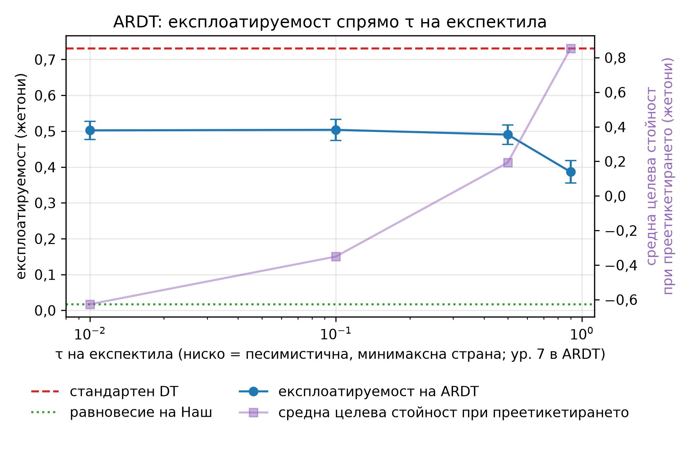

<!--
OFFICIAL PhD TITLE (keep consistent across all documents):
EN: Research on the possibilities for applying Artificial Intelligence in computer games
BG: Изследване на възможностите за приложение на изкуствения интелект в компютърни игри
-->

---
title: "Глава 12 Обобщение - Модели на последователности и агенти с голям езиков модел в стратегически среди"
subtitle: "Изследване върху възможностите за прилагане на изкуствен интелект в компютърните игри"
author: "Alexander Andreev"
date: "July 2026"
lang: bg
vars:
  research_focus: "Adaptive Strategy Learning in Multi-Agent Imperfect-Information Environments"
---

# Глава 12 - Модели на последователности и агенти с голям езиков модел в стратегически среди

## Защо да се разглежда обучението с подкрепление като прогнозиране на последователност

Класическото обучение с подкрепление оптимизира, като оценява функцията на стойността, разпространява наградите назад (белманово обновяване) и подобрява стратегията. Decision Transformer (DT, „трансформър за вземане на решения“; Chen и др., 2021) предлага друг подход: разглежда целия проблем като **моделиране на последователности чрез обучение с учител**. На модел от типа GPT се подава траектория от тройки

$$(\hat{R}_1, s_1, a_1,\; \hat{R}_2, s_2, a_2,\; \dots)$$

където $\hat{R}_t = \sum_{t'\ge t} r_{t'}$ е *остатъчната възвръщаемост* (return-to-go), а моделът се обучава да предсказва $a_t$ въз основа на всичко, случващо се до $s_t$. Не се използва оператор на Белман и не се извършва стъпка за подобряване на стратегията. При използването на модела той просто се **обуславя**: задава се желана висока остатъчна възвръщаемост и моделът генерира действията, които в данните са предшествали такива възвръщаемости.

За дисертацията подходът е привлекателен, защото работи изцяло **офлайн** - върху фиксиран набор от записани данни, какъвто е случаят с историите на реални игри, при които самообучението не е възможно.[^chen2021]

## Капанът между късмета и умението

Преформулирането прикрива едно предположение: че остатъчната възвръщаемост е нещо, което агентът *е заслужил*. В стохастична среда това не е вярно. Paster и др. (2022) показват, че стратегиите, обусловени от възвръщаемостта, систематично преследват късмета, а най-простият пример го прави очевидно.

Разгледайте едностъпкова задача с два възможни избора (двурък бандит). Действие A изплаща $0.5$ детерминистично, а действие B изплаща $1.0$ с вероятност $0.4$ и $0$ в останалите случаи, така че очакваната му стойност е $\mathbb{E}[B] = 0.4 < 0.5$. Действие A е оптимално по очаквана стойност. Единственият начин обаче една траектория да постигне възвръщаемост от $1.0$ е чрез избор на действие B и получаване на късмет. Ако обусловим по „възвръщаемост $= 1.0$“, ще получим единствено траектории с действие B:

$$P(a = B \mid \hat{R} = 1.0) = 1.00 \quad \text{(измерено в собствена симулация)}$$

Обучаваният модел, обусловен по възвръщаемостта, уверено избира действието с по-ниска очаквана стойност. Това не е грешка в модела, а самата същност на обуславянето по изхода, когато изходът отчасти зависи от случайността.[^paster2022]

## ARDT - обуславяне по гарантираната възвръщаемост

Решението е да се обуславя не по възвръщаемостта, която *се е случила*, а по възвръщаемостта, която агентът може **да си гарантира срещу противник в най-лошия случай** - минимаксната остатъчна възвръщаемост. ARDT (Tang и др., 2024) я оценява чрез **регресия с експектили**, която минимизира асиметричната квадратична загуба

$$L^{\alpha}_{\mathrm{ER}}(u) = \mathbb{E}_u\!\left[\,\lvert \alpha - \mathbf{1}(u > 0)\rvert \cdot u^2\,\right]$$

чиито граници дават необходимите оператори: $\alpha \to 0$ възстановява **минимума**, а $\alpha \to 1$ - **максимума**. Траекториите се преетикетират с оценената минимаксна възвръщаемост и върху тях се обучава стандартен DT.

Два детайла от публикувания метод са съществени; и двата са проверени в самата статия, а не само в резюмето ѝ. Първо, песимистичната страна съответства на **ниско** $\alpha$ (в първоначалния план на главата $\tau = 0.9$ погрешно е описано като песимистично); самата статия използва $\alpha = 0.01$. Второ - и по-важно - целевата стойност при преетикетирането е

$$\tilde{R}_t = \tilde{Q}_\nu(s_t, a_t)$$

стойност на двойката **състояние-действие**, получена от два *свързани* оценителя, които се напасват редуващо се със загуби $\alpha$ и $1-\alpha$. Стойност на състояние $V(s)$ не може да различи „това състояние е лошо“ от „*това действие* в това състояние е лошо“, а точно на това разграничение се основава методът.

Измерена върху **Кун** с умишлено опростен заместител, който отчита само състоянието, целевата стойност при преетикетирането се изменя монотонно с $\tau$, както изисква теорията - но експлоатируемостта е *най-ниска* от оптимистичната страна. Най-вероятната причина е, че действието липсва като аргумент на оценката; вариант с $\tilde{Q}(s,a)$ още не е изпълнен, така че резултатът нито опровергава, нито потвърждава ARDT.[^tang2024]

## Какво всъщност прави обуславянето по възвръщаемостта в покера

Равновесието и експлоатируемостта на **Кун покер** могат да бъдат изчислени точно (вж. глава 2),[^kuhn1950] поради което въпросът може да бъде решен, а не само обсъждан. Резултатът е, че обуславянето по възвръщаемостта **променя** стратегията съществено, но не я **насочва**: експлоатируемостта остава почти една и съща в целия диапазон на реално постижимите целеви стойности, с изключение на рязък скок (до ≈ 1.9 жетона) при една конкретна стойност - най-честата печалба, която в Кун е печалбата при пас.

На същите данни обикновеното поведенческо клониране достига експлоатируемост 0.055 жетона - близо до равновесието (0.016) - срещу 0.799 за DT: обуславянето по възвръщаемостта активно унищожава информация (стойността за DT варира между повторни обучения, 0.67–0.80).

Естественото обяснение е, че в игра само с четири възможни стойности на печалбата *големината* на възвръщаемостта кодира коя последователност от залози е изиграна, а *знакът* ѝ - кой е държал по-добрата карта. Следователно обуславянето избира хода на раздаването, а не качеството на играта.

Ледюк Холдем тества това обяснение с петнадесет стойности на печалбата вместо четири, два рунда на залагане и обща карта. **Спадът при най-честата възвръщаемост изчезва, както предвижда обяснението, но насочване пак не се наблюдава** (Пирсън $r = +0.062$); остават обаче два необяснени спада - при 0 (втората по честота възвръщаемост) и при $-5$. Следователно обяснението чрез малкия брой възможни печалби обяснява срива, но не и провала. Провалът е по-фундаментален: в игра с нулева сума и непълна информация реализираната възвръщаемост се определя основно от тайната карта и действията на опонента, които агентът не контролира. Колкото и да са възможните стойности на печалбата, сигнал, който агентът не контролира, не става управляем.

Това е основният извод на главата: при обучение върху записани партии DT, обусловен по възвръщаемостта, е неподходящ инструмент, а предимството на преетикетирането при ARDT е, че заменя целева стойност, която агентът не контролира, с такава, която зависи главно от собствените му действия.

## Езикови модели като стратегически агенти

Втората парадигма изцяло пропуска обучението: опишете правилата на английски и оставете езиков модел да играе. Тествани са три модела с отворени тегла, изпълнявани локално (LM Studio 0.4.20 на RTX 5090, температура 0.7; квантизацията на теглата не е записана): gpt-oss-20b, Qwen2.5-7B-Instruct и OpenThinker3-7B (Qwen2.5-7B-Instruct, дообучен за разсъждения). Ако не е посочено друго, резултатите по-долу са за Qwen2.5-7B-Instruct; всички числа са от собствени измервания. Сходни експерименти в Кун, Ледюк и лимитен холдем показват, че и по-големи модели не се доближават до равновесна игра, а действията им често се разминават със заявените разсъждения[^lin2026]; подкана с изрично разсъждение за противника позволява на GPT-4 да адаптира играта си.[^guo2023] Измерени със същия точен критерий, големите езикови модели се оказват **действително експлоатируеми**, но по-интересно е *къде* грешат.

Те разбират правилно **ранга** на ръцете, но грешат в **честотите** на смесените стратегии. Всеки от тестваните реални модели залага за стойност с поп с вероятност 1.00, докато изчисленото с CFR равновесие смесва с 0.68, и при обикновена подкана нито един не блъфира с вале в извадка от 24 опита на информационно множество. (В Кун равновесията на първия играч образуват еднопараметрично семейство - блъф с вале с вероятност α ∈ [0, 1/3] и залог с поп с вероятност 3α,[^kuhn1950] така че поотделно и двете поведения са равновесни; неравновесна е само комбинацията им.) Модел със 7 млрд. параметъра (Qwen2.5-7B) се представя наравно с gpt-oss-20b - модел със смес от експерти с 21 млрд. параметъра общо, но само 3.6 млрд. активни при всеки токен; при три модела и една опростена игра това не позволява извод за ролята на мащаба.

Разлагането на загубата по решение обръща очевидното тълкуване. „Провалът“ с поп - най-голямото видимо отклонение от равновесието - носи само **0.1%** от общата загуба, защото прекомерното залагане с ръка, която никога не е по-слаба, почти не струва нищо. Едно-единствено решение с дама струва **41.4%**. Големината на отклонението и цената му почти не са корелирани - конкретен аргумент при оценяването да се отчита диагностика по отделни решения, а не само едно число за експлоатируемост.

Питането на модел какво възнамерява е *по-лошо* от измерването на това, което прави. Оценени като стратегии, заявените от тези модели честоти са 2.6 и 4.0 пъти по-експлоатируеми в сравнение със стратегиите, които те реално играят. Един модел отговаря „50%“ почти навсякъде, а другият - „почти 0%“ почти навсякъде, включително и когато държи най-силната ръка. Поведенческото проучване тук не е просто по-удобно от самоанализа - то е по-точно (собствено измерване).

## Експлоатация, адаптация и ограниченията на опростената игра

Мерките за експлоатируемост показват доколко съвършен противник ви наказва; те не казват нищо за това колко добре вие сами наказвате слабостите. Измерено спрямо набор от умишлено експлоатируеми архетипи, езиковият модел (Qwen2.5-7B-Instruct) **печели средно 0.177 жетона на раздаване срещу 0.110 за равновесната игра (с 61% повече), но експлоатируемостта му е 0.357 жетона срещу 0.006** - и близо 90% от предимството идва от пасивния и случайния противник. Срещу двата най-компетентни архетипа той се представя *по-зле* от равновесието. Това е компромисът между безопасност и експлоатация, с който се занимава вторият принос на дисертацията - тук наблюдаван, а не предположен.

Когато историята на сесията (последните 20 раздавания) е подадена в контекста, моделът (Qwen2.5-7B-Instruct) **не** се адаптира: срещу тривиално пасивен противник той улавя 83% от наличната експлоатация още в първата половина на сесията и не се подобрява във втората (0.824 срещу 0.827); при другите два противника резултатът не е статистически надежден. Това, което изглежда като моделиране на противника, всъщност е фиксирано априорно убеждение, благоприятстващо разпуснато-агресивна игра. Когато обаче типът на противника е *описан* в подканата, моделите променят честотата на блъфиране с до 0.92 - липсва изводът от историята, а не способността да се реагира на описание.

Накрая опростената игра ласкае тези модели. С един рунд на залагане и една обща карта повече големият езиков модел вече е статистически неразличим от DT, губи средно срещу набора от слаби противници (печели само срещу двата пасивни типа) и насочва приблизително една четвърт от вероятностната си маса към недопустими действия. Този провал се дължи на *едно* погрешно схващане, а не на обща обърканост: моделът иска **да се откаже от ръката, когато може безплатно да направи чек**, почти изключително със слаби ръце без чифт при висока обща карта, и нито веднъж не се опитва да повиши над лимита за залагане. Всеки оптимизъм, произтичащ от опростената игра, трябва да се възприема като свойство на самата опростена игра.

## Основни изводи за синтеза на дисертацията

- **Обуславянето по величина, която агентът контролира само отчасти, не насочва поведението му.** Наблюдавано е в две опростени игри и съответства на теорема 2.1 на Paster и др.; затова за записани покер партии по-обещаващо е преетикетирането на ARDT, а не самият DT - при условие че се отчетат и случайните ходове (раздаването на картите), при които минимаксната цел на ARDT вече не е точна.[^tang2025]
- **Публикуваният ARDT преетикетира със стойност на двойката състояние-действие.** Възпроизвеждането на ползата от метода най-вероятно изисква $\tilde{Q}(s,a)$, а не $V(s)$ - това е следващата стъпка, която още предстои да се провери.
- **Скаларна оценка класира методите, но не ги диагностицира.** Едно решение носи 41.4% от загубата, докато най-забележимото отклонение носи 0.1%.
- **Измервайте поведението, а не самоотчета.** Вербализираната стратегия е съществено по-лоша от изиграната стратегия за всеки тестван модел.
- **Моделът не изведе противника от историята в контекста** (един модел със 7 млрд. параметъра, прозорец от 20 раздавания), но реагира, когато типът на противника му е съобщен; затова моделът на противника трябва да се изгради изрично и резултатът му да се подава на стратегията - пряко свързано с първия принос на дисертацията.
- **Протоколът за измерване е част от резултата.** При алчно декодиране (температура 0) езиковият модел играе чиста стратегия и всяка измерена честота дегенерира до 0 или 1; четири отделни открития в тази глава се оказаха измервателни артефакти, всеки от които беше открит чрез евтина проверка спрямо точно изчислимо количество.

<!-- Бележки към източниците. Заглавията на чуждоезични източници не се
     превеждат (правило 7 от terminology_EN_BG.md). -->

[^chen2021]: Chen et al., *Decision Transformer: Reinforcement Learning via Sequence Modeling*, NeurIPS 2021 (arXiv:2106.01345).

[^paster2022]: Paster, McIlraith & Ba, *You Can't Count on Luck: Why Decision Transformers and RvS Fail in Stochastic Environments*, NeurIPS 2022 (arXiv:2205.15967).

[^tang2024]: Tang, X., Marques, A., Kamalaruban, P. & Bogunovic, I., *Adversarially Robust Decision Transformer*, NeurIPS 2024 (arXiv:2407.18414) - Section 3 и Algorithm 1.

[^kuhn1950]: Kuhn, H. W. (1950). "A Simplified Two-Person Poker." In H. W. Kuhn & A. W. Tucker (Eds.), *Contributions to the Theory of Games*, Vol. I (Annals of Mathematics Studies 24), pp. 97–103. Princeton University Press. DOI 10.1515/9781400881727-010.

[^lin2026]: Lin, M., Dai, E., Liu, H. et al., *How Far Are LLMs from Professional Poker Players? Revisiting Game-Theoretic Reasoning with Agentic Tool Use*, ICLR 2026 (arXiv:2602.00528).

[^guo2023]: Guo, J., Yang, B., Yoo, P., Lin, B. Y., Iwasawa, Y. & Matsuo, Y., *Suspicion-Agent: Playing Imperfect Information Games with Theory of Mind Aware GPT-4*, 2023 (arXiv:2309.17277).

[^tang2025]: Tang, X., Cheng, Z. & Kumar, S., *Robust Adversarial Reinforcement Learning in Stochastic Games via Sequence Modeling*, Reliable ML Workshop @ NeurIPS 2025 (arXiv:2510.11877) - метод CART; отбелязва, че минимаксната цел на ARDT е точна само при детерминирани преходи.
