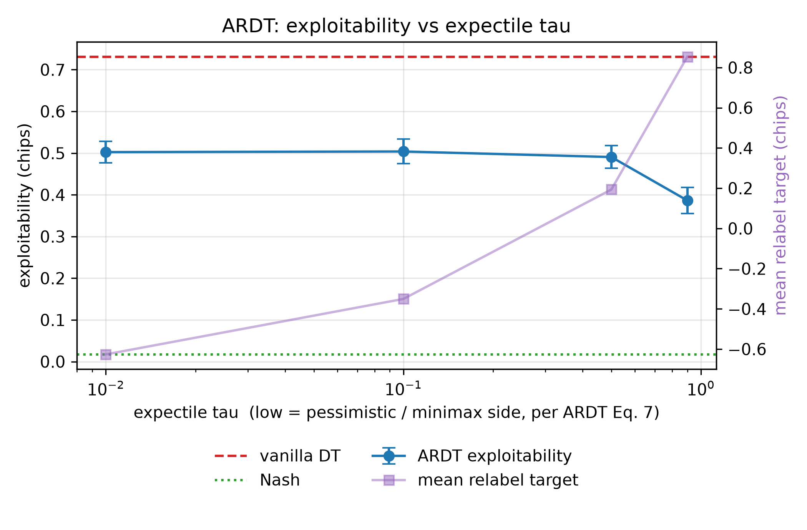
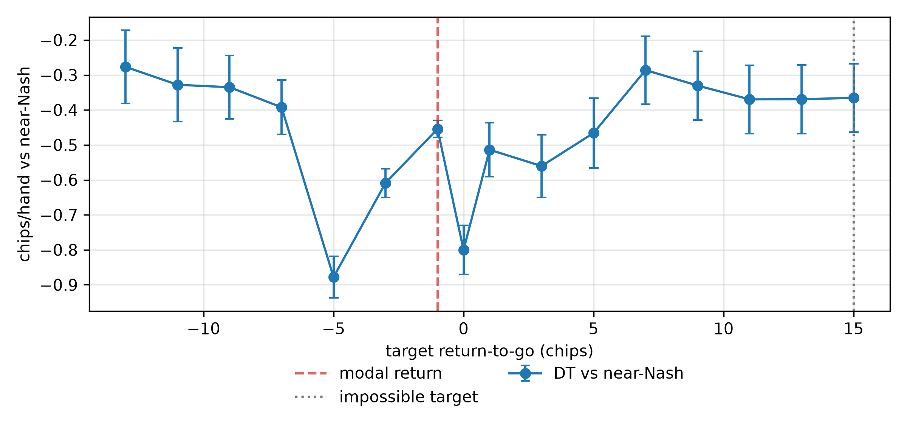
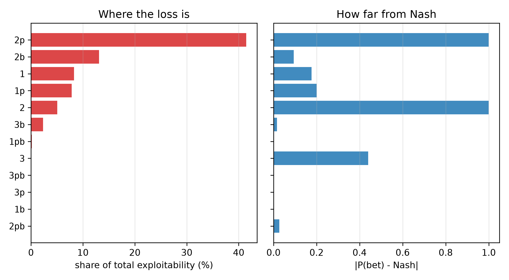
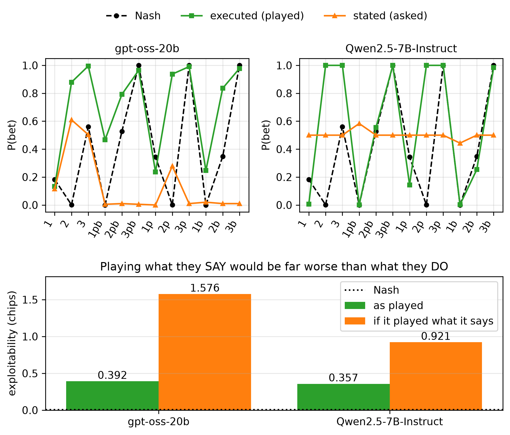
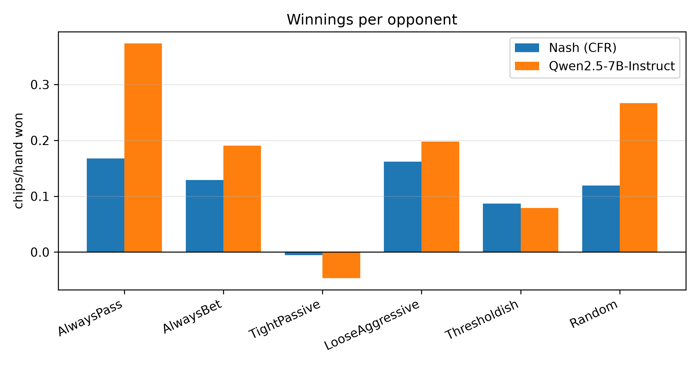
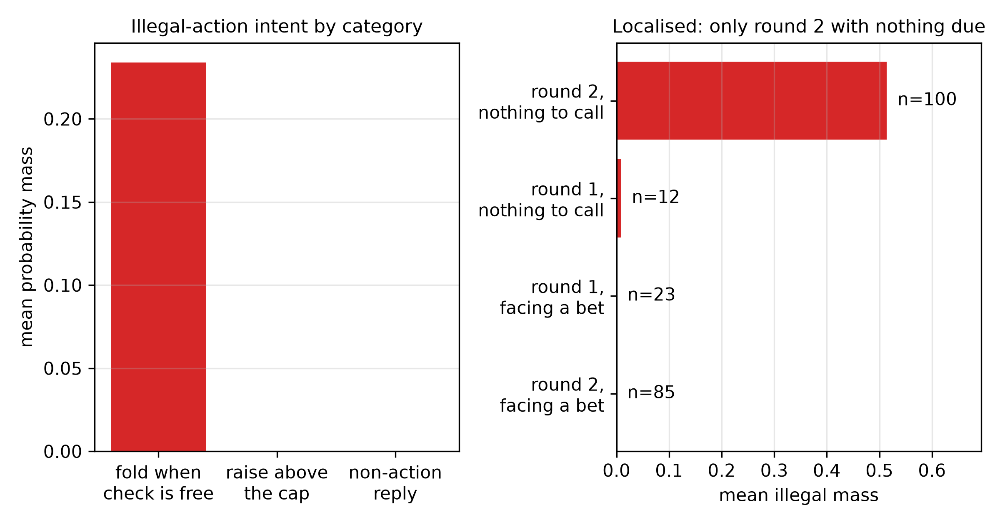

<!--
OFFICIAL PhD TITLE (keep consistent across all documents):
EN: Research on the possibilities for applying Artificial Intelligence in computer games
BG: Изследване на възможностите за приложение на изкуствения интелект в компютърни игри
-->
---
title: "Chapter 12 Summary — Sequence Models and LLM Agents in Strategic Settings"
subtitle: "Research on the possibilities for applying Artificial Intelligence in computer games"
author: "Alexander Andreev"
date: "July 2026"
lang: en
vars:
  research_focus: "Adaptive Strategy Learning in Multi-Agent Imperfect-Information Environments"
---

# Chapter 12 — Sequence Models and LLM Agents in Strategic Settings

## Why reframe reinforcement learning as sequence prediction

Classical RL optimises: estimate a value function, back up rewards, improve the policy. The
Decision Transformer (Chen et al., 2021) proposes something different — treat the whole problem as
**supervised sequence modelling**. Feed a GPT-style model a trajectory of triples

$$(\hat{R}_1, s_1, a_1,\; \hat{R}_2, s_2, a_2,\; \dots)$$

where $\hat{R}_t = \sum_{t'\ge t} r_{t'}$ is the *return-to-go*, and train it to predict $a_t$ from
everything up to $s_t$. There is no Bellman backup and no policy-improvement step. At inference you
simply **condition**: ask for a high return-to-go and the model produces the actions that
historically preceded such returns.

The appeal for this dissertation is that it works entirely **offline**, on a fixed dataset — the
regime of recorded game logs, where self-play is unavailable.[^chen2021]

## The luck-versus-skill trap

The reframing hides an assumption: that the return-to-go is something the agent *earned*. In a
stochastic environment it is not. Paster et al. (2022) show that return-conditioned policies
systematically chase luck; the smallest example makes it obvious.

Consider a one-step bandit. Action A pays $0.5$ deterministically. Action B pays $1.0$ with
probability $0.4$ and $0$ otherwise, so $\mathbb{E}[B] = 0.4 < 0.5$. Action A is EV-optimal. But the
*only* way a trajectory ever achieves a return of $1.0$ is to take B **and get lucky**. Condition on
"return $= 1.0$" and you recover exclusively B-trajectories:

$$P(a = B \mid \hat{R} = 1.0) = 1.00 \quad \text{(measured in own simulation)}$$

The return-conditioned learner confidently selects the action with the *worse* expected value. This
is not a bug in the model; it is what conditioning on an outcome means when the outcome is partly
noise.[^paster2022]

## ARDT — conditioning on what you can guarantee

The fix is to condition not on the return that *happened* but on the return the protagonist can
**guarantee against a worst-case opponent** — the minimax return-to-go. ARDT (Tang et al., 2024)
estimates it with **expectile regression**, which minimises the asymmetric squared loss

$$L^{\alpha}_{\mathrm{ER}}(u) = \mathbb{E}_u\!\left[\,\lvert \alpha - \mathbf{1}(u > 0)\rvert \cdot u^2\,\right]$$

whose limits give the operators you need: $\alpha \to 0$ recovers the **minimum** and $\alpha \to 1$
the **maximum**. The trajectories are relabelled with the estimated minimax return and a standard DT
is trained on the relabelled data.

Two details of the published method, both confirmed in the source, matter. The pessimistic side is
**low** $\alpha$ (the chapter's original plan wrongly called $\tau = 0.9$ pessimistic; the paper runs
$\alpha = 0.01$). And the relabel target is a state-**action** value, $\tilde{R}_t = \tilde{Q}_\nu(s_t, a_t)$,
produced by two *coupled* estimators alternately fitted with $\alpha$ and $1-\alpha$ losses. A
state-only value $V(s)$ cannot distinguish "this state is bad" from "*this action* in this state is
bad", which is exactly the discrimination the method relies on.

Measured on Kuhn with a deliberately simplified state-only proxy, the relabel target moves
monotonically with $\tau$ as theory requires — but exploitability is *lowest* on the optimistic
side. The most likely cause is the missing action argument; a $\tilde{Q}(s,a)$ variant has not been
run, so this neither refutes nor confirms ARDT.[^tang2024]

## What return conditioning actually does in poker

Kuhn Poker's equilibrium and exploitability are exactly computable (see Chapter 2),[^kuhn1950] so the
question can be settled rather than argued. Conditioning **changes** the policy substantially but
does not **steer** it: exploitability is flat across the range of real target returns, except for a
sharp spike (to ≈ 1.9 chips) at the modal payoff, which in Kuhn is the payoff of folding. On the
same data plain behavioural cloning reaches 0.055 chips of exploitability — close to Nash (0.016) —
against 0.799 for the DT: return conditioning actively destroys information (the DT value varies
between retrains, 0.67–0.80).

The natural explanation is that in a four-payoff game the *magnitude* of the return encodes which
betting line was played, while its *sign* encodes who held the better card. Conditioning therefore
selects the shape of the hand rather than the quality of the play.

Leduc Hold'em tests that explanation with fifteen payoff values instead of four, two betting streets
and a board card. **The notch at the modal return disappears as the explanation predicts — but
steering still does not appear** (Pearson $r = +0.062$); two unexplained dips remain, at 0 (the
second most common return) and at $-5$. The payoff-alphabet account thus explains the collapse but
not the failure, which is more fundamental: in a zero-sum imperfect-information game the
realised return is dominated by the opponent's private card and actions, which the protagonist does
not control.

This is the chapter's main conclusion: on recorded logs, a return-conditioned Decision Transformer
is the wrong instrument, and the value of ARDT's relabeling is that it replaces a conditioning
target the agent does not control with one that depends mainly on its own actions.

## Language models as strategic agents

The second paradigm skips training altogether: describe the rules in English and let a language
model play. Three open-weight models were run locally (the quantisation of the weights was not
recorded): gpt-oss-20b, Qwen2.5-7B-Instruct and OpenThinker3-7B (a reasoning fine-tune of
Qwen2.5-7B-Instruct). Results are for Qwen2.5-7B-Instruct unless stated otherwise; all are own
measurements. Similar experiments on Kuhn, Leduc and Limit Hold'em find larger models also far from
equilibrium, their actions often diverging from their stated reasoning[^lin2026]; prompting explicit
opponent reasoning lets GPT-4 adapt.[^guo2023]
Against the same exact ruler, LLMs are **honestly exploitable** — but the interesting result is
*where* they fail.

They get hand **ranking** right and mixing **frequencies** wrong. Every real model tested value-bets
the King with probability 1.00 where the CFR equilibrium mixes at 0.68, and none bluffs the Jack
under a plain prompt in 24 samples per information set. (Kuhn's first-player equilibria form a
one-parameter family — bluff the Jack with α ∈ [0, 1/3], bet the King with 3α[^kuhn1950] — so each
behaviour alone is an equilibrium action; only the combination is not.) A 7B model matches
gpt-oss-20b (a mixture-of-experts model with 3.6B of 21B parameters active per token), so three
models on one toy game say nothing general about scale.

Decomposing the loss per decision overturns the obvious reading. The King "failure" — the largest
visible deviation from equilibrium — costs **0.1%** of the total loss, because over-betting a hand
that is never behind is nearly free. A single Queen decision costs **41.4%**. Deviation magnitude
and cost are almost uncorrelated, which is the concrete argument for reporting per-decision
diagnostics rather than a single exploitability number.

Asking a model what it intends is *worse* than measuring what it does. Scored as strategies, the
frequencies these models **state** are 2.6× and 4.0× more exploitable than the strategies they
actually **play**. One model answers "50%" almost everywhere, the other "near 0%", even with the
strongest hand. Behavioural probing is more accurate than introspection, not merely more convenient.

## Exploitation, adaptation, and the limits of the toy game

Exploitability measures how a perfect adversary punishes you; it says nothing about how well you
punish weakness. Against a zoo of deliberately exploitable archetypes, the language model **wins
0.177 chips per hand against 0.110 for equilibrium play (61% more), while its exploitability is 0.357
chips against 0.006** — and nearly 90% of the advantage comes from the passive and random opponents.
Against the two most competent archetypes it does *worse* than equilibrium. That is the
safe-exploitation trade-off of the thesis's second contribution, observed rather than assumed.

Given the last 20 hands of the session in context, the model does **not** adapt: against a trivially
passive opponent it captures 83% of the available exploitation in the first half and no more in the
second (0.824 vs 0.827); the other two opponents are underpowered. What looks like opponent modelling
is a fixed loose-aggressive prior. Told the opponent's type in the prompt, however, the models shift
their bluffing by up to 0.92 — what is missing is inference from history, not responsiveness to a
description.

Finally, the toy game flatters these models. One street and one board card later, the LLM is
statistically indistinguishable from the Decision Transformer, loses on average to weak opponents
(winning only against the two passive types), and wants to take an illegal action with roughly a
quarter of its probability mass. That failure is a *single* misconception rather than diffuse
confusion — it wants to **fold when checking is free**, almost exclusively on weak unpaired hands
against a high board, and never tries to raise past the betting cap. Any optimism drawn from the toy
game is a property of the toy game.

## Key takeaways for the thesis synthesis

- **Conditioning on a quantity the agent only partly controls does not steer it.** Observed on two
  toy games and consistent with Paster et al.'s Theorem 2.1; hence ARDT's relabeling, not the
  Decision Transformer itself, is the more promising route for recorded poker logs — provided chance
  events (the deal) are handled, where ARDT's minimax target is no longer exact.[^tang2025] It most
  likely needs the published state-action value $\tilde{Q}(s,a)$, not $V(s)$ — still to be tested.
- **A scalar score does not diagnose, and self-report is worse than behaviour**: one decision
  carried 41.4% of the loss, the most conspicuous deviation 0.1%; stated strategy was worse than
  played strategy for every model tested.
- **The model did not infer its opponent from in-context history** (one 7B model, a 20-hand window)
  but responded when told the opponent's type: the opponent model must be built explicitly and its
  output passed to the policy (the first thesis contribution).
- **Measurement protocol is part of the result.** At greedy decoding a language model plays a pure
  strategy and every frequency degenerates to 0 or 1; four findings in this chapter were measurement
  artefacts, each caught by a cheap check against an exactly computable quantity.

<!-- Source footnotes. Definitions may sit anywhere at top level; keeping them
     together here keeps the prose readable and the EN/BG pair easy to compare. -->

[^chen2021]: Chen et al., *Decision Transformer: Reinforcement Learning via Sequence Modeling*, NeurIPS 2021 (arXiv:2106.01345).

[^paster2022]: Paster, McIlraith & Ba, *You Can't Count on Luck: Why Decision Transformers and RvS Fail in Stochastic Environments*, NeurIPS 2022 (arXiv:2205.15967).

[^tang2024]: Tang, X., Marques, A., Kamalaruban, P. & Bogunovic, I., *Adversarially Robust Decision Transformer*, NeurIPS 2024 (arXiv:2407.18414) — Section 3 and Algorithm 1.

[^kuhn1950]: Kuhn, H. W. (1950). "A Simplified Two-Person Poker." In H. W. Kuhn & A. W. Tucker (Eds.), *Contributions to the Theory of Games*, Vol. I (Annals of Mathematics Studies 24), pp. 97–103. Princeton University Press. DOI 10.1515/9781400881727-010.

[^lin2026]: Lin, M., Dai, E., Liu, H. et al., *How Far Are LLMs from Professional Poker Players? Revisiting Game-Theoretic Reasoning with Agentic Tool Use*, ICLR 2026 (arXiv:2602.00528).

[^guo2023]: Guo, J., Yang, B., Yoo, P., Lin, B. Y., Iwasawa, Y. & Matsuo, Y., *Suspicion-Agent: Playing Imperfect Information Games with Theory of Mind Aware GPT-4*, 2023 (arXiv:2309.17277).

[^tang2025]: Tang, X., Cheng, Z. & Kumar, S., *Robust Adversarial Reinforcement Learning in Stochastic Games via Sequence Modeling*, Reliable ML Workshop @ NeurIPS 2025 (arXiv:2510.11877) — proposes CART; notes that ARDT's minimax target is exact only for deterministic transitions.
