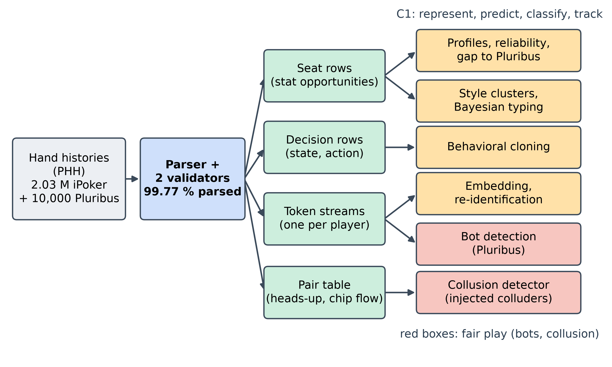
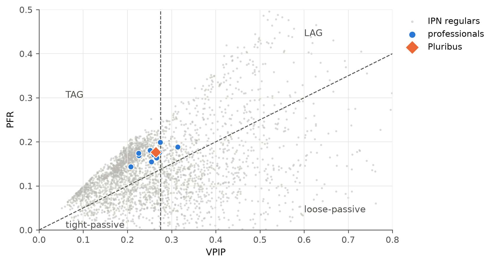
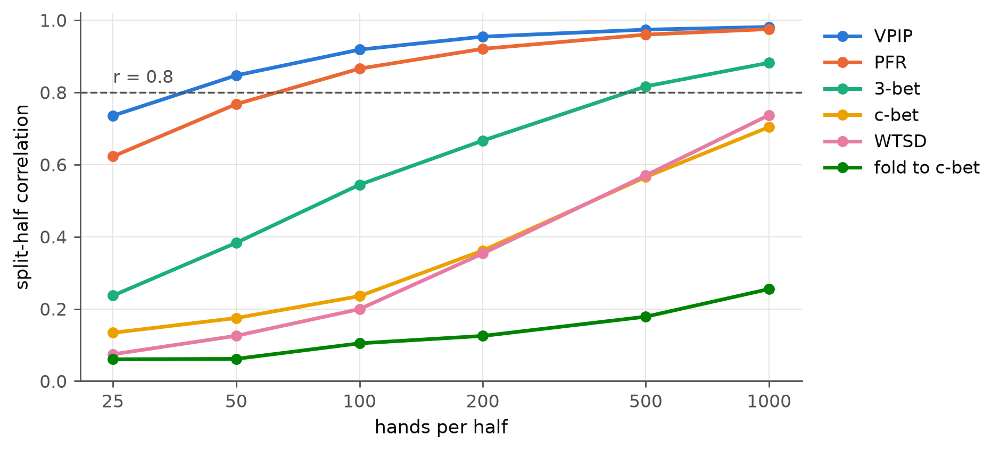
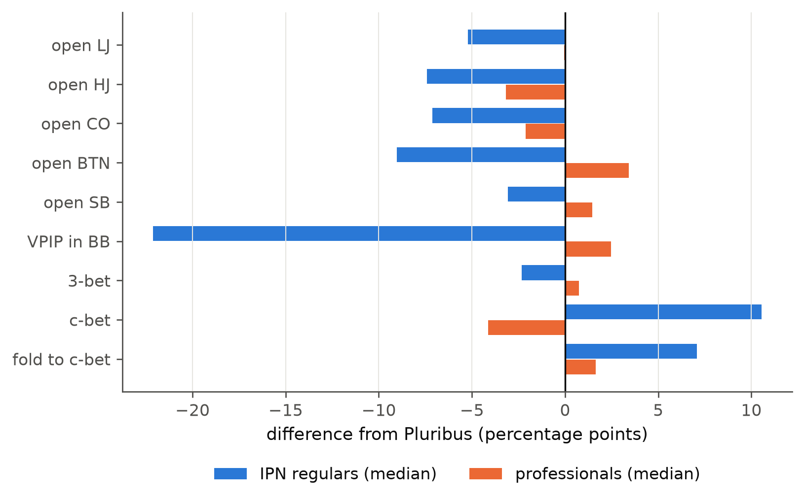
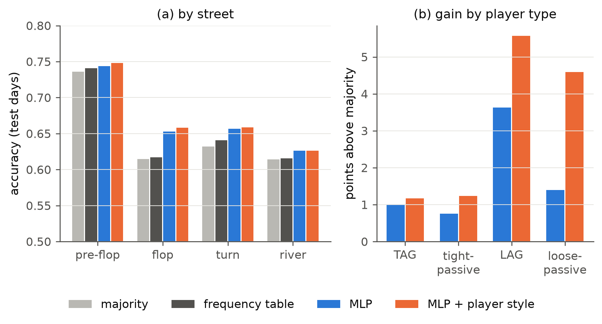
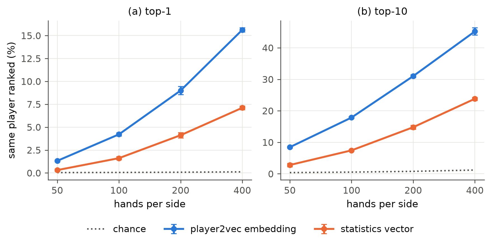
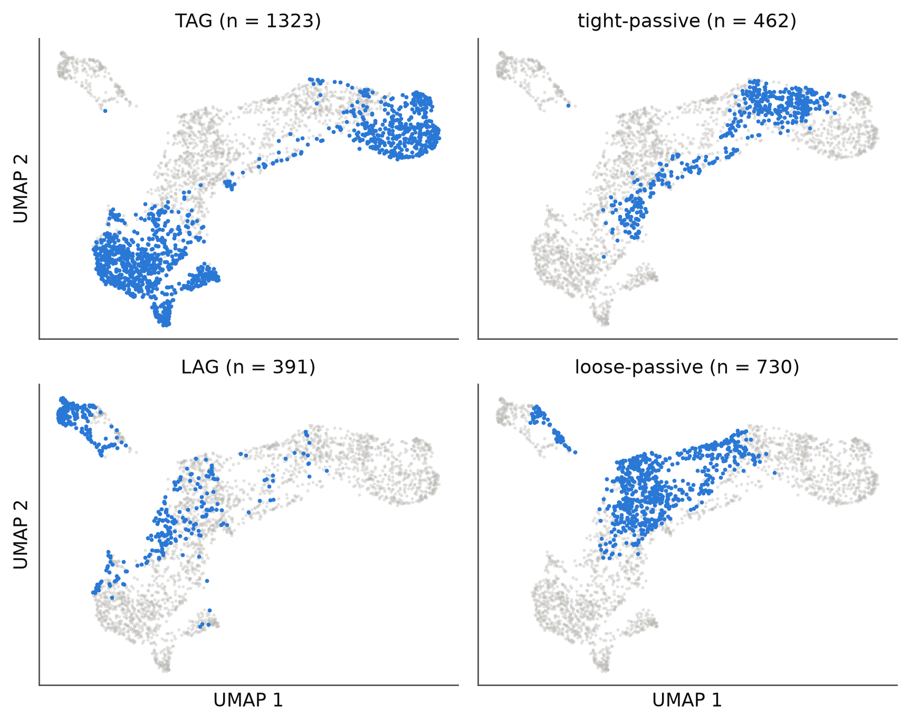
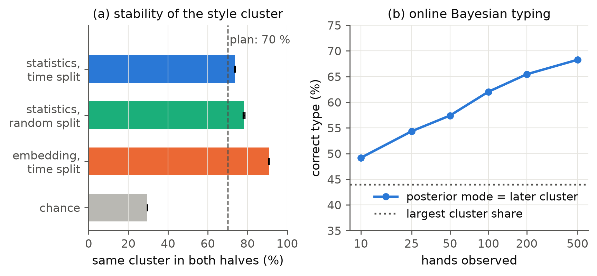
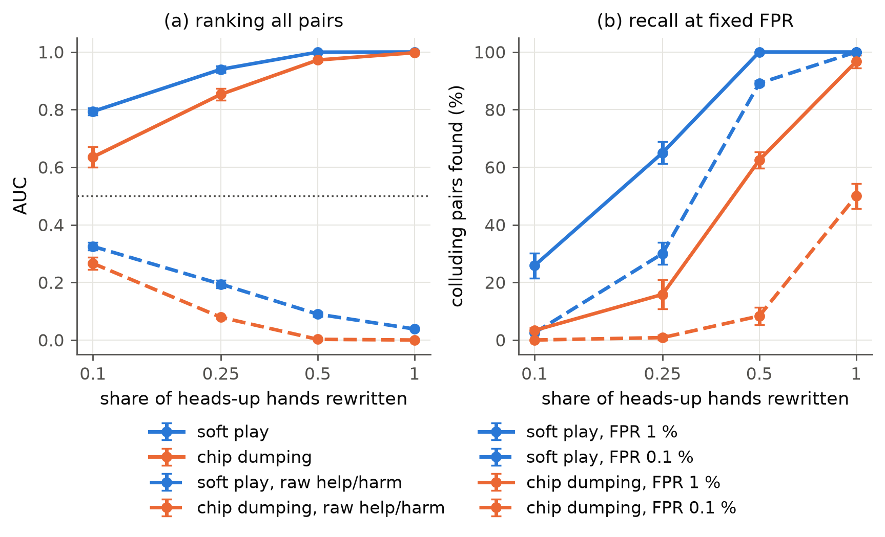
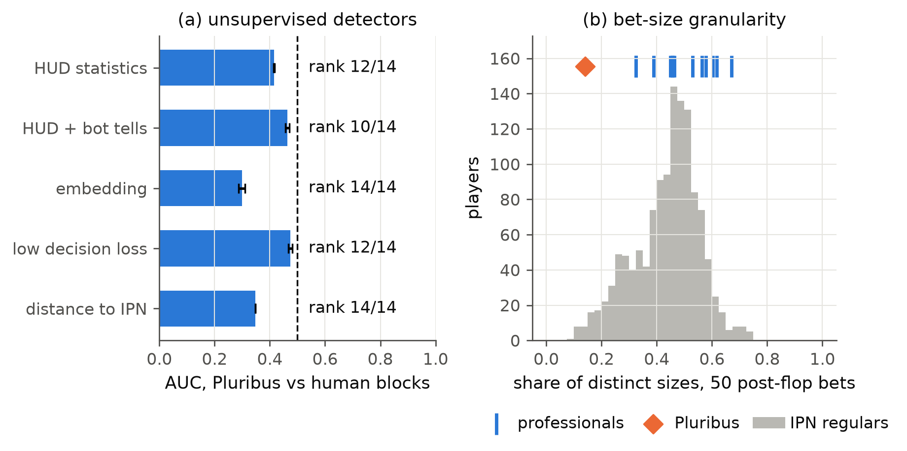

<!--
OFFICIAL PhD TITLE (keep consistent across all documents):
EN: Research on the possibilities for applying Artificial Intelligence in computer games
BG: Изследване на възможностите за приложение на изкуствения интелект в компютърни игри
-->
---
title: "Chapter 13 Summary — Behavioral Analysis Pipelines on Real Hand Histories"
subtitle: "Research on the possibilities for applying Artificial Intelligence in computer games"
author: "Alexander Andreev"
date: "September 2026"
lang: en
vars:
  research_focus: "Adaptive Strategy Learning in Multi-Agent Imperfect-Information Environments"
---

# Chapter 13 — Behavioral Analysis of Real Hand Histories

Chapters 2–12 studied games that could be solved or simulated, where every strategy was known and
every result could be checked against an exact reference. This chapter turns to what real people do.
It takes two million online poker hands and asks what can be learned about the players from the
record alone, down to whether two accounts are helping each other and whether an account is a bot.
**All numbers reported here were measured** on reproducible
runs, with three seeds wherever training or sampling is involved. Where a run contradicted what the
plan predicted, the prediction is kept and reconciled with what happened.

**The data.** All data used here are public. The PHH dataset[^kim2024phh] contains 21.6 million
anonymized no-limit hold'em hands from July 2009, collected from six online rooms by the
hand-history vendor HandHQ. Its iPoker part includes **2,032,655 hands at $0.50/$1 blinds**, and
these are used here. The second source is the **10,000 released hands of Pluribus**[^brown2019], each played by the program and five
professionals. It is the one public sample in which a bot is known, which makes it the ground truth
for bot detection.

**Where this sits in the thesis.** The chapter is the practical core of Contribution #1, the
behavioral adaptation framework, on its data side; the adaptive agent itself is outside its scope.
Real-time opponent modeling with a conservative fallback already works in two-player games,
including small poker games[^fu2022][^caen2026], and N-player opponent modeling exists without any
safety criterion[^ganzfried2024]. So what C1 still needs is the N-player, within-match, safety-coupled
version. It also covers the fair-play task of the individual plan, detecting
collusion and bots. In the literature, collusion detection is scored offline, as a detection
task[^mazrooei2013][^bonjour2022]. No counter-example was found to the statement that none of
these methods couples detection to what the detecting agent does next. This chapter also stays
on the offline side of that line.

---

## From solving games to reading logs

Picture a casino security room in which the cameras are off and only the dealer's logbook is left.
Each line says something like "seat 3 raised to 4, seat 5 folded". A floor manager who reads enough
pages learns each regular's habits and notices two players who never raise each other. They also
notice the account that plays three tables all day with the same rhythm. The pipeline in this
chapter is that floor manager written down, with one addition the floor manager rarely has: a way
to check how often each suspicion is right.

The logbook has limits. In the iPoker records, stacks are written as infinite, so an all-in is
invisible. The winnings field is zero in every hand, so results have to be recomputed from the
actions. Table names are identical, and hole cards are known only when shown, which leaves 86 % of
hands with no known cards. Every statistic in this chapter is therefore defined on what the record
contains, and the chapter says so where it matters. This is also the reason the chapter starts
with a parser rather than a model. A mistake in parsing does not fail loudly; it quietly corrupts
every number downstream.

---

## The data and the parser

The parser replays each hand with its own no-limit engine. A second, independent
validator is pokerkit, a rules engine by the author of the PHH format[^kim2025pokerkit]. The
parsed hands become four data products, and each analysis reads one of them (the pipeline figure below).

Three conventions of the format came to light only because two independent replays disagreed:
reversed heads-up blinds, negative blinds that are *posts* rather than refunds, and all-ins that
show up as a street dealt with no betting on it (4.3 % of hands). With these handled, the parser
replays 99.77 % of the iPoker hands and every Pluribus hand.

---

## Describing a player: statistics and how many hands they need

Poker players describe each other with a handful of tracker statistics: how often a player puts
money in voluntarily before the flop (VPIP), how often they raise before the flop (PFR), how often
they re-raise a single raise (3-bet), how often the pre-flop raiser bets the flop (c-bet), how often
a player who sees the flop goes to showdown (WTSD). Each of these is a count over its own
*opportunities*. A 3-bet can only happen when a player faces exactly one raise, so the 3-bet rate is
divided by those situations, not by all hands.

The 2,906 players with at least 500 hands (the plan's threshold) hold 84.6 % of all seats. On the
classic map, 1,323 are tight-aggressive, 730 loose-passive, 462 tight-passive and 391
loose-aggressive.

How many hands does each number need? The honest way to answer is to measure it. The test takes two
disjoint random samples of *m* hands from every player who has at least 2*m*, computes a statistic
on both, and correlates the two across players. A statistic that describes the player gives the same
value on both samples; one that mostly describes the cards does not.

VPIP reaches a correlation of 0.92 with 100 hands
per half, and PFR 0.87. 3-bet needs about 500 hands to reach 0.82. The post-flop statistics are
much slower: c-bet and showdown frequency are at 0.57 after 500 hands and about 0.7 after 1,000,
and fold-to-c-bet is at 0.25 after 1,000. The plan's rule of thumb, 500 hands for stable
statistics, is right for the pre-flop numbers and wrong for the post-flop ones. The chapter
therefore keeps 500 hands as the inclusion threshold and adds a minimum number of *opportunities*
per statistic. Win-at-showdown is dropped altogether, because cards are known for only a median
41 % of a regular's showdowns.

---

## How far real players are from a strong reference

The plan asks for the gap between real play and equilibrium play, the "exploitation opportunity"
that Contribution #2 would act on. For six-player no-limit hold'em no computed equilibrium is
available. The defensible reference is the strongest six-player strategy with public hands:
Pluribus's own frequencies in its 10,000 six-handed hands. Pluribus is not an equilibrium, and a
frequency gap is not an expected value. It says where an exploiter would look, not how much it would
win.

The two populations separate cleanly. Averaged over eleven pre-flop and flop frequencies, the
median iPoker regular differs from Pluribus by 9.3 percentage points; the median professional by 3.9.
Only 0.19 % of the 1,046 regulars with enough six-handed hands are closer to Pluribus than the median
professional. The 2009 regulars defend the big blind far less: their
median VPIP in the big blind is 22 points below Pluribus's. After the flop they c-bet 10.5 points more
often, and they fold to c-bets 7.1 points more often. The two flop gaps pull in opposite directions:
these players bet the flop too often and give up on it too often. In the language of Chapter 8,
these are the frequencies a safe exploiter would deviate against.

---

## Predicting decisions: behavioral cloning and the baseline trap

Behavioral cloning is the simplest model of behavior: predict the action a player took from the
situation they faced. The situation here is the public state — street, position, table size,
pot, price, the betting so far and the board. Hole cards are left out on the iPoker data, because no card is known in 86 % of hands and, where
known, selected by having been shown. The actions are six classes: fold, check, call, and a small,
medium or large bet or raise relative to the pot. The model is trained on days 1–18 of the month
and tested on days 19–25, so the test is the next week of the same people.

The plan set the target at 55 % accuracy, "with a random baseline of 14 %". The model reaches
72.0 %, but that number says little. More than half of all decisions are folds, and a model that
always predicts the most common legal action scores 70.2 %. The informative quantity is the gain
over that baseline. A frequency table over the coarse situation adds 0.4 points, the neural
network 1.4 points, and giving the network the acting player's style vector — twelve statistics
computed from the training days only — adds another 0.4 points. The same style vector lowers the
log-loss clearly, from 0.800 to 0.751 nats (3 seeds, standard error 0.0002). This is the
quantitative form of a C1 claim: representing *who* acts improves the prediction of what they will
do, and it improves the calibration of the prediction more than its top-choice accuracy.

> **Reconciliation (kept prediction → what actually happened).** The plan predicted that pre-flop
> decisions would be the most predictable, the button the most predictable position, and
> tight-aggressive players more predictable than loose-aggressive ones, and those more than weak
> loose players. Pre-flop is indeed the most predictable street (0.748 against 0.626–0.659
> post-flop), but the majority baseline shows the same order. The button is the *least* predictable
> position (0.639) and early position the most (0.813). Raw accuracy does order the types as
> predicted (tight-aggressive 0.786, loose-aggressive 0.650, loose-passive 0.642). Measured *above
> the baseline*, the order reverses: +1.2 points for tight-aggressive, +4.6 for loose-passive and
> +5.6 for loose-aggressive. I suspected a leak first and checked that the style vector uses only
> training days and that the test week is disjoint; it does, and it is. The predictions confused
> "easy to predict" with "folds a lot". The lesson survives in a sharper form: the style vector adds
> most for the players furthest from the population (+3.2 points for loose-passive players, +0.2
> for tight-aggressive ones).

On the Pluribus table every hole card is known, and the same network reaches 81.8 % (84.5 % with
the style vector, majority 69.7 %), with 92.6 % before the flop. That is the size of the part of
behavior that the iPoker data hides. Kumar et al.[^kumar2022] argue that on noisy data with sparse
rewards, offline reinforcement learning can beat cloning. Poker logs are exactly that kind of data,
so cloning here is used only as a description of behavior, not as a policy to play.

---

## A behavioral fingerprint: player2vec for poker

Twelve statistics are a hand-made summary. The player2vec approach[^wang2024] replaces them with a
learned one. Each in-game event becomes a token, and a Transformer[^vaswani2017] is trained to
predict masked tokens from their context, as in BERT[^devlin2019]. The original paper applied this to a casual
mobile game and read its clusters qualitatively; it did not test what the embedding captures.

For poker, each hand a player sits in becomes a short sentence: position and table size, one token
per decision, and a token for how the hand ended. A 4-layer encoder is trained on each player's
stream from days 1–18 only.

What should a player embedding capture? At least the player. That gives a test that needs no
labels. Each player is embedded twice, once from N hands of the training days and once from N
different hands of the last week, which the model never saw. Then, for every player's last-week
vector, all players are ranked by similarity. The question is whether the player's own first vector
comes top. The statistics vector gets the same test.

The embedding recognizes a player at least twice as often as the statistics at every sample size.
With 400 hands on each side it ranks the right player first among 834 for 15.6 % of them (±0.2,
3 seeds) and in the top ten for 45.2 %, against 7.1 % and 23.8 % for the statistics; chance is
0.12 %. With 100 hands the figures are 4.2 % against 1.6 %. Re-identification is also the
multi-accounting question, whether one person can be recognized across accounts. The answer here
is "sometimes, from a few hundred hands": enough to rank candidates for a human to review, and far
from proof.

The embedding also carries the classic axes, although it never sees a VPIP number. A
fifteen-nearest-neighbor classifier recovers a regular's VPIP × PFR quadrant from the embedding
with 90 % accuracy, slightly more than from the statistics vector that contains VPIP and PFR
(88 %). Cosine similarity is 0.87 within a quadrant and 0.75 between quadrants, so the plan's check
"intra-cluster similarity greater than inter-cluster similarity" holds.

---

## Types, stability and online inference

The plan expected four k-means clusters matching the four archetypes: tight-aggressive,
loose-aggressive, tight-passive ("nit") and loose-passive ("fish"). The data does not have four
natural clusters. The silhouette[^rousseeuw1987], a measure of how well separated clusters are, is
0.16 for two or three clusters and 0.13 for four, low values throughout. k-means with four clusters
is stable across seeds (adjusted Rand index[^hubert1985] 0.94 and 0.97), but what it finds is two
tight-aggressive groups, one loose-aggressive and one loose-passive group, with no tight-passive
cluster. Playing styles form a continuum with a dense tight-aggressive core, and "four archetypes"
is a convention for describing it.

Do players stay in their cluster? The plan's test splits each regular's hands into the first and
second half of the month and asks whether both halves land in the same cluster; the target is more
than 70 %. The measured figure is 73.6 % (±0.2, 3 seeds), so the target is met. A control shows how
little that says: splitting the same hands *randomly*, which removes any change over time, gives
78.2 %. Most switching is therefore sampling noise at cluster borders, and genuine change over the
month accounts for about five points.

Clusters are still useful as the *prior* of an online model, which closes a loop the plan left
open: data → clusters → prior → Bayesian update. This is the Bayesian opponent modeling of
Chapter 7 and of *Bayes' Bluff*[^southey2005], applied to real players. The four clusters become
four types, each with its own rates for per-hand events. The posterior over a player's type is then updated
hand by hand. The truth is the cluster of the same player's *later* hands, so the test does not
reward memorizing the data it predicts. Over the 1,702 players with at least 1,000 hands, the
posterior's best guess is right for 49 % after 10 hands, 62 % after 100 and 68 % after 500; always
guessing the largest cluster scores 44 %. Two thirds of the players reach a posterior of at least
0.9 on their later type within 500 hands, after a median 85 hands. The ceiling near 70 % is the
temporal stability above: a model cannot predict a later cluster more reliably than players stay in
it.

---

## Collusion: detection on injected colluders in real sessions

Collusion in online poker takes three classic forms: colluders share information about their
cards, they *soft-play* each other by not betting against a partner, or they *chip-dump* by losing
on purpose to move money. No labelled collusion data is public. The main poker detectors were
validated on synthetic colluders[^mazrooei2013][^bonjour2022]. Work on synthetic test benches
argues that synthetic data should come first and be verified on real cases later[^smed2007].

This chapter keeps the ground truth synthetic but puts the colluders into *real* sessions. For
each seed, 40 pairs of real players are chosen who already share at least 300 hands and 30 heads-up
confrontations, so that sitting together cannot give them away. In a share *q* of their heads-up
confrontations the rest of the hand is rewritten: for soft play both check or call to the end; for
chip dumping one bets the pot, the other raises to three times that, and the first folds. Every
rewritten hand was accepted by both the parser and pokerkit, so the injected hands are legal poker,
not noise.

The detector carries over Chapter 11's help/harm idea: compare what a player does *to the partner*
with what they do to everyone else. Harm withheld is soft play: a player's aggression against the
partner, standardized against the same player's aggression when heads-up against anyone else. Help
given is dumping: the chip flow between the two in their heads-up hands, standardized by its own
spread. Chapter 11's score with raw event counts was kept as a baseline. A first run flagged pairs
with soft-play scores above 100, all from heads-up *tables*, where the two players meet in every
hand: it had compared a heads-up table with being left heads-up at a six-player table, which is a
different game. The headline run compares like with like and uses multiway tables only.

Against the 2,802 real pairs of the same stratum, which are presumed clean, soft play is the easier
pattern. If a quarter of the confrontations are soft, the detector ranks the colluding pair above a
random real pair 94 % of the time (AUC 0.940 ± 0.011), and finds 65 % of the pairs at a 1 %
false-positive rate. From half the confrontations upward it finds all of them. Dumping needs more:
62 % of pairs are found at 1 % false positives when half the confrontations are dumps, and 97 %
when all are. Light collusion, one confrontation in ten, is mostly invisible (26 % and 3 % found).

> **Reconciliation (kept prediction → what actually happened).** The plan set the target at
> "detects 100 % of injected synthetic collusion at the chosen threshold, false positive rate on
> known-clean data < 5 %". Measured: met for soft play once half the confrontations are soft
> (false-positive rate 0.1 % at 90 % recall), and for dumping only when every confrontation is a
> dump (0.4 %). Chapter 11's help/harm score does not transfer with raw counts: its AUC is
> 0.04–0.33 in every setting, worse than chance. I suspected an inverted sign first; the code is
> right, and the mechanism is in the data. Soft play removes the partner's folds as well as the
> bets, so help falls with harm, and dumping *adds* bets, which counts as harm. The idea behind the
> detector survives; the raw counts do not. It works once each player is compared with their own
> behavior, and once like is compared with like.

The highest scores among real pairs, 7.29, 4.71 and 4.16, lie above the null's 99.9th percentile.
They are candidates for a human to review, not findings; this is 2009 data with no labels, and one
pair in a thousand lies above that percentile by construction.

---

## Can the pipeline find a bot?

A bot in a human game is the other fair-play concern. The Pluribus hands allow a direct test: cut
every player's hands into blocks of 250, give the pipeline no labels, and see whether its anomaly
scores single out Pluribus's blocks. The Math Flag of the plan predicted that a bot would be
*unusually consistent*, so its masked-token loss would be low.

None of the five unsupervised detectors finds Pluribus. Isolation Forest[^liu2008] on three feature
sets, low decision loss and distance from the iPoker population score AUCs of 0.298–0.475, and
Pluribus ranks 10th to 14th of 14 players. Every AUC is *below* one half:
Pluribus is more typical of these games than the average professional. Its decision loss, 0.691,
sits inside the human range (0.529–0.829). A bot that plays a fixed mixed strategy is predictable in
its *distribution* of actions, not in its actions. Low loss would flag a deterministic script, not
an equilibrium-style bot.

Looking with the label shows two things that do separate it. First, Pluribus bets from a small menu
of sizes. Among 50 of its post-flop bets, only 14 % of the sizes are distinct, against 32–67 % for
the professionals, and 16 of 1,275 iPoker regulars (1.3 %) are as low. Second, it randomizes given
its cards. Before the flop, with position, situation and exact starting hand fixed, its choice of
action has an entropy of 0.143 nats, the highest of the nine players with enough data (humans
0.059–0.107). The size menu and the randomization were found by
looking at one bot with its label known. They are hypotheses to be tested on data with more known bots,
not validated detectors, and a bot designer who knows them could remove both.

---

## Honest notes, limitations, and where this hands off

**What did not, and why it matters.** Four of the plan's expectations failed on real data. Accuracy
targets set against a random baseline are meaningless when most decisions are folds. The four
textbook archetypes are not natural clusters. Chapter 11's raw help/harm score points the wrong way
on poker. And a strong bot is not an outlier. Each failure was checked for a bug before it was
accepted, and each has a mechanism the chapter can name.

**Limitations.** (1) The data cover one month of one network in 2009: players, stakes and software
have changed since, and every threshold must be re-measured before it is applied to current play. (2) The collusion is
synthetic and covers two scripted patterns. Information sharing, the most common form, is not
modeled and would not show in these signals. (3) The optional Decision Transformer on real data was
not run. The iPoker outcomes are incomplete, and for the Pluribus games there is no simulator to
evaluate a return-conditioned policy. Only the luck-driven leakage that Paster et al.[^paster2022]
warn about could have been measured.

**Connections to other chapters.** Chapter 14
turns to evaluation methodology (C3), where collusion has so far been measured apart from play. The thesis's adaptive agent would use the online typing and the
collusion signals inside its decisions (C1, C2), which is the coupling this chapter does not attempt.

---

## Key takeaways for the thesis synthesis

- **Parse before you model.** Three data conventions each corrupted results until two independent
  replays were compared.
- **Every number needs its baseline and its sample size.** 72 % action accuracy is 1.8 points over
  "the most common action"; 73.6 % style stability is 4.6 points *under* a random split; VPIP is
  reliable after 100 hands and fold-to-c-bet not after 1,000.
- **Representing the player helps (C1).** The player's style vector lowers the prediction loss from
  0.800 to 0.751 nats. A self-supervised embedding recognizes a player on unseen days 15.6 % of the
  time among 834 (7.1 % for the statistics, 0.12 % by chance).
- **Styles are a continuum, types are still a prior.** There are no four natural clusters, but an
  online Bayesian model over four learned types reaches a confident type within a median 85 hands.
- **Collusion detection works where each player is compared with themselves.** Strong soft play and
  dumping are found at 1 % false positives; light collusion is not. Raw help/harm counts fail on
  poker.
- **A strong bot is not an outlier.** Unsupervised detectors rank Pluribus 10th–14th of 14. Its bet
  sizes and its randomization separate it, and these are hypotheses still to be tested on other data.

<!-- Source footnotes. Verified 2026-09-24/25 (arXiv, publisher and proceedings pages, Crossref);
     see implementation/step13/targetedReading/summary.md. -->

[^kim2024phh]: Kim, J. (2024). "Recording and Describing Poker Hands." *IEEE Conference on Games (CoG 2024)*, 1–8. DOI 10.1109/CoG60054.2024.10645611; arXiv:2312.11753 — the PHH format. The dataset is github.com/uoftcprg/phh-dataset (MIT licence; HandHQ subset of 21,605,687 no-limit hands, July 2009, six rooms, 5,996,345 of them on the iPoker Network).

[^brown2019]: Brown, N. & Sandholm, T. (2019). "Superhuman AI for multiplayer poker." *Science* 365(6456), 885–890. DOI 10.1126/science.aay2400 — 10,000 hands against five of 13 professionals, 100 big blinds per hand; on style: limping is "suboptimal for any player except the 'small blind' player", and Pluribus donk-bets "far more often than professional humans do".

[^fu2022]: Fu, H., Tian, Y., Yu, H., Liu, W., Wu, S., Xiong, J., Wen, Y., Li, K., Xing, J., Fu, Q. & Yang, W. (2022). "Greedy when Sure and Conservative when Uncertain about the Opponents." *ICML*, PMLR 162, 6829–6848.

[^caen2026]: Caen, A., Winands, M. H. M. & Soemers, D. J. N. J. (2026). "StratFormer: Adaptive Opponent Modeling and Exploitation in Imperfect-Information Games." *Computers and Games 2026* (accepted); arXiv:2604.25796. See also Murgoci, V., Spaan, M. & Oren, Y. (2026). "AlphaExploitem: Going beyond the Nash equilibrium in poker by learning to exploit suboptimal play." arXiv:2605.09150 — both two-player.

[^ganzfried2024]: Ganzfried, S., Wang, K. A. & Chiswick, M. (2024). "Opponent Modeling in Multiplayer Imperfect-Information Games." *Proc. 6th Int. Conf. Distributed Artificial Intelligence (DAI '24)*, 39–45. DOI 10.1145/3719545.3721108.

[^mazrooei2013]: Mazrooei, P., Archibald, C. & Bowling, M. (2013). "Automating Collusion Detection in Sequential Games." *AAAI* 27(1), 675–682. DOI 10.1609/aaai.v27i1.8674 — three-player limit hold'em, synthetic colluders. See also Greige, L. et al. (2022). "Collusion Detection in Team-Based Multiplayer Games." arXiv:2203.05121 (social-graph features on real data, not poker).

[^bonjour2022]: Bonjour, T., Aggarwal, V. & Bhargava, B. (2022). "Information Theoretic Approach to Detect Collusion in Multi-Agent Games." *UAI*, PMLR 180, 223–232.

[^smed2007]: Smed, J., Knuutila, T. & Hakonen, H. (2007). "Towards Swift and Accurate Collusion Detection." *GAME-ON 2007*, 103–107.

[^kim2025pokerkit]: Kim, J. (2025). "PokerKit: A Comprehensive Python Library for Fine-Grained Multivariant Poker Game Simulations." *IEEE Transactions on Games* 17(1), 32–39. DOI 10.1109/TG.2023.3325637.

[^kumar2022]: Kumar, A., Hong, J., Singh, A. & Levine, S. (2022). "When Should We Prefer Offline Reinforcement Learning Over Behavioral Cloning?" *ICLR 2022*; arXiv:2204.05618.

[^wang2024]: Wang, T., Honari-Jahromi, M., Katsarou, S., Mikheeva, O., Panagiotakopoulos, T., Asadi, S. & Smirnov, O. (2024). "player2vec: A Language Modeling Approach to Understand Player Behavior in Games." arXiv:2404.04234 (preprint).

[^vaswani2017]: Vaswani, A., Shazeer, N., Parmar, N., Uszkoreit, J., Jones, L., Gomez, A. N., Kaiser, Ł. & Polosukhin, I. (2017). "Attention Is All You Need." *NeurIPS 30*; arXiv:1706.03762.

[^devlin2019]: Devlin, J., Chang, M.-W., Lee, K. & Toutanova, K. (2019). "BERT: Pre-training of Deep Bidirectional Transformers for Language Understanding." *NAACL-HLT*, 4171–4186. DOI 10.18653/v1/N19-1423.

[^rousseeuw1987]: Rousseeuw, P. J. (1987). "Silhouettes: A graphical aid to the interpretation and validation of cluster analysis." *Journal of Computational and Applied Mathematics* 20, 53–65. DOI 10.1016/0377-0427(87)90125-7.

[^hubert1985]: Hubert, L. & Arabie, P. (1985). "Comparing partitions." *Journal of Classification* 2(1), 193–218. DOI 10.1007/BF01908075.

[^southey2005]: Southey, F., Bowling, M., Larson, B., Piccione, C., Burch, N., Billings, D. & Rayner, C. (2005). "Bayes' Bluff: Opponent Modelling in Poker." *UAI 2005*, 550–558; arXiv:1207.1411.

[^liu2008]: Liu, F. T., Ting, K. M. & Zhou, Z.-H. (2008). "Isolation Forest." *IEEE International Conference on Data Mining (ICDM)*, 413–422. DOI 10.1109/ICDM.2008.17.

[^paster2022]: Paster, K., McIlraith, S. & Ba, J. (2022). "You Can't Count on Luck: Why Decision Transformers and RvS Fail in Stochastic Environments." *NeurIPS 35*, 38966–38979.
