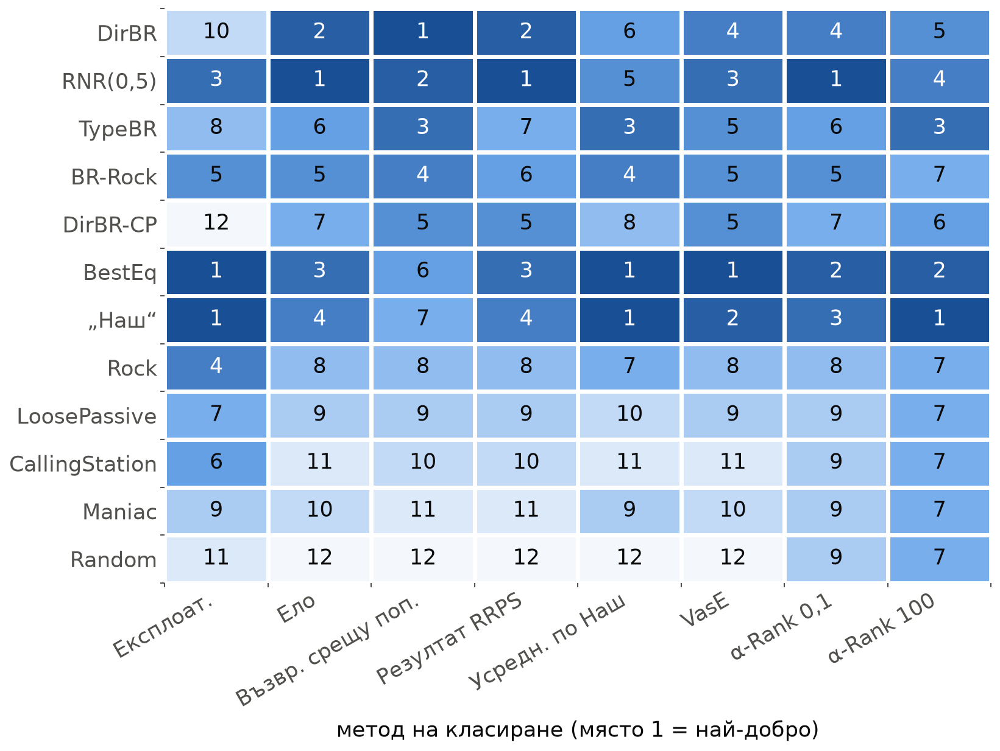
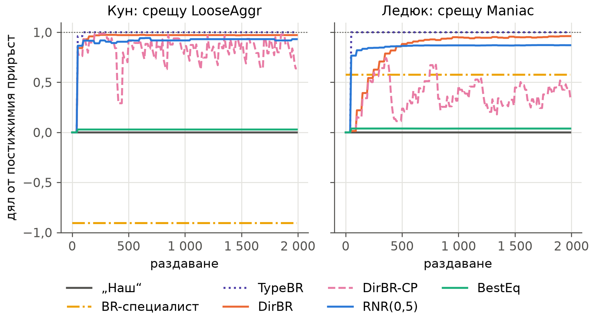

<!--
OFFICIAL PhD TITLE (keep consistent across all documents):
EN: Research on the possibilities for applying Artificial Intelligence in computer games
BG: Изследване на възможностите за приложение на изкуствения интелект в компютърни игри
-->

# Глава 14 – Рамки за оценяване и метрики за експлоатируемост: експериментален доклад

**Тестова среда:** Кун покер и Ледюк Холдем за двама играчи и Кун покер за трима играчи, всяка от които е изброена точно от дефинициите на игрите в OpenSpiel в едно и също представяне с масиви (информационни множества, последователности, крайни състояния), плюс двигателя на So Long Sucker за четирима играчи от Глава 11 за популационния слой. Зоопарците от агенти (bot zoos): 16 агента в Кун, 12 в Ледюк и 9 в Кун с трима играчи – равновесни планове (blueprints), типове, основани на правила, от Глава 7, три стратегии, извлечени от реални езикови модели в Глава 12, статични специалисти с най-добър отговор и адаптивни агенти, изградени от моделите на противника от Глава 7 и отговорите за безопасна експлоатация от Глава 8, – заедно с противници, които сменят стратегията си, и обучаваща атака тип „бяла кутия“ (white-box teaching attack).

**Връзка с дисертацията:** това е Принос №3 (методология за оценяване). Проверката за пропуски в литературата от септември 2026 г. го стесни: съчетаването на експлоатируемост, популационно класиране и статистическа увереност само по себе си не е ново (еталонният тест с повтаряща се игра „камък-ножица-хартия“ вече оценява възвръщаемостта и експлоатируемостта, за една игра). Отворен остава протокол, който измерва заедно, с доверителни граници, (а) приръста срещу неоптимална популация, (б) скоростта на адаптация и възстановяването след смяна на стратегията на противника и (в) най-лошия случай – или, при повече от двама играчи, заместител, който отчита коалициите, – приложен без промени в няколко игри с непълна информация. Главата изгражда този протокол върху трислойната рамка от плана на главата и го проверява там, където е известно, че съществуващото оценяване се проваля.

**Обхват на резултатите:** всяко число е измерено и е взето от файловете в `implementation/step14/implementation/results/`: `validation.json`, `population_{kuhn,leduc}.json`, `adaptation_{kuhn,leduc}.json`, `approx_br_{kuhn,leduc}.json`, `nplayer_kuhn3.json`, `sls.json`, `bridge13_pluribus.json` и производния `crossgame.json`; дневникът на разработката е `implementation/step14/EXECUTION_NOTES.md`. Началните числа са фиксирани в кода. Стохастичните твърдения използват 10 начални числа (протоколът за двама играчи и кръговите турнири), 5 (протоколът за трима играчи) или 3 (научените най-добри отговори, So Long Sucker); всяко начално число е дублирана двойка мачове с разменени места и запазени карти. Интервалите са 95 % интервали по началните числа. Опровергаваните прогнози са запазени и съпоставени с резултатите (WORKFLOW §0.1).

> **Как да се чете докладът.** Част I удостоверява инструментите спрямо независими еталони.
> Част II изпълнява обединения протокол и експериментите с режимите на отказ в игрите за двама играчи.
> Част III преминава към трима и четирима играчи. Докладът завършва с разделите за съпоставката,
> достоверността, ограниченията и възпроизвеждането.

---

## Част I – РАМКАТА И НЕЙНИТЕ ОПОРНИ ТОЧКИ

## За какво е тази глава

Адаптивният агент променя стратегията си, докато научава нещо за противниците си. Обичайните мерила предполагат фиксирана стратегия. Експлоатируемостта (exploitability) измерва колко под стойността на играта може да свали една стратегия противник, който играе най-добър отговор; тя може само да расте, когато агентът напуска равновесието, за да експлоатира. Популационните рейтинги – рейтингът по Ело (Elo), усредняването по Наш (Nash averaging), α-Rank, гласуването – изискват по една печалба за всяка двойка агенти, но печалбата на адаптивния агент зависи от това колко дълго продължава мачът и какво агентът е видял. При трима играчи изобщо няма стойност на играта и няма един-единствен най-лош противник. Затова главата оценява адаптивния агент като последователност от стратегии, всяка от които може да бъде оценена точно в тези малки игри, и докладва четири показателя заедно: **приръст** (gain), **скорост и възстановяване** (speed and recovery), **експозиция** (exposure) и **статистическа увереност** (confidence).

Конвенции. NashConv е сумата по играчите от печалбата, която всеки би получил с най-добър отговор; експлоатируемостта в OpenSpiel е NashConv, разделен на броя на играчите. За агент за двама играчи, който играе σ₀ и σ₁ на двете места, експлоатируемостта е равна на средното по местата от това колко под стойността на играта v* го сваля противник, който играе най-добър отговор. **Експозицията** на действащата стратегия на място s е v*_s минус стойността ѝ в най-лошия случай (в жетони на раздаване, ≥ 0). **Приръстът** е очакваната печалба на агента минус тази на равновесния план (blueprint) „Наш“ срещу същия противник на същото място; **реализираният дял** (capture) го дели на приръста, който би постигнал точният най-добър отговор. **h50** е първото раздаване, при което реализираният дял достига 0,5 и се задържа на това ниво средно през следващите 100 раздавания; **r50** е същото след смяна на стратегията на противника. Адаптивните агенти преизчисляват стратегията си на всеки 50 раздавания, така че h50 и r50 са определени с точност до 50 раздавания.

## Експеримент 1 – всеки компонент спрямо еталон

| Проверка | Еталон | Измерено |
|---|---|---|
| NashConv, 12 профила, три игри | OpenSpiel `exploitability.nash_conv` | идентичен до 10-ия знак |
| Стойности и най-добри отговори, 39 двойки | двигателят и най-добрият отговор от Глава 7 | максимална разлика 1e-14 |
| Експлоатируемост на CFR в Ледюк след 10 / 100 итерации | кодът за оценяване от Глава 3 | 0,811708 / 0,090002, идентични |
| Стойност на играта, място 0 | Кун −1/18, Ледюк −0,0856 | −0,055556, −0,085606 |
| Най-добро равновесие и RNR(p), Кун | решавачите с генериране на ограничения от Глава 8 | целевата функция на RNR съвпада до 1e-16; EV на най-доброто равновесие – в рамките на 1,9e-3 |
| α-Rank, усредняване по Наш, максимални лотарии | OpenSpiel | максимална разлика 2e-8 |
| „Пумпал“: камък-ножица-хартия / стълбица | 0 / 1 | 0,0000 / 1,0000 |
| Отместване на AIVAT, всички двойки „Наш“ срещу член на зоопарка | точната очаквана стойност | най-много 1e-15 |

: Проверка на рамката (`validation.json`).

Два резултата са от значение и отвъд проверката. Първо, еднократно решаваната двойнствена LP-задача в последователна форма – най-лошият случай на стратегия, записан като двойнствената задача на противника (Koller, Megiddo и von Stengel 1996; von Stengel 1996), – решава максимина, RNR(p) и най-доброто равновесие в **пълния Ледюк за 0,02–0,04 s**. Цикълът за генериране на ограничения от Глава 8 не беше достигнал сходимост върху пълния Ледюк в рамките на лимита си от 40 итерации. В Кун двата решавача съвпадат; малката разлика при най-доброто равновесие идва от резерва за допустимост 5e-4, който Глава 8 прилага към прага си (стойността в най-лошия случай на решението ѝ е −0,0560 при v* = −0,0556). Второ, AIVAT е **точно неизместен** и точната му дисперсия е достъпна, защото оценката е детерминирана функция на крайната история и може да бъде табулирана за всяка стратегия. Първата версия беше грешна: тя коригираше раздаването на собствената карта на известния агент като случайно събитие, което отчита късмета на тази карта два пъти. Проверката, която разкри грешката – когато и двете стратегии са известни и функцията на стойността е съвършена, дисперсията трябва да е нула, – не минаваше, докато този член не беше премахнат (фигура 1 от статията за AIVAT няма такъв член).

Целите на плана на главата за AIVAT (дисперсия ÷ 5 в Кун, ÷ 10 в Ледюк) са постигнати за 18 от 20 двойки в Кун (медианен коефициент 48) и за 7 от 12 двойки в Ледюк (медиана 12,2, минимум 6,9) при известна стратегия на агента и стойностите на плана при самообучение като функция на стойността. Изпълнение по метода Монте Карло с 20 000 раздавания на място потвърждава точните стойности (коефициенти от извадката 9,3 и 12,4 в Кун, 7,1 и 6,8 в Ледюк).

---

## Част II – ОБЕДИНЕНИЯТ ПРОТОКОЛ В ИГРИТЕ ЗА ДВАМА ИГРАЧИ

## Експеримент 2 – популационните класирания се разминават по предвидим начин

Кръговият турнир (round robin; `population_{kuhn,leduc}.json`) дава на всяка наредена двойка точна печалба, когато и двата агента са стационарни, и симулирана в противен случай: 2 000 раздавания на мач, двете места, 10 начални числа. Рейтингът по Ело се напасва по метода на максималното правдоподобие към вероятността сесия от 100 раздавания да завърши на печалба.




Методите се делят на два лагера. Експлоатируемостта, усредняването по Наш и VasE (Voting-as-Evaluation, оценяване чрез гласуване) предпочитат агенти, които никога не губят: в Ледюк сместа на Наш с максимална ентропия е BestEq 0,88, „Наш“ 0,11 и TypeBR 0,01, а RNR(0,5) и DirBR, двата агента с най-висока възвръщаемост срещу популацията (+0,807 и +0,890 жетона на раздаване), получават нулево тегло. Ело, възвръщаемостта срещу популацията и обобщеният резултат RRPS предпочитат агенти, които побеждават много противници: първите трима по Ело в Ледюк са RNR(0,5) 1892, DirBR 1848 и BestEq 1779. Корелацията на Кендъл между класиранията по Ело и по експлоатируемост е 0,45 в Кун и 0,36 в Ледюк.


Още три режима на отказ (failure modes) от `lit_evaluation.md` (точка 4) се проявяват, както беше прогнозирано. **Клонинги:** добавянето на 0 до 8 копия на най-слабия бот (AlwaysPass в Кун, CallingStation в Ледюк) увеличава преднината на DirBR пред „Наш“ по Ело от +166 на +181 точки в Кун и от +84 на +113 в Ледюк, докато нито една оценка на умението чрез усредняване по Наш не се променя с повече от 6e-6. **Селекционен натиск:** α-Rank посочва три различни победителя в Кун и четири в Ледюк. **Хоризонт:** същите изпълнения, съкратени до 100, 300 и 1 000 раздавания, дават различни победители по Ело – TypeBR при 100 раздавания в Кун, после DirBR-CP, после DirBR; в Ледюк статичният специалист BR-Rock води при 100 раздавания, а RNR(0,5) – от 300 раздавания нататък.

Увереността в класиранията се различава толкова, колкото и самите класирания. При 200 повторни извадки с връщане (bootstrap) от 10-те начални числа Ело запазва победителя си в Кун в 100 % от извадките, а α-Rank при α = 10 – в 22 %: почти равностойните равновесни агенти правят върха на α-Rank нестабилен при този размер на извадката, както предупреждават Rowland и др. за шумни печалби.

**Стратегии, извлечени от езикови модели (режим на отказ 9).** Трите стратегии от Глава 12 се държат като всеки друг фиксиран бот. Рейтингът в стила на арените за езикови модели ги подрежда погрешно спрямо най-лошия им случай: Ело поставя стратегията на Qwen2.5-7B на 7-о място от 16 (1537), а основания на правила бот Threshold – на 10-о (1459), въпреки че експлоатируемостта на Qwen е 0,179 жетона на раздаване срещу 0,118 за Threshold.

## Експеримент 3 – приръст, скорост, възстановяване и експозиция

Седем агента играха срещу всеки неоптимален стационарен член на зоопарка, срещу три противника, които сменят стратегията си (смяна на раздаване 1 000 от 2 000), и срещу три обучаващи атаки (примамваща стратегия до раздаване 1 000, а след това точният най-добър отговор на текущата стратегия на агента, обновяван на всеки 50 раздавания); по 10 начални числа × 2 места за всяко (`adaptation_{kuhn,leduc}.json`).

| Агент | Приръст К | Реализиран дял К | Експозиция К | Загуба от атака К | Приръст Л | Реализиран дял Л | Експозиция Л | Загуба от атака Л |
|---|---:|---:|---:|---:|---:|---:|---:|---:|
| „Наш“ | 0 | 0 | 0,000 | 0,000 | 0 | 0 | 0,000 | 0,000 |
| BestEq | +0,020 | 0,09 | 0,000 | 0,000 | +0,047 | 0,04 | 0,000 | 0,000 |
| RNR(0,5) | +0,210 | 0,60 | 0,090 | 0,045 | +0,797 | 0,71 | 0,264 | 0,179 |
| DirBR | +0,273 | 0,97 | 0,338 | 0,246 | +0,988 | 0,94 | 2,461 | 1,241 |
| DirBR-CP | +0,230 | 0,79 | 0,305 | 0,199 | +0,441 | 0,34 | 2,459 | 1,757 |
| TypeBR | +0,229 | 0,75 | 0,352 | 0,337 | +0,961 | 0,83 | 1,885 | 2,000 |
| BR-специалист | +0,054 | 0,13 | 0,500 | 0,500 | +0,573 | 0,55 | 1,400 | 1,400 |

: Обединеният протокол в Кун (К) и Ледюк (Л), в жетони на раздаване. Приръст: средно по популацията и 10 начални числа (95 % интервали ≤ 0,007). Реализиран дял: последните 500 раздавания. Експозиция: средно за мача. Загуба от атака: средно на v* − EV след смяната, по трите примамки.


Следват четири извода. **Само по себе си експлоатируемостта класира лошо** (режим на отказ 1): BestEq дели нулевата експозиция с „Наш“, но печели само 0,020 (Кун) и 0,047 (Ледюк) жетона на раздаване, докато RNR(0,5) печели от десет до седемнадесет пъти повече при експозиция 0,090 и 0,264. **Експозицията не е предположение за загубата от обучаващата атака, а нейната горна обвивка:** нападател тип „бяла кутия“, който играе най-добър отговор на текущата стратегия, взема експозицията на тази стратегия винаги когато е синхронизиран с преизчисляванията на агента (всеки агент тук освен DirBR-CP, чиито нулирания правят отговора на нападателя остарял), така че реализираните загуби (от 0,045 до 2,000 жетона на раздаване) следват експозицията. **Скоростта разделя агенти, които реализират еднакъв дял.** Медианата на h50 е 50 раздавания за всички адаптивни агенти в Кун (първото преизчисляване), но делът на мачовете, в които изобщо се достига половината от постижимия приръст, е различен: DirBR 99 %, DirBR-CP 100 %, TypeBR 89 %, RNR(0,5) 73 %, BestEq 10 %. В Ледюк медианата на h50 за DirBR е 150 раздавания. **Възстановяването е информативно само там, където старата експлоатация се проваля срещу новия противник.** В Кун най-добрият отговор на TightPassive постига −0,91 от постижимия приръст срещу LooseAggr (справя се по-зле от „Наш“), така че смяната TightPassive → LooseAggr е истинска проверка: DirBR-CP се възстановява за медиана от 50 раздавания, RNR(0,5) – за 400 (в 30 % от мачовете), DirBR – за 850 (45 %), а TypeBR – никога; през първите 300 раздавания след смяната DirBR е с 0,187 жетона на раздаване по-лош от „Наш“.




Експлоататорът с откриване на точка на промяна (change point) илюстрира защо една игра не е достатъчна. В Кун той има най-бързото възстановяване и най-малката загуба от обучаващата атака сред агентите с най-добър отговор (0,199 срещу 0,246 за DirBR). В Ледюк той реализира само 0,34 от постижимия приръст и губи повече от DirBR при обучаващата атака (1,757 срещу 1,241): детекторът му, настроен в Глава 7, се задейства срещу стационарните противници в Ледюк и всяко нулиране налага нов най-добър отговор на модел с малко данни.

## Експеримент 4 – статистическа увереност: какво може да види оценяващият без стратегиите

Протоколът по-горе използва точната по стратегиите оценка (policy-exact estimator), която изисква двете стратегии и е достъпна само за ботове. Реалният оценяващ вижда жетоните и в най-добрия случай знае стратегията на собствения си агент (AIVAT).


Измерването на *адаптацията* вместо на крайния темп на печалба изисква оценки по прозорци, а те са скъпи (режим на отказ 5). За да се определи реализираният дял в един прозорец от 100 раздавания с точност ±0,25 при доверителна вероятност 95 %, на медианната двойка са нужни 3 383 раздавания със суровите резултати в Кун и 379 с AIVAT (Ледюк: 1 313 и 354). Медианната грешка на реализирания дял в един прозорец е 0,51 със суровите резултати и 0,18 с AIVAT в Кун.

**Връзка с реалните истории на раздаванията от Глава 13.** Глава 13 обработи 10 000-те публикувани раздавания на Pluribus срещу петима професионалисти. Само по резултатите от отделните раздавания темпът на печалба на Pluribus е −70,9 ± 172,8 хилядни от големия блайнд на раздаване (mbb/g; 95 % интервал; стандартно отклонение на раздаване 8 815 mbb). Brown и Sandholm отчитат 48 mbb/g със стандартна грешка 25 за същия експеримент, като използват AIVAT при известна стратегия на Pluribus. Суровата стандартна грешка (88 mbb) е 3,5 пъти по-голяма. Трета страна, която разполага само с историите на раздаванията, не може да достигне статистическа значимост и изобщо не би могла да измери адаптацията.

## Експеримент 5 – научените най-добри отговори са долни граници


В Кун обучаващият се агент попада в рамките на 4 % от точната стойност до 10⁴ раздавания за всеки от атакуваните ботове. В Ледюк той достига от 71 % (Rock) до 98 % (CallingStation) след 10⁵ раздавания на място, а при 10³ раздавания *губи* срещу Rock и Maniac (съотношения −0,20 и −0,05): експлоататор с ограничен бюджет би обявил и двата бота за безопасни. Целта от плана на главата – в рамките на 10 % в Ледюк – е изпълнена за 4 от 6-те атакувани бота и само при 10⁵ раздавания. Срещу адаптивните агенти същият обучаващ се агент, играейки онлайн един мач от 2 000 раздавания, **не** нанася никакви щети в Ледюк – агентите печелят срещу него от 0,35 до 0,86 жетона на раздаване над стойността на играта, – докато обучаващата атака тип „бяла кутия“ взема 1,0–1,5 жетона на раздаване от DirBR. Експлоатируемостта в рамките на популацията (within-population exploitability) в резултата RRPS има същото сляпо петно: 0,279 жетона на раздаване за DirBR в Ледюк срещу експозиция 2,461.

---

## Част III – ТРИМА И ЧЕТИРИМА ИГРАЧИ

## Експеримент 6 – Кун покер с трима играчи: NashConv не е гаранция

Бяха изчислени пет приблизителни равновесия: CFR и CFR+ (100 000 итерации; NashConv 4,4e-5 и 1,5e-7) и MCCFR с външно вземане на проби (external sampling) при три начални числа (10⁶ итерации; NashConv от 3,4e-3 до 1,4e-2). Стойностите им се различават – място 0 печели −0,0287 при CFR и −0,0269 при CFR+, място 1 – −0,0208 и при двете, – а съчетаването на компоненти от различни решавачи дава профили с NashConv до 0,125. **Стойността срещу коалиция** (coalition value) на една компонента на равновесието, изчислена точно като минимума по всички двойки стратегии на другите двама играчи, координирани предварително (ex ante), е за равновесията от CFR и CFR+ от −0,094 до −0,125 жетона на раздаване при равновесни стойности от −0,029 до +0,050 (`nplayer_kuhn3.json`).


Адаптивният агент за трима играчи DirBR3P (непрекъснатият модел от Глава 7, разширен до двама противници, с броеве върху невидяните карти, претеглени по апостериорната им вероятност, който играе най-добър отговор срещу моделираната двойка) постига приръст +0,372 ± 0,038 жетона на раздаване спрямо плана срещу независими неоптимални двойки, като реализира 0,99 от постижимия приръст при медиана на h50 от 50 раздавания. Той е първи по възвръщаемост срещу популацията (+0,346), по Ело, изчислен от класирането в игрите (1972), и по α-Rank при α = 0,1, а усредняването по Наш на проекцията върху двойки поставя цялата си маса върху него. При **коалиционна обучаваща атака** – двама противници, които примамват с TightPassive до раздаване 1 000, а после играят точния коалиционен най-добър отговор на текущата му стратегия – той получава −0,466 жетона на раздаване, четири пъти колкото −0,119 на плана. Смесването с плана (Blend3P, тегло 0,5) е между двете (приръст +0,213, при обучаващата атака −0,242). *Фиксирана* двойка съучастници, насочена срещу плана, струва на плана 0,119 на раздаване, но самата тя е експлоатируема: DirBR3P печели +0,354 срещу нея. Популационните класирания, изградени от независими разпределения по масите, не виждат нищо от това (режим на отказ 8); стойността срещу коалиция на крайната стратегия на всеки агент (−0,119, −0,219, −0,386) го вижда.

## Експеримент 7 – So Long Sucker

Върху двигателя за четирима играчи от Глава 11, измерен наново с поправеното правило при равенство (`sls.json`), популационният слой се пренася без промени: транзитивното съотношение на проекцията върху двойки е 0,955, Ело разпределя четирите базови агента в диапазон от едва 66 точки (1460–1526), а усредняването по Наш поставя цялата маса върху „предателя“. Тук проверката за коалиции е слаба: предварително зададен съюз намалява дела на победите на наблюдавания базов агент с 0,8 до 1,9 процентни пункта (3 начални числа × 2 000 игри); 95 % интервали на двете условия се разделят само за fixed_ally_1. Глава 11 установи, че около 99,5 % от случайните игри в този двигател завършват с пат, което оставя на един съюз малко възможности за действие.

## Сравнение между игрите

| Показател | Кун | Ледюк | Кун с трима играчи | So Long Sucker |
|---|---|---|---|---|
| Приръст (най-добър адаптивен агент) | +0,273 DirBR | +0,988 DirBR | +0,372 DirBR3P | не е измерен |
| Реализиран дял / h50 | 0,97 / 50 | 0,94 / 150 | 0,99 / 50 | – |
| Възстановяване r50 | 50–850 (TypeBR: никога) | 309–850 | 200 (DirBR3P), 550 (Blend3P) | – |
| Експозиция | точна, 0–0,50 | точна, 0–2,46 | стойност срещу коалиция, точна | само емпирична проверка |
| Загуба от обучаващата атака / стойност след коалиционна атака | 0–0,50 | 0–2,23 | от −0,12 до −0,47 | – |
| Популационен слой | всички методи | всички методи | проекция, α-Rank с няколко популации, VasE | проекция |
| Статистическа увереност | сурови резултати, AIVAT, точна | сурови резултати, AIVAT, точна | само точна | само начални числа |

: Какво докладва непромененият протокол за всяка игра (в жетони на раздаване; възстановяването – в раздавания, за смените TightPassive → LooseAggr в Кун и CallingStation → Rock в Ледюк). „Не е измерен“: от Глава 11 не е запазен адаптивен агент за So Long Sucker.

---

## Съпоставка прогноза ↔ резултат

- *„Random трябва да губи от всички.“* Вярно в Ледюк; в Кун Random побеждава AlwaysPass, който никога не залага и се отказва при всеки залог (изследване `zoo_sanity.py`).
- *„AIVAT: ≥ 5× в Кун, ≥ 10× в Ледюк.“* Постигнато за 18/20 и 7/12 двойки. Пропуските са противници, чиято игра стойностите на плана при самообучение предсказват погрешно, което съответства на намалението на стандартното отклонение с 48–75 % при несходни стратегии в самата статия. Формулировката в плана на главата „трябва да съвпада с точната експлоатируемост“ е категориална грешка; AIVAT беше проверен спрямо точната очаквана стойност.
- *„В Ледюк приблизителната стойност следва точната в рамките на 10 %.“* Само при 10⁵ раздавания и за 4 от 6-те атакувани бота.
- *„Наш/CFR има най-високото класиране.“* Само по експлоатируемост, усредняване по Наш, VasE и α-Rank при високо α; Ело, възвръщаемостта срещу популацията и резултатът RRPS поставят четири адаптивни агента над него.
- *„Детекторът на точки на промяна помага срещу смените.“* В Кун – да; в Ледюк той намалява реализирания дял от 0,94 на 0,34 и увеличава загубата от обучаващата атака (изненада 3 в дневника).
- *„Усредняването по Наш е инвариантно спрямо клонинги.“* Потвърдено за копия на агент извън носителя (< 6e-6); едно ранно изпълнение сякаш го опровергаваше, а причината беше неточност на решавача при почти равностойни агенти, отстранена с фиксирано допустимо отклонение и LP-задачи върху носителя.

## Достоверност и достатъчност на извадката

- Всяка точна величина (стойности, най-добри отговори, експозиции, стойности срещу коалиция, таблици на AIVAT) е кръстосано проверена спрямо OpenSpiel или кода от предходните глави с точност 1e-8 или по-добра.
- Стохастичните показатели на протокола използват 10 начални числа на клетка; приръстите имат 95 % интервали от най-много 0,007 жетона на раздаване в игрите за двама играчи, защото точната по стратегиите оценка няма шум от картите. Останалата случайност е траекторията на обучението, която началните числа обхващат.
- h50 и r50 са определени с точност до периода на преизчисляване от 50 раздавания; за разлики под 50 раздавания не се твърди нищо.
- Протоколът за трима играчи използва 5 начални числа × 3 места; интервалите на приръста са от ±0,026 до ±0,038.
- So Long Sucker и научените най-добри отговори използват 3 начални числа; заключенията за тях са формулирани като посоки.

## Ограничения (подредени по влияние върху заключенията)

1. **Опростени (учебни) игри.** Кун, Ледюк и Кун с трима играчи са достатъчно малки за точни най-лоши случаи и точна стойност срещу коалиция (2¹⁶ чисти стратегии на член). В голям мащаб експозицията се превръща в долна граница (Експеримент 5), а стойността срещу коалиция изисква обучаващ се най-добър отговор на отбор.
2. **Точната по стратегиите оценка съществува само за ботове.** Реалното оценяване трябва да разчита на AIVAT (известна е една стратегия) или на суровите резултати; Експеримент 4 показва цената.
3. **Нападателят тип „бяла кутия“ е един силен противник, а не най-лошият адаптивен.** Най-лошият случай на адаптивен агент срещу всички адаптивни противници не е изчислен.
4. **Адаптивните агенти са базовите методи от глави 7–8.** Никой агент тук не съчетава онлайн моделиране с проверена граница на загубата при N играчи (Принос №2); протоколът измерва този пропуск, но не го запълва.
5. **So Long Sucker е слабо доказателство** – двигател, в който преобладава патът, и само базови агенти.

## Заключения и насоки за бъдещи изследвания

Рамката работи според спецификацията и съвпада с всеки еталон, спрямо който може да бъде проверена. Основният резултат на главата е емпиричен: върху едни и същи зоопарци осем стандартни класирания дават противоречиви оценки за адаптивните агенти и всяко противоречие е един от режимите на отказ, изброени в `lit_evaluation.md`. Докладвани заедно, приръстът, скоростта, възстановяването и експозицията разделят агентите, които тези класирания смесват – безопасния експлоататор RNR(0,5) от алчния DirBR, BestEq с нулев приръст от плана, – а стойността срещу коалиция разкрива агента за N играчи, когото повечето популационни класирания поставят на първо място.

Насоки: (1) научен най-добър отговор на отбор за експозицията спрямо коалиция отвъд миниатюрните игри; (2) правила за спиране на AIVAT, валидни по всяко време (anytime-valid), за оценките по прозорци; (3) протоколът, приложен към агент от Принос №2 с граница на загубата спрямо базова линия; (4) двигател за So Long Sucker, по-малко склонен към пат, с адаптивен агент, така че четвъртата колона на таблицата за сравнение между игрите да бъде попълнена.

## Възпроизвеждане

```bash
cd implementation/step14/implementation        # repo .venv active
python run_validation.py
python run_population.py --games kuhn leduc --seeds 10
python run_adaptation.py --games kuhn leduc --seeds 10
python run_approx_br.py --seeds 3 --max-hands 100000
python run_nplayer.py --seeds 5 --pop-seeds 3
python run_sls.py --games 2000 --seeds 3
python run_bridge13.py                         # optional: needs Chapter 13's cache
python run_crossgame.py
python plot_figures.py                         # figures from the saved JSON only
```
