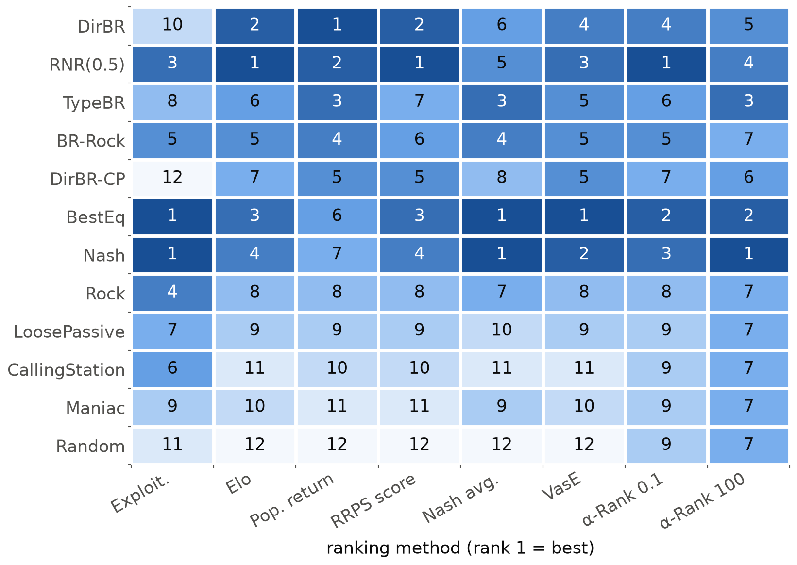
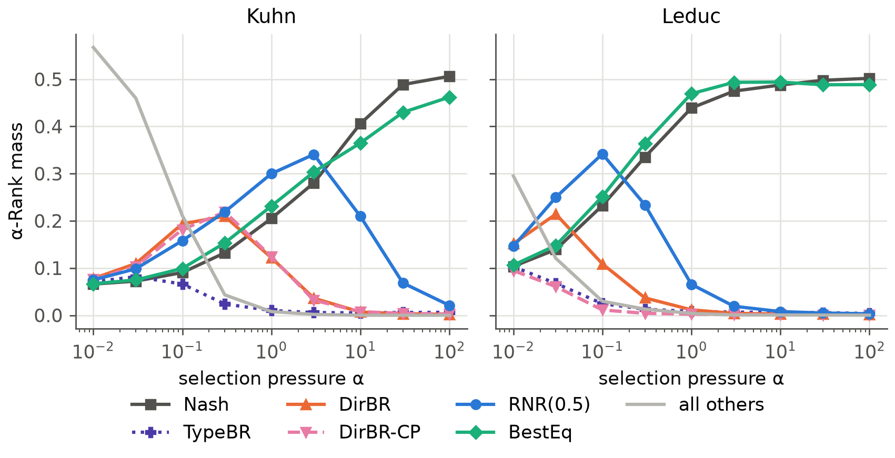
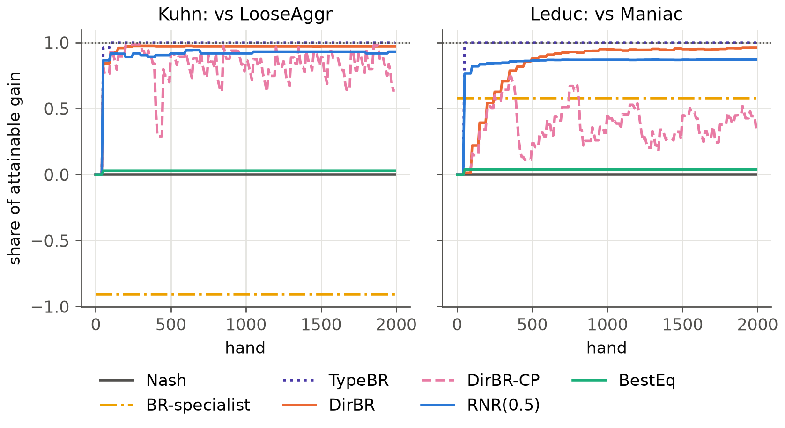
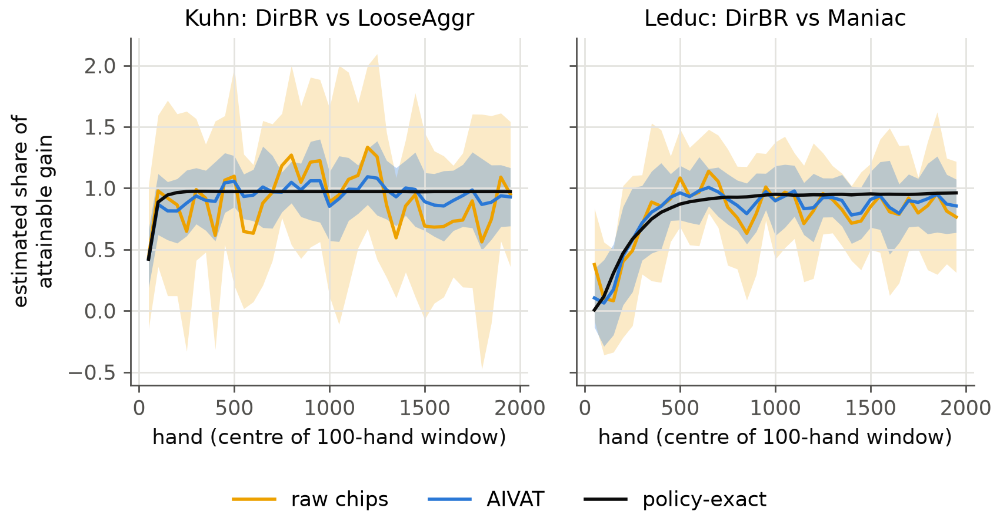
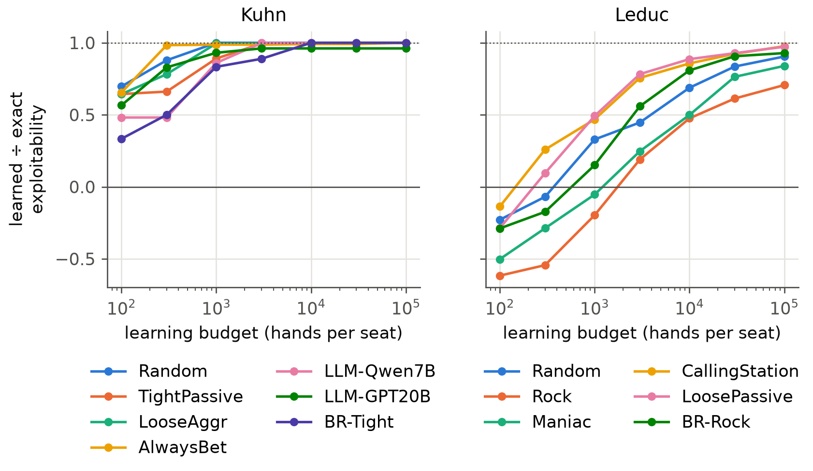

<!--
OFFICIAL PhD TITLE (keep consistent across all documents):
EN: Research on the possibilities for applying Artificial Intelligence in computer games
BG: Изследване на възможностите за приложение на изкуствения интелект в компютърни игри
-->

# Chapter 14 — Evaluation Frameworks and Exploitability Metrics: Experiment Report

**Testbed:** two-player Kuhn and Leduc poker and three-player Kuhn poker, each enumerated exactly
from OpenSpiel's game definitions into one array representation (information sets, sequences,
terminals), plus Chapter 11's four-player So Long Sucker engine for the population layer. The
zoos: 16 agents on Kuhn, 12 on Leduc, 9 on three-player Kuhn — equilibrium blueprints, rule-based
types from Chapter 7, three strategies extracted from real language models in Chapter 12,
static best-response specialists, and adaptive agents built from Chapter 7's opponent models and
Chapter 8's safe-exploitation responses — together with switching opponents and a white-box
teaching attack.

**PhD connection:** this is Contribution 3 (evaluation methodology). The September 2026 gap check
narrowed it: combining exploitability, population ranking and confidence is not new on its own
(the repeated rock–paper–scissors benchmark already scores return and exploitability for one
game). What remains open is a protocol that measures together, with confidence bounds, (a) the
gain against a sub-optimal population, (b) the speed of adaptation and the recovery after an
opponent switches, and (c) the worst case — or, with more than two players, a coalition-aware
substitute — applied unchanged across several imperfect-information games. The chapter builds
that protocol on top of the plan's three-layer framework and tests it where existing evaluation
is known to break.

**Scope of results:** every number is measured and read from the files in
`implementation/step14/implementation/results/`: `validation.json`, `population_{kuhn,leduc}.json`,
`adaptation_{kuhn,leduc}.json`, `approx_br_{kuhn,leduc}.json`, `nplayer_kuhn3.json`, `sls.json`,
`bridge13_pluribus.json` and the derived `crossgame.json`; the dev log is
`implementation/step14/EXECUTION_NOTES.md`. Seeds are fixed in the code. Stochastic claims use 10
seeds (two-player protocol and round-robins), 5 seeds (three-player protocol) or 3 seeds (learned
best responses, So Long Sucker); each seed is a duplicate pair of matches with the seats swapped
and the cards kept. Intervals are 95 % intervals over seeds. Contradicted predictions are kept and
reconciled (WORKFLOW §0.1).

> **How to read this report.** Part I certifies the machinery against independent references.
> Part II runs the joint protocol and the failure-mode experiments on the two-player games.
> Part III moves to three and four players. The reconciliation, trust, limitations and
> reproduction sections close the report.

---

## Part I — THE FRAMEWORK AND ITS ANCHORS

## What this chapter is about

An adaptive agent changes its strategy as it learns about its opponents. The usual yardsticks
assume a fixed strategy. Exploitability measures how far a best-responding opponent can push a
strategy below the game value; it can only grow when the agent leaves equilibrium to exploit.
Population ratings (Elo, Nash averaging, α-Rank, voting) need one payoff per pair of agents, but
an adaptive agent's payoff depends on how long the match lasts and what it has seen. With three
players there is no game value and no single worst opponent at all. The chapter therefore
evaluates the adaptive agent as a sequence of policies, each of which can be scored exactly in
these small games, and reports four readouts together: **gain**, **speed and recovery**,
**exposure**, and **confidence**.

Conventions. NashConv is the sum over players of the best-response gain; OpenSpiel's
exploitability is NashConv divided by the number of players. For a two-player agent that plays
σ₀ and σ₁ in the two seats, exploitability equals the average over seats of how far a best
responder pushes it below the game value v*. The **exposure** of the policy in force in seat s is
v*_s minus its worst-case value (chips per hand, ≥ 0). **Gain** is the agent's expected payoff
minus the Nash blueprint's against the same opponent in the same seat; **capture** divides it
by the gain the exact best response would achieve. **h50** is the first hand at which the
capture reaches 0.5 and keeps that level on average over the next 100 hands; **r50** is the same
after an opponent switch. Adaptive agents refit every 50 hands, so h50 and r50 are resolved to
50 hands.

## Experiment 1 — every component against a reference

| Check | Reference | Measured |
|---|---|---|
| NashConv, 12 profiles, three games | OpenSpiel `exploitability.nash_conv` | identical to 10 decimals |
| Values and best responses, 39 pairs | Chapter 7's engine and best response | max difference 1e-14 |
| Leduc CFR exploitability after 10 / 100 it. | Chapter 3's evaluator | 0.811708 / 0.090002, identical |
| Game value, seat 0 | Kuhn −1/18, Leduc −0.0856 | −0.055556, −0.085606 |
| Best equilibrium and RNR(p), Kuhn | Chapter 8's constraint-generation solvers | RNR objective equal to 1e-16; best-equilibrium EV within 1.9e-3 |
| α-Rank, Nash averaging, maximal lotteries | OpenSpiel | max difference 2e-8 |
| Spinning top: RPS / ladder | 0 / 1 | 0.0000 / 1.0000 |
| AIVAT bias, all Nash-vs-zoo pairs | exact expected value | at most 1e-15 |

: Validation of the framework (`validation.json`).

Two results carry beyond validation. First, the one-shot sequence-form dual LP — the worst case of
a strategy written as the opponent's dual program (Koller, Megiddo and von Stengel 1996; von
Stengel 1996) — solves maxmin, RNR(p) and best equilibrium on **full Leduc in 0.02–0.04 s**.
Chapter 8's constraint-generation loop had not converged on full Leduc within its 40-iteration
cap. On Kuhn the two solvers agree; the small best-equilibrium difference comes from the 5e-4
feasibility slack Chapter 8 applies to its floor (its worst case −0.0560 against v* = −0.0556).
Second, AIVAT is **exactly unbiased**, and its exact variance is available, because the estimate
is a deterministic function of the terminal history and can be tabulated per strategy. A first
version was wrong: it corrected the known agent's own card deal as a chance event, which counts
that card's luck twice. The check that exposed it — with both strategies known and a perfect
value function the variance must be zero — failed until that term was removed (the AIVAT paper's
Figure 1 has no such term).

The AIVAT targets of the plan (variance ÷ 5 on Kuhn, ÷ 10 on Leduc) were met for 18 of 20 Kuhn
pairs (median factor 48) and 7 of 12 Leduc pairs (median 12.2, minimum 6.9) with the agent's
strategy known and blueprint self-play values as the value function. A 20,000-hand Monte Carlo run
per seat confirms the exact figures (sample factors 9.3 and 12.4 on Kuhn, 7.1 and 6.8 on Leduc).

---

## Part II — THE JOINT PROTOCOL ON TWO-PLAYER GAMES

## Experiment 2 — population rankings disagree, in predictable ways

The round-robin (`population_{kuhn,leduc}.json`) gives each ordered pair an exact payoff when both
agents are stationary, and a simulated one otherwise: 2,000 hands per match, both seats, 10 seeds.
Elo is fitted by maximum likelihood to the probability of finishing a 100-hand session ahead.




The methods split into two camps. Exploitability, Nash averaging and VasE favour agents that
never lose: on Leduc the maximum-entropy Nash mixture is BestEq 0.88, Nash 0.11 and TypeBR 0.01,
and RNR(0.5) and DirBR, the two agents with the highest population return (+0.807 and +0.890
chips/hand), receive zero weight. Elo, population return and the RRPS aggregate score favour agents
that beat many opponents: Elo's top three on Leduc are RNR(0.5) 1892, DirBR 1848 and BestEq
1779. The Kendall correlation between the Elo and exploitability rankings is 0.45 on Kuhn and
0.36 on Leduc.



Three further failure modes of `lit_evaluation.md` (point 4) appear as predicted. **Clones:**
adding 0 to 8 copies of the weakest bot (AlwaysPass on Kuhn, CallingStation on Leduc) widens the
Elo lead of DirBR over Nash from +166 to +181 points on Kuhn and from +84 to +113 on Leduc, while
no Nash-averaged skill moves by more than 6e-6. **Selection pressure:** α-Rank names three
different winners on Kuhn and four on Leduc. **Horizon:** the same runs truncated to 100, 300 and 1,000 hands
give different Elo winners — TypeBR at 100 hands on Kuhn, then DirBR-CP, then DirBR; on Leduc the
static specialist BR-Rock leads at 100 hands and RNR(0.5) from 300 hands on.

Ranking confidence differs as much as the rankings do. Bootstrapping the 10 seeds 200 times, Elo
keeps its Kuhn winner in 100 % of resamples, α-Rank at α = 10 in 22 %: near-tied equilibrium
agents make α-Rank's top unstable at this sample size, as Rowland et al. warn for noisy payoffs.

**LLM-derived strategies (failure mode 9).** The three Chapter 12 strategies behave like any
other fixed bot. The arena-style rating misorders them relative to their worst case: Elo ranks
the Qwen2.5-7B strategy 7th of 16 (1537) and the rule-based Threshold bot 10th (1459), although
Qwen's exploitability is 0.179 chips/hand against Threshold's 0.118.

## Experiment 3 — gain, speed, recovery and exposure

Seven agents were run against every sub-optimal stationary member of the zoo, three switching
opponents (switch at hand 1,000 of 2,000) and three teaching attacks (a bait strategy until hand
1,000, then the exact best response to the agent's current policy, refreshed every 50 hands);
10 seeds × 2 seats each (`adaptation_{kuhn,leduc}.json`).

| Agent | Gain K | Capture K | Exposure K | Teach loss K | Gain L | Capture L | Exposure L | Teach loss L |
|---|---:|---:|---:|---:|---:|---:|---:|---:|
| Nash | 0 | 0 | 0.000 | 0.000 | 0 | 0 | 0.000 | 0.000 |
| BestEq | +0.020 | 0.09 | 0.000 | 0.000 | +0.047 | 0.04 | 0.000 | 0.000 |
| RNR(0.5) | +0.210 | 0.60 | 0.090 | 0.045 | +0.797 | 0.71 | 0.264 | 0.179 |
| DirBR | +0.273 | 0.97 | 0.338 | 0.246 | +0.988 | 0.94 | 2.461 | 1.241 |
| DirBR-CP | +0.230 | 0.79 | 0.305 | 0.199 | +0.441 | 0.34 | 2.459 | 1.757 |
| TypeBR | +0.229 | 0.75 | 0.352 | 0.337 | +0.961 | 0.83 | 1.885 | 2.000 |
| BR-specialist | +0.054 | 0.13 | 0.500 | 0.500 | +0.573 | 0.55 | 1.400 | 1.400 |

: The joint protocol on Kuhn (K) and Leduc (L), chips per hand. Gain: mean over the population and 10 seeds (95 % intervals ≤ 0.007). Capture: last 500 hands. Exposure: mean over the match. Teach loss: mean of v* − EV after the switch, over three baits.


Four points follow. **Exploitability alone ranks badly** (failure mode 1): BestEq ties with Nash
at zero exposure but gains only 0.020 (Kuhn) and 0.047 (Leduc) chips/hand, while RNR(0.5) gains
ten to seventeen times as much at exposure 0.090 and 0.264. **Exposure is not a guess at the
teaching loss — it is its upper envelope:** a white-box attacker that best-responds to the
current policy takes the exposure of that policy whenever it is in step with the agent's refits
(every agent here except DirBR-CP, whose resets leave the attacker's response stale), so the
realized losses (0.045 to 2.000 chips/hand) track the exposure. **Speed separates agents that capture the same share.** The median h50 is
50 hands for all adaptive agents on Kuhn (the first refit), but the share of matches in which
half the attainable gain is reached at all differs: DirBR 99 %, DirBR-CP 100 %, TypeBR 89 %,
RNR(0.5) 73 %, BestEq 10 %. On Leduc
DirBR's median h50 is 150 hands. **Recovery is informative only where the old exploit fails
against the new opponent.** On Kuhn the best response to TightPassive achieves −0.91 of the
attainable gain against LooseAggr (it does worse than Nash), so the switch TightPassive → LooseAggr is a real test: DirBR-CP
recovers in a median 50 hands, RNR(0.5) in 400 (in 30 % of matches), DirBR in 850 (45 %), and
TypeBR never; over the first 300 post-switch hands DirBR is 0.187 chips/hand worse than Nash.




The change-point exploiter illustrates why one game is not enough. On Kuhn it has the fastest
recovery and the smallest teaching loss of the best-response agents (0.199 against DirBR's
0.246). On Leduc it captures only 0.34 of the attainable gain and loses more to the teaching
attack than DirBR (1.757 against 1.241): its detector, tuned in Chapter 7, fires on stationary
Leduc opponents, and every reset forces a new best response to a thin model.

## Experiment 4 — confidence: what an evaluator without the strategies can see

The protocol above uses the policy-exact estimator, which needs both strategies and is available
only for bots. A real evaluator sees chips, and at best knows its own agent's strategy (AIVAT).



Measuring *adaptation* rather than a final win rate needs per-window estimates, and those are
expensive (failure mode 5). To pin the capture of one 100-hand window to ±0.25 with 95 %
confidence, the median pair needs 3,383 hands with raw chips on Kuhn and 379 with AIVAT (Leduc:
1,313 and 354). The median error of a single window's capture is 0.51 with chips and 0.18 with
AIVAT on Kuhn.

**Bridge to Chapter 13's real hand histories.** Chapter 13 parsed the 10,000 released hands of
Pluribus against five professionals. From the per-hand results alone Pluribus's win rate is
−70.9 ± 172.8 mbb/hand (95 % interval; per-hand SD 8,815 mbb). Brown and Sandholm report
48 mbb/game with a standard error of 25 over the same experiment, using AIVAT with Pluribus's
strategy known. The raw standard error (88 mbb) is 3.5 times larger. A third party with only the
hand histories cannot reach significance, and could not measure adaptation at all.

## Experiment 5 — learned best responses are lower bounds



On Kuhn the learner comes within 4 % of the exact value by 10⁴ hands for every target. On Leduc it reaches
71 % (Rock) to 98 % (CallingStation) after 10⁵ hands per seat, and at 10³ hands it *loses* to
Rock and Maniac (ratios −0.20 and −0.05): a budget-limited exploiter would report both as safe.
The plan's target — within 10 % on Leduc — holds for 4 of 6 targets, and only at 10⁵ hands. Against
the adaptive agents the same learner, playing online for one 2,000-hand match, inflicts **no**
damage on Leduc — the agents earn 0.35 to 0.86 chips/hand above the game value against it —
whereas the white-box teaching
attack takes 1.0–1.5 chips/hand from DirBR. The RRPS score's within-population exploitability has
the same blind spot: 0.279 chips/hand for DirBR on Leduc, against an exposure of 2.461.

---

## Part III — THREE AND FOUR PLAYERS

## Experiment 6 — three-player Kuhn: NashConv is not a guarantee

Five approximate equilibria were computed: CFR and CFR+ (100,000 iterations; NashConv 4.4e-5 and
1.5e-7) and external-sampling MCCFR with three seeds (10⁶ iterations; NashConv 3.4e-3 to 1.4e-2).
Their values differ — seat 0 earns −0.0287 under CFR and −0.0269 under CFR+, seat 1 −0.0208 under
both — and combining components from different solvers yields profiles with NashConv up to 0.125.
The **coalition value** of an equilibrium component, computed exactly as the minimum over all
ex-ante coordinated strategy pairs of the other two players, is, for the CFR and CFR+ equilibria,
−0.094 to −0.125 chips/hand against equilibrium values of −0.029 to +0.050
(`nplayer_kuhn3.json`).


The adaptive three-player agent DirBR3P (Chapter 7's continuous model extended to two opponents,
with posterior-weighted counts over unseen cards, best-responding to the modelled pair) gains
+0.372 ± 0.038 chips/hand over the blueprint against independent sub-optimal pairs, capturing 0.99
of the attainable gain with a median h50 of 50 hands. It tops the population return (+0.346), the
ranking-based Elo (1972) and α-Rank at α = 0.1, and the Nash averaging of the pairwise projection
puts all its mass on it. Against a **coalition teaching attack** — two opponents that bait with
TightPassive until hand 1,000 and then play the exact coalition best response to its current
policy — it earns −0.466 chips/hand, four times the blueprint's −0.119. The blend with the
blueprint (Blend3P, weight 0.5) sits between (gain +0.213, teaching −0.242). A *fixed* colluding
pair targeted at the blueprint costs the blueprint 0.119 per hand but is itself exploitable:
DirBR3P earns +0.354 against it. Population rankings built from independent seatings see none of
this (failure mode 8); the coalition value of each agent's final policy (−0.119, −0.219, −0.386)
does.

## Experiment 7 — So Long Sucker

On Chapter 11's four-player engine, re-measured with its fixed tie-break (`sls.json`), the
population layer transfers unchanged: the pairwise projection is 0.955 transitive, Elo spreads
the four baselines over only 66 points (1460–1526), and Nash averaging puts all mass on the
betrayer. The coalition probe is weak here: a planted alliance lowers a focal baseline's win
rate by 0.8 to 1.9 percentage points (3 seeds × 2,000 games); the 95 % intervals of the two
conditions separate only for fixed_ally_1. Chapter 11 found that about 99.5 %
of random games in this engine end in deadlock, which leaves an alliance little to act on.

## Cross-game comparison

| Readout | Kuhn | Leduc | Three-player Kuhn | So Long Sucker |
|---|---|---|---|---|
| Gain (best adaptive) | +0.273 DirBR | +0.988 DirBR | +0.372 DirBR3P | not measured |
| Capture / h50 | 0.97 / 50 | 0.94 / 150 | 0.99 / 50 | — |
| Recovery r50 | 50–850 (TypeBR: never) | 309–850 | 200 (DirBR3P), 550 (Blend3P) | — |
| Exposure | exact, 0–0.50 | exact, 0–2.46 | coalition value, exact | empirical probe only |
| Teaching loss / value after coalition attack | 0–0.50 | 0–2.23 | −0.12 to −0.47 | — |
| Population layer | all methods | all methods | projection, multi-population α-Rank, VasE | projection |
| Confidence | chips, AIVAT, exact | chips, AIVAT, exact | exact only | seeds only |

: What the unchanged protocol reports per game (chips per hand; recovery in hands, for the switches TightPassive → LooseAggr on Kuhn and CallingStation → Rock on Leduc). "Not measured": no adaptive So Long Sucker agent was kept from Chapter 11.

---

## Prediction ↔ reality reconciliation

- *"Random should lose to everyone."* True on Leduc; on Kuhn Random beats AlwaysPass, which never
  bets and folds to every bet (exploration `zoo_sanity.py`).
- *"AIVAT: ≥ 5× on Kuhn, ≥ 10× on Leduc."* Met for 18/20 and 7/12 pairs. The misses are opponents
  whose play the blueprint self-play values mispredict, consistent with the paper's own 48–75 % SD
  reduction for dissimilar strategies. The plan's "should match the exact exploitability" is a
  category error; AIVAT was checked against the exact expected value.
- *"On Leduc, approximate tracks exact within 10 %."* Only at 10⁵ hands, for 4 of 6 targets.
- *"Nash/CFR has the highest ranking."* Only under exploitability, Nash averaging, VasE and α-Rank
  at high α; Elo, population return and the RRPS score rank four adaptive agents above it.
- *"The change-point detector helps against switches."* On Kuhn yes; on Leduc it lowers capture
  from 0.94 to 0.34 and raises the teaching loss (surprise 3 in the log).
- *"Nash averaging is invariant to clones."* Confirmed for copies of a non-support agent (< 6e-6);
  an early run seemed to contradict it, and the cause was solver inaccuracy on near-tied agents,
  now fixed with a fixed tolerance and support LPs.

## Trustworthiness and sample adequacy

- Every exact quantity (values, best responses, exposures, coalition values, AIVAT tables) is
  cross-checked against OpenSpiel or the earlier chapters' code, to 1e-8 or better.
- The protocol's stochastic readouts use 10 seeds per cell; gains carry 95 % intervals of at most
  0.007 chips/hand on the two-player games because the policy-exact estimator has no card noise.
  The remaining randomness is the learning trajectory, which the seeds sample.
- h50 and r50 are resolved to the 50-hand refit period; differences below 50 hands are not claims.
- The three-player protocol uses 5 seeds × 3 seats; its gain intervals are ±0.026 to ±0.038.
- So Long Sucker and the learned best responses use 3 seeds; their conclusions are stated as
  directions.

## Limitations (ranked by how much they affect the conclusions)

1. **Toy games.** Kuhn, Leduc and three-player Kuhn are small enough for exact worst cases and an
   exact coalition value (2¹⁶ pure strategies per member). At scale, exposure becomes a lower
   bound (Experiment 5) and the coalition value needs a team best-response learner.
2. **The policy-exact estimator exists only for bots.** Real evaluation falls back to AIVAT (one
   strategy known) or chips; Experiment 4 shows the cost.
3. **The white-box attacker is one strong adversary, not the worst adaptive one.** The worst case
   of an adaptive agent against all adaptive opponents is not computed.
4. **The adaptive agents are Chapter 7–8 baselines.** No agent here combines online modelling with
   a checked N-player loss bound (Contribution 2); the protocol measures that gap, it does not
   close it.
5. **So Long Sucker is weak evidence** — deadlock-dominated engine, baselines only.

## Conclusions and research directions

The framework works as specified and matches every reference it can be checked against. The
chapter's main result is empirical: on the same zoos, eight standard rankings produce
contradictory verdicts on adaptive agents, and each contradiction is one of the failure modes
listed in `lit_evaluation.md`. Reported together, gain, speed, recovery and exposure separate
the agents those rankings conflate — the safe exploiter RNR(0.5) from the greedy DirBR, the
zero-gain BestEq from the blueprint — and the coalition value exposes the N-player agent that
most population rankings put first.

Directions: (1) a learned team best response for coalition exposure beyond tiny games; (2)
anytime-valid AIVAT stopping rules for the per-window estimates; (3) the protocol applied to a
Contribution-2 agent with a baseline-relative loss bound; (4) a less deadlock-prone So Long
Sucker engine with an adaptive agent, so the fourth column of the cross-game table fills in.

## Reproduction

```bash
cd implementation/step14/implementation        # repo .venv active
python run_validation.py
python run_population.py --games kuhn leduc --seeds 10
python run_adaptation.py --games kuhn leduc --seeds 10
python run_approx_br.py --seeds 3 --max-hands 100000
python run_nplayer.py --seeds 5 --pop-seeds 3
python run_sls.py --games 2000 --seeds 3
python run_bridge13.py                         # optional: needs Chapter 13's cache
python run_crossgame.py
python plot_figures.py                         # figures from the saved JSON only
```
