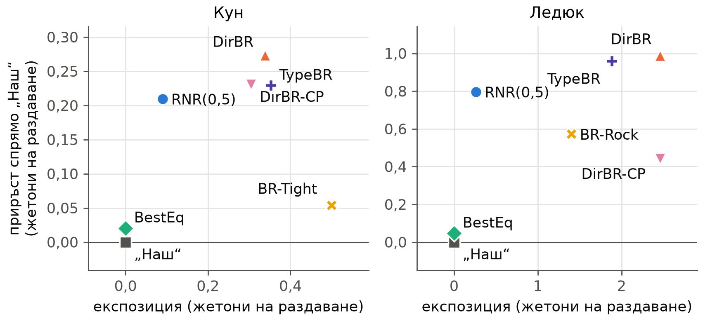
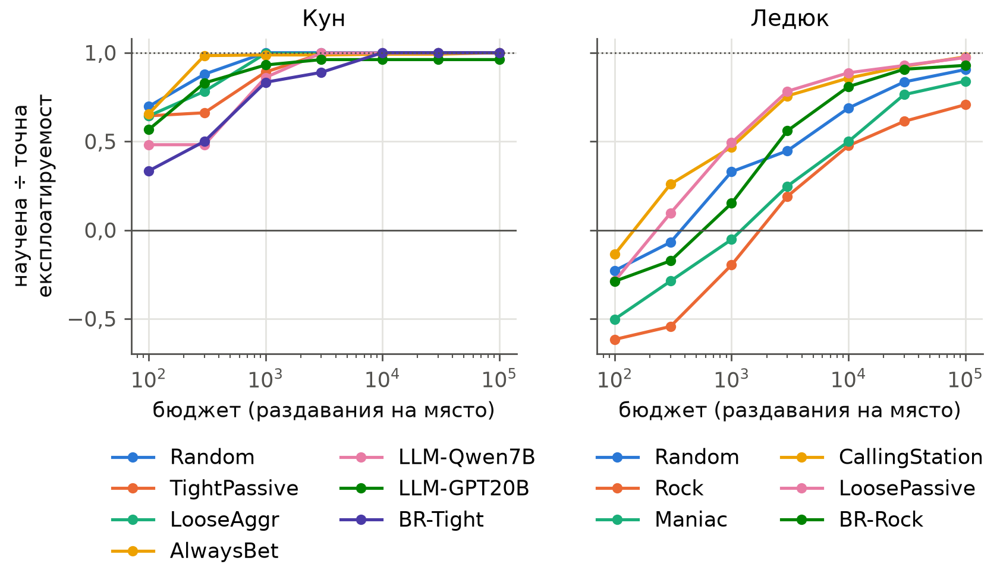

<!--
OFFICIAL PhD TITLE (keep consistent across all documents):
EN: Research on the possibilities for applying Artificial Intelligence in computer games
BG: Изследване на възможностите за приложение на изкуствения интелект в компютърни игри
-->
---
title: "Глава 14 Обобщение – Рамки за оценяване и метрики за експлоатируемост"
subtitle: "Изследване на възможностите за приложение на изкуствения интелект в компютърни игри"
author: "Alexander Andreev"
date: "September 2026"
lang: bg
vars:
  research_focus: "Adaptive Strategy Learning in Multi-Agent Imperfect-Information Environments"
---

# Глава 14 – Рамки за оценяване и метрики за експлоатируемост

Тази глава разглежда от самото начало как се оценяват агенти за игри, които **се адаптират** – агенти, които наблюдават противниците си и променят играта си. Тя изгражда стандартния инструментариум – точна експлоатируемост (exploitability), популационни класирания (population rankings) и намаляване на дисперсията (variance reduction) – проверява всяка негова част спрямо независим еталон и след това го използва, за да измери какво този инструментариум пропуска. Написана е така, че да може да се чете самостоятелно. **Всички експериментални числа са измерени** при възпроизводими изпълнения върху три малки покер игри (Кун покер и Ледюк Холдем за двама играчи и Кун покер за трима) и върху двигателя на So Long Sucker за четирима играчи от Глава 11 и навсякъде, където играта позволява, са *точни*, а не получени от извадка. Когато някое изпълнение противоречи на очакванията ми, очакването е запазено и съпоставено с действителния резултат.

**Къде се вписва това в дисертацията.** Тази глава е Принос №3 (методология за оценяване). Проверката на литературата от септември 2026 г. стесни този принос: съчетаването на експлоатируемост, популационно класиране и статистическа увереност само по себе си не е ново – еталонен тест (benchmark) с повтаряща се игра „камък-ножица-хартия“ вече оценява възвръщаемостта и експлоатируемостта заедно, за една игра[^rrps]. Това, което нито един от намерените протоколи не докладва заедно, е (а) **приръстът** срещу неоптимална популация, (б) **скоростта** на адаптация и **възстановяването** след смяна на стратегията на противника и (в) **най-лошият случай**, а при повече от двама играчи – заместител, който отчита коалициите, всяко от тях с доверителни граници и приложено без промени в няколко игри с непълна информация. Главата изгражда такъв протокол и показва върху конкретни зоопарци от агенти къде съществуващите мерки се провалят. Тя служи и на другите два приноса: тя е мерилото за адаптивните агенти от Глава 7 (Принос №1) и за въпроса, който Глава 8 остави отворен – какво може да означава „безопасно“ при трима играчи (Принос №2).

---

## Защо оценяването на адаптивен агент е трудно

Един агент за игри може да бъде оценен по два начина. Първият пита *колко тежко може да бъде победен?* В игра с нулева сума за двама играчи отговорът е **експлоатируемостта**: колко под стойността на играта може да го свали противник, който играе най-добър отговор. Вторият пита *колко добре се справя срещу противниците, които ще срещне?* Отговорите са темпът на печалба в преки срещи и рейтингите, изчислени от него – от рейтинга по Ело (Elo)[^elo1978] до усредняването по Наш (Nash averaging)[^balduzzi2018], α-Rank (еволюционно класиране на агенти)[^alpharank] и оценяването чрез гласуване (voting-based evaluation)[^vase]. Известно е, че двете семейства се разминават. Два покер бота, неразличими в преки срещи, се различаваха с около 1 300 хилядни от големия блайнд на раздаване (mbb/g) по експлоатируемост, измерена с локален най-добър отговор[^deepstack], и Годишното състезание по компютърен покер (Annual Computer Poker Competition) използваше две правила за определяне на победителя точно по тази причина[^bard2013].

При адаптивния агент разминаването става структурно. Той напуска равновесието умишлено, за да експлоатира, така че експлоатируемостта може само да работи срещу него, колкото и да печели. Печалбата му срещу друг агент зависи от това колко дълго играят и какво е видял, така че той няма една-единствена клетка в матрицата на печалбите, каквато предполага всяко популационно класиране. При трима или повече играчи самият най-лош случай променя смисъла си: NashConv, обичайното обобщение на експлоатируемостта за N играчи, измерва разстоянието до *някакво* равновесие[^openspiel]. В Кун покер с трима играчи един играч може да прехвърля полезност към втори играч за сметка на третия, докато всички играят равновесни стратегии[^szafron2013]. Единственото понятие за най-лош случай при коалиции, което проверката на литературата откри, е отборната максиминна стойност (team-maxmin) в игрите на отбор срещу противник (adversarial team games)[^celli2018] – понятие за решение, а не протокол за оценяване.

Помага една аналогия. Когато се наема преговарящ, една препоръка гласи „най-лошата сделка, която безмилостна отсрещна страна би могла да му наложи“, а друга – „как се е справил в последните си двадесет преговора“. Нито една не казва колко бързо той разгадава нова отсрещна страна, дали забелязва, когато тя смени тактиката си, или дали може да бъде изигран от някого, който първо се прави на наивен, а после обръща играта. Когато на масата има три страни, нито една не казва какво става, когато другите две действат координирано. Протоколът на главата задава всички тези въпроси – с интервали на грешката.

---

## Рамката: три слоя и един четвърти въпрос

Планът на главата предвижда три слоя. **Слой 1** е най-лошият случай: точна експлоатируемост в малките игри и научен най-добър отговор в големите[^timbers2022]. **Слой 2** е популацията: матрици на печалбите от кръгов турнир (round robin), рейтинг по Ело, усредняване по Наш, мета-Наш сместа от емпиричния теоретико-игрови анализ (глави 9–10), α-Rank, максималните лотарии (maximal lotteries) на VasE и транзитивно-цикличната декомпозиция „пумпал“ (spinning top)[^balduzzi2019][^czarnecki2020]. **Слой 3** е статистическата увереност (confidence): начални числа, дублирано раздаване на картите (duplicate dealing) и AIVAT (техника за намаляване на дисперсията)[^aivat]. Четвъртият въпрос е собственият въпрос на главата: как се държи адаптивният агент *във времето*.

Всичко се опира на един точен двигател. Всяка игра се изброява еднократно от собствената ѝ дефиниция в OpenSpiel в масиви от информационни множества, последователности и крайни истории. Тогава стратегията на агента във всеки момент е вектор, а очакваната му печалба, най-добрият отговор срещу него и експозицията му (exposure) са матрични операции. Ледюк има 9 457 възела и 468 информационни множества на играч; изграждането на дървото му отнема 0,04 s. Адаптивният агент се разглежда като *последователност* от стратегии, по една за всяко преизчисляване, всяка от които може да бъде оценена точно. Двигателят възпроизвежда NashConv на OpenSpiel до 10-ия знак след десетичната запетая за дванадесет профила, експлоатируемостта на Ледюк от Глава 3 (0,811708 след 10 итерации на CFR, 0,090002 след 100) и най-добрите отговори от Глава 7 с точност до 1e-14 (`validation.json`).

Четирите показателя (readouts) се определят, както следва (навсякъде в жетони на раздаване).

- **Приръст** (gain): очакваната печалба на агента минус тази на равновесния план (blueprint) срещу същия противник на същото място; **реализираният дял** (capture) дели приръста на приръста, който би постигнал точният най-добър отговор.
- **Скорост и възстановяване** (speed and recovery): *h50* е първото раздаване, при което реализираният дял достига половина и остава на това ниво средно през следващите 100 раздавания; *r50* е същият брой, отчетен след смяната на противника. Адаптивните агенти преизчисляват стратегията си на всеки 50 раздавания, така че и двете величини са определени с точност до 50 раздавания.
- **Експозиция**: при двама играчи – колко под стойността на играта v* би могъл да свали действащата стратегия противник, който играе най-добър отговор, т.е. експлоатируемостта, приложена към текущата стратегия, а не към фиксиран агент; плюс реализираната загуба при обучаваща атака тип „бяла кутия“ (white-box teaching attack). При трима играчи – **стойността срещу коалиция** (coalition value): най-малкото, до което другите двама могат да ограничат агента с координирани стратегии.
- **Статистическа увереност**: 95 % интервали по началните числа, като се посочва използваната оценка (estimator). Оценките са три: суровите резултати в жетони; AIVAT при известна собствена стратегия на агента; и *точната по стратегиите* (policy-exact) очаквана печалба на двете действащи стратегии, достъпна само когато и двамата играчи са ботове.

Зоопарците включват 16 агента в Кун и 12 в Ледюк. **Равновесният** план идва от CFR+ на OpenSpiel (експлоатируемост 9,6e-6 в Кун и 8,5e-5 в Ледюк). **Типовете, основани на правила**, са тези от Глава 7 (AlwaysPass, AlwaysBet, TightPassive, LooseAggr, Threshold в Кун; CallingStation, Maniac, Rock, LoosePassive в Ледюк), плюс Random. В Кун има и три **стратегии, извлечени от реални езикови модели** в Глава 12 (Qwen2.5-7B-Instruct, gpt-oss-20b и OpenThinker3-7B, изпълнявани локално чрез LM Studio 0.4.20, с обикновена подкана и температура 0,7 и разчетени от логаритмичните вероятности на токена за действие; квантизацията на теглата не е записана). OpenThinker3-7B е слаб заместител: 34 % от вероятностната му маса при токена за действие не можаха да бъдат съпоставени с действие. **Специалистът** е статичен най-добър отговор на един слаб тип. Петте **адаптивни агента** съчетават моделите от Глава 7 с отговорите от Глава 8:

- *TypeBR*: байесово апостериорно разпределение върху типовете, срещу което се играе най-добър отговор;
- *DirBR*: непрекъснатият модел на Дирихле, срещу който се играе най-добър отговор;
- *DirBR-CP*: DirBR с нулирането на модела при точка на промяна (change point) от Глава 7;
- *RNR(0,5)*: непрекъснатият модел в ограничен отговор по Наш (restricted Nash response) с p = 0,5[^johanson2007];
- *BestEq*: най-доброто равновесие срещу модела – най-многото, което агентът може да спечели, без никога да пада под v*; това е базовият вариант „най-добро равновесие“ на Ganzfried и Sandholm[^ganzfried2015].

Глава 8 решаваше последните два с цикъл за генериране на ограничения, който не достигна сходимост върху пълния Ледюк в рамките на лимитите си. Тук те се решават с двойнствената задача на линейното програмиране в последователна форма[^kmvs1996][^vonstengel1996], в която най-добрият отговор на противника влиза като двойнствена променлива. По една LP-задача за всеки метод решава пълния Ледюк за 0,02–0,04 s и възпроизвежда резултатите от Глава 8 за Кун. Единствената разлика е отклонение от 1,9e-3 при най-доброто равновесие, което идва от резерва за допустимост 5e-4, който решавачът от Глава 8 прилага към прага си.

---

## Слой 2 – класиранията се разминават по предвидим начин

Всяка двойка агенти играе по 2 000 раздавания на мач, на двете места с дублирани карти, при 10 начални числа; двойките от стационарни агенти се оценяват точно. Рейтингът по Ело се напасва към вероятността сесия от 100 раздавания да завърши на печалба. Кръговият турнир дава ясна и неудобна картина (`population_{kuhn,leduc}.json`).

Класиранията се делят на два лагера. **Експлоатируемостта, усредняването по Наш и VasE** предпочитат агенти, които никога не губят. В Ледюк сместа на Наш с максимална ентропия в мета-играта е BestEq 0,88, „Наш“ 0,11 и TypeBR 0,01. RNR(0,5) и DirBR постигат най-високата възвръщаемост срещу популацията (+0,807 и +0,890 жетона на раздаване), но получават нулево тегло, защото всеки от тях губи малко срещу равновесията. **Ело, възвръщаемостта срещу популацията и резултатът RRPS** предпочитат агенти, които побеждават много противници: подредбата по Ело в Ледюк е RNR(0,5) 1892, DirBR 1848, BestEq 1779, „Наш“ 1763. Корелацията на Кендъл между класиранията по Ело и по експлоатируемост е 0,45 в Кун и 0,36 в Ледюк. Нито един от лагерите не греши по собствения си въпрос. Важното е, че за експлоатиращ агент двата въпроса имат противоположни отговори, а едно-единствено класиране мълчаливо избира единия.

Проявяват се още три предвидени режима на отказ (failure modes). **Клонингите завишават рейтинга по Ело.** Добавянето на до осем копия на най-слабия бот увеличава преднината на DirBR пред „Наш“ по Ело от +166 на +181 точки в Кун и от +84 на +113 в Ледюк. Нито една оценка на умението чрез усредняване по Наш не се променя с повече от 6e-6 – това е инвариантността, която Balduzzi и др. са заложили в усредняването по Наш[^balduzzi2018]. **α-Rank зависи от α.** При нарастване на α от 0,01 до 100 в Кун водят три различни агента (DirBR, RNR(0,5), „Наш“), а в Ледюк – четири (DirBR, RNR(0,5), BestEq, „Наш“). **Хоризонтът има значение.** Съкращаването на същите изпълнения до 100 раздавания поставя TypeBR на първо място по Ело в Кун, а *статичния* специалист BR-Rock – в Ледюк; от 300 раздавания нататък водят DirBR-CP, после DirBR (Кун) и RNR(0,5) (Ледюк). Мястото на адаптивния агент в мета-играта е определено едва когато продължителността на мача е фиксирана.

Увереността в класиранията също е неравномерна. При 200 повторни извадки от 10-те начални числа Ело запазва победителя си в Кун във всяка извадка, а α-Rank при α = 10 – в 22 % от тях. Почти равностойните равновесни агенти правят върха на α-Rank нестабилен при този размер на извадката – ефектът, който Rowland и др. анализират за шумни печалби[^rowland2019]. Стратегиите, извлечени от езикови модели, се държат като всеки друг фиксиран бот, а рейтинг в стила на арените за езикови модели ги подрежда погрешно спрямо най-лошия им случай. Ело поставя стратегията на Qwen2.5-7B на 7-о място от 16, а основания на правила бот Threshold – на 10-о, въпреки че експлоатируемостта на Qwen е 0,179 жетона на раздаване срещу 0,118 за Threshold (Глава 12 отчете 0,357 за Qwen като NashConv; конвенцията тук е NashConv/2). Арените за езикови модели, които класират само по рейтинг, наследяват този проблем.

---

## Слой 3 – статистическата увереност и какво показа AIVAT

AIVAT коригира резултата от всяко раздаване с контролни променливи (control variates) за случайните събития и за действията на всеки играч, чиято стратегия е известна, плюс „въображаеми наблюдения“ върху останалите възможни частни карти на този играч[^aivat]. Статията доказва, че оценката е неизместена при всяка функция на стойността. Тъй като всеки член зависи само от наблюдаваната крайна история и от известните стратегии, тази глава изчислява стойността на AIVAT за всяко крайно състояние еднократно за всяка стратегия и я записва в таблица. Така се получават *точните* средна стойност и дисперсия на оценката, без извадка.

Първата реализация имаше истинска грешка и проверката, която я улови, си заслужава да бъде запазена. Когато и двете стратегии са известни и функцията на стойността е съвършена, дисперсията на AIVAT трябва да е нула. Тя не беше. Раздаването на собствената карта на известния играч беше получило член за корекция на случайността, макар че въображаемите наблюдения вече усредняват по тази карта; късметът ѝ се отчиташе два пъти. Примерът, разгледан подробно в статията, няма член при това раздаване. Премахването му възстанови точно нулевата дисперсия и направи реалистичния вариант – само със собствената стратегия на агента известна – по-добър навсякъде от корекцията само на случайността.

Със стойностите на плана при самообучение като функция на стойността AIVAT е неизместен с точност до 1e-15 за всяка двойка „Наш“ срещу член на зоопарка. Целите на плана на главата – дисперсията да намалее поне 5 пъти в Кун и 10 пъти в Ледюк – са постигнати за 18 от 20 двойки в Кун (медианен коефициент 48) и за 7 от 12 двойки в Ледюк (медиана 12,2, минимум 6,9). Пропуските са противници, чиято игра функцията на стойността от самообучението предсказва лошо. Това съответства на собствената таблица на статията за Ледюк, в която при несходни стратегии стандартното отклонение намалява с 48–75 %. Две уговорки от скорошни работи важат и тук: AIVAT не може да се използва за хора, чиято стратегия е неизвестна[^pluribus], а функцията му на стойността трябва да бъде фиксирана, преди данните да бъдат видени[^kim2026] – тук това е планът, изчислен преди всеки мач.

Измерването на *адаптацията* вместо на крайния темп на печалба рязко повишава цената. Интересуващата ни величина се съдържа в кратки прозорци по протежение на мача. За да се оцени реализираният дял в един прозорец от 100 раздавания с точност ±0,25 при доверителна вероятност 95 %, на медианната двойка агент–противник са нужни 3 383 раздавания със суровите резултати в Кун и 379 с AIVAT; в Ледюк – 1 313 и 354. Същото важи и за реални данни. Глава 13 обработи 10 000-те публикувани раздавания на Pluribus срещу петима професионалисти. Само по резултатите от отделните раздавания темпът на печалба на Pluribus е −70,9 ± 172,8 mbb/g (95 % интервал), т.е. стандартна грешка 88 mbb. С AIVAT и стратегията на Pluribus Brown и Sandholm отчитат 48 mbb/g със стандартна грешка 25[^pluribus]. Трета страна, която разполага само с историите на раздаванията, не може да достигне статистическа значимост за темпа на печалба, камо ли за това колко бързо агентът се адаптира.

---

## Обединеният протокол в Кун и Ледюк

Седем агента играха срещу всеки неоптимален стационарен член на зоопарка, срещу три противника, които сменят стратегията си на раздаване 1 000 от 2 000, и срещу три обучаващи атаки. Обучаващата атака играе примамваща стратегия до раздаване 1 000, а след това – точния най-добър отговор на текущата стратегия на агента, обновяван на всеки 50 раздавания; това е сценарият „обучен, после експлоатиран“, който мотивира безопасността на адаптацията (adaptation safety)[^ge2024]. Всяко условие беше изпълнено при 10 начални числа на двете места (`adaptation_{kuhn,leduc}.json`).

| Агент | Приръст К | Експозиция К | Загуба от атака К | Приръст Л | Експозиция Л | Загуба от атака Л |
|---|---:|---:|---:|---:|---:|---:|
| „Наш“ | 0 | 0,000 | 0,000 | 0 | 0,000 | 0,000 |
| BestEq | +0,020 | 0,000 | 0,000 | +0,047 | 0,000 | 0,000 |
| RNR(0,5) | +0,210 | 0,090 | 0,045 | +0,797 | 0,264 | 0,179 |
| DirBR | +0,273 | 0,338 | 0,246 | +0,988 | 2,461 | 1,241 |
| DirBR-CP | +0,230 | 0,305 | 0,199 | +0,441 | 2,459 | 1,757 |
| TypeBR | +0,229 | 0,352 | 0,337 | +0,961 | 1,885 | 2,000 |

: Приръст срещу неоптималната популация, средна експозиция на действащата стратегия и загуба под v* след обучаваща атака в Кун (К) и Ледюк (Л), в жетони на раздаване. 95 % интервали на приръстите не надхвърлят 0,007.

Разгледани заедно, числата разделят агенти, които всяко отделно класиране смесва. **BestEq** е безопасен по конструкция и не печели почти нищо: 0,020 и 0,047 жетона на раздаване. **RNR(0,5)** печели от 10 до 17 пъти повече при експозиция 0,090 в Кун и 0,264 в Ледюк и губи най-много 0,274 жетона на раздаване при която и да е обучаваща атака. **DirBR** печели още малко повече (0,988 в Ледюк), но при експозиция 2,46 – почти тридесет пъти стойността на играта – а обучаващият нападател си връща 1,0–1,5 жетона на раздаване. Експлоатируемостта поставя BestEq, заедно с „Наш“, на първо място, а RNR(0,5) – след тях; Ело ги подрежда обратно. Само двойката (приръст, експозиция) казва това, което е нужно на оценяващия: RNR(0,5) купува по-голямата част от приръста срещу малък, измерен риск.

Експозицията е и горната обвивка на загубата от обучаващата атака. Нападател тип „бяла кутия“, синхронизиран с преизчисляванията на агента, взема точно експозицията на текущата стратегия. За всички агенти освен DirBR-CP, чиито нулирания правят отговора на нападателя остарял, измерените загуби от обучаващата атака са равни на експозицията след смяната.

Скоростта и възстановяването разделят агенти със сходен приръст. В Кун всеки адаптивен агент достига половината от постижимия приръст при първото преизчисляване (медиана h50 = 50 раздавания), но в различен дял от мачовете: DirBR-CP 100 %, DirBR 99 %, TypeBR 89 %, RNR(0,5) 73 %. Възстановяването е информативно само там, където старата експлоатация се проваля срещу новия противник. В Кун най-добрият отговор на TightPassive се справя по-зле от „Наш“ срещу LooseAggr, така че тази смяна е истинска проверка. При нея DirBR-CP се възстановява за медиана от 50 раздавания, а RNR(0,5) – за 400 (постигнато в 30 % от мачовете); на DirBR са нужни 850 (45 %), а TypeBR, чието апостериорно разпределение е поело 1 000 раздавания на TightPassive, изобщо не се възстановява в рамките на мача. Експлоататорът с откриване на точка на промяна показва защо една игра не е достатъчна. В Кун той се възстановява най-бързо и губи най-малко от обучаващата атака сред агентите с най-добър отговор. В Ледюк детекторът му се задейства срещу *стационарни* противници, той реализира само 0,34 от постижимия приръст и губи 1,76 жетона на раздаване при обучаващата атака срещу 1,24 за DirBR.

---

## Приблизителни най-добри отговори и резултатът RRPS

В игри, които са твърде големи, за да бъдат обходени изцяло, експлоатируемостта се оценява чрез научаване на най-добър отговор, което дава долна граница[^timbers2022][^lisy2017]. Кун и Ледюк позволяват това да се провери спрямо точната стойност.

В Кун обучаващият се агент попада в рамките на 4 % от точната стойност до 10⁴ раздавания за всеки от атакуваните ботове. В Ледюк той достига от 71 % (Rock) до 98 % (CallingStation) след 10⁵ раздавания на място. След 10³ раздавания той *губи* срещу Rock и Maniac, така че оценяващ с ограничен бюджет би обявил и двата бота за безопасни. Срещу адаптивните агенти разликата е още по-рязка. Същият обучаващ се агент, играейки онлайн мач от 2 000 раздавания, не нанася никакви щети в Ледюк: агентите печелят срещу него 0,35–0,86 жетона на раздаване над стойността на играта, докато атаката тип „бяла кутия“ взема 1,0–1,5 от DirBR. Експлоатируемостта *в рамките на популацията* (within-population exploitability) от еталонния тест RRPS – най-многото, което някой член на популацията печели срещу агента – има същото сляпо петно. Тя е 0,279 жетона на раздаване за DirBR в Ледюк срещу експозиция 2,461 и поставя DirBR на второ място от дванадесет по обобщения резултат. Резултатите с противникови стратегии (adversarial policies) срещу свръхчовешки програми за Го са версията на тази находка в голям мащаб[^wang2023]. Числото на един експлоататор означава малко без неговия бюджет и сила.

---

## Трима и четирима играчи

При трима играчи протоколът се променя на едно място – в най-лошия случай. Бяха изчислени пет приблизителни равновесия на Кун покер с трима играчи: CFR и CFR+ (100 000 итерации; NashConv 4,4e-5 и 1,5e-7) и MCCFR с външно вземане на проби (external sampling) при три начални числа (NashConv от 3,4e-3 до 1,4e-2). NashConv на всички е почти нула, но те не са взаимозаменяеми. Място 0 печели −0,0287 при CFR и −0,0269 при CFR+, а място 2 – съответно по-малко, докато място 1 остава на −0,0208; това е полезност, която се премества между двама играчи в рамките на множеството от равновесия, както Szafron и др. описват за тази игра[^szafron2013], а профили, съчетаващи компоненти от различни решавачи, достигат NashConv 0,125. Още по-лошо, компонентата на едно равновесие не гарантира нищо срещу двойка. Стойността ѝ срещу коалиция се изчислява точно, като се изброяват 2¹⁶-те чисти стратегии на единия член, а другият играе най-добър отговор; линейна целева функция върху корелирани съвместни стратегии достига минимума си в чиста двойка. За равновесията от CFR и CFR+ тя е от −0,094 до −0,125 жетона на раздаване при равновесни стойности от −0,029 до +0,050 (`nplayer_kuhn3.json`).

Адаптивният агент за трима играчи DirBR3P разширява непрекъснатия модел от Глава 7 до двама противници, като разпределя броевете върху невидяните карти според апостериорното им тегло, и играе най-добър отговор срещу моделираната двойка. Срещу независими неоптимални двойки той постига приръст +0,372 ± 0,038 жетона на раздаване спрямо плана и реализира 0,99 от постижимия приръст в рамките на 50 раздавания. Повечето популационни погледи го поставят на първо място: възвръщаемостта срещу популацията (+0,346), Ело по дял на победите (1972), α-Rank при α = 0,1 и усредняването по Наш на проекцията върху двойки, което му дава цялата маса. Показателят, който отчита коалициите, не е съгласен. Срещу двама противници, които примамват до раздаване 1 000, а след това играят точния коалиционен най-добър отговор на текущата му стратегия, DirBR3P получава −0,466 жетона на раздаване – четири пъти колкото −0,119 на плана; стойността срещу коалиция на крайната му стратегия е −0,386. Смесването с плана (Blend3P) намалява приблизително наполовина и приръста, и загубата от обучаващата атака (+0,213; −0,242). Фиксирана двойка съучастници, насочена срещу плана, струва на плана 0,119 на раздаване, но самата тя е експлоатируема: DirBR3P печели +0,354 срещу нея. Адаптацията е защита срещу *статична* коалиция и слабост срещу адаптивна. Никое класиране, изградено от противници, седнали на масата независимо един от друг, не може да ги различи – това е режим на отказ 8 в анализа на пропуските.

So Long Sucker, измерена наново върху двигателя от Глава 11 с поправеното му правило при равенство, поддържа само популационния слой. Транзитивното съотношение на проекцията върху двойки е 0,955, Ело разпределя четирите базови агента в диапазон от 66 точки, а усредняването по Наш избира „предателя“. Предварително зададен съюз намалява дела на победите на наблюдавания базов агент само с 0,8–1,9 процентни пункта, като интервалите се разделят за един базов агент от четирите. Глава 11 установи, че около 99,5 % от случайните игри в този двигател завършват с пат, което оставя на един съюз малко възможности за действие.

---

## Къде съществуващото оценяване се проваля – контролен списък

| Режим на отказ (анализ на пропуските) | Доказателство в тази глава | Какво докладва протоколът вместо това |
|---|---|---|
| 1. Експлоатируемостта само наказва адаптацията | BestEq дели първото място по експлоатируемост с „Наш“ при приръст 0,02–0,05 | приръст и експозиция като двойка |
| 2. Експлоатируемостта няма смисъл при N играчи | компоненти с NashConv ≈ 0 губят с 0,06–0,17 повече срещу двойка | точната стойност срещу коалиция |
| 3. Приблизителните най-добри отговори са долни граници | обучаващият се агент е на загуба след 10³ раздавания; онлайн обучаващият се агент не открива нищо | точна експозиция; посочен бюджет на експлоататора |
| 4. Класиранията надценяват или подценяват експлоатацията | клонингите, α и хоризонтът сменят победителя | класиранията се докладват като контекст |
| 5. Дисперсията се натрупва с адаптацията | 3 383 срещу 379 раздавания на прозорец; Pluribus ±173 | посочена оценка; AIVAT, където е възможно |
| 7. Измамните противници не се проверяват | обучаващата атака взема 1,0–2,2 жетона на раздаване в Ледюк | загуба от обучаващата атака |
| 8. Тайните съглашения се оценяват отделно от играта | DirBR3P е първи по възвръщаемост, Ело и усредняване по Наш; −0,47 срещу коалиция | коалиционна обучаваща атака |
| 9. Арените за езикови модели наследяват горното | Ело поставя стратегията на Qwen над по-малко експлоатируем бот | същите показатели за агентите с езикови модели |

: Режимите на отказ от `lit_evaluation.md` (точка 6, наборите за проверка на обобщаването, се отнася до кооперативни среди и не се проверява тук) и какво измери тази глава.

---

## Честни бележки, ограничения и връзка със следващите глави

**Какво се потвърди.** Всяка точна величина съвпада с независим еталон: NashConv, α-Rank, усредняването по Наш и максималните лотарии на OpenSpiel; експлоатируемостта от Глава 3; най-добрите отговори от Глава 7; решавачите от Глава 8. AIVAT е точно неизместен и границата му с нулева дисперсия вече е изпълнена. Приръстите в протокола имат 95 % интервали от най-много 0,007 жетона на раздаване в игрите за двама играчи, защото точната по стратегиите оценка няма шум от картите; десетте начални числа обхващат единствената останала случайност – траекторията на обучението.

**Какво не се получи и защо това е важно.** Три прогнози от плана на главата не се потвърдиха и са запазени във вида, в който са формулирани: „Random губи от всички“ (в Кун той побеждава AlwaysPass); „AIVAT ≥ 10× в Ледюк“ (7 от 12 двойки); „приблизителната стойност е в рамките на 10 % в Ледюк“ (4 от 6 атакувани бота и само при 10⁵ раздавания). Две от собствените ми грешки в реализацията бяха уловени от проверки, а не случайно: двойното отчитане в AIVAT и решавач за усредняване по Наш, който връщаше недопустими „оптимални“ точки при почти равностойни агенти, докато не беше заменен с фиксирано допустимо отклонение и LP-задачи върху носителя.

**Ограничения.** Това са опростени (учебни) игри. Точният най-лош случай и точната стойност срещу коалиция (2¹⁶ стратегии на член) съществуват само защото игрите са миниатюрни; в голям мащаб научен нападател дава само долна граница и за двете. Точната по стратегиите оценка съществува само за ботове. Обучаващият нападател тип „бяла кутия“ е силен противник, но не и най-лошият адаптивен. Адаптивните агенти са базовите методи от глави 7–8: протоколът *измерва* липсващата граница на загубата при N играчи, но не я осигурява. So Long Sucker е слабо доказателство. Глава 15 добавя две бележки. LP-задачата на BestEq оставя равенствата на решавача и срещу модел, близък до равновесие, може да върне изродено равновесие (в Кун −0,034 срещу противници, близки до равновесието, където планът получава −0,019); правило при равенство в полза на плана би променило леко малките му приръсти. Обучаващият нападател обновява отговора си на всеки 50 раздавания, синхронно с преизчисляванията на тези агенти; срещу агент, чиято стратегия се сменя на всяко раздаване, това подценява атаката и Глава 15 го обновява на всяко раздаване.

**Връзки с другите глави.** Назад: двигателят обединява експлоатируемостта от Глава 3, моделите и най-добрите отговори от Глава 7, безопасните отговори от Глава 8 (вече като една LP-задача), „пумпала“ от Глава 10, So Long Sucker от Глава 11 и стратегиите, извлечени от езикови модели в Глава 12. Напред: Глава 15 очертава изследователската програма, а този протокол е мерилото за нейните експерименти. За Принос №2 той дава измерването, което безопасен агент за N играчи трябва да издържи – приръст срещу независими двойки, стойност срещу коалиция и загуба от коалиционна обучаваща атака. Еднократно решаваната LP-задача премахва препятствието пред мащабирането, на което се натъкна Глава 8.

---

## Основни изводи за синтеза на дисертацията

- **Експлоатируемостта и класиранията отговарят на различни въпроси, а за експлоатиращите агенти дават противоположни отговори.** В един и същ зоопарк в Ледюк BestEq и „Наш“ водят по експлоатируемост и по усредняване по Наш, а BestEq води по VasE; RNR(0,5) и DirBR водят по Ело, по възвръщаемост срещу популацията и по резултата RRPS. Ранговата корелация между Ело и експлоатируемостта е 0,36.
- **Приръстът, скоростта, възстановяването и експозицията, докладвани заедно, разделят това, което отделните числа смесват.** RNR(0,5) постига приръст +0,797 жетона на раздаване в Ледюк при експозиция 0,264 и загуба от обучаващата атака най-много 0,274; DirBR постига +0,988 при експозиция 2,461 и загуба 1,0–1,5; BestEq постига 0,047 при нулева експозиция.
- **При трима играчи най-лошият случай трябва да отчита коалициите.** Компонентите на равновесията (NashConv ≈ 0) губят срещу координирана двойка с 0,06–0,17 жетона на раздаване повече, отколкото печелят в равновесието. Адаптивният DirBR3P е първи по възвръщаемост срещу популацията, Ело и усредняване по Наш и губи 0,47 жетона на раздаване при коалиционна обучаваща атака.
- **Статистическата увереност е основното ограничение при измерването на адаптацията.** Оценките по прозорци изискват около 3 400 раздавания със суровите резултати срещу около 380 с AIVAT в Кун. При публикуваните раздавания на Pluribus суровият 95 % интервал е ±173 mbb/g.
- **Докладваните експлоататори се нуждаят от посочен бюджет.** Научен най-добър отговор обявява два експлоатируеми бота в Ледюк за безопасни след 10³ раздавания, а експлоатируемостта в рамките на популацията подценява експозицията на DirBR деветкратно.
- **Твърдението на Принос №3 остава тясно.** Отделните части съществуват; това, което главата добавя, е съвместното им прилагане без промени в игри с непълна информация за двама и за трима играчи и демонстрацията къде се проваля всяка от съществуващите мерки. Засега всичко това е върху опростени игри.

<!-- Бележки към източниците. Определенията могат да стоят навсякъде на най-горно ниво;
     събрани тук, те не пречат на четенето и улесняват сравнението на двойката EN/BG.
     Заглавията на чуждоезични източници не се превеждат (правило 7 от terminology_EN_BG.md). -->

[^rrps]: Lanctot, M., Schultz, J., Burch, N., Smith, M. O., Hennes, D., Anthony, T. & Pérolat, J. (2023). "Population-based Evaluation in Repeated Rock-Paper-Scissors as a Benchmark for Multiagent Reinforcement Learning." *Transactions on Machine Learning Research*; arXiv:2303.03196 – 43 бота, мачове от 1 000 хвърляния; възвръщаемост срещу популацията, експлоатируемост в рамките на популацията и разликата между тях като обобщен резултат.

[^elo1978]: Elo, A. E. (1978). *The Rating of Chessplayers, Past and Present*. New York: Arco.

[^balduzzi2018]: Balduzzi, D., Tuyls, K., Pérolat, J. & Graepel, T. (2018). "Re-evaluating Evaluation." *NeurIPS*; arXiv:1806.02643 – рейтингът по Ело се завишава от копия на победени агенти; усредняването по Наш е инвариантно спрямо излишни агенти.

[^alpharank]: Omidshafiei, S., Papadimitriou, C., Piliouras, G., Tuyls, K., Rowland, M., Lespiau, J.-B., Czarnecki, W. M., Lanctot, M., Pérolat, J. & Munos, R. (2019). "α-Rank: Multi-Agent Evaluation by Evolution." *Scientific Reports* 9, 9937. DOI 10.1038/s41598-019-45619-9.

[^vase]: Lanctot, M., Larson, K., Bachrach, Y., Marris, L., Li, Z., Bhoopchand, A., Anthony, T., Tanner, B. & Koop, A. (2023). "Evaluating Agents using Social Choice Theory." *arXiv:2312.03121* (v4, 2025) – Voting-as-Evaluation; препоръчват се максималните лотарии.

[^deepstack]: Moravčík, M. и др. (2017). "DeepStack: Expert-level artificial intelligence in heads-up no-limit poker." *Science* 356(6337), 508–513; arXiv:1701.01724 – отчита също 85 % намаление на стандартното отклонение с AIVAT.

[^bard2013]: Bard, N., Hawkin, J., Rubin, J. & Zinkevich, M. (2013). "The Annual Computer Poker Competition." *AI Magazine* 34(2), 112–114 – правила за победителя по общ банкрол (total bankroll) и по последователно отпадане (instant runoff); дублирана игра.

[^openspiel]: Lanctot, M. и др. (2019). "OpenSpiel: A Framework for Reinforcement Learning in Games." *arXiv:1908.09453* – NashConv като сума от стимулите на всеки играч да се отклони; експлоатируемост = NashConv / n.

[^szafron2013]: Szafron, D., Gibson, R. & Sturtevant, N. (2013). "A Parameterized Family of Equilibrium Profiles for Three-Player Kuhn Poker." *AAMAS*, 247–254.

[^celli2018]: Celli, A. & Gatti, N. (2018). "Computational Results for Extensive-Form Adversarial Team Games." *AAAI* 32(1). DOI 10.1609/aaai.v32i1.11462; вж. също Zhang, Y., An, B. & Černý, J. (2021). "Computing Ex Ante Coordinated Team-Maxmin Equilibria in Zero-Sum Multiplayer Extensive-Form Games." *AAAI* 35(6), 5813–5821.

[^timbers2022]: Timbers, F., Bard, N., Lockhart, E., Lanctot, M., Schmid, M., Burch, N., Schrittwieser, J., Hubert, T. & Bowling, M. (2022). "Approximate Exploitability: Learning a Best Response." *IJCAI*; arXiv:2004.09677.

[^balduzzi2019]: Balduzzi, D. и др. (2019). "Open-ended Learning in Symmetric Zero-sum Games." *ICML*, PMLR 97, 434–443 – транзитивно-цикличната декомпозиция.

[^czarnecki2020]: Czarnecki, W. M., Gidel, G., Tracey, B., Tuyls, K., Omidshafiei, S., Balduzzi, D. & Jaderberg, M. (2020). "Real World Games Look Like Spinning Tops." *NeurIPS*; arXiv:2004.09468.

[^aivat]: Burch, N., Schmid, M., Moravčík, M., Morrill, D. & Bowling, M. (2018). "AIVAT: A New Variance Reduction Technique for Agent Evaluation in Imperfect Information Games." *AAAI* 32(1); arXiv:1612.06915 – неизместена при всяка функция на стойността (теорема 1); в Ледюк – с 48–75 % по-ниско стандартно отклонение при несходни стратегии.

[^johanson2007]: Johanson, M., Zinkevich, M. & Bowling, M. (2007). "Computing Robust Counter-Strategies." *NIPS 2007* – ограничен отговор по Наш (Restricted Nash Response).

[^ganzfried2015]: Ganzfried, S. & Sandholm, T. (2015). "Safe Opponent Exploitation." *ACM Transactions on Economics and Computation* 3(2), статия 8. DOI 10.1145/2716322 – стратегията на най-доброто равновесие е техният базов вариант; техните безопасни алгоритми рискуват само вече спечелените подаръци.

[^kmvs1996]: Koller, D., Megiddo, N. & von Stengel, B. (1996). "Efficient Computation of Equilibria for Extensive Two-Person Games." *Games and Economic Behavior* 14(2), 247–259.

[^vonstengel1996]: von Stengel, B. (1996). "Efficient Computation of Behavior Strategies." *Games and Economic Behavior* 14(2), 220–246 – последователната форма.

[^rowland2019]: Rowland, M., Omidshafiei, S., Tuyls, K., Pérolat, J., Valko, M., Piliouras, G. & Munos, R. (2019). "Multiagent Evaluation under Incomplete Information." *NeurIPS*; arXiv:1909.09849.

[^pluribus]: Brown, N. & Sandholm, T. (2019). "Superhuman AI for multiplayer poker." *Science* 365(6456), 885–890. DOI 10.1126/science.aay2400 – 48 mbb/g, стандартна грешка 25, при 10 000 раздавания; AIVAT не може да се приложи към играчите хора.

[^kim2026]: Kim, J. & Sandholm, T. (2026). "Heuristic Pathologies and Further Variance Reduction via Uncertainty Propagation in the AIVAT Family of Techniques." *arXiv:2605.14261*.

[^ge2024]: Ge, Z., Xu, Z., Ding, T., Meng, L., An, B., Li, W. & Gao, Y. (2024). "Safe and Robust Subgame Exploitation in Imperfect Information Games." *ICML*, PMLR 235, 15255–15270 – безопасност на адаптацията и проблемът „обучен и експлоатиран“.

[^lisy2017]: Lisý, V. & Bowling, M. (2017). "Equilibrium Approximation Quality of Current No-Limit Poker Bots." *AAAI-17 Workshop on Computer Poker and Imperfect Information Games*; arXiv:1612.07547 – локален най-добър отговор, долна граница на експлоатируемостта.

[^wang2023]: Wang, T. T., Gleave, A., Tseng, T., Pelrine, K., Belrose, N., Miller, J., Dennis, M. D., Duan, Y., Pogrebniak, V., Levine, S. & Russell, S. (2023). "Adversarial Policies Beat Superhuman Go AIs." *ICML*, PMLR 202, 35655–35739.
