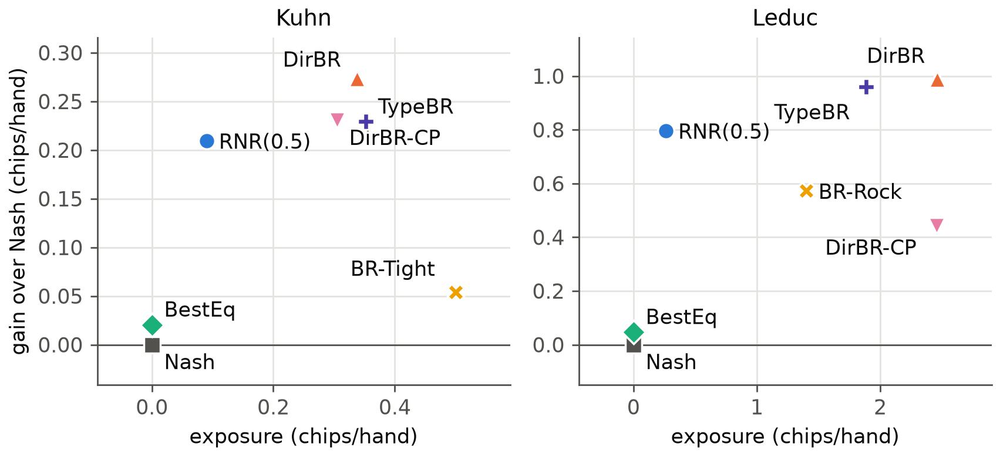

<!--
OFFICIAL PhD TITLE (keep consistent across all documents):
EN: Research on the possibilities for applying Artificial Intelligence in computer games
BG: Изследване на възможностите за приложение на изкуствения интелект в компютърни игри
-->
---
title: "Chapter 14 Summary — Evaluation Frameworks and Exploitability Metrics"
subtitle: "Research on the possibilities for applying Artificial Intelligence in computer games"
author: "Alexander Andreev"
date: "September 2026"
lang: en
vars:
  research_focus: "Adaptive Strategy Learning in Multi-Agent Imperfect-Information Environments"
---

# Chapter 14 — Evaluation Frameworks and Exploitability Metrics

This is a ground-up chapter on how to evaluate game-playing agents that **adapt**: agents that
watch their opponents and change their play. It builds the standard toolkit — exact
exploitability, population rankings and variance reduction — validates every piece against an
independent reference, and then uses it to measure what that toolkit misses. It is written to be
read on its own. **All experimental numbers were measured** on reproducible runs on three small
poker games (two-player Kuhn and Leduc, three-player Kuhn) and on Chapter 11's four-player So
Long Sucker engine, and wherever the game allows they are *exact* rather than sampled. Where a
run contradicted what I expected, I keep the expectation and reconcile it with what happened.

**Where this sits in the thesis.** This chapter is Contribution 3 (evaluation methodology). The
September 2026 literature check narrowed that contribution: combining exploitability,
population ranking and confidence is not new on its own — a benchmark for repeated
rock–paper–scissors already scores return and exploitability together, for one game[^rrps]. What
no protocol found reports together is (a) the **gain** against a sub-optimal population, (b) the
**speed** of adaptation and the **recovery** after an opponent switches, and (c) the **worst
case**, or with more than two players a coalition-aware substitute — each with confidence bounds,
applied unchanged across several imperfect-information games. The chapter builds such a protocol
and shows, on concrete agent zoos, where the existing measures break. It also serves the other
two contributions: it is the yardstick for Chapter 7's adaptive agents (Contribution 1) and for
the question Chapter 8 left open — what "safe" can mean with three players (Contribution 2).

---

## Why evaluating an adaptive agent is hard

There are two ways to grade a game-playing agent. The first asks *how badly can it be beaten?*
In a two-player zero-sum game the answer is **exploitability**: how far a best-responding
opponent can push the agent below the game value. The second asks *how well does it do against
the opponents it will meet?* The answers are head-to-head win rates and ratings computed from
them, from Elo[^elo1978] to Nash averaging[^balduzzi2018], α-Rank[^alpharank] and voting-based
evaluation[^vase]. The two families are known to disagree. Two poker bots that were
indistinguishable head-to-head were about 1,300 mbb/game apart in local-best-response
exploitability[^deepstack], and
the Annual Computer Poker Competition used two winner rules for exactly this reason[^bard2013].

An adaptive agent makes the disagreement structural. It leaves equilibrium on purpose, to
exploit, so exploitability can only count against it however much it gains. Its payoff against
another agent depends on how long they play and on what it has seen, so it has no single entry in
the payoff matrix that every population ranking assumes. With three or more players the worst
case itself changes meaning: NashConv, the usual N-player generalisation of exploitability,
measures distance from *an* equilibrium[^openspiel]. In three-player Kuhn poker a player can pass
utility to a second player at the third's expense while everyone plays equilibrium
strategies[^szafron2013]. The only worst-case notion the literature check found for coalitions is the
team-maxmin value of adversarial team games[^celli2018] — a solution concept, not an evaluation protocol.

A picture helps. Hiring a negotiator, one reference says "the worst deal a ruthless
counterpart could force on this person", another "how they did in their last twenty
negotiations". Neither says how fast they read a new counterpart, whether they notice when the
counterpart changes tactics, or whether they can be played by someone who acts naive and then
turns. With three parties at the table, neither says what happens when the other two
coordinate. The chapter's protocol asks all of these, with error bars.

---

## The framework: three layers and a fourth question

The plan specifies three layers. **Layer 1** is the worst case: exact exploitability in small
games, a learned best response in large ones[^timbers2022]. **Layer 2** is the population:
round-robin payoff matrices, Elo, Nash averaging, the meta-Nash of empirical game analysis
(Chapters 9–10), α-Rank, VasE's maximal lotteries and the transitive/cyclic "spinning top"
decomposition[^balduzzi2019][^czarnecki2020]. **Layer 3** is confidence: seeds, duplicate dealing
and AIVAT[^aivat]. The fourth question is the chapter's own: how an adaptive agent behaves *over
time*.

Everything rests on one exact engine. Each game is enumerated once from OpenSpiel's own
definition into arrays of information sets, sequences and terminal histories. An agent's
strategy at any moment is then a vector, and its expected payoff, best response and exposure are
matrix operations. Leduc has 9,457 nodes and 468 information sets per player; building its tree
takes 0.04 s. An adaptive agent is treated as a *sequence* of strategies, one per refit, each of
which can be scored exactly. The engine reproduces OpenSpiel's NashConv to 10 decimals on
twelve profiles, Chapter 3's Leduc exploitability (0.811708 after 10 CFR iterations, 0.090002
after 100) and Chapter 7's best responses to 1e-14 (`validation.json`).

The four readouts are defined as follows (chips per hand throughout).

- **Gain**: the agent's expected payoff minus the equilibrium blueprint's, against the same
  opponent in the same seat; its **capture** divides this by what the exact best response would
  gain.
- **Speed and recovery**: *h50* is the first hand at which the capture reaches one half and stays
  there on average over the next 100 hands; *r50* is the same count after the opponent switches.
  The adaptive agents refit every 50 hands, so both are resolved to 50 hands.
- **Exposure**: for two players, how far below the game value v* a best responder could push the
  policy in force — exploitability applied to the current policy rather than to a fixed agent;
  plus the realised loss under a white-box teaching attack. For three players, the **coalition
  value**: the least the other two can hold the agent to with coordinated strategies.
- **Confidence**: 95 % intervals over seeds, with the estimator named. There are three:
  raw chips; AIVAT with the agent's own strategy known; and the *policy-exact* expected payoff of
  the two policies in force, available only when both are bots.

The zoos have 16 agents on Kuhn and 12 on Leduc. The **equilibrium** blueprint comes from
OpenSpiel's CFR+ (exploitability 9.6e-6 on Kuhn and 8.5e-5 on Leduc). The **rule-based types** are Chapter 7's
(AlwaysPass, AlwaysBet, TightPassive, LooseAggr, Threshold on Kuhn; CallingStation, Maniac, Rock,
LoosePassive on Leduc), plus Random. On Kuhn there are also three **strategies extracted from real
language models** in Chapter 12 (Qwen2.5-7B-Instruct, gpt-oss-20b and OpenThinker3-7B, served
locally by LM Studio 0.4.20, plain prompt, temperature 0.7, read from the action-token
log-probabilities; the quantisation of the weights was not recorded). OpenThinker3-7B is a weak
stand-in: 34 % of its probability mass at the action token could not be mapped to an action. A **specialist** is a static best response to
one weak type. The five **adaptive agents** combine Chapter 7's models with Chapter 8's
responses:

- *TypeBR*: a Bayesian posterior over the types, best-responded to;
- *DirBR*: the continuous Dirichlet model, best-responded to;
- *DirBR-CP*: DirBR with Chapter 7's change-point reset;
- *RNR(0.5)*: the continuous model inside a restricted Nash response with p = 0.5[^johanson2007];
- *BestEq*: the best equilibrium against the model — the most it can earn while never falling
  below v*, Ganzfried and Sandholm's best-equilibrium baseline[^ganzfried2015].

Chapter 8 solved the last two with a constraint-generation loop that did not converge on full
Leduc within its caps. Here they are solved with the sequence-form dual linear
program[^kmvs1996][^vonstengel1996], in which the opponent's best response enters as a dual
variable. One LP per method solves full Leduc in 0.02–0.04 s and reproduces Chapter 8's Kuhn
results. The only difference is a 1.9e-3 gap in the best equilibrium, which comes from the 5e-4
slack Chapter 8's solver applies to its floor.

---

## Layer 2 — rankings disagree, in predictable ways

Each pair of agents plays 2,000 hands per match, in both seats with duplicate cards, over 10
seeds; pairs of stationary agents are evaluated exactly. Elo is fitted to the probability of
finishing a 100-hand session ahead. The round-robin gives a clear and uncomfortable picture
(`population_{kuhn,leduc}.json`).

The rankings fall into two camps. **Exploitability, Nash averaging and VasE** favour agents that
never lose. On Leduc the maximum-entropy Nash mixture of the meta-game is BestEq 0.88, Nash 0.11
and TypeBR 0.01. RNR(0.5) and DirBR earn the highest population return (+0.807 and +0.890
chips/hand) yet get zero weight, because each loses a little to the equilibria. **Elo,
population return and the RRPS score** favour agents that beat many opponents: Elo's order on
Leduc is RNR(0.5) 1892, DirBR 1848, BestEq 1779, Nash 1763. The Kendall correlation between the
Elo and exploitability rankings is 0.45 on Kuhn and 0.36 on Leduc. Neither camp is wrong about
its own question. The point is that for an exploiting agent the two questions have opposite
answers, and a single ranking silently picks one.

Three more predicted failure modes appear. **Clones inflate Elo.** Adding up to eight copies of
the weakest bot widens DirBR's Elo lead over Nash from +166 to +181 points on Kuhn and from +84 to
+113 on Leduc. No Nash-averaged skill moves by more than 6e-6, which is the invariance Balduzzi et
al. designed Nash averaging to have[^balduzzi2018]. **α-Rank depends on α.** As α grows from 0.01
to 100, three different agents lead on Kuhn (DirBR, RNR(0.5), Nash) and four on Leduc (DirBR,
RNR(0.5), BestEq, Nash). **The horizon matters.** Truncating the same runs to 100 hands
puts TypeBR first in Elo on Kuhn and the *static* specialist BR-Rock first on Leduc; from 300
hands on, DirBR-CP, then DirBR (Kuhn) and RNR(0.5) (Leduc) lead. An adaptive agent's place in a
meta-game is only defined once the match length is fixed.

Ranking confidence is uneven too. Resampling the 10 seeds 200 times, Elo keeps its Kuhn winner in
every resample and α-Rank at α = 10 in 22 %. Near-tied equilibrium agents make α-Rank's top
unstable at this sample size — the effect Rowland et al. analyse for noisy payoffs[^rowland2019].
The LLM-derived strategies behave like any other fixed bot, and an arena-style rating misorders
them relative to their worst case. Elo puts the Qwen2.5-7B strategy 7th of 16 and the rule-based
Threshold bot 10th, although Qwen's exploitability is 0.179 chips/hand against Threshold's 0.118
(Chapter 12 reported 0.357 for Qwen as NashConv; the convention here is NashConv/2).
LLM arenas that rank by rating alone inherit this.

---

## Layer 3 — confidence, and what AIVAT taught

AIVAT corrects each hand's result with control variates for chance events and for the actions
of any player whose strategy is known, plus "imaginary observations" over that player's other
possible private cards[^aivat]. The paper proves the estimate unbiased for any value function.
Because every term depends only on the observed terminal history and the known strategies,
this chapter tabulates the AIVAT value of every terminal once per strategy. That gives the
estimator's *exact* mean and variance, with no sampling.

The first implementation had a real bug, and the check that caught it is worth keeping. With
both strategies known and a perfect value function, AIVAT's variance must be zero. It was not.
The known player's own card deal had received a chance-correction term, although the imaginary
observations already average over that card; its luck was being counted twice. The paper's
worked example has no term at that deal. Removing it restored exactly zero variance and made the
realistic version, with only the agent's own strategy known, better than chance-only correction
everywhere.

With blueprint self-play values as the value function, AIVAT is unbiased to 1e-15 on every
Nash-versus-zoo pair. The plan's targets — variance divided by at least 5 on Kuhn and 10 on Leduc
— are met for 18 of 20 Kuhn pairs (median factor 48) and 7 of 12 Leduc pairs (median 12.2,
minimum 6.9). The misses are opponents whose play the self-play value function predicts badly.
This is consistent with the paper's own Leduc table, where dissimilar strategies saw 48–75 %
reductions in standard deviation. Two caveats from recent work carry over: AIVAT cannot be used
for humans, whose strategy is unknown[^pluribus], and its value function must be fixed before the
data are seen[^kim2026] — here it is the blueprint, computed before any match.

Measuring *adaptation* rather than a final win rate raises the price sharply. The quantity of
interest lives in short windows along the match. To estimate the capture of one 100-hand window
to ±0.25 with 95 % confidence, the median agent–opponent pair needs 3,383 hands with raw chips on
Kuhn and 379 with AIVAT; on Leduc, 1,313 and 354. The same holds on real data. Chapter 13 parsed
the 10,000 released hands of Pluribus against five professionals. From the per-hand results
alone, Pluribus's win rate is −70.9 ± 172.8 mbb/hand (95 % interval), a standard error of
88 mbb. With AIVAT and Pluribus's strategy, Brown and Sandholm report 48 mbb/game with a standard
error of 25[^pluribus]. A third party holding only the hand histories cannot reach significance
on the win rate, let alone on how fast the agent adapts.

---

## The joint protocol on Kuhn and Leduc

Seven agents were run against every sub-optimal stationary member of the zoo, against three
opponents that switch strategy at hand 1,000 of 2,000, and against three teaching attacks. A
teaching attack plays a bait strategy until hand 1,000 and then the exact best response to the
agent's current policy, refreshed every 50 hands — the "taught then exploited" scenario that
motivates adaptation safety[^ge2024]. Every condition was run for 10 seeds in both seats
(`adaptation_{kuhn,leduc}.json`).

| Agent | Gain K | Exposure K | Teach loss K | Gain L | Exposure L | Teach loss L |
|---|---:|---:|---:|---:|---:|---:|
| Nash | 0 | 0.000 | 0.000 | 0 | 0.000 | 0.000 |
| BestEq | +0.020 | 0.000 | 0.000 | +0.047 | 0.000 | 0.000 |
| RNR(0.5) | +0.210 | 0.090 | 0.045 | +0.797 | 0.264 | 0.179 |
| DirBR | +0.273 | 0.338 | 0.246 | +0.988 | 2.461 | 1.241 |
| DirBR-CP | +0.230 | 0.305 | 0.199 | +0.441 | 2.459 | 1.757 |
| TypeBR | +0.229 | 0.352 | 0.337 | +0.961 | 1.885 | 2.000 |

: Gain against the sub-optimal population, mean exposure of the policy in force, and loss below v* after a teaching attack, on Kuhn (K) and Leduc (L), chips per hand. 95 % intervals on the gains are at most 0.007.

Read together, the numbers separate agents that every single ranking conflates. **BestEq** is
safe by construction and gains almost nothing: 0.020 and 0.047 chips/hand. **RNR(0.5)** gains 10 to
17 times as much at an exposure of 0.090 on Kuhn and 0.264 on Leduc, and loses at most 0.274
chips/hand to any teaching attack. **DirBR** gains a little more still (0.988 on Leduc) but at an
exposure of 2.46 — almost thirty times the game value — and a teaching attacker takes 1.0–1.5
chips/hand back. Exploitability ranks BestEq, with Nash, first and RNR(0.5) behind them; Elo ranks them the
other way. Only the pair (gain, exposure) says what an evaluator needs to know: RNR(0.5) buys
most of the gain for a small, measured risk.

Exposure is also the upper envelope of the teaching loss. A white-box attacker in step with the
agent's refits takes exactly the exposure of the current policy. For every agent except DirBR-CP,
whose resets leave the attacker's response stale, the measured teaching losses equal the
exposure after the switch.

Speed and recovery separate agents with similar gains. On Kuhn every adaptive agent reaches half
the attainable gain at the first refit (median h50 = 50 hands), but in different shares of
matches: DirBR-CP 100 %, DirBR 99 %, TypeBR 89 %, RNR(0.5) 73 %. Recovery is informative only
where the old exploit fails against the new opponent. On Kuhn the best response to TightPassive
does worse than Nash against LooseAggr, so that switch is a real test. There DirBR-CP recovers in
a median of 50 hands and RNR(0.5) in 400 (reached in 30 % of matches); DirBR needs 850 (45 %),
and TypeBR, whose posterior has absorbed 1,000 hands of TightPassive, never recovers within the
match. The change-point exploiter shows why one game is not enough. On Kuhn it recovers fastest
and loses least to teaching among the best-response agents. On Leduc its detector fires on
*stationary* opponents, it captures only 0.34 of the attainable gain, and it loses 1.76
chips/hand to the teaching attack against DirBR's 1.24.

---

## Approximate best responses and the RRPS score

In games too large to traverse, exploitability is estimated by learning a best response, which
gives a lower bound[^timbers2022][^lisy2017]. Kuhn and Leduc allow this to be checked against the
exact value.

On Kuhn the learner comes within 4 % of the exact value by 10⁴ hands for every target. On Leduc it
reaches 71 % (Rock) to 98 % (CallingStation) after 10⁵ hands per seat. After 10³ hands it *loses*
to Rock and Maniac, so a budget-limited evaluator would report both as safe. Against the adaptive
agents the gap is starker. The same learner, playing a 2,000-hand match online, inflicts no damage
on Leduc: the agents earn 0.35–0.86 chips/hand above the game value against it, while the
white-box attack takes 1.0–1.5 from DirBR. The RRPS benchmark's *within-population*
exploitability — the most any population member wins against the agent — has the same blind
spot. It is 0.279 chips/hand for DirBR on Leduc against an exposure of 2.461, and it ranks DirBR
second of twelve on the aggregate score. The adversarial-policy results against superhuman Go
programs are the large-scale version of this finding[^wang2023]. An exploiter's number means
little without its budget and strength.

---

## Three and four players

With three players the protocol changes in one place, the worst case. Five approximate
equilibria of three-player Kuhn were computed: CFR and CFR+ (100,000 iterations; NashConv 4.4e-5
and 1.5e-7) and external-sampling MCCFR with three seeds (NashConv 3.4e-3 to 1.4e-2). All have
near-zero NashConv, yet they are not interchangeable. Seat 0 earns −0.0287 under CFR and −0.0269
under CFR+, and seat 2 correspondingly less, while seat 1 stays at −0.0208 — utility moving
between two players inside the equilibrium set, as Szafron et al. describe for this
game[^szafron2013] — and profiles
combining components from different solvers reach a NashConv of 0.125. Worse, an equilibrium
component guarantees nothing against a pair. Its coalition value is computed exactly by
enumerating one member's 2¹⁶ pure strategies and best-responding with the other; a linear
objective over correlated joint strategies is minimised at a pure pair. For the CFR and CFR+
equilibria it ranges from −0.094 to −0.125 chips/hand, against equilibrium values of −0.029 to
+0.050 (`nplayer_kuhn3.json`).

The three-player adaptive agent DirBR3P extends Chapter 7's continuous model to two opponents,
spreading counts over the unseen cards by their posterior weight, and best-responds to the
modelled pair. Against independent sub-optimal pairs it gains +0.372 ± 0.038 chips/hand over the
blueprint and captures 0.99 of the attainable gain within 50 hands. Most population views put it
first: population return (+0.346), a win-share Elo (1972), α-Rank at α = 0.1, and Nash averaging
of the pairwise projection, which gives it all the mass. The coalition-aware readout disagrees.
Against two opponents that bait until hand 1,000 and then play the exact coalition best response
to its current policy, DirBR3P earns −0.466 chips/hand, four times the blueprint's −0.119; the
coalition value of its final policy is −0.386. Blending with the blueprint (Blend3P) roughly
halves both the gain and the teaching loss (+0.213; −0.242). A fixed colluding pair aimed at the blueprint costs the
blueprint 0.119 per hand but is itself exploitable: DirBR3P earns +0.354 against it. Adaptation is
a defence against a *static* coalition and a liability against an adaptive one. No ranking built
from independently seated opponents can tell these apart, which is failure mode 8 in the gap
analysis.

So Long Sucker, re-measured on Chapter 11's engine with its fixed tie-break, supports only the
population layer. The pairwise projection is 0.955 transitive, Elo spreads the four baselines
over 66 points, and Nash averaging picks the betrayer. A planted alliance lowers a focal
baseline's win rate by only 0.8–1.9 percentage points, with intervals that separate for one
baseline of four. Chapter 11 found that about 99.5 % of random games in this engine end in
deadlock, which leaves an alliance little to act on.

---

## Where existing evaluation breaks — a checklist

| Failure mode (gap analysis) | Evidence in this chapter | What the protocol reports instead |
|---|---|---|
| 1. Exploitability only punishes adaptation | BestEq ties Nash for first on exploitability with 0.02–0.05 gain | gain and exposure as a pair |
| 2. No N-player meaning of exploitability | NashConv ≈ 0 components lose 0.06–0.17 more to a pair | the exact coalition value |
| 3. Approximate BRs are lower bounds | learner negative after 10³ hands; online learner finds nothing | exact exposure; exploiter budget stated |
| 4. Rankings over- or under-credit exploitation | clones, α, horizon change the winner | rankings reported as context |
| 5. Variance compounds with adaptation | 3,383 vs 379 hands per window; Pluribus ±173 | estimator named; AIVAT where possible |
| 7. Deceptive opponents untested | teaching attack takes 1.0–2.2 chips/hand on Leduc | teaching loss |
| 8. Collusion evaluated apart from play | DirBR3P first in return, Elo and Nash averaging; −0.47 under a coalition | coalition teaching attack |
| 9. LLM arenas inherit the above | Elo ranks the Qwen strategy above a less exploitable bot | the same readouts for LLM agents |

: The failure modes of `lit_evaluation.md` (point 6, generalisation suites, concerns cooperative substrates and is not tested here) and what this chapter measured.

---

## Honest notes, limitations, and where this hands off

**What held up.** Every exact quantity matches an independent reference: OpenSpiel's NashConv,
α-Rank, Nash averaging and maximal lotteries; Chapter 3's exploitability; Chapter 7's best
responses; Chapter 8's solvers. AIVAT is exactly unbiased, and its zero-variance limit now holds.
The protocol's gains carry 95 % intervals of at most 0.007 chips/hand on the two-player games,
because the policy-exact estimator has no card noise; the ten seeds sample the only remaining
randomness, the learning trajectory.

**What did not, and why it matters.** Three plan predictions failed and are kept as stated:
"random loses to everyone" (on Kuhn it beats AlwaysPass); "AIVAT ≥ 10× on Leduc" (7 of 12
pairs); "approximate within 10 % on Leduc" (4 of 6 targets, only at 10⁵ hands). Two of my own
implementation errors were caught by checks, not by luck: the AIVAT double count, and a Nash
averaging solver that returned infeasible "optimal" points on near-tied agents until a fixed
tolerance and support LPs replaced it.

**Limitations.** These are toy games. The exact worst case and the exact coalition value (2¹⁶
strategies per member) exist only because the games are tiny; at scale a learned attacker gives only a lower bound on
either.
The policy-exact estimator exists only for bots. The white-box teaching attacker is a strong
adversary but not the worst adaptive one. The adaptive agents are Chapter 7–8 baselines: the
protocol *measures* the missing N-player loss bound; it does not provide one. So Long Sucker is
weak evidence.

**Connections.** Backward: the engine absorbs Chapter 3's exploitability, Chapter 7's models and
best responses, Chapter 8's safe responses (now as one LP), Chapter 10's spinning top, Chapter
11's So Long Sucker and Chapter 12's LLM-extracted strategies. Forward: Chapter 15 maps the
research programme, and this protocol is the yardstick for its experiments. For Contribution 2 it
supplies the measurement a safe N-player agent must pass — gain against independent pairs,
coalition value, and coalition teaching loss. The one-shot LP removes the scaling obstacle
Chapter 8 met.

---

## Key takeaways for the thesis synthesis

- **Exploitability and rankings answer different questions, and for exploiting agents they give
  opposite answers.** On the same Leduc zoo, BestEq and Nash lead exploitability and Nash averaging and BestEq leads VasE;
  RNR(0.5) and DirBR lead Elo, population return and the RRPS score. The Elo–exploitability rank
  correlation is 0.36.
- **Gain, speed, recovery and exposure reported together separate what single numbers conflate.**
  RNR(0.5) gains +0.797 chips/hand on Leduc at exposure 0.264 and at most 0.274 teaching loss;
  DirBR gains +0.988 at exposure 2.461 and 1.0–1.5 teaching loss; BestEq gains 0.047 at zero.
- **With three players the worst case must be coalition-aware.** Equilibrium components (NashConv
  ≈ 0) lose 0.06–0.17 chips/hand more to a coordinated pair than they earn in equilibrium. The
  adaptive DirBR3P tops population return, Elo and Nash averaging, and loses 0.47 chips/hand to a
  coalition teaching attack.
- **Confidence is the binding constraint on measuring adaptation.** Per-window estimates need about
  3,400 hands with raw chips against about 380 with AIVAT on Kuhn. On Pluribus's released hands the
  raw 95 % interval is ±173 mbb/hand.
- **Reported exploiters need a stated budget.** A learned best response reports two exploitable
  Leduc bots as safe after 10³ hands, and within-population exploitability misses DirBR's
  exposure by a factor of nine.
- **The C3 claim stays narrow.** The pieces exist; what this chapter adds is their joint, unchanged
  application across two- and three-player imperfect-information games, and a demonstration of
  where each existing measure breaks. All of it is on toy games so far.

<!-- Source footnotes. Definitions may sit anywhere at top level; keeping them
     together here keeps the prose readable and the EN/BG pair easy to compare. -->

[^rrps]: Lanctot, M., Schultz, J., Burch, N., Smith, M. O., Hennes, D., Anthony, T. & Pérolat, J. (2023). "Population-based Evaluation in Repeated Rock-Paper-Scissors as a Benchmark for Multiagent Reinforcement Learning." *Transactions on Machine Learning Research*; arXiv:2303.03196 — 43 bots, 1,000-throw matches; population return, within-population exploitability and their difference as an aggregate score.

[^elo1978]: Elo, A. E. (1978). *The Rating of Chessplayers, Past and Present*. New York: Arco.

[^balduzzi2018]: Balduzzi, D., Tuyls, K., Pérolat, J. & Graepel, T. (2018). "Re-evaluating Evaluation." *NeurIPS*; arXiv:1806.02643 — Elo is inflated by copies of beaten agents; Nash averaging is invariant to redundant agents.

[^alpharank]: Omidshafiei, S., Papadimitriou, C., Piliouras, G., Tuyls, K., Rowland, M., Lespiau, J.-B., Czarnecki, W. M., Lanctot, M., Pérolat, J. & Munos, R. (2019). "α-Rank: Multi-Agent Evaluation by Evolution." *Scientific Reports* 9, 9937. DOI 10.1038/s41598-019-45619-9.

[^vase]: Lanctot, M., Larson, K., Bachrach, Y., Marris, L., Li, Z., Bhoopchand, A., Anthony, T., Tanner, B. & Koop, A. (2023). "Evaluating Agents using Social Choice Theory." *arXiv:2312.03121* (v4, 2025) — Voting-as-Evaluation; maximal lotteries recommended.

[^deepstack]: Moravčík, M. et al. (2017). "DeepStack: Expert-level artificial intelligence in heads-up no-limit poker." *Science* 356(6337), 508–513; arXiv:1701.01724 — also reports an 85 % reduction in standard deviation with AIVAT.

[^bard2013]: Bard, N., Hawkin, J., Rubin, J. & Zinkevich, M. (2013). "The Annual Computer Poker Competition." *AI Magazine* 34(2), 112–114 — total-bankroll and instant-runoff winner rules; duplicate play.

[^openspiel]: Lanctot, M. et al. (2019). "OpenSpiel: A Framework for Reinforcement Learning in Games." *arXiv:1908.09453* — NashConv as the sum of each player's incentive to deviate; exploitability = NashConv / n.

[^szafron2013]: Szafron, D., Gibson, R. & Sturtevant, N. (2013). "A Parameterized Family of Equilibrium Profiles for Three-Player Kuhn Poker." *AAMAS*, 247–254.

[^celli2018]: Celli, A. & Gatti, N. (2018). "Computational Results for Extensive-Form Adversarial Team Games." *AAAI* 32(1). DOI 10.1609/aaai.v32i1.11462; see also Zhang, Y., An, B. & Černý, J. (2021). "Computing Ex Ante Coordinated Team-Maxmin Equilibria in Zero-Sum Multiplayer Extensive-Form Games." *AAAI* 35(6), 5813–5821.

[^timbers2022]: Timbers, F., Bard, N., Lockhart, E., Lanctot, M., Schmid, M., Burch, N., Schrittwieser, J., Hubert, T. & Bowling, M. (2022). "Approximate Exploitability: Learning a Best Response." *IJCAI*; arXiv:2004.09677.

[^balduzzi2019]: Balduzzi, D. et al. (2019). "Open-ended Learning in Symmetric Zero-sum Games." *ICML*, PMLR 97, 434–443 — the transitive/cyclic decomposition.

[^czarnecki2020]: Czarnecki, W. M., Gidel, G., Tracey, B., Tuyls, K., Omidshafiei, S., Balduzzi, D. & Jaderberg, M. (2020). "Real World Games Look Like Spinning Tops." *NeurIPS*; arXiv:2004.09468.

[^aivat]: Burch, N., Schmid, M., Moravčík, M., Morrill, D. & Bowling, M. (2018). "AIVAT: A New Variance Reduction Technique for Agent Evaluation in Imperfect Information Games." *AAAI* 32(1); arXiv:1612.06915 — unbiased for any value function (Theorem 1); on Leduc, 48–75 % lower standard deviation for dissimilar strategies.

[^johanson2007]: Johanson, M., Zinkevich, M. & Bowling, M. (2007). "Computing Robust Counter-Strategies." *NIPS 2007* — Restricted Nash Response.

[^ganzfried2015]: Ganzfried, S. & Sandholm, T. (2015). "Safe Opponent Exploitation." *ACM Transactions on Economics and Computation* 3(2), Article 8. DOI 10.1145/2716322 — the best-equilibrium strategy is their baseline; their safe algorithms risk only gifts already won.

[^kmvs1996]: Koller, D., Megiddo, N. & von Stengel, B. (1996). "Efficient Computation of Equilibria for Extensive Two-Person Games." *Games and Economic Behavior* 14(2), 247–259.

[^vonstengel1996]: von Stengel, B. (1996). "Efficient Computation of Behavior Strategies." *Games and Economic Behavior* 14(2), 220–246 — the sequence form.

[^rowland2019]: Rowland, M., Omidshafiei, S., Tuyls, K., Pérolat, J., Valko, M., Piliouras, G. & Munos, R. (2019). "Multiagent Evaluation under Incomplete Information." *NeurIPS*; arXiv:1909.09849.

[^pluribus]: Brown, N. & Sandholm, T. (2019). "Superhuman AI for multiplayer poker." *Science* 365(6456), 885–890. DOI 10.1126/science.aay2400 — 48 mbb/game, standard error 25, over 10,000 hands; AIVAT cannot be applied to the human players.

[^kim2026]: Kim, J. & Sandholm, T. (2026). "Heuristic Pathologies and Further Variance Reduction via Uncertainty Propagation in the AIVAT Family of Techniques." *arXiv:2605.14261*.

[^ge2024]: Ge, Z., Xu, Z., Ding, T., Meng, L., An, B., Li, W. & Gao, Y. (2024). "Safe and Robust Subgame Exploitation in Imperfect Information Games." *ICML*, PMLR 235, 15255–15270 — adaptation safety and the "taught and exploited" problem.

[^lisy2017]: Lisý, V. & Bowling, M. (2017). "Equilibrium Approximation Quality of Current No-Limit Poker Bots." *AAAI-17 Workshop on Computer Poker and Imperfect Information Games*; arXiv:1612.07547 — local best response, a lower bound on exploitability.

[^wang2023]: Wang, T. T., Gleave, A., Tseng, T., Pelrine, K., Belrose, N., Miller, J., Dennis, M. D., Duan, Y., Pogrebniak, V., Levine, S. & Russell, S. (2023). "Adversarial Policies Beat Superhuman Go AIs." *ICML*, PMLR 202, 35655–35739.
