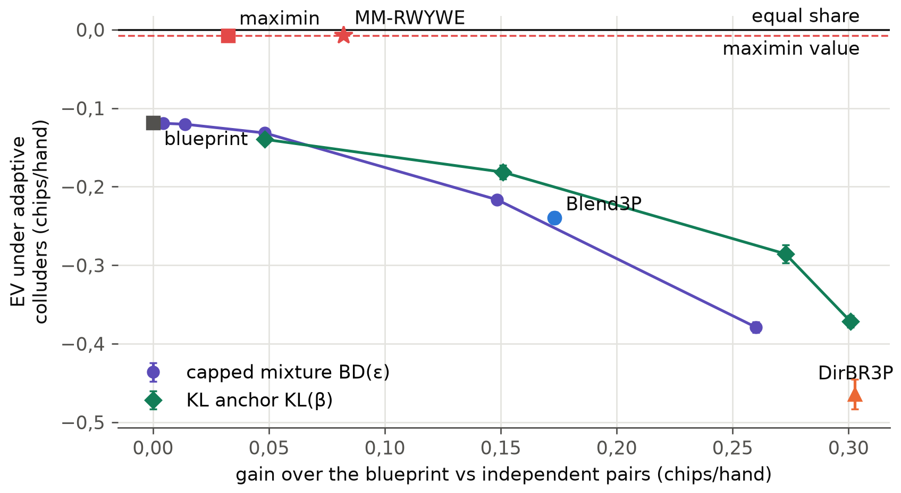

<!--
OFFICIAL PhD TITLE (keep consistent across all documents):
EN: Research on the possibilities for applying Artificial Intelligence in computer games
BG: Изследване на възможностите за приложение на изкуствения интелект в компютърни игри
-->

# Глава 15 – Картографиране на изследователската граница и проектиране на приносите: експериментален доклад

**Тестова среда:** Кун покер и Ледюк Холдем за двама играчи и Кун покер за трима играчи, върху точния двигател с масиви от Глава 14 (информационни множества, последователности и крайни състояния, изброени от дефинициите на игрите в OpenSpiel и проверени спрямо OpenSpiel до 10-ия знак след десетичната запетая). Противниците са зоопарците от агенти (bot zoos) от Глава 14: типове, основани на правила, стратегии, извлечени от езикови модели, статични специалисти, противници, които сменят стратегията си, обучаващ нападател и – при трима играчи – независими двойки, фиксирана двойка съучастници (colluders) и адаптивна двойка съучастници. За възпроизвеждането се използват собствените класове противници на Ganzfried и Sandholm.

**Връзка с дисертацията:** тази глава превръща четиринадесетте подготвителни глави в изследователската програма за глави II–IV: карта на изследователската граница (frontier map), три проектни документа за приносите, спецификации на експериментите и публикационен план (`implementation/step15/design/`). Докладът обхваща двата проведени пилотни експеримента за осъществимост и представя проектите накратко в Част III. Пилотният експеримент P1 реализира RWYWE (Risk What You've Won in Expectation – „рискувай средно спечеленото дотук“) на Ganzfried и Sandholm – базовия метод за безопасна експлоатация при двама играчи, който липсваше в Глава 8, – и го измерва с обединения протокол от Глава 14. Пилотният експеримент P2 е първо изпълнение с трима играчи на Експеримент 2.1, централния експеримент на Принос №2: експлоатация с ограничена загуба, изпитана срещу противници в тайно съглашение.

**Обхват на резултатите:** всяко число е измерено и е взето от файловете в `implementation/step15/implementation/results/`: `gs_replication.json` (и `gs_replication_notb.json`), `protocol2p_kuhn.json`, `protocol2p_leduc.json`, `maximin3p.json` и `bounded3p.json`; дневникът на разработката е `implementation/step15/EXECUTION_NOTES.md`. Началните числа са фиксирани в кода. Твърденията за двама играчи използват 10 начални числа × 2 места (дублирани карти, началните числа за тестето от Глава 14); твърденията за трима играчи използват 5 начални числа × 3 места; възпроизвеждането използва 400 противници на клас. Интервалите са 95 % интервали. Пилотните експерименти са доказателства за осъществимостта на проектите, а не резултатите на приносите. Когато някое изпълнение противоречи на прогнозата, записана преди него, и двете са запазени (WORKFLOW §0.1).

> **Как да се чете докладът.** Част I е базовият метод за двама играчи: възпроизвеждането на
> публикуваните резултати, а след това RWYWE по протокола от Глава 14. Част II преминава към трима
> играчи: максиминната стойност, а след това три правила за ограничено отклонение срещу независими
> двойки и двойки съучастници. Част III представя проектите накратко. Докладът завършва с разделите
> за съпоставката, достоверността, ограниченията, заключенията и възпроизвеждането.

---

## Част I – БАЗОВИЯТ МЕТОД ЗА ДВАМА ИГРАЧИ

## Какво проверява тази глава

Глава 8 реализира безопасната експлоатация като праг за всяко раздаване: всяка стратегия трябва да гарантира поне стойността на играта v* във всяко раздаване. Прегледът от септември 2026 г. установи, че това е само *базовият вариант* на Ganzfried и Sandholm – най-доброто равновесие срещу модела на противника. Собствените им алгоритми определят безопасността за цялата повтаряща се игра – поне v* на раздаване *средно за мача* (по математическо очакване) – и се отклоняват извън равновесието, като рискуват само „подаръците“ (gifts), които противникът вече е направил (Ganzfried & Sandholm 2015, деф. 4.1 и § 6). RWYWE поддържа резерв (bank) k: във всяко раздаване той играе най-добрия отговор на модела измежду стратегиите, чиято стойност в най-лошия случай е поне v* − k, а след раздаването добавя към k гарантираната печалба на тази стратегия срещу наблюдаваната игра, минус v*. В игра с непълна информация ненаблюдаваната игра на противника трябва да се приеме за враждебна: зачетената стойност е най-лошият случай по всички стратегии на противника, съвместими с наблюдаваните действия (алг. 6), а когато картата на противника не е била показана – и по всяка карта, която той би могъл да държи (§ 8.2.2). Резервът никога не пада под нула, а сумирането по мача дава гаранцията: общата очаквана печалба е ≥ T·v* срещу всеки противник.

Проверяват се два въпроса. Възпроизвежда ли реализацията в тази глава публикуваните резултати (Експеримент 1)? И какво печели RWYWE по протокола от Глава 14 срещу вече измерените там агенти (Експеримент 2)?

## Експеримент 1 – възпроизвеждане на таблица I на Ganzfried и Sandholm

Постановката следва G&S, § 9: агентът е първият играч в Кун покер (v* = −1/18); моделът на противника брои действията му с априорно разпределение на Дирихле, равно на 5 фиктивни равновесни раздавания във всяко информационно множество; приема се, че картата на противника се показва след всяко раздаване; мачове от 1 000 раздавания, с едни и същи раздадени карти за всеки алгоритъм срещу даден противник. G&S са използвали 40 000 противници на клас; това възпроизвеждане използва 400 (200 в равновесния клас). Първо беше нужна една поправка (изненада 1 по-долу): линейните задачи решават равенствата между еднакво добрите стратегии в полза на плана (blueprint).


| | случайни | близки до равновесието | динамични |
|---|---|---|---|
| RWYWE | 0,332 ± 0,025 (0,364) | −0,0144 ± 0,0016 (−0,0110) | −0,0271 ± 0,0016 (−0,0204) |
| BEFEWP | 0,322 ± 0,024 (0,355) | −0,0138 ± 0,0016 (−0,0115) | −0,0272 ± 0,0017 (−0,0214) |
| BEFFE | 0,176 ± 0,010 (0,200) | −0,0150 ± 0,0016 (−0,0131) | −0,0403 ± 0,0007 (−0,0397) |
| Най-добро равновесие | 0,133 ± 0,008 (0,145) | −0,0177 ± 0,0015 (−0,0148) | −0,0365 ± 0,0007 (−0,0352) |
| Най-добър отговор | 0,328 ± 0,025 (0,470) | +0,0395 ± 0,0048 (+0,0548) | −0,1695 ± 0,0028 (−0,1209) |

: Жетони на раздаване за първия играч в това възпроизвеждане (G&S 2015, таблица I, в скоби). `gs_replication.json`.

Резултатът, на който главата разчита, се възпроизвежда. Срещу динамичните противници и четирите безопасни алгоритъма остават над v* в 400 от 400 мача и в нито едно раздаване от нито един мач експозицията на действащата стратегия не надхвърли резерва; най-добрият отговор пада до −0,170 и под v* във всеки мач. Подредбите се възпроизвеждат: RWYWE и BEFEWP водят срещу случайните и динамичните противници, следвани от BEFFE и най-доброто равновесие в реда на G&S. Нивата на безопасните алгоритми са с 0,001–0,033 жетона на раздаване под публикуваните. Редът за най-добрия отговор не се възпроизвежда: 0,328 срещу 0,470 при случайните противници. Бяха изпробвани три тълкувания на случайния клас и друго правило при равенство за най-добрия отговор, но нито едно не затваря разликата; тя остава отворена (изненада 2).

## Експеримент 2 – RWYWE по обединения протокол

Тук RWYWE използва същия модел на противника като адаптивните агенти от Глава 14 (непрекъснатия модел на Дирихле от Глава 7, преизчисляван на всеки 50 раздавания, с карти, видими само при разкриване), така че сравнението да изолира правилото за отклонение. Изпълняват се два варианта на отчитането: реалистичният, при който отчитането на подаръците използва картата на противника само когато тя бъде разкрита, и експерименталната предпоставка на G&S, при която картата винаги е открита. Обучаващият нападател пренасочва атаката си към *текущата* стратегия на агента на всяко раздаване, защото стратегията на RWYWE се сменя на всяко раздаване. Към показателите от Глава 14 се добавя нов: безопасността на ниво мач (match-level safety) S – средното за мача на EV − v*, което според гаранцията на G&S е неотрицателно по математическо очакване.

| Агент | Приръст в Кун | Експозиция в Кун | Приръст в Ледюк | Експозиция в Ледюк | S < 0 при обучаваща атака (Кун / Ледюк) |
|---|---:|---:|---:|---:|---|
| „Наш“ | 0 | 0 | 0 | 0 | 0 / 0 |
| BestEq | +0,020 | 0 | +0,047 | 0 | 0 / 0 |
| BEFEWP | +0,053 ± 0,003 | 0,029 | +0,049 | 0,004 | 0 / 0 |
| RWYWE (разкриване) | +0,062 ± 0,002 | 0,030 | +0,113 ± 0,001 | 0,006 | 0 / 0 |
| RWYWE (открити карти) | +0,148 ± 0,004 | 0,087 | +0,134 ± 0,001 | 0,010 | 0 / 0 |
| RNR(0,5) | +0,210 ± 0,002 | 0,090 | +0,797 ± 0,007 | 0,264 | 1 / 0 |
| DirBR | +0,273 ± 0,001 | 0,338 | +0,988 ± 0,005 | 2,461 | 21 / 31 |

: Приръст (gain) спрямо плана срещу неоптималната популация и средна експозиция (exposure) на действащата стратегия (жетони на раздаване, 95 % интервали по 10 начални числа), както и броят от 60-те атакувани мача за всяка игра, в които безопасността на ниво мач S е паднала под нула. `protocol2p_{kuhn,leduc}.json`.


Три констатации. Първо, RWYWE е истинско подобрение спрямо базовия вариант от Глава 8: той постига 3,1 пъти приръста на най-доброто равновесие в Кун и 2,4 пъти в Ледюк, и нито един от 120-те му мача при атака не завършва под v*. Второ, цената на гаранцията е висока: RNR(0,5), който няма гаранция, постига 3,4 пъти приръста на RWYWE в Кун и 7 пъти в Ледюк, а при тези атаки падна под v* само в 1 от 120 мача, с 0,0007. Неограниченият DirBR падна под v* в 52 от 120. Трето, песимистичното отчитане е ограничаващият фактор. Когато картите се използват само при разкриване, резервът на RWYWE след 1 000 раздавания с примамката TightPassive в Кун е 0,01 жетона, а след всяка примамка в Ледюк е 0,01–0,02: повечето подаръци не могат да бъдат *доказани*, защото играта на противника извън наблюдавания път трябва да се приеме за възможно най-неблагоприятната. Когато картите винаги са открити, резервът достига 8,5 жетона срещу LooseAggr в Кун и приръстът се удвоява (+0,148), но в Ледюк той се покачва само до +0,134. При 468 информационни множества на играч почти цялата стратегия на противника лежи извън пътя на всяко отделно раздаване.


Обучаващата атака показва защо протоколът се нуждае от S. При примамката LooseAggr RWYWE натрупва в резерва 2,19 жетона до раздаване 1 000 и след това ги изразходва срещу нападателя, което показателят от Глава 14 за загубата от обучаващата атака по раздавания би записал в тежест на агента като небезопасна игра. За целия мач S остава +0,112 ± 0,025. Експозицията по раздавания е правилният показател за агенти с фиксирано правило за отклонение; за агент, който натрупва подаръци в резерв, гаранцията е свойство на целия мач.

---

## Част II – ТРИМА ИГРАЧИ

## Експеримент 3 – максиминната стойност на Кун покер с трима играчи

При трима играчи няма стойност на играта. Ganzfried и Sandholm отбелязват, че методът им „се прилага непосредствено“ (applies straightforwardly) към игри с много играчи, ако минимаксната стойност се замени с максиминната (§ 2.3). Срещу съучастници съответната максиминна стойност е отборната максиминна стойност (team-maxmin): най-многото, което едно място може да си гарантира, когато другите двама могат да се координират (Celli & Gatti 2018; Zhang, An & Černý 2021). Тя беше изчислена точно с LP-задача в последователна форма и генериране на ограничения, с помощта на предсказвач, който намира най-лошата съвместна чиста стратегия на двойката. Предсказвачът изброява различните чисти стратегии на онзи противник, който има по-малко такива (6 561 или 10 000), а другият противник играе най-добър отговор. Той съвпада с изброяването от Глава 14 с точност до 1e-9 и е 20 пъти по-бърз (4,5 ms на извикване).

| Място | максиминна стойност | отсичащи ограничения | план, игра срещу себе си | план, стойност срещу коалиция |
|---|---:|---:|---:|---:|
| 0 | −0,0379 | 15 | −0,0269 | −0,125 |
| 1 | −0,0265 | 23 | −0,0208 | −0,106 |
| 2 | +0,0417 | 14 | +0,0477 | −0,125 |

: Отборна максиминна стойност за всяко място в Кун покер с трима играчи, заедно със стойността на плана от CFR+ при игра срещу себе си и стойността му срещу коалиция. `maximin3p.json`.

Осреднената по местата максиминна стойност е −0,0076 жетона на раздаване – само с 0,0076 под равния дял (equal share; 0 в тази игра с нулева сума). Осреднената по местата стойност на плана срещу коалиция е −0,119. Следователно в тази игра гарантирането на максиминната стойност е далеч от „много консервативния“ резултат, който очаква анализът на пропуските: максиминната стойност на всяко място е само с 0,006–0,011 под стойността на плана при игра срещу себе си, докато собствената стойност на плана срещу коалиция е с 0,085–0,173 под нея (изненада 4).

## Експеримент 4 – ограничено отклонение срещу независими двойки и двойки съучастници

Три правила за отклонение използват общия модел на противника за трима играчи от Глава 14 (броевете на Дирихле на DirBR3P):

- **MM-RWYWE**: отчитането на подаръците на G&S с v_mm на мястото на v* и с координирана двойка на мястото на единствения противник. Зачетената стойност се изчислява срещу най-лошата съвместна чиста стратегия на двойката, съвместима с наблюдаваното. Гаранция: общата очаквана печалба е ≥ T·v_mm срещу всякакви противници. Изпълнява се с открити карти (предпоставката на G&S) и само с разкриване.
- **BD(ε)**, смес с таван (capped mixture): σ = (1 − λ)·план + λ·(най-добър отговор на модела), смесени в последователна форма, с λ = увереност × min(1, ε/L(BR)). Тук L(σ) е най-многото, с което σ може да изостане от плана срещу *която и да е* координирана двойка, изчислено точно. По линейност L(σ) = λ·L(BR) ≤ ε: граница за всяко раздаване спрямо базовата линия.
- **KL(β)**, KL-котва (KL anchor): във всяко информационно множество се играе план(a)·exp(β·Q(a)), нормирано, където Q е стойността на действието срещу модела. Това е собствено предложение на дисертацията: piKL се закотвя към човешка стратегия (Jacob и др. 2022), а не към равновесие. То няма граница; L се измерва.

Базови методи: планът, стационарната максиминна стратегия, MM-BestEq (с k, фиксирано на 0), неограниченият DirBR3P от Глава 14 и неговата поведенческа смес 50/50 Blend3P. Условия: седем независими двойки, фиксирана двойка, която играе точния коалиционен най-добър отговор на плана, и адаптивна двойка, която примамва в продължение на 1 000 раздавания, а след това играе точния коалиционен най-добър отговор на текущата стратегия на агента, обновяван на всеки 50 раздавания. Изпълняващата програма записва за всяко раздаване точната EV на агента и точната EV на плана срещу същите стратегии на противниците и изчислява L точно за всяка действаща стратегия.

| Агент | приръст, незав. двойки | L в най-лошия случай | EV, фиксирани съучастници | EV, адаптивни съучастници |
|---|---:|---:|---:|---:|
| план | 0 | 0 | −0,119 | −0,119 |
| DirBR3P | +0,303 ± 0,001 | 1,06 | +0,353 | −0,464 ± 0,019 |
| Blend3P | +0,173 | 0,56 | +0,117 | −0,239 |
| BD(0,1) | +0,048 ± 0,002 | 0,095 | −0,049 | −0,132 |
| BD(0,3) | +0,149 ± 0,001 | 0,285 | +0,093 | −0,217 |
| BD(∞) | +0,260 ± 0,001 | 1,00 | +0,287 | −0,379 |
| KL(3) | +0,151 ± 0,003 | 0,68 | +0,108 | −0,181 |
| KL(10) | +0,273 ± 0,003 | 0,91 | +0,330 | −0,286 ± 0,011 |
| максиминна стратегия | +0,032 | 0,24 | +0,003 | −0,0076 |
| MM-RWYWE (открити карти) | +0,082 ± 0,001 | 0,97 | +0,003 | −0,0070 ± 0,0008 |
| MM-RWYWE (разкриване) | +0,063 ± 0,001 | 0,74 | +0,003 | −0,0071 ± 0,0006 |

: Жетони на раздаване, осреднени по местата (5 начални числа × 3 места; адаптивни съучастници: раздавания 1 000–1 999). `bounded3p.json`; пълната серия експерименти (ε = 0,01 и 0,03; β = 1 и 30) е във файла.




Проверките се удържат. При BD(ε) най-лошият случай L на всяка действаща стратегия остана ≤ ε (максимум 0,095 при ε = 0,1 и 0,285 при ε = 0,3), а реализираната загуба в раздаване спрямо плана никога не надхвърли ε при адаптивните съучастници. При агентите с максиминен праг S = mean(EV − v_mm) беше неотрицателна във всеки от 135-те мача на всеки агент (минимум +0,0029 при адаптивните съучастници), а стойността срещу коалиция на действащата стратегия никога не падна с повече от 5·10⁻⁷ под прага.

Какво казват числата. MM-RWYWE експлоатира независими слаби двойки (+0,082 спрямо плана, 27 % от приръста на неограничения DirBR3P), а при адаптивните съучастници получава −0,007, докато планът получава −0,119, а DirBR3P получава −0,464. Сместа с таван разменя приръст срещу границата си плавно – приблизително половин жетон приръст за всеки жетон L (при ε = 0,3: +0,149 при L = 0,285), но границата е спрямо базова линия, която сама губи 0,119 срещу съучастници, така че нейната EV при адаптивни съучастници само се влошава с нарастването на ε. Закотвянето чрез KL е по-лошо от сместа при равно L за L ≤ 0,7 и малко по-добро близо до пълното отклонение. По другата ос на устойчивост то е ясно по-добро: при сходен приръст KL(10) получава −0,286 при адаптивни съучастници срещу −0,379 за BD(∞). Двата показателя – най-лошият случай спрямо базовата линия и абсолютната експозиция спрямо коалиция – подреждат правилата различно.

---

## Част III – ПРОЕКТИТЕ НАКРАТКО

Пълните документи са в `implementation/step15/design/`. По-долу е посочено какво поема всеки от тях.

### Принос №1 – извеждане на стратегията на противника в хода на мача

**Пропуск (формулировката от lit_gaps).** Моделиране на противника в реално време с консервативен резервен вариант съществува и работи в игри за двама играчи, включително в покера; всичко това е за двама играчи, а моделиране на противника при N играчи съществува без какъвто и да е критерий за безопасност. Отворено: онлайн извеждане (inference) в игри с непълна информация с N играчи, което се справя със смени на стратегията в рамките на мача и е свързано с изричен критерий за безопасност и с общ протокол за оценяване.

**Метод.** Модел на Дирихле за всяко информационно множество на противника, при който скритите карти се разпределят според апостериорното тегло (моделът от Глава 7, разширен за двама противници в Глава 14); априорно разпределение върху типовете, научено от реални истории на раздаванията (стиловете от Глава 13); откриване на промени по няколко сигнала с частично нулиране; и калибрирана мярка за увереност, която правилото за отклонение на Принос №2 използва. **Експерименти** 1.1 (Кун и Ледюк за двама и за трима играчи; стационарни противници, противници, които сменят стратегията си, и обучаващи противници; показатели: приръст, h50, r50, фалшиви тревоги, калибровка) и 1.2 (онлайн върху историите на раздаванията от Глава 13). **Доказателства:** медиана h50 = 50 раздавания в Кун; DirBR3P +0,372 ± 0,038 жетона на раздаване в рамките на 50 раздавания срещу независими двойки; повторно разпознаване на играч в 15,6 % от случаите сред 834 играчи. **Основен риск:** агентите за двама играчи първи навлизат в игрите с N играчи; тогава твърдението се свежда до свързването и протокола.

### Принос №2 – експлоатация с проверена граница на загубата при повече от двама играчи

**Пропуск (формулировката от lit_gaps).** Безопасната експлоатация има зряла теория за игри с нулева сума за двама играчи. При трима или повече играчи съществуващите понятия са много консервативни (team-maxmin) или доказуемо непостижими срещу разнородни противници (равен дял), закотвянето чрез KL е поведенческо, а експлоатацията в игри с много играчи няма граница на загубата. Отворено (не е намерен контрапример): експлоатацията на неоптимални противници в игри с непълна информация с N играчи при ограничаване на загубата спрямо базова линия и изпитването на тази граница срещу противници в тайно съглашение.

**Какво не се твърди.** Няма обща теорема за безопасност при N играчи. Приносът е емпиричен и в малки игри; всяка граница е или точна по конструкция, или точно проверена чрез изброяване, а където изброяването е невъзможно, се оценява с посочен бюджет. Равният дял е референтна линия, никога гаранция.

**Метод.** Три правила за отклонение върху един модел на противника: RWYWE с максиминен праг (бележката на G&S в § 2.3, с праг, взет срещу координирана двойка), сместа с таван в последователна форма и отговорът, закотвен чрез KL (собствено предложение на дисертацията, само измерено). **Експерименти** 2.0 (изпълнен: пилотен експеримент P1), 2.1 (Кун с трима играчи, а след това Ледюк) и 2.2 (откриване на тайни съглашения, свързано с бюджета за отклонение). **Доказателства:** части I и II по-горе.

### Принос №3 – обединен протокол за оценяване

**Пропуск (формулировката от lit_gaps).** Оценяването е добре развито по отделни оси; един еталонен тест съчетава възвръщаемостта срещу популацията и експлоатируемостта, за една игра за двама играчи. Отворено: протокол, който докладва приръста, скоростта на адаптация и възстановяването, както и устойчивостта в най-лошия случай или с отчитане на коалициите, с доверителни граници, приложен без промени в няколко игри с непълна информация, включително игри с N играчи.

**Метод.** Протоколът от Глава 14 плюс безопасността на ниво мач S, чиято необходимост показа пилотният експеримент P1; приложен без промени към Кун и Ледюк за двама и за трима играчи; режимите на отказ от анализа на пропуските като матрица на откриване. **Експеримент** 3.1. **Основен риск:** „комбинация от известни метрики“; отговорът е изложението да започва с провалите, които пропуска всяка от съществуващите метрики.

### Експериментална програма

| Експеримент | Въпрос | Тестови среди | Основни показатели | Етап |
|---|---|---|---|---|
| 1.1 | извеждане в рамките на мача, калибрирано | Кун, Ледюк, Кун за трима, Ледюк за трима | приръст, h50, r50, фалшиви тревоги, калибровка | II–III |
| 1.2 | същият модел върху реални записи | раздавания от IPN (Playtech, ако са налични) | раздавания до уверен тип, стабилност | III |
| 2.0 | базов метод за двама играчи (RWYWE) | Кун, Ледюк | приръст, експозиция, S | изпълнен (P1) |
| 2.1 | ограничена експлоатация при N играчи | Кун за трима (точно), Ледюк за трима (с бюджет) | приръст, L, стойност срещу коалиция, S спрямо v_mm | II–III |
| 2.2 | отговор с отчитане на коалициите | Кун за трима, Ледюк за трима със съучастници | загуба от съучастниците, забавяне на откриването, фалшиви сигнали | III |
| 3.1 | валидиране на протокола в различни игри | четири игри | стабилност на класирането, матрица на режимите на отказ | III–IV |

### Публикационен план

| # | Статия | Принос → глава | Конференция или списание (срок) |
|---|---|---|---|
| 1 | обединеният протокол, с безопасността на RWYWE на ниво мач | №3 → IV | IEEE CoG 2027 (1 март 2027 г.); AAMAS 2027 (8 октомври 2026 г.) като амбициозен вариант |
| 2 | конвейерът за истории на раздаванията от Глава 13 | данни за №1 + честна игра → III | IEEE Transactions on Games (юни 2027 г.) |
| 3 | безопасна експлоатация при повече от двама играчи | №2 → II | IJCAI-ECAI 2027 (оценка: януари 2027 г.) или AAMAS 2028 (оценка: октомври 2027 г.) |
| 4 | извеждане в рамките на мача при N играчи | №1 → III | NeurIPS 2027 (оценка: май 2027 г.) или AAAI-28 (оценка: август 2027 г.) |
| 5 | експлоатация с отчитане на коалициите | №2 × №1 → III–IV | AAMAS 2028 или IEEE CoG 2028 (оценка) |
| 6 | протоколът в различни игри (журнал) | №3 → IV | JAIR / TMLR / IEEE ToG (юни–август 2028 г.) |

Първата публикация е статия 1: тя е мерилото, което използва всяка следваща статия, резултатите ѝ са точни и завършени и тя носи рамката на дисертацията; статията от Глава 13 печели, ако изчака решението за данните на Playtech.

---

## Съпоставка прогноза ↔ резултат

Прогнозите, записани в `design/experiments.md` преди изпълненията, са запазени във вида, в който са записани.

- **H2.1a (таванът се удържа; ≥ 25 % от приръста на DirBR3P при ε = 0,1).** Таванът се удържа във всяко раздаване. Приръстът при ε = 0,1 беше 16 %; прагът от 25 % се преминава едва между ε = 0,1 и 0,3 (49 % при 0,3). Точната граница се налага евтино; *размерът* на L(BR), около 0,6 жетона на раздаване, е това, поради което малкото ε носи малко.
- **H2.1b (максиминен праг: S ≥ 0 навсякъде; по-голям приръст от максиминната стратегия).** И двете се потвърдиха.
- **H2.1c (KL е по-добра от сместа при равно L).** Не се потвърди за L ≤ 0,7. Закотвянето чрез KL променя поведението във всяко информационно множество по малко и изброяването намира двойка, която експлоатира точно тези промени, докато сместа запазва плана изцяло с вероятност 1 − λ. Това, което KL прави по-добре, е абсолютната експозиция спрямо коалиция – показател, който хипотезата не назоваваше.
- **Твърдението на G&S „агресивната безопасна експлоатация значително превъзхожда най-доброто равновесие“.** Потвърждава се и в двете игри (3,1× и 2,4× приръста).
- **Изненада 1 – равенства в LP-задачата.** Първите стойности от възпроизвеждането срещу противници, близки до равновесието, бяха с 0,01 под тези в статията. Решавачът беше прав (когато моделът е истинският противник, най-доброто равновесие получава −0,0112). Срещу модел, подобен на равновесие, всяко равновесие е оптимално, а HiGHS върна онова, което никога не блъфира с вале и никога не залага с поп (−0,034 срещу тези противници; планът: −0,019). Втори етап на LP-задачата вече избира измежду оптималните решения най-близкото до плана. Без него безопасните алгоритми губят още 0,002–0,046 (`gs_replication_notb.json`).
- **Изненада 2 – редът за най-добрия отговор (отворен въпрос).** Обсъден в Експеримент 1. Алчният обучаващ се агент в тази глава играе най-добър отговор на модела си и никога не посещава някои информационни множества на противника, които запазват априорното си разпределение; G&S не посочват как техният агент е избегнал това.
- **Изненада 4 – team-maxmin тук не е „много консервативна“.** Очаквана беше голяма разлика до равния дял; установена беше 0,0076. Една малка игра; твърдението не се обобщава и формулировката на пропуска остава непроменена.

## Достоверност и достатъчност на извадката

Всяка точна величина има независима проверка. Отчитането на подаръците, когато няма наложени ограничения, съвпада с най-лошия случай от Глава 14; при скрита карта то никога не е над стойността при видима карта (300 раздавания). Коалиционният предсказвач съвпада с изброяването от Глава 14 с точност до 1e-9. Границата от максиминната LP-задача съвпада със стойността на предсказвача. Агентите от Глава 14 възпроизвеждат точно публикуваните си приръсти в тази изпитателна среда. Приръстите при двама играчи са точни по стратегиите, така че интервалите (≤ 0,007) отразяват само траекториите на обучението. Пилотният експеримент с трима играчи има 5 начални числа × 3 места; разликите между правилата в него са широки много интервали, но условията със съучастници (една фиксирана двойка, един адаптивен график) са тесни. 400-те противници на клас във възпроизвеждането дават интервали от ±0,025 при случайния клас – твърде широки, за да се разграничат RWYWE и BEFEWP.

## Ограничения (подредени по влияние върху заключенията)

1. **Опростени (учебни) игри.** Точни най-лоши случаи съществуват само защото Кун покер с трима играчи е миниатюрен. В голям мащаб L и стойността срещу коалиция трябва да идват от научени експлоататори, които дават долни граници.
2. **Един модел на противника и един график** (тези от Глава 14, с преизчисляване на всеки 50 раздавания, без забравяне). Слабото възстановяване след смени отчасти се дължи на модела.
3. **Адаптивните съучастници са един силен, но специфичен нападател** (точен коалиционен най-добър отговор на всеки 50 раздавания след примамка TightPassive), а не най-лошата адаптивна коалиция.
4. **Възпроизвеждането е частично**: редът за най-добрия отговор се различава, а 400 противници на клас дават интервали около 60 пъти по-широки от тези при 40 000-те противници на G&S.
5. **RWYWE за двама играчи в Ледюк не натрупа почти нищо в резерва** при реалистичното отчитане, така че резултатът му в Ледюк казва повече за песимизма на отчитането, отколкото за експлоатацията.

## Заключения и насоки за бъдещи изследвания

- RWYWE е базовият метод за двама играчи за Принос №2: безопасен за целия мач във всеки атакуван мач, с 2,4–3,1 пъти приръста на най-доброто равновесие, но само 14–30 % от този на RNR(0,5).
- Показателят за безопасност на ниво мач S е част от протокола на Принос №3: показателите по раздавания преценяват погрешно агентите, които натрупват подаръци в резерв.
- При трима играчи конструкцията на G&S с максиминен праг срещу координирана двойка работи, удържа гаранцията си срещу фиксирани и адаптивни съучастници във всеки мач и все пак експлоатира независими слаби двойки. Точният таван за всяко раздаване спрямо плана също се удържа.
- Следващи стъпки (етап II): откриване на подаръци в рамките на раздаването и по-малко песимистично допускане за играта извън наблюдавания път, така че подаръците да се доказват по-често; Ледюк с трима играчи с научен коалиционен експлоататор, калибриран върху Кун с трима играчи; отговорът с отчитане на коалициите от Експеримент 2.2.

## Възпроизвеждане

```bash
cd implementation/step15/implementation            # repo .venv active
python run_gs_table.py                             # P0 replication (~39 min, 14 processes)
python run_gs_table.py --no-tiebreak               # P0 without the LP tie-break (~14 min)
python run_protocol2p.py --game kuhn               # P1 Kuhn (~3 min)
python run_protocol2p.py --game leduc --tol 0.01 --agents Nash BestEq "RNR(0.5)" DirBR RWYWE RWYWE-rev BEFEWP
                                                   # P1 Leduc (~25 min)
python maximin3p.py                                # P2a (7 s)
python run_bounded3p.py                            # P2b (~32 min)
python plot_pilots.py                              # figures from the JSON only
```
