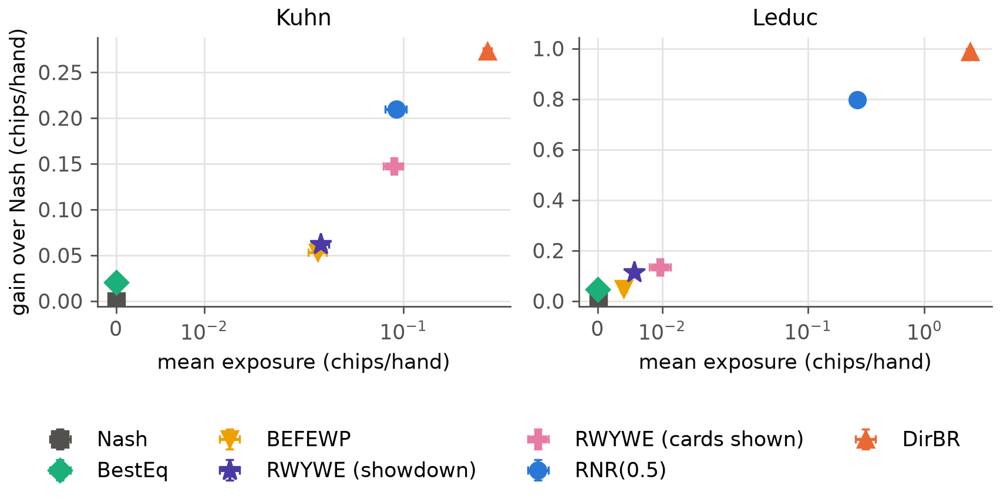
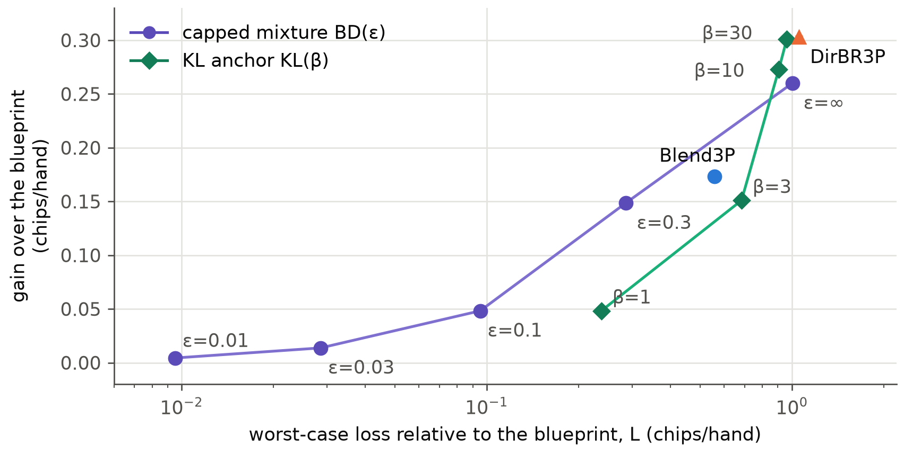
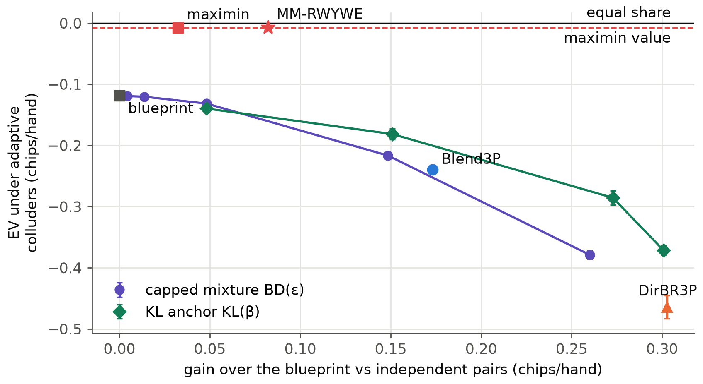

<!--
OFFICIAL PhD TITLE (keep consistent across all documents):
EN: Research on the possibilities for applying Artificial Intelligence in computer games
BG: Изследване на възможностите за приложение на изкуствения интелект в компютърни игри
-->

# Chapter 15 — Research Frontier Mapping and Contribution Design: Experiment Report

**Testbed:** two-player Kuhn and Leduc poker and three-player Kuhn poker, on Chapter 14's exact
array engine (information sets, sequences and terminals enumerated from OpenSpiel's game
definitions, validated against OpenSpiel to 10 decimals). Opponents are Chapter 14's zoos:
rule-based types, LLM-derived strategies, static specialists, switching opponents, a teaching
attacker, and — with three players — independent pairs, a fixed colluding pair and an adaptive
colluding pair. For the replication, Ganzfried and Sandholm's own opponent classes are used.

**PhD connection:** this chapter turns the fourteen preparatory chapters into the research
programme for Chapters II–IV: a frontier map, three contribution design documents, experiment
specifications and a publication pipeline (`implementation/step15/design/`). The report covers
the two feasibility pilots that were run, and condenses the designs in Part III. Pilot P1
implements Ganzfried and Sandholm's RWYWE (Risk What You've Won in Expectation), the two-player
safe-exploitation baseline that Chapter 8 lacked, and measures it with Chapter 14's joint
protocol. Pilot P2 is a first three-player run of Experiment 2.1, the central experiment of
Contribution 2: exploitation whose loss is bounded, tested against colluding opponents.

**Scope of results:** every number is measured and read from the files in
`implementation/step15/implementation/results/`: `gs_replication.json` (and
`gs_replication_notb.json`), `protocol2p_kuhn.json`, `protocol2p_leduc.json`, `maximin3p.json`
and `bounded3p.json`; the dev log is `implementation/step15/EXECUTION_NOTES.md`. Seeds are fixed
in the code. Two-player claims use 10 seeds × 2 seats (duplicate cards, Chapter 14's deck seeds);
three-player claims use 5 seeds × 3 seats; the replication uses 400 opponents per class. Intervals
are 95 % intervals. The pilots are feasibility evidence for the designs, not the contributions'
results. Where a run contradicted the prediction written before it, both are kept (WORKFLOW §0.1).

> **How to read this report.** Part I is the two-player baseline: the replication of the
> published results, then RWYWE under Chapter 14's protocol. Part II moves to three players: the
> maximin value, then three bounded-deviation rules against independent and colluding pairs.
> Part III condenses the designs. The reconciliation, trust, limitations, conclusions and
> reproduction sections close the report.

---

## Part I — THE TWO-PLAYER BASELINE

## What this chapter tests

Chapter 8 implemented safe exploitation as a per-hand floor: every strategy must guarantee at
least the game value v* in every hand. The September 2026 review found that this is only
Ganzfried and Sandholm's *baseline*, the best equilibrium against the opponent model. Their own
algorithms define safety over the whole repeated game — at least v* per hand *in expectation over
the match* — and deviate beyond equilibrium by risking only the "gifts" the opponent has already
given (Ganzfried & Sandholm 2015, Def. 4.1 and § 6). RWYWE keeps a bank k: in each hand it plays
the best response to the model among strategies whose worst case is at least v* − k, and after the
hand it adds to k what that strategy is guaranteed to have earned against the observed play,
minus v*. In an imperfect-information game the opponent's unobserved play must be assumed
adversarial: the credited value is the worst case over all opponent strategies that agree with
the observed actions (Alg. 6) and, when the opponent's card was not shown, over every card it
could have held (§ 8.2.2). The bank never falls below zero, and summing over the match gives the
guarantee: total expected payoff ≥ T·v* against any opponent.

Two questions are tested. Does this chapter's implementation reproduce the published results
(Experiment 1)? And what does RWYWE buy under Chapter 14's protocol, against the agents already
measured there (Experiment 2)?

## Experiment 1 — replication of Ganzfried and Sandholm's Table I

The setup follows G&S § 9: we are the first player of Kuhn poker (v* = −1/18); the opponent model
counts the opponent's actions with a Dirichlet prior of 5 fictitious equilibrium hands at each
information set; the opponent's card is assumed shown after every hand; 1,000-hand matches, the
same deals for every algorithm against a given opponent. G&S used 40,000 opponents per class; this
replication uses 400 (200 in the equilibrium class). One fix was needed first (Surprise 1 below):
the linear programs break ties between equally good strategies toward the blueprint.


| | random | near-equilibrium | dynamic |
|---|---|---|---|
| RWYWE | 0.332 ± 0.025 (0.364) | −0.0144 ± 0.0016 (−0.0110) | −0.0271 ± 0.0016 (−0.0204) |
| BEFEWP | 0.322 ± 0.024 (0.355) | −0.0138 ± 0.0016 (−0.0115) | −0.0272 ± 0.0017 (−0.0214) |
| BEFFE | 0.176 ± 0.010 (0.200) | −0.0150 ± 0.0016 (−0.0131) | −0.0403 ± 0.0007 (−0.0397) |
| Best equilibrium | 0.133 ± 0.008 (0.145) | −0.0177 ± 0.0015 (−0.0148) | −0.0365 ± 0.0007 (−0.0352) |
| Best response | 0.328 ± 0.025 (0.470) | +0.0395 ± 0.0048 (+0.0548) | −0.1695 ± 0.0028 (−0.1209) |

: Chips per hand for the first player, this replication (G&S 2015, Table I, in brackets). `gs_replication.json`.

The result the chapter relies on reproduces. Against the dynamic opponents all four safe
algorithms stay above v* in 400 of 400 matches, and in no hand of any match did the exposure of
the policy in force exceed the bank; the best response falls to −0.170 and below v* in every
match. The orderings reproduce: RWYWE and BEFEWP lead on random and dynamic opponents, followed
by BEFFE and the best equilibrium in G&S's order. The safe algorithms' levels sit 0.001–0.033
chips/hand below the published ones. The best-response row does not reproduce: 0.328 against
0.470 on random opponents. Three readings of the random class and a different tie-break for the
best response were tried and none closes the gap; it stays open (Surprise 2).

## Experiment 2 — RWYWE under the joint protocol

Here RWYWE uses the same opponent model as Chapter 14's adaptive agents (Chapter 7's continuous
Dirichlet model, refitted every 50 hands, cards seen only at showdown), so that the comparison
isolates the deviation rule. Two accounting variants are run: the realistic one, where the gift
accounting uses the opponent's card only when shown down, and G&S's experimental assumption, where
the card is always shown. The teaching attacker re-targets the agent's *current* policy every hand,
because RWYWE's policy changes every hand. A new readout is added to Chapter 14's: match-level
safety S, the mean over the match of EV − v*, which G&S's guarantee says is non-negative in
expectation.

| Agent | Kuhn gain | Kuhn exposure | Leduc gain | Leduc exposure | S < 0 under teaching (Kuhn / Leduc) |
|---|---:|---:|---:|---:|---|
| Nash | 0 | 0 | 0 | 0 | 0 / 0 |
| BestEq | +0.020 | 0 | +0.047 | 0 | 0 / 0 |
| BEFEWP | +0.053 ± 0.003 | 0.029 | +0.049 | 0.004 | 0 / 0 |
| RWYWE (showdown) | +0.062 ± 0.002 | 0.030 | +0.113 ± 0.001 | 0.006 | 0 / 0 |
| RWYWE (cards shown) | +0.148 ± 0.004 | 0.087 | +0.134 ± 0.001 | 0.010 | 0 / 0 |
| RNR(0.5) | +0.210 ± 0.002 | 0.090 | +0.797 ± 0.007 | 0.264 | 1 / 0 |
| DirBR | +0.273 ± 0.001 | 0.338 | +0.988 ± 0.005 | 2.461 | 21 / 31 |

: Gain over the blueprint against the sub-optimal population and mean exposure of the policy in force (chips/hand, 95 % intervals over 10 seeds), and the number of the 60 attacked matches per game in which the match-level safety S fell below zero. `protocol2p_{kuhn,leduc}.json`.



Three findings. First, RWYWE is a real improvement on Chapter 8's baseline: it earns 3.1 times
the best equilibrium's gain on Kuhn and 2.4 times on Leduc, and none of its 120 attacked matches
ends below v*. Second, the price of the guarantee is high: RNR(0.5), which has no guarantee, earns
3.4 times RWYWE's gain on Kuhn and 7 times on Leduc, and in these attacks it fell below v* in
only 1 of 120 matches, by 0.0007. The unconstrained DirBR fell below in 52 of 120. Third, the
pessimistic accounting is the bottleneck. With cards used only at showdown, RWYWE's bank after
1,000 hands of the TightPassive bait on Kuhn is 0.01 chips, and after every Leduc bait 0.01–0.02:
most gifts cannot be *proved*, because the opponent's play off the observed path must be assumed
to be a nemesis. With cards always shown, the bank reaches 8.5 chips against LooseAggr on Kuhn
and the gain doubles (+0.148), but on Leduc it rises only to +0.134. With 468 information sets per
player, almost all of the opponent's strategy lies off any one hand's path.


The teaching attack shows why the protocol needs S. Under the LooseAggr bait RWYWE banks 2.19
chips by hand 1,000 and then spends them against the attacker, which Chapter 14's per-hand
teaching-loss readout would charge to the agent as unsafe play. Over the match S stays at
+0.112 ± 0.025. The per-hand exposure is the right readout for agents with a fixed deviation rule;
for a gift-banking agent the guarantee is a property of the whole match.

---

## Part II — THREE PLAYERS

## Experiment 3 — the maximin value of three-player Kuhn

With three players there is no game value. Ganzfried and Sandholm remark that their method
"applies straightforwardly" to multiplayer games if the minimax value is replaced by the maximin
value (§ 2.3). Against colluders the relevant maximin value is the team-maxmin value: the most a
seat can guarantee when the other two may coordinate (Celli & Gatti 2018; Zhang, An & Černý 2021).
It was computed exactly with a sequence-form LP and constraint generation, using an oracle that
finds the pair's worst joint pure strategy. The oracle enumerates the unique pure plans of the
opponent with fewer of them (6,561 or 10,000) and best-responds with the other. It equals Chapter
14's enumeration to 1e-9 and is 20 times faster (4.5 ms per call).

| Seat | maximin value | cuts | blueprint, self-play | blueprint, coalition value |
|---|---:|---:|---:|---:|
| 0 | −0.0379 | 15 | −0.0269 | −0.125 |
| 1 | −0.0265 | 23 | −0.0208 | −0.106 |
| 2 | +0.0417 | 14 | +0.0477 | −0.125 |

: Team-maxmin value per seat of three-player Kuhn, with the CFR+ blueprint's self-play value and coalition value. `maximin3p.json`.

The seat-averaged maximin value is −0.0076 chips/hand, only 0.0076 below equal share (0 in this
zero-sum game). The blueprint's seat-averaged coalition value is −0.119. In this game, then,
guaranteeing the maximin value is far from the "very conservative" outcome the gap analysis
expects: each seat's maximin value is only 0.006–0.011 below the blueprint's self-play value,
while the blueprint's own coalition value lies 0.085–0.173 below it (Surprise 4).

## Experiment 4 — bounded deviation against independent and colluding pairs

Three deviation rules share Chapter 14's three-player opponent model (DirBR3P's Dirichlet counts):

- **MM-RWYWE**: G&S's gift accounting with v_mm in place of v*, and a coordinated pair in place of
  the single opponent. The credited value is the worst joint pure strategy of the pair that agrees
  with what was observed. Guarantee: total expected payoff ≥ T·v_mm against any opponents. Run with
  cards shown (G&S's assumption) and with showdown only.
- **BD(ε)**, a capped mixture: σ = (1 − λ)·blueprint + λ·(best response to the model), mixed in
  sequence form, with λ = confidence × min(1, ε/L(BR)). Here L(σ) is the most σ can fall behind
  the blueprint against *any* coordinated pair, computed exactly. By linearity L(σ) = λ·L(BR) ≤ ε:
  a per-hand bound relative to the baseline.
- **KL(β)**, a KL anchor: at each information set play blueprint(a)·exp(β·Q(a)), normalised, with
  Q the action value against the model. This is the thesis's own proposal: piKL anchors to a human
  policy (Jacob et al. 2022), not to an equilibrium. It has no bound; L is measured.

Baselines: the blueprint, the stationary maximin strategy, MM-BestEq (k fixed at 0), Chapter 14's
unbounded DirBR3P and its 50/50 behaviour blend Blend3P. Conditions: seven independent pairs, a
fixed pair playing the exact coalition best response to the blueprint, and an adaptive pair that
baits for 1,000 hands and then plays the exact coalition best response to the agent's current
policy, refreshed every 50 hands. The runner records, per hand, the agent's exact EV and the
blueprint's exact EV against the same opponent strategies, and computes L exactly for every
policy in force.

| Agent | gain, indep. pairs | worst-case L | EV, fixed colluders | EV, adaptive colluders |
|---|---:|---:|---:|---:|
| blueprint | 0 | 0 | −0.119 | −0.119 |
| DirBR3P | +0.303 ± 0.001 | 1.06 | +0.353 | −0.464 ± 0.019 |
| Blend3P | +0.173 | 0.56 | +0.117 | −0.239 |
| BD(0.1) | +0.048 ± 0.002 | 0.095 | −0.049 | −0.132 |
| BD(0.3) | +0.149 ± 0.001 | 0.285 | +0.093 | −0.217 |
| BD(∞) | +0.260 ± 0.001 | 1.00 | +0.287 | −0.379 |
| KL(3) | +0.151 ± 0.003 | 0.68 | +0.108 | −0.181 |
| KL(10) | +0.273 ± 0.003 | 0.91 | +0.330 | −0.286 ± 0.011 |
| maximin strategy | +0.032 | 0.24 | +0.003 | −0.0076 |
| MM-RWYWE (cards shown) | +0.082 ± 0.001 | 0.97 | +0.003 | −0.0070 ± 0.0008 |
| MM-RWYWE (showdown) | +0.063 ± 0.001 | 0.74 | +0.003 | −0.0071 ± 0.0006 |

: Seat-averaged chips per hand (5 seeds × 3 seats; adaptive colluders: hands 1,000–1,999). `bounded3p.json`; the full sweep (ε = 0.01, 0.03; β = 1, 30) is in the file.





The checks hold. For BD(ε) the worst-case L of every policy in force stayed ≤ ε (maximum 0.095 at
ε = 0.1, 0.285 at ε = 0.3), and the realised per-hand loss relative to the blueprint never exceeded
ε under the adaptive colluders. For the maximin-floor agents, S = mean(EV − v_mm) was non-negative
in every one of the 135 matches of each agent (minimum +0.0029 under adaptive colluders), and the
coalition value of the policy in force never fell more than 5·10⁻⁷ below its floor.

What the numbers say. MM-RWYWE exploits independent weak pairs (+0.082 over the blueprint, 27 % of
the unbounded DirBR3P's gain) and, under the adaptive colluders, earns −0.007 where the blueprint
earns −0.119 and DirBR3P −0.464. The capped mixture trades gain for its bound smoothly, roughly
half a chip of gain per chip of L (at ε = 0.3: +0.149 for L = 0.285), but the bound is relative to a
baseline that itself loses 0.119 to colluders, so its EV under adaptive colluders only gets worse
as ε grows. KL anchoring is worse than the mixture at equal L for L ≤ 0.7 and slightly better near
full deviation. On the other robustness axis it is clearly better: at similar gain KL(10) earns
−0.286 under adaptive colluders against BD(∞)'s −0.379. The two readouts, the worst case relative
to the baseline and the absolute exposure to a coalition, rank the rules differently.

---

## Part III — THE DESIGNS, CONDENSED

The full documents are in `implementation/step15/design/`. What follows is what each commits to.

### Contribution 1 — within-match opponent inference

**Gap (lit_gaps wording).** Real-time opponent modelling with a conservative fallback exists and
works in two-player games, including poker; all of it is two-player, and N-player opponent
modelling exists without any safety criterion. Open: online inference in N-player
imperfect-information games that handles strategy shifts within a match and is coupled to an
explicit safety criterion and a common evaluation protocol.

**Method.** A Dirichlet model per opponent information set with hidden cards spread by posterior
weight (Chapter 7's model, extended to two opponents in Chapter 14); a type prior learned from real
logs (Chapter 13's styles); multi-signal change detection with partial resets; and a calibrated
confidence that C2's deviation rule consumes. **Experiments** 1.1 (two- and three-player Kuhn and
Leduc, stationary, switching and teaching opponents; readouts gain, h50, r50, false alarms,
calibration) and 1.2 (online over Chapter 13's hand histories). **Evidence:** median h50 = 50
hands on Kuhn; DirBR3P +0.372 ± 0.038 chips/hand within 50 hands against independent pairs; player
re-identification 15.6 % among 834 players. **Main risk:** the two-player agents move into N players
first; the claim is then the coupling and the protocol.

### Contribution 2 — exploitation with a checked loss bound, beyond two players

**Gap (lit_gaps wording).** Safe exploitation has a mature two-player zero-sum theory. With three or
more players the existing notions are very conservative (team-maxmin) or provably unattainable
against heterogeneous opponents (equal share), KL anchoring is behavioural, and multiplayer
exploitation has no loss bound. Open (no counter-example found): exploiting sub-optimal opponents in
N-player imperfect-information games while bounding the loss relative to a baseline, and testing
that bound against colluding opponents.

**Non-claim.** No general N-player safety theorem. The contribution is empirical and in small
games; each bound is either exact by construction or checked exactly by enumeration, and estimated
with a stated budget where enumeration is impossible. Equal share is a reference line, never a
guarantee.

**Method.** Three deviation rules on one opponent model: the maximin-floor RWYWE (G&S's § 2.3
remark, with the floor taken against a coordinated pair), the capped sequence-form mixture, and the
KL-anchored response (the thesis's own proposal, measured only). **Experiments** 2.0 (done: Pilot
P1), 2.1 (three-player Kuhn, then Leduc) and 2.2 (collusion detection coupled to the deviation
budget). **Evidence:** Part I and Part II above.

### Contribution 3 — a joint evaluation protocol

**Gap (lit_gaps wording).** Evaluation is well developed along separate axes; one benchmark combines
population return and exploitability, for one two-player game. Open: a protocol that reports gain,
adaptation speed and recovery, and worst-case or coalition-aware robustness, with confidence bounds,
applied unchanged across several imperfect-information games including N-player ones.

**Method.** Chapter 14's protocol plus the match-level safety S that Pilot P1 showed is needed;
applied unchanged to two- and three-player Kuhn and Leduc; the failure modes of the gap analysis as
a detection matrix. **Experiment** 3.1. **Main risk:** "a combination of known metrics"; answered by
leading with the failures each existing metric misses.

### Experiment plan

| Experiment | Question | Testbeds | Primary readouts | Stage |
|---|---|---|---|---|
| 1.1 | within-match inference, calibrated | Kuhn, Leduc, 3P Kuhn, 3P Leduc | gain, h50, r50, false alarms, calibration | II–III |
| 1.2 | the same model on real logs | IPN hands (Playtech if available) | hands to a confident type, stability | III |
| 2.0 | two-player baseline (RWYWE) | Kuhn, Leduc | gain, exposure, S | done (P1) |
| 2.1 | N-player bounded exploitation | 3P Kuhn (exact), 3P Leduc (budgeted) | gain, L, coalition value, S vs v_mm | II–III |
| 2.2 | coalition-aware response | 3P Kuhn, 3P Leduc with colluders | loss to colluders, detection delay, false flags | III |
| 3.1 | cross-game protocol validation | four games | rank stability, failure-mode matrix | III–IV |

### Publication pipeline

| # | Paper | Contribution → chapter | Venue (deadline) |
|---|---|---|---|
| 1 | the joint protocol, with RWYWE's match-level safety | C3 → IV | IEEE CoG 2027 (1 Mar 2027); AAMAS 2027 (8 Oct 2026) as a stretch |
| 2 | Chapter 13's hand-history pipeline | C1 data + fair play → III | IEEE Transactions on Games (06.2027) |
| 3 | safe exploitation beyond two players | C2 → II | IJCAI-ECAI 2027 (est. Jan 2027) or AAMAS 2028 (est. Oct 2027) |
| 4 | within-match N-player inference | C1 → III | NeurIPS 2027 (est. May 2027) or AAAI-28 (est. Aug 2027) |
| 5 | coalition-aware exploitation | C2 × C1 → III–IV | AAMAS 2028 or IEEE CoG 2028 (est.) |
| 6 | cross-game protocol (journal) | C3 → IV | JAIR / TMLR / IEEE ToG (06–08.2028) |

The first publication is Paper 1: it is the yardstick every later paper uses, its results are
exact and complete, and it carries the thesis's framing; Chapter 13's paper gains from waiting for
the Playtech data decision.

---

## Prediction ↔ reality reconciliation

Predictions written in `design/experiments.md` before the runs are kept as written.

- **H2.1a (cap holds; ≥ 25 % of DirBR3P's gain at ε = 0.1).** The cap held in every hand. The gain
  at ε = 0.1 was 16 %; the 25 % mark is passed only between ε = 0.1 and 0.3 (49 % at 0.3). The
  exact bound is cheap to enforce; it is the *size* of L(BR), about 0.6 chips/hand, that makes a
  small ε buy little.
- **H2.1b (maximin floor: S ≥ 0 everywhere; more gain than the maximin strategy).** Both held.
- **H2.1c (KL better than the mixture at equal L).** Did not hold for L ≤ 0.7. KL anchoring
  changes behaviour at every information set a little, and the enumeration finds a pair that
  exploits exactly those changes, while the mixture keeps the blueprint in full with probability
  1 − λ. What KL does better is absolute coalition exposure, a readout the hypothesis did not name.
- **G&S's "aggressive safe exploitation significantly outperforms best equilibrium".** Holds on
  both games (3.1× and 2.4× the gain).
- **Surprise 1 — LP ties.** The first replication values against near-equilibrium opponents were
  0.01 below the paper's. The solver was right (with the true opponent as the model the best
  equilibrium earns −0.0112). Against an equilibrium-like model every equilibrium is optimal, and
  HiGHS returned the one that never bluffs the Jack and never bets the King (−0.034 against these
  opponents, the blueprint −0.019). A second LP stage now picks, among optimal solutions, the one
  closest to the blueprint. Without it the safe algorithms lose a further 0.002–0.046
  (`gs_replication_notb.json`).
- **Surprise 2 — the best-response row (open).** Discussed in Experiment 1. Our greedy learner
  best-responds to its model and never visits some opponent information sets, which keep their
  prior; G&S do not say how theirs avoided this.
- **Surprise 4 — team-maxmin not "very conservative" here.** Expected a large gap to equal share;
  found 0.0076. One small game; the claim is not generalised and the gap wording is unchanged.

## Trustworthiness and sample adequacy

Every exact quantity has an independent check. The gift accounting with nothing forced equals
Chapter 14's worst case; with a hidden card it is never above the observed-card value (300 hands).
The coalition oracle equals Chapter 14's enumeration to 1e-9. The maximin LP bound equals the
oracle's value. Chapter 14's agents reproduce their published gains in this harness exactly.
Two-player gains are policy-exact, so the intervals (≤ 0.007) reflect only the learning
trajectories. The three-player pilot has 5 seeds × 3 seats; its differences between rules are
many intervals wide, but the colluder conditions (one fixed pair, one adaptive schedule) are
narrow. The replication's 400 opponents per class give intervals of ±0.025 on the random class,
too wide to separate RWYWE from BEFEWP.

## Limitations (ranked by how much they affect the conclusions)

1. **Toy games.** Exact worst cases exist only because three-player Kuhn is tiny. At scale, L and
   the coalition value must come from learned exploiters, which are lower bounds.
2. **One opponent model and one schedule** (Chapter 14's, refit every 50 hands, no forgetting).
   The poor recovery after switches is partly the model's.
3. **The adaptive colluders are one strong but specific attacker** (exact coalition best
   response every 50 hands after a TightPassive bait), not the worst adaptive coalition.
4. **The replication is partial**: the best-response row differs, and 400 opponents per class
   give intervals about 60 times wider than G&S's 40,000.
5. **The two-player RWYWE in Leduc banked almost nothing** with the realistic accounting, so its
   Leduc result says more about the pessimism of the accounting than about exploitation.

## Conclusions and research directions

- RWYWE is the two-player C2 baseline: safe over the match in every attacked match, 2.4–3.1 times
  the best equilibrium's gain, but 14–30 % of RNR(0.5)'s.
- The match-level safety readout S belongs in C3's protocol: per-hand readouts misjudge
  gift-banking agents.
- With three players, G&S's construction with a coordinated-pair maximin floor runs, holds its
  guarantee against fixed and adaptive colluders in every match, and still exploits independent
  weak pairs. The exact per-hand cap relative to the blueprint also holds.
- Next (Stage II): within-hand gift detection and a less pessimistic off-path assumption, to
  make gifts provable more often; three-player Leduc with a learned coalition exploiter
  calibrated on three-player Kuhn; the coalition-aware response of Experiment 2.2.

## Reproduction

```bash
cd implementation/step15/implementation            # repo .venv active
python run_gs_table.py                             # P0 replication (~39 min, 14 processes)
python run_gs_table.py --no-tiebreak               # P0 without the LP tie-break (~14 min)
python run_protocol2p.py --game kuhn               # P1 Kuhn (~3 min)
python run_protocol2p.py --game leduc --tol 0.01 --agents Nash BestEq "RNR(0.5)" DirBR RWYWE RWYWE-rev BEFEWP
                                                   # P1 Leduc (~25 min)
python maximin3p.py                                # P2a (7 s)
python run_bounded3p.py                            # P2b (~32 min)
python plot_pilots.py                              # figures from the JSON only
```
