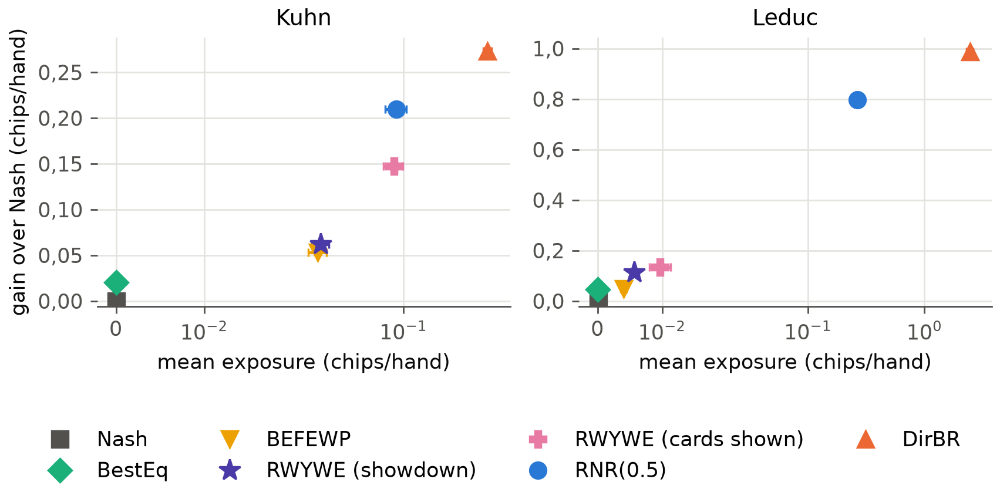
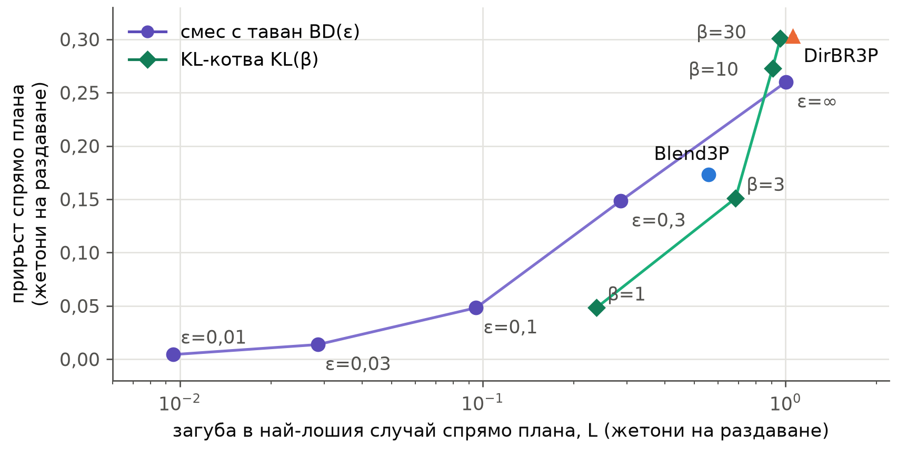

<!--
OFFICIAL PhD TITLE (keep consistent across all documents):
EN: Research on the possibilities for applying Artificial Intelligence in computer games
BG: Изследване на възможностите за приложение на изкуствения интелект в компютърни игри
-->
---
title: "Глава 15 Обобщение – Картографиране на изследователската граница и проектиране на приносите"
subtitle: "Изследване на възможностите за приложение на изкуствения интелект в компютърни игри"
author: "Alexander Andreev"
date: "September 2026"
lang: bg
vars:
  research_focus: "Adaptive Strategy Learning in Multi-Agent Imperfect-Information Environments"
---

# Глава 15 – Картографиране на изследователската граница и проектиране на приносите

Четиринадесетте глави дотук изградиха инструментариум: изчисляване на равновесия, модели на противника, безопасна експлоатация, многоагентна динамика, коалиции, модели на последователности, реални истории на раздаванията и оценяване на адаптивни агенти. Тази глава превръща инструментариума в изследователска програма. За всеки от трите замислени приноса тя задава пет въпроса: какво вече съществува, какво точно остава отворено, какво ще направи дисертацията, какви доказателства вече показват, че това е осъществимо, и какво може да се обърка. Отговорите се превръщат в проектни документи, спецификации на експериментите и публикационен план. Написана е така, че да може да се чете самостоятелно.

Само планирането би оставило централния принос непроверен, затова главата провежда и два пилотни експеримента за осъществимост. Първият реализира алгоритъма за безопасна експлоатация RWYWE на Ganzfried и Sandholm[^gs2015], проверява го спрямо публикуваните им резултати и го измерва с протокола за оценяване от Глава 14; това е базовият метод за двама играчи, който липсваше в Глава 8. Вторият е първо изпълнение с трима играчи на централния експеримент на дисертацията: експлоатация с ограничена загуба, изпитана срещу противници в тайно съглашение (colluding opponents). **Всички експериментални числа са измерени** при възпроизводими изпълнения с поне пет начални числа и навсякъде, където играта позволява, са точни. Те са доказателства за осъществимостта на проектите, а не резултатите на приносите. Когато някое изпълнение противоречи на очакванията ми, очакването е запазено и съпоставено с действителния резултат.

**Къде се вписва това в дисертацията.** Тази глава завършва подготвителната програма и открива глави II–IV. Тя запазва целта, изследователските въпроси и тезата, формулирани за Глава I, раздел 1.7, и посочва къде ги прецизира. Формулировките на пропуските следват проверката на литературата от септември 2026 г., която стесни два от трите приноса. Моделирането на противника в реално време вече работи в игри за двама играчи[^gscu][^stratformer], а един еталонен тест вече съчетава възвръщаемостта и експлоатируемостта, за една-единствена игра[^rrps]. В основата си отворен остава само вторият принос: експлоатация с проверена граница на загубата при повече от двама играчи.

---

## От учебна към изследователска програма

Картата на изследователската граница (frontier map) е преглед на вече заетата територия. Планът за обучение от април 2026 г. начерта такава карта по памет, а проверката от септември установи, че близо до две от трите ѝ знамена вече има чужди работи. Първият пропуск в плана, „няма обединена рамка откриване → адаптация“, се опровергава от GSCU. GSCU поддържа апостериорно разпределение върху противника, превключва между алчна и консервативна стратегия с гаранция за съжалението и е изпитан в Кун покер срещу противници, които сменят стратегията си[^gscu]. Съвременни покер агенти за двама играчи също моделират и експлоатират противниците си, като остават близо до равновесието[^stratformer][^alphaexploitem]. Третият пропуск в плана, „нито една рамка не съчетава експлоатируемост и класиране“, се опровергава от еталонния тест с повтаряща се игра „камък-ножица-хартия“, който оценява заедно възвръщаемостта срещу популацията и експлоатируемостта[^rrps]. Вторият пропуск остава, но две от твърденията, на които се опираше, бяха погрешни. Равният дял (equal share) – справедливата част на всеки играч от общото – не е гарантиран минимум: доказано е, че той не може да бъде осигурен срещу противници, които играят различни стратегии[^equalshare]. А piKL закотвя играта към *човешка* стратегия, научена чрез подражание, а не към равновесие[^pikl][^dilpikl]. Няколко цитата също бяха погрешни; папката с проектните документи изброява всяка корекция.

Картата определя нивото, на което всеки принос може да бъде заявен. Тя също така прецизира изследователските въпроси на Глава I (RQ1–RQ3), без да променя предмета им. RQ1 вече изисква извеждането (inference) да бъде *калибрирано*, защото вторият принос определя размера на отклонението си според увереността на модела. RQ2 вече назовава два вида граница: относителна спрямо базова линия и абсолютна срещу координирана двойка. RQ3 вече изисква безопасност както за всяко раздаване, така и за целия мач. Тезата остава в сила. Нейната „предварително определена, емпирично проверена граница“ вече има точен смисъл. В малките игри границата е или точна по конструкция, или проверена чрез пълно изброяване; в по-големите тя се оценява с посочен бюджет.

---

## Принос №1 – извеждане на стратегията на противника в хода на мача

**Какво съществува.** Онлайн байесовото моделиране на противника и моделирането в контекста (in-context) с консервативен резервен вариант работят в игри за двама играчи, включително в покера[^gscu][^stratformer][^alphaexploitem]. Модели на противника са вграждани в търсене на равновесие с ограничена дълбочина, като моделът е зададен предварително[^milec2025]. Моделиране на противника при N играчи съществува: в Кун покер с трима играчи то побеждава равновесните стратегии, но не е съпроводено с критерий за безопасност[^ganzfried2024].

**Какво остава отворено.** Онлайн извеждане в игри с непълна информация с N играчи, което се справя със смени на стратегията *в рамките на* мача и е свързано с изричен критерий за безопасност и с общ протокол за оценяване. Затова Принос №1 не претендира за самия цикъл откриване–адаптация. Той претендира за разширяването на цикъла към повече играчи и към смени в рамките на мача, както и за свързването му с приносите №2 и №3.

**Подходът на дисертацията.** Модел на Дирихле за всяко информационно множество на противника, при който скритите карти се разпределят между възможните карти според апостериорното им тегло. Глава 7 го изгради за един противник, а Глава 14 го разшири за двама. Априорно разпределение върху типовете, научено от реални истории на раздаванията, с помощта на стиловете от Глава 13. Откриване на промени, което съчетава няколко сигнала и забравя старите данни частично, а не наведнъж, защото Глава 14 установи, че детектор, настроен върху Кун, се задейства срещу стационарни противници в Ледюк. Мярка за увереност, която вторият принос използва, за да определи размера на отклонението си, с измерена калибровка.

**Доказателства за осъществимост.** В Кун всеки адаптивен агент достигна половината от постижимия приръст (gain) при първото си преизчисляване (медиана 50 раздавания). След смяна на стратегията на противника по средата на мача възстановяването варираше от 50 раздавания до никога, в зависимост от конструкцията на агента (Глава 14). Моделът за трима играчи постига приръст +0,37 ± 0,04 жетона на раздаване спрямо плана (blueprint) срещу независими двойки в рамките на 50 раздавания (Глава 14). Реалните записи съдържат информацията, от която моделът се нуждае: вграждане (embedding) разпознава играч в невиждани дни в 15,6 % от случаите сред 834 играчи (при 0,12 % случайно), а 66 % от играчите достигат уверена онлайн оценка на типа в рамките на 500 раздавания (Глава 13).

**Основен риск.** Възможно е методите за двама играчи да бъдат разширени до N играчи преди дисертацията. Мярката срещу това е оценяването при N играчи, в рамките на мача и свързано с безопасността, да бъде публикувано през 2027 г., като се претендира само за свързването и за протокола.

---

## Принос №2 – експлоатация с проверена граница на загубата при повече от двама играчи

**Какво съществува.** Безопасната експлоатация има зряла теория за двама играчи. Тя стига от ограничените отговори по Наш (restricted Nash responses)[^johanson2007] и основаната на подаръци безопасност на Ganzfried и Sandholm[^gs2015] до безопасността на адаптацията в OX-Search[^oxsearch] и, съвсем наскоро, до сертифицирани гаранции за всяко отделно прилагане[^lihuang2026]. Всеки от тези резултати се опира на минимаксната стойност на играта за двама. При трима или повече играчи понятия за безопасност съществуват, но са трудни за използване. Отборните максиминни стойности (team-maxmin) гарантират печалба срещу координирана коалиция[^celli2018]; проверката от септември ги определи като много консервативни. Доказано е, че равният дял е непостижим срещу разнородни противници[^equalshare]. Съжалението спрямо базова линия (baseline-relative regret) ограничава загубата спрямо еталон за сравнение, а не в най-лошия случай[^mueller2025]. Експлоатация в покер с трима играчи е демонстрирана без никаква граница на загубата[^ganzfried2024]. Играта с KL-регуларизация в Diplomacy за седем играчи се закотвя към човешкото поведение, за съвместимост[^dilpikl].

**Какво остава отворено (не е намерен контрапример).** Експлоатацията на неоптимални противници в игри с непълна информация с N играчи при ограничаване на загубата спрямо базова линия и изпитването на тази граница срещу противници в тайно съглашение.

**Какво не се твърди.** Принос №2 не претендира за обща теорема за безопасност при N играчи. Той е емпиричен и работи в малки игри. Всяка граница, която използва, е или точна по конструкция, или точно проверена чрез изброяване, а в по-големите игри ще бъде оценявана с посочен бюджет. Равният дял е референтна линия във фигурите му, никога гаранция: двойката съучастници (colluders) е точно онзи разнороден случай, в който равният дял не може да бъде осигурен.

**Подходът на дисертацията.** Три правила за отклонение върху един и същ модел на противника, всяко изпитано точно в Кун покер с трима играчи:

1. **Резерв (bank) с максиминен праг.** Ganzfried и Sandholm отбелязват, че методът им „се прилага непосредствено“ към игри с много играчи, ако минимаксната стойност се замени с максиминната[^gs2015]. Дисертацията конкретизира тази бележка, като максиминната стойност се взема срещу *координирана* двойка: отборната максиминна стойност. Идеята е тяхна; приносът е прагът срещу координирана двойка, точните проверки и изпитанията срещу съучастници.
2. **Смес с таван (capped mixture).** Агентът смесва плана и най-добрия отговор на своя модел в пропорции, които държат загубата му в най-лошия случай спрямо плана под ε във всяко раздаване. Загубата се взема по всички двойки противници, включително двойките съучастници.
3. **KL-котва (KL anchor).** Играта остава близо до плана в смисъла на KL, като силата на привличането се определя от увереността на модела. Това е собствено предложение на дисертацията, а не piKL. То няма априорна граница, затова загубата му само се измерва.

Двата вида граница отговарят на различни въпроси и една аналогия помага да бъдат разграничени. Търговец, който обещава „никога да не завърши годината под фиксиран праг, каквото и да прави пазарът“, дава абсолютна граница. Това е резервът с максиминен праг: при трима играчи прагът е това, което мястото може да си гарантира, дори ако другите двама действат като един. Търговец, който обещава „никога да не се представи много по-зле, отколкото би се представил индексният фонд на същия пазар“, дава относителна граница. Това е сместа с таван, в която планът играе ролята на индексния фонд. Относителното обещание е лесно за спазване и лесно за проверка, но струва само колкото индекса: ако самият план бъде ограбен от съучастници, това, че агентът остава близо до него, е слаба утеха. Абсолютното обещание изисква максиминната стойност, която проверката от септември определи като много консервативна. Пилотният експеримент 2 измерва и двете.

**Доказателства за осъществимост.** Двата пилотни експеримента по-долу. **Основни рискове.** Точните проверки не се мащабират отвъд миниатюрните игри, затова Ледюк с трима играчи ще изисква научен коалиционен експлоататор, калибриран спрямо точните стойности на Кун покер с трима играчи. Самата базова линия не е безопасна срещу съучастници: планът губи 0,119 жетона на раздаване срещу фиксирана двойка (Глава 14). Затова всеки резултат се докладва както спрямо плана, така и в абсолютни стойности.

---

## Принос №3 – обединен протокол за оценяване

**Какво съществува.** Оценяването е добре развито по отделни оси: експлоатируемост в най-лошия случай и научените ѝ приближения, оценки от преки срещи с намалена дисперсия, популационни рейтинги и обобщаване към нови съиграчи (Глава 14 ги разглежда). Един еталонен тест съчетава възвръщаемостта срещу популацията с експлоатируемостта, за една игра за двама играчи[^rrps].

**Какво остава отворено.** Протокол, който докладва приръста, скоростта на адаптация и възстановяването, както и устойчивостта в най-лошия случай или с отчитане на коалициите, с доверителни граници, приложен без промени в няколко игри с непълна информация, включително игри с N играчи. Твърдението е формулирано като „съществуващото оценяване се проваля в тези условия, а протоколът улавя това, което то пропуска“, а никога като нов инструментариум.

**Подходът на дисертацията.** Протоколът от Глава 14, който докладва заедно приръста, скоростта и възстановяването, експозицията (exposure) или стойността срещу коалиция (coalition value), загубата от обучаващата атака (teaching loss) и статистическата увереност. Тази глава добавя един показател – безопасността на ниво мач (match-level safety) S: средното за мача на очакваната печалба на агента минус референтната му стойност за безопасност. Това е определението за безопасност на Ganzfried и Sandholm, а пилотният експеримент 1 показва защо само показателите за отделното раздаване преценяват погрешно агент, който натрупва печалбите си в резерв.

**Как се съчетават трите.** Принос №1 превръща наблюденията в модел *и* в мярка за увереност. Принос №2 решава доколко тази увереност може да отдалечи агента от безопасната му базова линия при посочена граница. Принос №3 измерва заедно приръста, скоростта, възстановяването и загубата, което е единственият начин приносите №1 и №2 изобщо да бъдат заявени. Версиите за двама играчи (глави 7, 8 и 14 и RWYWE в тази глава) са опорните точки, с които се сравнява всеки резултат при N играчи. Нишката на честната игра от Глава 13 – откриването на тайни съглашения и на ботове – влиза в Принос №2 като отговора с отчитане на коалициите от Експеримент 2.2, а в Принос №3 – като показателите за коалициите.

**Доказателства за осъществимост.** Глава 14 възпроизведе осем от деветте режима на отказ на съществуващото оценяване в Кун, Ледюк и Кун с трима играчи. Например класиранията по Ело и по експлоатируемост корелират само с 0,36 в Ледюк. Експлоататорът за трима играчи, който е първи по Ело и по усредняване по Наш, губи 0,47 жетона на раздаване срещу адаптивна коалиция. **Основен риск.** Рецензентите може да го определят като комбинация от известни метрики. Отговорът е изложението да започва с провалите, които всяка от съществуващите метрики пропуска.

---

## Пилотен експеримент 1 – RWYWE, базовият метод за двама играчи

Глава 8 налагаше прага си на безопасност на всяко раздаване: стратегията трябва да гарантира стойността на играта v* във всяко отделно раздаване. Прегледът от септември установи, че това е само базовият вариант на Ganzfried и Sandholm – *най-доброто равновесие* срещу модела на противника. Техните алгоритми определят безопасността за повтарящата се игра – като поне v* на раздаване средно за мача (по математическо очакване) – и се отклоняват извън равновесието, като рискуват само подаръците (gifts), които противникът вече е направил[^gs2015]. RWYWE (Risk What You've Won in Expectation – „рискувай средно спечеленото дотук“) поддържа резерв k. Той играе най-добрия отговор на своя модел измежду стратегиите, чиято стойност в най-лошия случай е поне v* − k. След всяко раздаване той зачита най-малкото, което тази стратегия би могла да спечели срещу която и да е игра на противника, съвместима с наблюдаваното, и добавя към резерва тази зачетена стойност минус v*. В покера играта на противника извън наблюдавания път, както и картата му, когато не е разкрита, трябва да се приемат за враждебни[^gs2015]. Резервът никога не става отрицателен, а сумирането по раздаванията дава гаранцията: общата очаквана печалба е ≥ T·v* срещу всеки противник.

**Възпроизвежда ли реализацията статията?** Експериментът от статията с Кун беше повторен с 400 противници на клас вместо 40 000. Резултатът за безопасността се възпроизвежда точно. Срещу динамичните противници, които играят случайно 100 раздавания, а след това на всяко раздаване играят най-добър отговор на текущата стратегия на агента, и четирите безопасни алгоритъма остават над v* в 400 от 400 мача. В нито едно раздаване от нито един мач рискът на действащата стратегия не надхвърли резерва. Най-добрият отговор срещу модела пада до −0,170 при v* = −0,056. Подредбите също се възпроизвеждат. Нивата на безопасните алгоритми са с 0,001–0,033 жетона на раздаване под публикуваните (RWYWE 0,332 срещу 0,364 при случайните противници). Редът за най-добрия отговор не се възпроизвежда: 0,328 срещу 0,470. Бяха изпробвани три тълкувания на „случайните“ противници от статията и нито едно не затваря разликата, която остава отворен въпрос.

Възпроизвеждането улови и един фин дефект. Срещу модел, който изглежда като равновесие, всички равновесни стратегии са еднакво добри и решавачът на LP-задачата върна онази, която никога не блъфира с вале и никога не залага с поп. Тази стратегия е слаба срещу противници, които се отклоняват леко. Тя получи −0,034 срещу класа, близък до равновесието, където планът получава −0,019. Втори етап на LP-задачата вече решава равенствата в полза на плана; без него безопасните алгоритми губят още 0,002–0,046 жетона на раздаване. Агентът с най-доброто равновесие от Глава 14 използва същата LP-задача без правило при равенство; решавачът от Глава 8 не беше проверен.

**Какво печели RWYWE по обединения протокол?** RWYWE беше изпълнен редом с агентите от Глава 14, със същия модел на противника, срещу същите популации, противници, които сменят стратегията си, и обучаващи атаки, при 10 начални числа и на двете места. В единия вариант отчитането на подаръците използва картата на противника само когато тя бъде разкрита; в другия, съгласно предпоставката на статията, картата винаги е открита.

RWYWE е истинско подобрение спрямо базовия вариант от Глава 8. Приръстът му спрямо плана е +0,062 ± 0,002 жетона на раздаване в Кун и +0,113 ± 0,001 в Ледюк – 3,1 и 2,4 пъти приръста на най-доброто равновесие (+0,020 и +0,047), – и нито един от 120-те му мача при атака не завършва под v*. Гаранцията обаче е скъпа. Ограниченият отговор по Наш RNR(0,5), който няма гаранция, постига +0,210 в Кун и +0,797 в Ледюк. При тези конкретни атаки той падна под v* само в 1 мач от 120, и то с 0,0007. Неограниченият агент с най-добър отговор DirBR падна под v* в 52 от 120.

Ограничаващият фактор е песимизмът на отчитането. Когато картите се използват само при разкриване, резервът на RWYWE след 1 000 раздавания с примамка беше 0,01 жетона срещу примамката TightPassive в Кун и 0,01–0,02 срещу всяка примамка в Ледюк. Повечето подаръци не могат да бъдат *доказани*, защото всичко, което противникът не е направил видимо, трябва да се приеме за възможно най-неблагоприятно. Когато картите винаги са открити, резервът достига 8,5 жетона срещу LooseAggr в Кун и приръстът се увеличава повече от двойно – до +0,148. В Ледюк той се покачва само до +0,134: при 468 информационни множества на играч почти цялата стратегия на противника лежи извън пътя на всяко отделно раздаване. Откриването на подаръци в рамките на раздаването, което статията описва, но не изпитва[^gs2015], е очевидната следваща стъпка.

Обучаващата атака разкрива и пропуск в протокола. При примамката LooseAggr RWYWE натрупа в резерва 2,19 жетона до раздаване 1 000 и ги изразходва срещу нападателя за около сто раздавания. Показателят от Глава 14 за загубата от обучаващата атака по раздавания записва това изразходване в тежест на агента, сякаш е небезопасна игра. Въпреки това за целия мач RWYWE остава над v*, със S = +0,112 ± 0,025. Експозицията по раздавания е правилният показател за агенти с фиксирано правило за отклонение; за агент, който натрупва печалбите си в резерв, безопасността е свойство на целия мач. Затова Принос №3 вече докладва и S.

---

## Пилотен експеримент 2 – трима играчи, координирана двойка и два вида граница

При трима играчи няма стойност на играта, затова референтната стойност за безопасност трябва да бъде избрана. Пилотният експеримент изпробва и двата вида, назовани в RQ2.

**Абсолютната референтна стойност: отборната максиминна стойност.** Максиминната стойност на всяко място в Кун покер с трима играчи срещу координирана двойка беше изчислена точно: задача на линейното програмиране върху стратегиите на мястото плюс предсказвач, който намира най-лошия съвместен чист отговор на двойката. Предсказвачът изброява различните чисти стратегии на единия противник (най-много 10 000), а другият противник играе най-добър отговор. Той съвпада с изброяването от Глава 14 с точност до 10⁻⁹ и работи около 20 пъти по-бързо. Стойностите за местата са −0,038, −0,027 и +0,042, средно по местата −0,0076 жетона на раздаване. Това е само с 0,0076 под равния дял (нула, тъй като играта е с нулева сума). Собствената стойност на плана срещу коалиция е средно −0,119. Очаквах „много консервативната“ разлика, която описва проверката на литературата. В тази игра тя липсва: максиминната стойност на всяко място е в рамките на 0,006–0,011 от стойността на плана при игра срещу себе си. Констатацията обхваща една миниатюрна игра и не променя нищо във формулировката на пропуска.

**Четири семейства агенти** играха срещу седем независими двойки противници, срещу фиксирана двойка съучастници (точния коалиционен най-добър отговор на плана) и срещу адаптивна двойка съучастници. Адаптивната двойка примамва в продължение на 1 000 раздавания, след което играе точния коалиционен най-добър отговор на *текущата* стратегия на агента, преизчисляван на всеки 50 раздавания. Семействата бяха:

- **RWYWE с максиминен праг**: резервът с отборната максиминна стойност като референтна стойност, който зачита най-лошата съвместна игра на двойката, съвместима с видяното.
- **Сместа с таван BD(ε)**, за ε от 0,01 до неограничено.
- **KL-котвата KL(β)**, за β от 1 до 30.
- **Базови методи**: планът, стационарната максиминна стратегия и неограниченият експлоататор DirBR3P от Глава 14.

За всяко раздаване изпълняващата програма записваше точната очаквана печалба на агента, точната печалба на плана срещу същите стратегии на противниците и загубата в най-лошия случай спрямо плана на всяка действаща стратегия. Пет начални числа, и трите места.

**Всяка граница се удържа при точна проверка.** При сместа с таван загубата в най-лошия случай на всяка действаща стратегия остана равна на ε или под нея, например 0,095 при ε = 0,1. Реализираната загуба в раздаване спрямо плана никога не надхвърли ε при адаптивните съучастници. При агента с максиминен праг безопасността на ниво мач спрямо максиминната стойност беше неотрицателна и в 135-те мача (минимум +0,003 при адаптивните съучастници). Стойността срещу коалиция на стратегията му никога не падна с повече от 5·10⁻⁷ под прага.

**Какво печелят границите.** Сместа с таван разменя около половин жетон приръст за всеки жетон допустима загуба до ε = 0,3: +0,048 при ε = 0,1 и +0,149 при ε = 0,3, срещу +0,303 за неограничения експлоататор. Предварително записаната надежда за 25 % от неограничения приръст при ε = 0,1 не се сбъдна (16 %). Причината е, че най-добрият отговор на модела може да загуби около 0,6 жетона на раздаване спрямо плана, така че малкият таван позволява само малка стъпка към него. KL-котвата беше по-лоша от сместа при равна загуба в най-лошия случай до около 0,7 и малко по-добра близо до пълното отклонение, което също противоречи на хипотезата за нея.

Втората фигура променя картината. Измерена по това, което адаптивна коалиция действително отнема, KL-котвата е по-доброто от двете относителни правила. При сходен приръст KL(10) запазва −0,286 жетона на раздаване при адаптивните съучастници, докато сместа без таван запазва −0,379, а DirBR3P запазва −0,464. Двата показателя за устойчивост – загубата в най-лошия случай спрямо базова линия и абсолютната експозиция спрямо коалиция – подреждат правилата различно. Затова протоколът на Принос №3 трябва да докладва и двата. А относителните граници имат обща слабост: те са толкова добри, колкото е базовата линия, а самият план губи 0,119 срещу съучастници. Абсолютното семейство няма такъв проблем. Агентът с максиминен праг постига приръст +0,082 спрямо плана срещу независими двойки (+0,063 при отчитане само при разкриване на картите) – 27 % от приръста на неограничения експлоататор. При адаптивните съучастници той запазва −0,007, в рамките на 0,007 от равния дял, докато планът получава −0,119.

**Какво пилотният експеримент не показва.** Той не показва нищо извън една миниатюрна игра. Точните проверки разчитат на изброяване, което не се мащабира. Началните числа са пет, моделът на противника е един, адаптивният нападател – също един. Единствената участваща гаранция е аргументът на Ganzfried и Sandholm, пренесен към координирана двойка. Това, което той показва, е, че резултатът, към който се стреми Принос №2, може да бъде получен и проверен: експлоатация на слаби противници с критерий за загубата, проверен точно срещу противници в тайно съглашение.

---

## Експерименталната програма и публикационният план

Шест експеримента пренасят приносите в глави II–IV. Всеки е специфициран в папката с проектните документи с хипотези, независими и зависими променливи, протокол, критерии за успех и статистически методи.

| Експеримент | Въпрос | Тестови среди | Етап |
|---|---|---|---|
| 1.1 | извеждане в рамките на мача, калибрирано | Кун, Ледюк, Кун за трима, Ледюк за трима | II–III |
| 1.2 | същият модел върху реални истории на раздаванията | публични раздавания от iPoker (Playtech, ако са налични) | III |
| 2.0 | базов метод за двама играчи (RWYWE) | Кун, Ледюк | изпълнен (пилотен експеримент 1) |
| 2.1 | ограничена експлоатация при N играчи | Кун за трима (точно), Ледюк за трима (с бюджет) | II–III |
| 2.2 | отговор на съучастници с отчитане на коалициите | Кун за трима, Ледюк за трима | III |
| 3.1 | протоколът в различни игри | четири игри | III–IV |

: Експерименталната програма (спецификациите са в `implementation/step15/design/experiments.md`).

Експеримент 2.2 заменя експеримента със So Long Sucker от плана за обучение. Глава 14 измери, че предварително зададен съюз струва на наблюдавания базов агент в So Long Sucker само 0,8–1,9 процентни пункта от дела на победите, а Глава 11 установи, че около 99,5 % от случайните игри в този двигател завършват с пат. Там един съюз има малко възможности за действие.

Индивидуалният план за обучение изисква статия в края на всеки етап. Публикационният план разпределя шест статии върху глави II–IV. Първата е обединеният протокол за оценяване от Глава 14, с резултата за RWYWE от тази глава като случая, който налага безопасност на ниво мач. В нейна полза са четири причини. Тя е мерилото, което използва всяка следваща статия. Резултатите ѝ са точни и завършени, без риск, свързан с достъпа до данни. Тя носи рамката на дисертацията. А статията за историите на раздаванията от Глава 13 печели, ако изчака решението за данните на Playtech. Целта е IEEE Conference on Games 2027, със срок за пълни статии 1 март 2027 г. Основната секция на AAMAS 2027, със срок 8 октомври 2026 г., е амбициозен вариант само ако до края на септември има пълна чернова, тъй като Глава I трябва да бъде завършена през същите седмици. Статията се побира в осем страници: режимите на отказ на съществуващото оценяване; протоколът и точният му двигател; резултатите в Кун и Ледюк, включително безопасността на RWYWE на ниво мач; показателите за коалициите при трима играчи с максиминната стойност като референтна линия; и границите на точното оценяване в голям мащаб. Основната статия за безопасността при повече от двама играчи следва Експеримент 2.1 през 2027 г. Останалите четири обхващат конвейера за обработка на историите на раздаванията от Глава 13, извеждането в рамките на мача, експлоатацията с отчитане на коалициите и журнална версия на протокола за различни игри.

---

## Честни бележки, ограничения и връзка със следващите глави

**Какво се потвърди.** Възпроизвеждането потвърждава централния резултат на Ganzfried и Sandholm: техните безопасни алгоритми остават безопасни срещу противник, който на всяко раздаване играе най-добър отговор, а най-добрият отговор – не. Всяка граница в пилотния експеримент с трима играчи беше проверена точно и се удържа във всяко раздаване или мач. Коалиционният предсказвач, максиминната задача и отчитането на подаръците съвпадат всеки със свой независим еталон. Агентите от Глава 14 възпроизвеждат публикуваните си приръсти в изпитателната среда на тази глава.

**Какво не се получи и защо това е важно.** Три прогнози не се потвърдиха и са запазени във вида, в който са формулирани. Сместа с таван не достигна една четвърт от неограничения приръст при ε = 0,1. KL-котвата не надмина сместа при равна загуба в най-лошия случай. Отборната максиминна стойност не се оказа много консервативна в Кун покер с трима играчи. Едно несъответствие остава неизяснено: редът за най-добрия отговор във възпроизвеждането. Две неща бяха уловени от проверки, а не случайно: дефектът с равенствата в LP-задачата и изродена стена на LP-задачата, върху която максиминната задача зацикляше, докато не беше добавено допустимо отклонение при приемането.

**Ограничения.** Това са опростени (учебни) игри, а точните най-лоши случаи съществуват само защото игрите са миниатюрни. Моделът на противника и графиците на атаките са тези от Глава 14. Пилотният експеримент с трима играчи има пет начални числа и една адаптивна коалиция. При реалистичното отчитане резервът на RWYWE в Ледюк остана близо до нула, така че резултатът му в Ледюк измерва по-скоро песимизма на отчитането, отколкото експлоатацията. Датите на конференциите, отбелязани като оценки, трябва да бъдат потвърдени, когато бъдат обявени поканите за статии, а националните изисквания за публикации за придобиване на степента не са проверени тук.

**Връзки с другите глави.** Назад: главата надгражда моделите от Глава 7, безопасните отговори от Глава 8 (вече с алгоритъма, който липсваше в Глава 8), въпросите за коалициите от Глава 11, реалните записи от Глава 13 и двигателя и протокола от Глава 14. Напред: Глава I използва картата на изследователската граница и прецизираните изследователски въпроси. Глава II формализира двата вида граница. Глава III изгражда мащабирания агент и отговора с отчитане на коалициите. Глава IV прилага протокола в различни игри. Глава 8 вече може да цитира RWYWE като липсващия си базов метод.

---

## Основни изводи за синтеза на дисертацията

- **Приносите са заявени на нивото, което литературата допуска.** Принос №1 е извеждане при N играчи, в рамките на мача и свързано с безопасността. Принос №2 е експлоатация при повече от двама играчи с проверен критерий за загубата, изпитана срещу съучастници, без обща теорема. Принос №3 е обединен протокол, който улавя това, което съществуващите мерки пропускат.
- **Базовият метод за двама играчи вече съществува.** RWYWE постига 2,4–3,1 пъти приръста на най-доброто равновесие и остава безопасен за целия мач и в 120-те мача при атака. Това са 14–30 % от приръста на ограничен отговор по Наш без гаранция; ограничаващият фактор е доказването на подаръците.
- **Безопасността на агент, който натрупва подаръци в резерв, е свойство на мача.** Резерв от 2,19 жетона се изразходва в рамките на около 100 раздавания от началото на атаката, докато мачът остава над v* (S = +0,112). Принос №3 добавя безопасността на ниво мач.
- **При трима играчи и двата вида граница могат да бъдат наложени и проверени точно.** Резервът с максиминен праг постига +0,082 срещу независими двойки и запазва −0,007 при адаптивни съучастници (планът: −0,119). Сместа с таван спазва точно границата си за всяко раздаване.
- **Относителната и абсолютната устойчивост си противоречат.** KL-котвата отстъпва на сместа с таван по най-лошия случай спрямо базовата линия, но запазва много повече срещу адаптивна коалиция.
- **Първата публикация е статията за протокола** – за IEEE CoG 2027 (1 март 2027 г.), с AAMAS 2027 като амбициозен вариант.

<!-- Бележки към източниците. Проверени записи от deliverables/finalReview/lit_gaps.md и
     lit_evaluation.md (2026-09-24); Ganzfried & Sandholm (2015) е прочетена изцяло за тази глава
     (PDF файлът на авторите, 2026-09-25). Вж. implementation/step15/EXECUTION_NOTES.md.
     Заглавията на чуждоезични източници не се превеждат (правило 7 от terminology_EN_BG.md). -->

[^gs2015]: Ganzfried, S. & Sandholm, T. (2015). "Safe Opponent Exploitation." *ACM Transactions on Economics and Computation* 3(2), статия 8. DOI 10.1145/2716322 – безопасност в повтарящата се игра (деф. 4.1); RWYWE, BEFFE и BEFEWP (§ 6); обновявания в разгърната форма (§ 8); игри с много играчи с максиминната стойност (§ 2.3); експерименти с Кун (§ 9, таблица I).

[^gscu]: Fu, H., Tian, Y., Yu, H., Liu, W., Wu, S., Xiong, J., Wen, Y., Li, K., Xing, J., Fu, Q. & Yang, W. (2022). "Greedy when Sure and Conservative when Uncertain about the Opponents." *ICML*, PMLR 162, 6829–6848.

[^stratformer]: Caen, A., Winands, M. H. M. & Soemers, D. J. N. J. (2026). "StratFormer: Adaptive Opponent Modeling and Exploitation in Imperfect-Information Games." *Computers and Games 2026* (приета); arXiv:2604.25796.

[^alphaexploitem]: Murgoci, V., Spaan, M. & Oren, Y. (2026). "AlphaExploitem: Going beyond the Nash Equilibrium in Poker by Learning to Exploit Suboptimal Play." *arXiv:2605.09150* (препринт).

[^rrps]: Lanctot, M., Schultz, J., Burch, N., Smith, M. O., Hennes, D., Anthony, T. & Pérolat, J. (2023). "Population-based Evaluation in Repeated Rock-Paper-Scissors as a Benchmark for Multiagent Reinforcement Learning." *Transactions on Machine Learning Research*; arXiv:2303.03196.

[^equalshare]: Ge, J., Wang, Y., Li, W. & Jin, C. (2025). "Securing Equal Share: A Principled Approach for Learning Multiplayer Symmetric Games." *ICML*, 18989–19010; arXiv:2406.04201 – равният дял не може да бъде осигурен срещу противници, които играят различни стратегии (твърдение 4.1).

[^pikl]: Jacob, A. P., Wu, D. J., Farina, G., Lerer, A., Hu, H., Bakhtin, A., Andreas, J. & Brown, N. (2022). "Modeling Strong and Human-Like Gameplay with KL-Regularized Search." *ICML*; arXiv:2112.07544.

[^dilpikl]: Bakhtin, A., Wu, D. J., Lerer, A., Gray, J., Jacob, A. P., Farina, G., Miller, A. H. & Brown, N. (2023). "Mastering the Game of No-Press Diplomacy via Human-Regularized Reinforcement Learning and Planning." *ICLR*; arXiv:2210.05492.

[^milec2025]: Milec, D., Kovařík, V. & Lisý, V. (2025). "Adapting Beyond the Depth Limit: Counter Strategies in Large Imperfect Information Games." *AAMAS* (разширено резюме), 2675–2677; arXiv:2501.10464.

[^ganzfried2024]: Ganzfried, S., Wang, K. A. & Chiswick, M. (2024). "Opponent Modeling in Multiplayer Imperfect-Information Games." *Proc. DAI '24*, 39–45. DOI 10.1145/3719545.3721108.

[^johanson2007]: Johanson, M., Zinkevich, M. & Bowling, M. (2007). "Computing Robust Counter-Strategies." *NIPS 2007* – ограничен отговор по Наш (Restricted Nash Response).

[^oxsearch]: Ge, Z., Xu, Z., Ding, T., Meng, L., An, B., Li, W. & Gao, Y. (2024). "Safe and Robust Subgame Exploitation in Imperfect Information Games." *ICML*, PMLR 235, 15255–15270.

[^lihuang2026]: Li, B. & Huang, L. (2026). "Agents that Certify their Own Exploits: Confidence-Scheduled Restricted Responses for Safe Opponent Exploitation." *arXiv:2607.28520* (препринт).

[^celli2018]: Celli, A. & Gatti, N. (2018). "Computational Results for Extensive-Form Adversarial Team Games." *AAAI* 32(1). DOI 10.1609/aaai.v32i1.11462; вж. също Zhang, Y., An, B. & Černý, J. (2021). "Computing Ex Ante Coordinated Team-Maxmin Equilibria in Zero-Sum Multiplayer Extensive-Form Games." *AAAI* 35(6), 5813–5821.

[^mueller2025]: Müller, A., Schneider, J., Skoulakis, S., Viano, L. & Cevher, V. (2025). "Best of Both Worlds: Regret Minimization versus Minimax Play." *ICML*; arXiv:2502.11673.
