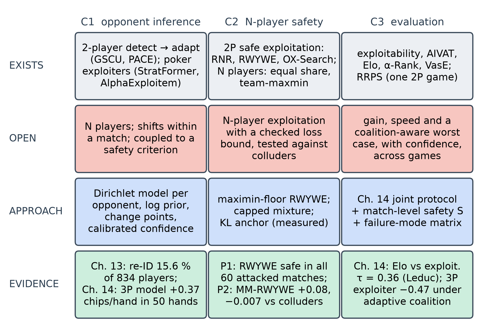

<!--
OFFICIAL PhD TITLE (keep consistent across all documents):
EN: Research on the possibilities for applying Artificial Intelligence in computer games
BG: Изследване на възможностите за приложение на изкуствения интелект в компютърни игри
-->
---
title: "Chapter 15 Summary — Research Frontier Mapping and Contribution Design"
subtitle: "Research on the possibilities for applying Artificial Intelligence in computer games"
author: "Alexander Andreev"
date: "September 2026"
lang: en
vars:
  research_focus: "Adaptive Strategy Learning in Multi-Agent Imperfect-Information Environments"
---

# Chapter 15 — Research Frontier Mapping and Contribution Design

Fourteen chapters built a toolbox: equilibrium computation, opponent models, safe exploitation,
multi-agent dynamics, coalitions, sequence models, real hand histories and the evaluation of
adaptive agents. This chapter turns the toolbox into a research programme. For each of the three
intended contributions it asks five questions: what already exists, what exactly is still open,
what the thesis will do, what evidence already shows that it can be done, and what could go
wrong. The answers become design documents, experiment specifications and a publication plan. The
chapter is written to be read on its own.

Planning alone would leave the central contribution untested, so the chapter also runs two
feasibility pilots. The first implements Ganzfried and Sandholm's safe exploitation algorithm
RWYWE[^gs2015], checks it against their published results, and measures it with Chapter 14's
evaluation protocol; it is the two-player baseline that Chapter 8 lacked. The second is a first
three-player run of the thesis's central experiment: exploitation with a bounded loss, tested
against colluding opponents. **All experimental numbers were measured** on reproducible runs, with
at least five seeds, and are exact wherever the game allows. They are feasibility evidence for the
designs, not the contributions' results. Where a run contradicted what I expected, the expectation
is kept and set against what happened.

**Where this sits in the thesis.** This chapter closes the preparatory programme and opens
Chapters II–IV. It keeps the goal, the research questions and the thesis statement drafted for
Chapter I, § 1.7, and says where it refines them. Its gap statements follow the September 2026
literature check, which narrowed two of the three contributions. Real-time opponent modelling
already works in two-player games[^gscu][^stratformer], and one benchmark already combines
return and exploitability, for a single game[^rrps]. Only the second contribution remains open at
its core: exploitation with a checked loss bound beyond two players.

---

## From a learning programme to a research programme

A frontier map is a survey of claimed ground. The April 2026 plan drew one from memory, and the
September check found that other work had landed near two of its three flags. The plan's first
gap, "no unified detect → adapt framework", is contradicted by GSCU. GSCU keeps a posterior over
the opponent, switches between a greedy and a conservative policy with a regret guarantee, and is
tested against switching opponents in Kuhn poker[^gscu]. Recent heads-up poker agents also model
and exploit opponents while staying near equilibrium[^stratformer][^alphaexploitem]. The plan's
third gap, "no framework combines exploitability and ranking", is contradicted by the repeated
rock–paper–scissors benchmark, which scores population return and exploitability together[^rrps].
The second gap stands, but two of its supporting claims were wrong. Equal share, each player's
fair fraction of the total, is not a guaranteed minimum: it provably cannot be secured against
opponents who play different strategies[^equalshare]. And piKL anchors play to an
imitation-learned *human* policy, not to an equilibrium[^pikl][^dilpikl]. Several citations were
wrong as well; the design folder lists every correction.

The map fixes the level at which each contribution may be claimed. It also sharpens Chapter I's
research questions without changing their subject. RQ1 now asks for inference that is
*calibrated*, because the second contribution sizes its deviation by the model's confidence. RQ2
now names two kinds of bound: one relative to a baseline, and one absolute against a coordinated
pair. RQ3 now asks for safety over the whole match as well as per hand. The thesis statement
stands. Its "predefined, empirically verified bound" now has a precise meaning. In small games a
bound is either exact by construction or checked by exhaustive enumeration; in larger ones it is
estimated with a stated budget.

---

## Contribution 1 — within-match opponent inference

**What exists.** Online Bayesian and in-context opponent modelling with a conservative fallback
works in two-player games, including poker[^gscu][^stratformer][^alphaexploitem]. Opponent models
have been placed inside depth-limited equilibrium search, with the model given in
advance[^milec2025]. N-player opponent modelling exists: in three-player Kuhn poker it beats the
equilibrium strategies, but it comes with no safety criterion[^ganzfried2024].

**What is open.** Online inference in N-player imperfect-information games that handles strategy
shifts *within* a match and is coupled to an explicit safety criterion and a common evaluation
protocol. C1 therefore does not claim the detect–adapt loop itself. It claims the loop's extension
to more players and to shifts within a match, together with its coupling to C2 and C3.

**The thesis's approach.** A Dirichlet model per opponent information set, with hidden cards
spread over the possible cards by posterior weight. Chapter 7 built it for one opponent and
Chapter 14 extended it to two. A type prior learned from real logs, using Chapter 13's styles.
Change detection that combines several signals and forgets old data partially rather than all at
once, because Chapter 14 found that a detector tuned on Kuhn fires on stationary Leduc opponents.
A confidence that the second contribution uses to size its deviation, with its calibration
measured.

**Evidence of feasibility.** On Kuhn every adaptive agent reached half of the attainable gain at
its first refit (median 50 hands). After a switch in the middle of the match, recovery ranged from
50 hands to never, depending on the design (Chapter 14). The three-player model gains +0.37 ±
0.04 chips/hand over the blueprint against independent pairs within 50 hands (Chapter 14). Real
logs carry the information the model needs: an embedding recognises a player on unseen days 15.6 %
of the time among 834 (chance 0.12 %), and 66 % of players reach a confident online type within
500 hands (Chapter 13).

**Main risk.** The two-player methods may be extended to N players first. The mitigation is to
publish the N-player, within-match, safety-coupled evaluation in 2027 and to claim only the
coupling and the protocol.

---

## Contribution 2 — exploitation with a checked loss bound beyond two players

**What exists.** Safe exploitation has a mature two-player theory. It runs from restricted Nash
responses[^johanson2007] and Ganzfried and Sandholm's gift-based safety[^gs2015] to adaptation
safety in OX-Search[^oxsearch] and, most recently, certified per-deployment
guarantees[^lihuang2026]. Every one of these results rests on the two-player minimax value. With
three or more players, safety notions exist but are hard to use. Team-maxmin values guarantee a
payoff against a coordinated coalition[^celli2018]; the September check classed them as very
conservative. Equal
share is provably unattainable against heterogeneous opponents[^equalshare]. Baseline-relative
regret bounds the loss against a comparator rather than in the worst case[^mueller2025].
Exploitation in three-player poker has been demonstrated without any loss bound[^ganzfried2024].
KL-regularised play in seven-player Diplomacy anchors to human behaviour, for
compatibility[^dilpikl].

**What is open (no counter-example found).** Exploiting sub-optimal opponents in N-player
imperfect-information games while bounding the loss relative to a baseline, and testing that bound
against colluding opponents.

**The non-claim.** C2 claims no general N-player safety theorem. It is empirical and works in
small games. Each bound it uses is either exact by construction or checked exactly by enumeration,
and in larger games it will be estimated with a stated budget. Equal share is a reference line in
its figures, never a guarantee: a colluding pair is exactly the heterogeneous case in which equal
share cannot be secured.

**The thesis's approach.** Three deviation rules on one opponent model, each tested exactly in
three-player Kuhn:

1. **A maximin-floor bank.** Ganzfried and Sandholm remark that their method "applies
   straightforwardly" to multiplayer games if the minimax value is replaced by the maximin
   value[^gs2015]. The thesis makes that remark concrete, with the maximin value taken against a
   *coordinated* pair: the team-maxmin value. The idea is theirs; the coordinated-pair floor, the
   exact checks and the tests against colluders are the contribution.
2. **A capped mixture.** The agent mixes the blueprint and a best response to its model, in
   proportions that keep its worst-case loss relative to the blueprint below ε in every hand. The
   loss is taken over all opponent pairs, colluding ones included.
3. **A KL anchor.** Play stays close to the blueprint in the KL sense, with the strength of the
   pull set by the model's confidence. This is the thesis's own proposal, not piKL. It has no
   a-priori bound, so its loss is only measured.

The two kinds of bound answer different questions, and an analogy helps to keep them apart. A
trader who promises "never to end the year below a fixed floor, whatever the market does" gives an
absolute bound. That is the maximin-floor bank: with three players, the floor is what the seat can
guarantee even if the other two act as one. A trader who promises "never to do much worse than
the index fund would have done in the same market" gives a relative bound. That is the capped
mixture, with the blueprint as the index fund. The relative promise is easy to keep and easy to
check, but it is worth only as much as the index: if the blueprint itself is robbed by colluders,
staying close to it is small comfort. The absolute promise needs the maximin value, which the
September check classed as very conservative. Pilot 2 measures both.

**Evidence of feasibility.** The two pilots below. **Main risks.** Exact checks do not scale beyond
tiny games, so three-player Leduc will need a learned coalition exploiter, calibrated against the
exact values of three-player Kuhn. The baseline itself is unsafe against colluders: the blueprint
loses 0.119 chips/hand to a fixed pair (Chapter 14). Every result is therefore reported both
relative to the blueprint and in absolute terms.

---

## Contribution 3 — a joint evaluation protocol

**What exists.** Evaluation is well developed along separate axes: worst-case exploitability and
its learned approximations, variance-reduced head-to-head estimation, population ratings and
generalisation to new co-players (Chapter 14 reviews them). One benchmark combines population
return with exploitability, for one two-player game[^rrps].

**What is open.** A protocol that reports gain, adaptation speed and recovery, and worst-case or
coalition-aware robustness, with confidence bounds, applied unchanged across several
imperfect-information games including N-player ones. The claim is framed as "existing evaluation
breaks in these settings, and the protocol catches what it misses", never as a new toolkit.

**The thesis's approach.** Chapter 14's protocol, which reports gain, speed and recovery,
exposure or coalition value, teaching loss and confidence together. This chapter adds one
readout, match-level safety S: the mean over the match of the agent's expected payoff minus its
safety reference. That is Ganzfried and Sandholm's definition of safety, and Pilot 1 shows why
per-hand readouts alone misjudge an agent that banks gains.

**How the three fit together.** C1 turns observations into a model *and* a confidence. C2
decides how far that confidence may move the agent from its safe baseline, under a stated bound.
C3 measures gain, speed, recovery and loss together, which is the only way C1 and C2 can be
claimed at all. The two-player versions (Chapters 7, 8 and 14, and this chapter's RWYWE) are the
reference points that every N-player result is compared with. The fair-play thread of Chapter 13,
collusion and bot detection, enters C2 as the coalition-aware response of Experiment 2.2 and C3 as
the coalition readouts.

**Evidence of feasibility.** Chapter 14 reproduced eight of the nine failure modes of existing
evaluation on Kuhn, Leduc and three-player Kuhn. For example, the Elo and exploitability rankings
correlate at only 0.36 on Leduc. The three-player exploiter that tops Elo and Nash averaging loses
0.47 chips/hand to an adaptive coalition. **Main risk.** Reviewers may call it a combination of
known metrics. The answer is to lead with the failures that each existing metric misses.

---

## Pilot 1 — RWYWE, the two-player baseline

Chapter 8 imposed its safety floor on every hand: the strategy must guarantee the game value v* in
each hand. The September review found that this is only Ganzfried and Sandholm's baseline, the
*best equilibrium* against the opponent model. Their algorithms define safety over the repeated
game, as at least v* per hand in expectation over the match, and deviate beyond equilibrium by
risking only gifts the opponent has already given[^gs2015]. RWYWE ("risk what you've won in
expectation") keeps a bank k. It plays the best response to its model among strategies whose worst
case is at least v* − k. After each hand it credits the least that strategy could have earned
against any opponent play consistent with what was observed, and adds that credit minus v* to the
bank. In poker the opponent's play off the observed path, and its card when it is not shown down,
must be assumed adversarial[^gs2015]. The bank never goes negative, and summing over hands gives
the guarantee: total expected payoff ≥ T·v* against any opponent.

**Does the implementation reproduce the paper?** The paper's Kuhn experiment was replicated with
400 opponents per class instead of 40,000. The safety result reproduces exactly. Against dynamic
opponents, which play randomly for 100 hands and then best-respond to the agent's current strategy
every hand, all four safe algorithms stay above v* in 400 of 400 matches. In no hand of any match
did the risk of the policy in force exceed the bank. The model-based best response falls to
−0.170 against v* = −0.056. The orderings reproduce as well. The safe algorithms' levels are
0.001–0.033 chips/hand below the published ones (RWYWE 0.332 against 0.364 on random opponents).
The best-response row does not reproduce: 0.328 against 0.470. Three readings of the paper's
"random" opponents were tried and none closes the gap, which stays open.

The replication also caught a subtle defect. Against a model that looks like an equilibrium, every
equilibrium strategy is equally good, and the LP solver returned the one that never bluffs the
Jack and never bets the King. That strategy is poor against opponents who deviate slightly. It
earned −0.034 against the near-equilibrium class, where the blueprint earns −0.019. A second LP
stage now breaks ties toward the blueprint; without it the safe algorithms lose a further
0.002–0.046 chips/hand. Chapter 14's best-equilibrium agent uses the same LP without a
tie-break; Chapter 8's solver was not checked.

**What does RWYWE buy under the joint protocol?** RWYWE was run next to Chapter 14's agents with
the same opponent model, against the same populations, switching opponents and teaching attacks,
over 10 seeds and both seats. In one variant the gift accounting uses the opponent's card only when
it is shown down; in the other, following the paper's assumption, the card is always shown.

RWYWE is a real improvement on Chapter 8's baseline. Its gain over the blueprint is +0.062 ±
0.002 chips/hand on Kuhn and +0.113 ± 0.001 on Leduc, 3.1 and 2.4 times the best equilibrium's
(+0.020 and +0.047), and none of its 120 attacked matches ends below v*. The guarantee is
expensive, however. The restricted Nash response RNR(0.5), which has no guarantee, gains +0.210 on
Kuhn and +0.797 on Leduc. Under these particular attacks it fell below v* in only 1 match of 120,
and then by 0.0007. The unconstrained best responder DirBR fell below in 52 of 120.

The bottleneck is the pessimism of the accounting. With cards used only at showdown, RWYWE's bank
after 1,000 bait hands was 0.01 chips against the TightPassive bait on Kuhn and 0.01–0.02 against
every Leduc bait. Most gifts cannot be *proved*, because everything the opponent did not visibly do
must be assumed to be a nemesis. When cards are always shown, the bank reaches 8.5 chips against
LooseAggr on Kuhn and the gain more than doubles, to +0.148. On Leduc it rises only to +0.134:
with 468 information sets per player, almost all of the opponent's strategy lies off the path of
any single hand. Detecting gifts inside a hand, which the paper describes but did not
test[^gs2015], is the obvious next step.

The teaching attack also exposes a gap in the protocol. Under the LooseAggr bait RWYWE banked 2.19
chips by hand 1,000 and spent them against the attacker within about a hundred hands. Chapter 14's
per-hand teaching-loss readout charges that spending to the agent as if it were unsafe play. Yet
over the match RWYWE stays above v*, with S = +0.112 ± 0.025. Per-hand exposure is the right
readout for agents with a fixed deviation rule; for an agent that banks gains, safety is a property
of the whole match. This is why C3 now reports S as well.

---

## Pilot 2 — three players, a coordinated pair and two kinds of bound

With three players there is no game value, so the reference for safety has to be chosen. The
pilot tries both kinds named in RQ2.

**The absolute reference: the team-maxmin value.** The maximin value of each seat of three-player
Kuhn against a coordinated pair was computed exactly: a linear program over the seat's strategies
plus an oracle that finds the pair's worst joint pure response. The oracle enumerates the unique
pure plans of one opponent (at most 10,000) and best-responds with the other. It matches Chapter
14's enumeration to 10⁻⁹ and runs about 20 times faster. The seat values are −0.038, −0.027 and
+0.042, a seat average of −0.0076 chips/hand. That is only 0.0076 below equal share (zero, since
the game is zero-sum). The blueprint's own coalition value averages −0.119. I expected the
"very conservative" gap that the literature check describes. In this game it is not there: each
seat's maximin value is within 0.006–0.011 of the blueprint's self-play value. The finding covers
one tiny game and changes nothing in the gap wording.

**Four agent families** played seven independent opponent pairs, a fixed colluding pair (the exact
coalition best response to the blueprint), and an adaptive colluding pair. The adaptive pair baits
for 1,000 hands, then plays the exact coalition best response to the agent's *current* policy,
recomputed every 50 hands. The families were:

- **Maximin-floor RWYWE**: the bank with the team-maxmin value as its reference, crediting the
  worst joint play of the pair that agrees with what was seen.
- **The capped mixture BD(ε)**, for ε from 0.01 to unlimited.
- **The KL anchor KL(β)**, for β from 1 to 30.
- **Baselines**: the blueprint, the stationary maximin strategy, and Chapter 14's unbounded
  exploiter DirBR3P.

Per hand, the runner recorded the agent's exact expected payoff, the blueprint's exact payoff
against the same opponent strategies, and the worst-case loss relative to the blueprint of every
policy in force. Five seeds, all three seats.

**Every bound held when checked exactly.** For the capped mixture, the worst-case loss of every
policy in force stayed at or below ε, for example 0.095 at ε = 0.1. The realised per-hand loss
relative to the blueprint never exceeded ε under the adaptive colluders. For the maximin-floor
agent, the match-level safety relative to the maximin value was non-negative in all 135 matches
(minimum +0.003 under the adaptive colluders). The coalition value of its policy never fell more
than 5·10⁻⁷ below its floor.

**What the bounds buy.** The capped mixture trades about half a chip of gain for each chip of
allowed loss up to ε = 0.3: +0.048 at ε = 0.1 and +0.149 at ε = 0.3, against the unbounded
exploiter's +0.303. The pre-registered hope of 25 % of the unbounded gain at ε = 0.1 was not met
(16 %). The reason is that the best response to the model can lose about 0.6 chips/hand relative to
the blueprint, so a small cap allows only a small step towards it. The KL anchor was worse than the
mixture at equal worst-case loss up to about 0.7, and slightly better near full deviation, which
also contradicts its hypothesis.

The second figure changes the picture. Measured by what an adaptive coalition actually takes, the
KL anchor is the better of the two relative rules. At a similar gain, KL(10) keeps −0.286 chips/hand
under the adaptive colluders, while the uncapped mixture keeps −0.379 and DirBR3P −0.464. The two
robustness readouts, worst-case loss relative to a baseline and absolute exposure to a coalition,
rank the rules differently. C3's protocol must therefore report both. And the relative bounds share
one weakness: they are only as good as the baseline, and the blueprint itself loses 0.119 to
colluders. The absolute family has no such problem. The maximin-floor agent gains +0.082 over the
blueprint against independent pairs (+0.063 with showdown-only accounting), 27 % of the unbounded
exploiter's gain. Under the adaptive colluders it keeps −0.007, within 0.007 of equal share, where
the blueprint gets −0.119.

**What the pilot does not show.** It shows nothing beyond one tiny game. The exact checks rely on
an enumeration that does not scale. There are five seeds, one opponent model and one adaptive
attacker. The only guarantee involved is Ganzfried and Sandholm's argument transposed to a
coordinated pair. What it does show is that the kind of result C2 aims at can be produced and
checked: exploitation of weak opponents with a loss criterion that is verified exactly against
colluding ones.

---

## The experiment plan and the publication pipeline

Six experiments carry the contributions into Chapters II–IV. Each is specified with hypotheses,
independent and dependent variables, a protocol, success criteria and statistics in the design
folder.

| Experiment | Question | Testbeds | Stage |
|---|---|---|---|
| 1.1 | within-match inference, calibrated | Kuhn, Leduc, 3P Kuhn, 3P Leduc | II–III |
| 1.2 | the same model on real hand histories | public iPoker hands (Playtech if available) | III |
| 2.0 | two-player baseline (RWYWE) | Kuhn, Leduc | done (Pilot 1) |
| 2.1 | N-player bounded exploitation | 3P Kuhn (exact), 3P Leduc (budgeted) | II–III |
| 2.2 | coalition-aware response to colluders | 3P Kuhn, 3P Leduc | III |
| 3.1 | the protocol across games | four games | III–IV |

: The experiment plan (specifications in `implementation/step15/design/experiments.md`).

Experiment 2.2 replaces the plan's So Long Sucker experiment. Chapter 14 measured that a planted
alliance costs a focal So Long Sucker baseline only 0.8–1.9 percentage points of win rate, and
Chapter 11 found that about 99.5 % of random games in that engine end in deadlock. An alliance there
has little to act on.

The individual study plan asks for an article at the end of each stage. The pipeline maps six papers
onto Chapters II–IV. The first is the joint evaluation protocol of Chapter 14, with this chapter's
RWYWE result as the case that requires match-level safety. Four reasons favour it. It is the
yardstick every later paper uses. Its results are exact and complete, with no data-access risk. It
carries the thesis's framing. And Chapter 13's hand-history paper gains from waiting for the
Playtech data decision. The target is the IEEE Conference on Games 2027, full papers due
1 March 2027. The AAMAS 2027 main track, with papers due 8 October 2026, is a stretch option only if
a full draft exists by the end of September, since Chapter I is due in the same weeks. The paper
fits in eight pages: the failure modes of existing evaluation; the protocol and its exact engine;
results on Kuhn and Leduc, including RWYWE's match-level safety; the three-player coalition
readouts with the maximin value as a reference line; and the limits of exact evaluation at scale.
The flagship paper on safety beyond two players follows Experiment 2.1 in 2027. The remaining four
cover Chapter 13's hand-history pipeline, within-match inference, coalition-aware exploitation and
a cross-game journal version of the protocol.

---

## Honest notes, limitations, and where this hands off

**What held up.** The replication reproduces Ganzfried and Sandholm's central result: their safe
algorithms stay safe against an opponent that best-responds every hand, while a best response does
not. Every bound in the three-player pilot was checked exactly and held in every hand or match. The
coalition oracle, the maximin program and the gift accounting each agree with an independent
reference. Chapter 14's agents reproduce their published gains in this chapter's harness.

**What did not, and why it matters.** Three predictions failed and are kept as stated. The capped
mixture did not reach a quarter of the unbounded gain at ε = 0.1. The KL anchor did not beat the
mixture at equal worst-case loss. The team-maxmin value was not very conservative in three-player
Kuhn. One discrepancy is unresolved: the best-response row of the replication. Two things were
caught by checks rather than by luck: the LP tie-breaking defect, and a degenerate LP face on
which the maximin program cycled until an acceptance tolerance was added.

**Limitations.** These are toy games, and the exact worst cases exist only because the games are
tiny. The opponent model and the attack schedules are Chapter 14's. The three-player pilot has five
seeds and one adaptive coalition. With the realistic accounting, RWYWE's Leduc bank stayed near
zero, so its Leduc result measures the accounting's pessimism more than exploitation. The venue
dates marked as estimates must be confirmed when the calls appear, and the degree's national
publication requirements were not checked here.

**Connections.** Backward: the chapter builds on Chapter 7's models, Chapter 8's safe responses
(now with the algorithm Chapter 8 lacked), Chapter 11's coalition questions, Chapter 13's real
logs and Chapter 14's engine and protocol. Forward: Chapter I uses the frontier map and the refined
research questions. Chapter II formalises the two kinds of bound. Chapter III builds the scaled
agent and the coalition-aware response. Chapter IV runs the protocol across games. Chapter 8 can now
cite RWYWE as its missing baseline.

---

## Key takeaways for the thesis synthesis

- **The contributions are claimed at the level the literature allows.** C1 is N-player,
  within-match, safety-coupled inference. C2 is exploitation beyond two players with a checked loss
  criterion, tested against colluders, with no general theorem. C3 is a joint protocol that catches
  what existing measures miss.
- **The two-player baseline exists now.** RWYWE gains 2.4–3.1 times the best equilibrium's gain and
  stays safe over the match in all 120 attacked matches. That is 14–30 % of the gain of an
  unguaranteed restricted Nash response; proving gifts is the bottleneck.
- **Safety of a gift-banking agent is a property of the match.** A bank of 2.19 chips is spent
  within about 100 hands of an attack while the match stays above v* (S = +0.112). C3 adds
  match-level safety.
- **With three players both kinds of bound can be enforced and checked exactly.** The
  maximin-floor bank gains +0.082 against independent pairs and keeps −0.007 under adaptive
  colluders (blueprint −0.119). The capped mixture holds its per-hand bound exactly.
- **Relative and absolute robustness disagree.** The KL anchor loses to the capped mixture on the
  worst case relative to the baseline, but keeps much more against an adaptive coalition.
- **The first publication is the protocol paper**, for IEEE CoG 2027 (1 March 2027), with AAMAS
  2027 as a stretch option.

<!-- Source footnotes. Verified entries from deliverables/finalReview/lit_gaps.md and
     lit_evaluation.md (2026-09-24); Ganzfried & Sandholm (2015) read in full for this chapter
     (authors' PDF, 2026-09-25). See implementation/step15/EXECUTION_NOTES.md. -->

[^gs2015]: Ganzfried, S. & Sandholm, T. (2015). "Safe Opponent Exploitation." *ACM Transactions on Economics and Computation* 3(2), Article 8. DOI 10.1145/2716322 — safety over the repeated game (Def. 4.1); RWYWE, BEFFE and BEFEWP (§ 6); extensive-form updates (§ 8); multiplayer games with the maximin value (§ 2.3); Kuhn experiments (§ 9, Table I).

[^gscu]: Fu, H., Tian, Y., Yu, H., Liu, W., Wu, S., Xiong, J., Wen, Y., Li, K., Xing, J., Fu, Q. & Yang, W. (2022). "Greedy when Sure and Conservative when Uncertain about the Opponents." *ICML*, PMLR 162, 6829–6848.

[^stratformer]: Caen, A., Winands, M. H. M. & Soemers, D. J. N. J. (2026). "StratFormer: Adaptive Opponent Modeling and Exploitation in Imperfect-Information Games." *Computers and Games 2026* (accepted); arXiv:2604.25796.

[^alphaexploitem]: Murgoci, V., Spaan, M. & Oren, Y. (2026). "AlphaExploitem: Going beyond the Nash Equilibrium in Poker by Learning to Exploit Suboptimal Play." *arXiv:2605.09150* (preprint).

[^rrps]: Lanctot, M., Schultz, J., Burch, N., Smith, M. O., Hennes, D., Anthony, T. & Pérolat, J. (2023). "Population-based Evaluation in Repeated Rock-Paper-Scissors as a Benchmark for Multiagent Reinforcement Learning." *Transactions on Machine Learning Research*; arXiv:2303.03196.

[^equalshare]: Ge, J., Wang, Y., Li, W. & Jin, C. (2025). "Securing Equal Share: A Principled Approach for Learning Multiplayer Symmetric Games." *ICML*, 18989–19010; arXiv:2406.04201 — equal share cannot be secured against opponents playing different strategies (Prop. 4.1).

[^pikl]: Jacob, A. P., Wu, D. J., Farina, G., Lerer, A., Hu, H., Bakhtin, A., Andreas, J. & Brown, N. (2022). "Modeling Strong and Human-Like Gameplay with KL-Regularized Search." *ICML*; arXiv:2112.07544.

[^dilpikl]: Bakhtin, A., Wu, D. J., Lerer, A., Gray, J., Jacob, A. P., Farina, G., Miller, A. H. & Brown, N. (2023). "Mastering the Game of No-Press Diplomacy via Human-Regularized Reinforcement Learning and Planning." *ICLR*; arXiv:2210.05492.

[^milec2025]: Milec, D., Kovařík, V. & Lisý, V. (2025). "Adapting Beyond the Depth Limit: Counter Strategies in Large Imperfect Information Games." *AAMAS* (extended abstract), 2675–2677; arXiv:2501.10464.

[^ganzfried2024]: Ganzfried, S., Wang, K. A. & Chiswick, M. (2024). "Opponent Modeling in Multiplayer Imperfect-Information Games." *Proc. DAI '24*, 39–45. DOI 10.1145/3719545.3721108.

[^johanson2007]: Johanson, M., Zinkevich, M. & Bowling, M. (2007). "Computing Robust Counter-Strategies." *NIPS 2007* — restricted Nash response.

[^oxsearch]: Ge, Z., Xu, Z., Ding, T., Meng, L., An, B., Li, W. & Gao, Y. (2024). "Safe and Robust Subgame Exploitation in Imperfect Information Games." *ICML*, PMLR 235, 15255–15270.

[^lihuang2026]: Li, B. & Huang, L. (2026). "Agents that Certify their Own Exploits: Confidence-Scheduled Restricted Responses for Safe Opponent Exploitation." *arXiv:2607.28520* (preprint).

[^celli2018]: Celli, A. & Gatti, N. (2018). "Computational Results for Extensive-Form Adversarial Team Games." *AAAI* 32(1). DOI 10.1609/aaai.v32i1.11462; see also Zhang, Y., An, B. & Černý, J. (2021). "Computing Ex Ante Coordinated Team-Maxmin Equilibria in Zero-Sum Multiplayer Extensive-Form Games." *AAAI* 35(6), 5813–5821.

[^mueller2025]: Müller, A., Schneider, J., Skoulakis, S., Viano, L. & Cevher, V. (2025). "Best of Both Worlds: Regret Minimization versus Minimax Play." *ICML*; arXiv:2502.11673.
