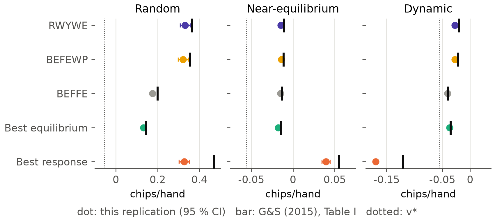
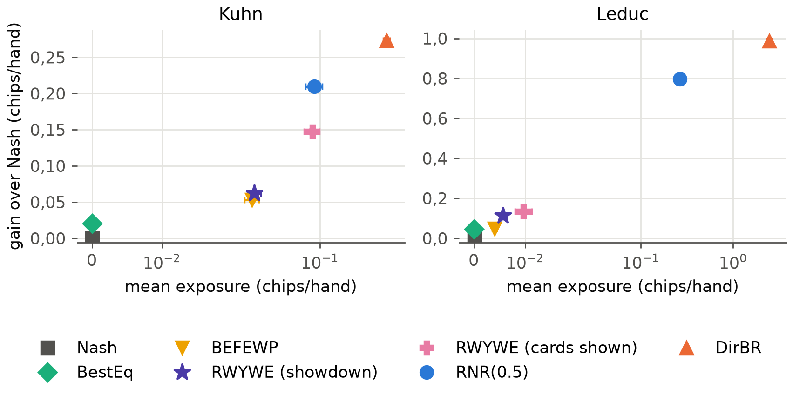
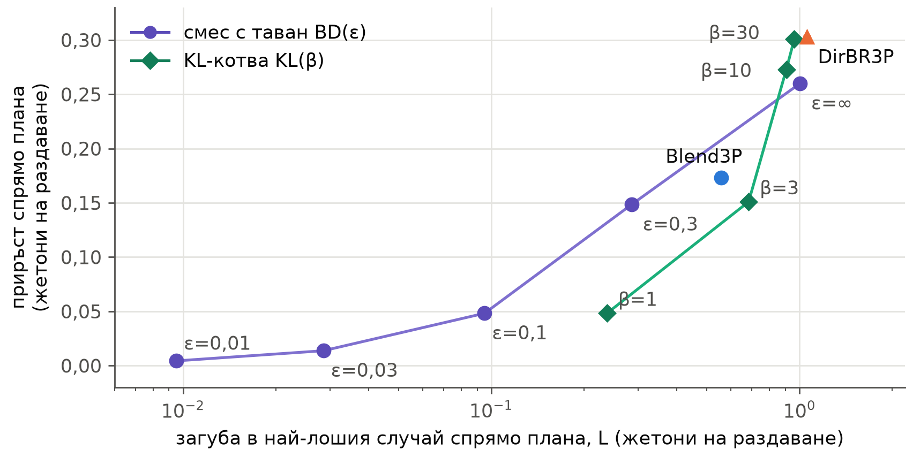
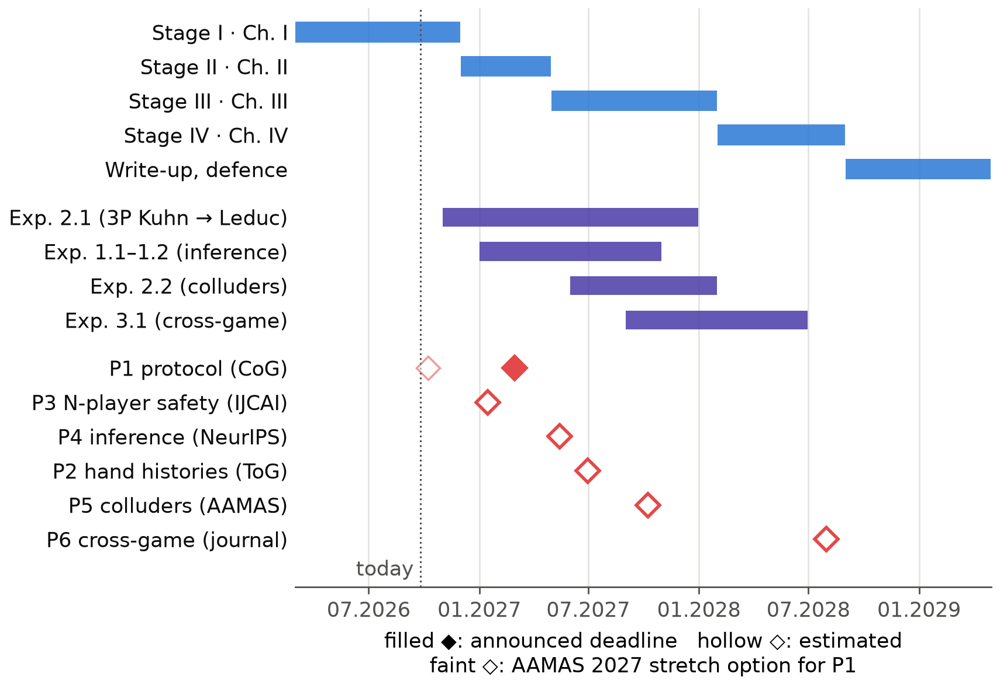

<!--
OFFICIAL PhD TITLE (keep consistent across all documents):
EN: Research on the possibilities for applying Artificial Intelligence in computer games
BG: Изследване на възможностите за приложение на изкуствения интелект в компютърни игри
-->
---
title: "Глава 15 Обобщение – Картографиране на изследователската граница и проектиране на приносите"
subtitle: "Изследване на възможностите за приложение на изкуствения интелект в компютърни игри"
author: "Alexander Andreev"
date: "September 2026"
lang: bg
vars:
  research_focus: "Adaptive Strategy Learning in Multi-Agent Imperfect-Information Environments"
---

# Глава 15 – Картографиране на изследователската граница и проектиране на приносите

Тази глава превръща инструментариума, изграден в предходните четиринадесет глави, в изследователска програма. За всеки от трите замислени приноса тя задава пет въпроса: какво вече съществува, какво точно остава отворено, какво ще направи дисертацията, какви доказателства вече показват, че това е осъществимо, и какво може да се обърка. Отговорите се превръщат в проектни документи, спецификации на експериментите и публикационен план.

Главата провежда и два пилотни експеримента за осъществимост. Първият реализира алгоритъма за безопасна експлоатация RWYWE на Ganzfried и Sandholm[^gs2015], проверява го спрямо публикуваните им резултати и го измерва с протокола за оценяване от Глава 14; това е базовият метод за двама играчи, който липсваше в Глава 8. Вторият е първо изпълнение с трима играчи на централния експеримент на дисертацията: експлоатация с ограничена загуба, изпитана срещу противници в тайно съглашение (colluding opponents). **Всички експериментални числа са измерени** при възпроизводими изпълнения с поне пет начални числа и навсякъде, където играта позволява, са точни. Те са доказателства за осъществимостта на проектите, а не резултатите на приносите. Когато някое изпълнение противоречи на очакванията ми, очакването е запазено и съпоставено с действителния резултат.

**Къде се вписва това в дисертацията.** Тази глава завършва подготвителната програма и открива глави II–IV. Тя запазва целта, изследователските въпроси и тезата, формулирани за Глава I, раздел 1.7, и посочва къде ги прецизира.

---

## От учебна към изследователска програма

Картата на изследователската граница (frontier map) е преглед на вече заетата територия. Планът за обучение от април 2026 г. начерта такава карта по памет, а проверката от септември установи, че близо до две от трите ѝ знамена вече има чужди работи. Първият пропуск в плана, „няма обединена рамка откриване → адаптация“, се опровергава от GSCU, който превключва между алчна и консервативна стратегия срещу противници, които сменят стратегията си, в Кун покер[^gscu], както и от съвременни покер агенти за двама играчи, които експлоатират противниците си, като остават близо до равновесието[^stratformer][^alphaexploitem]. Третият пропуск, „нито една рамка не съчетава експлоатируемост и класиране“, се опровергава от еталонния тест с повтаряща се игра „камък-ножица-хартия“, който оценява заедно възвръщаемостта срещу популацията и експлоатируемостта[^rrps]. В основата си остава само вторият пропуск – експлоатация с проверена граница на загубата при повече от двама играчи, – но две от твърденията, на които се опираше, бяха погрешни. Доказано е, че равният дял (equal share) – справедливата част на всеки играч от общото – не може да бъде осигурен срещу противници, които играят различни стратегии[^equalshare]. А piKL закотвя играта към *човешка* стратегия, научена чрез подражание, а не към равновесие[^pikl][^dilpikl].

Картата определя нивото, на което всеки принос може да бъде заявен. Тя също така прецизира изследователските въпроси на Глава I (RQ1–RQ3), без да променя предмета им. RQ1 вече изисква извеждането (inference) да бъде *калибрирано*, защото вторият принос определя размера на отклонението си според увереността на модела. RQ2 вече назовава два вида граница: относителна спрямо базова линия и абсолютна срещу координирана двойка. RQ3 вече изисква безопасност както за всяко раздаване, така и за целия мач. Тезата остава в сила. Нейната „предварително определена, емпирично проверена граница“ вече има точен смисъл. В малките игри границата е или точна по конструкция, или проверена чрез пълно изброяване; в по-големите тя се оценява с посочен бюджет.

---

## Принос №1 – извеждане на стратегията на противника в хода на мача

**Какво съществува.** Онлайн моделирането на противника с консервативен резервен вариант работи в игри за двама играчи, включително в покера[^gscu][^stratformer][^alphaexploitem], както и в търсене с ограничена дълбочина, при което моделът е зададен предварително[^milec2025]. В Кун покер с трима играчи моделирането на противника побеждава равновесните стратегии, но без критерий за безопасност[^ganzfried2024].

**Какво остава отворено.** Онлайн извеждане в игри с непълна информация с N играчи, което се справя със смени на стратегията *в рамките на* мача и е свързано с изричен критерий за безопасност и с общ протокол за оценяване. Затова Принос №1 не претендира за самия цикъл откриване–адаптация. Той претендира за разширяването на цикъла към повече играчи и към смени в рамките на мача, както и за свързването му с приносите №2 и №3.

**Подходът на дисертацията.** Модел на Дирихле за всяко информационно множество на противника (глави 7 и 14), априорно разпределение върху типовете, научено от стиловете от Глава 13, откриване на промени, което съчетава няколко сигнала и забравя старите данни частично (детектор, настроен върху Кун, се задейства срещу стационарни противници в Ледюк), и мярка за увереност с измерена калибровка, която Принос №2 използва, за да определи размера на отклонението си.

**Доказателства за осъществимост.** Скоростта на адаптация и възстановяването след смяна на стратегията са измерени в раздел 14.5, а приръстът (gain) на модела за трима играчи срещу независими двойки – в раздел 14.7. Реалните записи съдържат информацията, от която моделът се нуждае: вграждане (embedding) разпознава играч в невиждани дни в 15,6 % от случаите сред 834 играчи (при 0,12 % случайно), а 66 % от играчите достигат уверена онлайн оценка на типа в рамките на 500 раздавания (Глава 13).

**Основен риск.** Възможно е методите за двама играчи да бъдат разширени до N играчи преди дисертацията; мярката срещу това е оценяването при N играчи, в рамките на мача и свързано с безопасността, да бъде публикувано през 2027 г.

---

## Принос №2 – експлоатация с проверена граница на загубата при повече от двама играчи

**Какво съществува.** Безопасната експлоатация има зряла теория за двама играчи – от ограничените отговори по Наш (restricted Nash responses)[^johanson2007] и основаната на подаръци безопасност[^gs2015] до безопасността на адаптацията в OX-Search[^oxsearch] и сертифицираните гаранции за всяко отделно прилагане[^lihuang2026]; цялата тя се опира на минимаксната стойност на играта за двама. При трима или повече играчи отборните максиминни стойности (team-maxmin) гарантират печалба срещу координирана коалиция[^celli2018], но бяха определени като много консервативни; равният дял е непостижим срещу разнородни противници[^equalshare]; съжалението спрямо базова линия (baseline-relative regret) ограничава загубата спрямо еталон за сравнение, а не в най-лошия случай[^mueller2025]. Експлоатация в покер с трима играчи е демонстрирана без никаква граница на загубата[^ganzfried2024].

**Какво остава отворено (не е намерен контрапример).** Експлоатацията на неоптимални противници в игри с непълна информация с N играчи при ограничаване на загубата спрямо базова линия и изпитването на тази граница срещу противници в тайно съглашение.

**Какво не се твърди.** Принос №2 не претендира за обща теорема за безопасност при N играчи. Той е емпиричен и работи в малки игри. Всяка граница, която използва, е или точна по конструкция, или точно проверена чрез изброяване, а в по-големите игри ще бъде оценявана с посочен бюджет. Равният дял е референтна линия във фигурите му, никога гаранция: двойката съучастници (colluders) е точно онзи разнороден случай, в който равният дял не може да бъде осигурен.

**Подходът на дисертацията.** Три правила за отклонение върху един и същ модел на противника, всяко изпитано точно в Кун покер с трима играчи:

1. **Резерв (bank) с максиминен праг.** Ganzfried и Sandholm отбелязват, че методът им „се прилага непосредствено“ към игри с много играчи, ако минимаксната стойност се замени с максиминната[^gs2015]. Дисертацията взема максиминната стойност срещу *координирана* двойка: отборната максиминна стойност. Идеята е тяхна; приносът е прагът срещу координирана двойка, точните проверки и изпитанията срещу съучастници.
2. **Смес с таван (capped mixture).** Агентът смесва плана и най-добрия отговор на своя модел така, че загубата му в най-лошия случай спрямо плана, взета по всички двойки противници, включително двойките съучастници, да остава под ε във всяко раздаване.
3. **KL-котва (KL anchor).** Играта остава близо до плана в смисъла на KL, като силата на привличането се определя от увереността на модела. Това е собствено предложение на дисертацията, а не piKL; то няма априорна граница, затова загубата му само се измерва.

Двата вида граница отговарят на различни въпроси и една аналогия помага да бъдат разграничени. Търговец, който обещава „никога да не завърши годината под фиксиран праг, каквото и да прави пазарът“, дава абсолютна граница. Това е резервът с максиминен праг: при трима играчи прагът е това, което мястото може да си гарантира, дори ако другите двама действат като един. Търговец, който обещава „никога да не се представи много по-зле, отколкото би се представил индексният фонд на същия пазар“, дава относителна граница. Това е сместа с таван, в която планът играе ролята на индексния фонд. Относителното обещание е лесно за спазване и лесно за проверка, но струва само колкото индекса: ако самият план бъде ограбен от съучастници, това, че агентът остава близо до него, е слаба утеха. Абсолютното обещание изисква максиминната стойност, която проверката от септември определи като много консервативна. Пилотният експеримент 2 измерва и двете.

**Доказателства за осъществимост.** Двата пилотни експеримента по-долу. **Основни рискове.** Точните проверки не се мащабират, затова Ледюк с трима играчи ще изисква научен коалиционен експлоататор, калибриран върху Кун покер с трима играчи. Самата базова линия не е безопасна срещу съучастници (раздел 14.7), затова всеки резултат се докладва както спрямо плана, така и в абсолютни стойности.

---

## Принос №3 – обединен протокол за оценяване

**Какво съществува.** Оценяването е добре развито по отделни оси (раздел 14.1); един еталонен тест съчетава възвръщаемостта срещу популацията с експлоатируемостта, за една игра за двама играчи[^rrps].

**Какво остава отворено.** Протокол, който докладва приръста, скоростта на адаптация и възстановяването, както и устойчивостта в най-лошия случай или с отчитане на коалициите, с доверителни граници, приложен без промени в няколко игри с непълна информация, включително игри с N играчи. Твърдението е формулирано като „съществуващото оценяване се проваля в тези условия, а протоколът улавя това, което то пропуска“, а никога като нов инструментариум.

**Подходът на дисертацията.** Протоколът от Глава 14 (раздел 14.5), разширен с един показател – безопасността на ниво мач (match-level safety) S: средното за мача на очакваната печалба на агента минус референтната му стойност за безопасност. Това е определението за безопасност на Ganzfried и Sandholm, а пилотният експеримент 1 показва защо само показателите за отделното раздаване преценяват погрешно агент, който натрупва печалбите си в резерв.

**Как се съчетават трите.** Принос №1 превръща наблюденията в модел *и* в мярка за увереност. Принос №2 решава доколко тази увереност може да отдалечи агента от безопасната му базова линия при посочена граница. Принос №3 измерва заедно приръста, скоростта, възстановяването и загубата, което е единственият начин приносите №1 и №2 изобщо да бъдат заявени. Версиите за двама играчи (глави 7, 8 и 14 и RWYWE в тази глава) са опорните точки, с които се сравнява всеки резултат при N играчи.

**Доказателства за осъществимост.** Режимите на отказ на съществуващото оценяване, възпроизведени в раздел 14.8. **Основен риск.** Рецензентите може да го определят като комбинация от известни метрики. Отговорът е изложението да започва с провалите, които всяка от съществуващите метрики пропуска.

---

## Пилотен експеримент 1 – RWYWE, базовият метод за двама играчи

Глава 8 налагаше прага си на безопасност на всяко раздаване: стратегията трябва да гарантира стойността на играта v* във всяко отделно раздаване. Прегледът от септември установи, че това е само базовият вариант на Ganzfried и Sandholm – *най-доброто равновесие* срещу модела на противника. Техните алгоритми определят безопасността за повтарящата се игра – като поне v* на раздаване средно за мача (по математическо очакване) – и се отклоняват извън равновесието, като рискуват само подаръците (gifts), които противникът вече е направил[^gs2015]. RWYWE (Risk What You've Won in Expectation – „рискувай средно спечеленото дотук“) поддържа резерв k. Той играе най-добрия отговор на своя модел измежду стратегиите, чиято стойност в най-лошия случай е поне v* − k. След всяко раздаване той зачита най-малкото, което тази стратегия би могла да спечели срещу която и да е игра на противника, съвместима с наблюдаваното, и добавя към резерва тази зачетена стойност минус v*. В покера играта на противника извън наблюдавания път, както и картата му, когато не е разкрита, трябва да се приемат за враждебни[^gs2015]. Резервът никога не става отрицателен, а сумирането по раздаванията дава гаранцията: общата очаквана печалба е ≥ T·v* срещу всеки противник.

**Възпроизвежда ли реализацията статията?** Експериментът от статията с Кун беше повторен с 400 противници на клас вместо 40 000. Резултатът за безопасността се възпроизвежда точно. Срещу динамичните противници, които играят случайно 100 раздавания, а след това на всяко раздаване играят най-добър отговор на текущата стратегия на агента, и четирите безопасни алгоритъма остават над v* в 400 от 400 мача, докато най-добрият отговор срещу модела пада до −0,170 при v* = −0,056. Подредбите също се възпроизвеждат; нивата на безопасните алгоритми са с 0,001–0,033 жетона на раздаване под публикуваните. Редът за най-добрия отговор не се възпроизвежда (0,328 срещу 0,470), а три тълкувания на „случайните“ противници от статията оставят разликата отворена.

Възпроизвеждането улови и един неочевиден дефект: срещу модел, който изглежда като равновесие, решавачът на LP-задачата върна равновесие, което никога не блъфира с вале и никога не залага с поп и е слабо срещу противници, които се отклоняват леко. Втори етап на LP-задачата вече решава равенствата в полза на плана; без него безопасните алгоритми губят още 0,002–0,046 жетона на раздаване.

**Какво печели RWYWE по обединения протокол?** RWYWE беше изпълнен редом с агентите от Глава 14, при 10 начални числа и на двете места, с отчитане на подаръците, което използва картата на противника само при разкриване или, съгласно предпоставката на статията, винаги.

RWYWE е истинско подобрение спрямо базовия вариант от Глава 8. Приръстът му спрямо плана е +0,062 ± 0,002 жетона на раздаване в Кун и +0,113 ± 0,001 в Ледюк – 3,1 и 2,4 пъти приръста на най-доброто равновесие (+0,020 и +0,047), – и нито един от 120-те му мача при атака не завършва под v*. Гаранцията обаче е скъпа. Ограниченият отговор по Наш RNR(0,5), който няма гаранция, постига +0,210 в Кун и +0,797 в Ледюк и при тези конкретни атаки падна под v* само в 1 мач от 120, с 0,0007. Неограниченият агент с най-добър отговор DirBR падна под v* в 52 от 120.

Ограничаващият фактор е песимизмът на отчитането. Когато картите се използват само при разкриване, резервът на RWYWE след 1 000 раздавания с примамка беше 0,01 жетона срещу примамката TightPassive в Кун и 0,01–0,02 срещу всяка примамка в Ледюк: всичко, което противникът не е направил видимо, трябва да се приеме за възможно най-неблагоприятно, затова повечето подаръци не могат да бъдат *доказани*. Когато картите винаги са открити, резервът достига 8,5 жетона срещу LooseAggr в Кун и приръстът се увеличава повече от двойно – до +0,148; в Ледюк, при 468 информационни множества на играч, той се покачва само до +0,134. Откриването на подаръци в рамките на раздаването, което статията описва, но не изпитва[^gs2015], е очевидната следваща стъпка.

Обучаващата атака разкрива и пропуск в протокола. При примамката LooseAggr RWYWE натрупа в резерва 2,19 жетона до раздаване 1 000 и ги изразходва срещу нападателя за около сто раздавания. Показателят от Глава 14 за загубата от обучаващата атака по раздавания записва това изразходване в тежест на агента като небезопасна игра, а за целия мач RWYWE остава над v*, със S = +0,112 ± 0,025. Експозицията по раздавания е правилният показател за агенти с фиксирано правило за отклонение; за агент, който натрупва печалбите си в резерв, безопасността е свойство на целия мач. Затова Принос №3 вече докладва и S.

---

## Пилотен експеримент 2 – трима играчи, координирана двойка и два вида граница

При трима играчи няма стойност на играта, затова референтната стойност за безопасност трябва да бъде избрана. Пилотният експеримент изпробва и двата вида, назовани в RQ2.

**Абсолютната референтна стойност: отборната максиминна стойност.** Максиминната стойност на всяко място в Кун покер с трима играчи срещу координирана двойка беше изчислена точно (методът е описан в доклада). Стойностите за местата са −0,038, −0,027 и +0,042, средно по местата −0,0076 жетона на раздаване – само с 0,0076 под равния дял (нула, тъй като играта е с нулева сума). Собствената стойност на плана срещу коалиция е средно −0,119. Очаквах „много консервативната“ разлика, която описва проверката на литературата. В тази игра тя липсва: максиминната стойност на всяко място е в рамките на 0,006–0,011 от стойността на плана при игра срещу себе си. Констатацията обхваща една миниатюрна игра и не променя нищо във формулировката на пропуска.

**Четири семейства агенти** – RWYWE с максиминен праг, сместа с таван BD(ε), KL-котвата KL(β) и базовите методи (планът, стационарната максиминна стратегия и неограниченият експлоататор DirBR3P от Глава 14) – играха срещу седем независими двойки противници, срещу фиксирана двойка съучастници (точния коалиционен най-добър отговор на плана) и срещу адаптивна двойка съучастници, която примамва в продължение на 1 000 раздавания, след което играе точния коалиционен най-добър отговор на *текущата* стратегия на агента. Пет начални числа, и трите места, точни печалби за всяко раздаване.

**Всяка граница се удържа при точна проверка.** При сместа с таван загубата в най-лошия случай на всяка действаща стратегия остана равна на ε или под нея (например 0,095 при ε = 0,1), а реализираната загуба в раздаване никога не надхвърли ε при адаптивните съучастници. При агента с максиминен праг безопасността на ниво мач спрямо максиминната стойност беше неотрицателна и в 135-те мача (минимум +0,003), а стойността срещу коалиция на стратегията му никога не падна с повече от 5·10⁻⁷ под прага.

**Какво печелят границите.** Сместа с таван разменя около половин жетон приръст за всеки жетон допустима загуба до ε = 0,3: +0,048 при ε = 0,1 и +0,149 при ε = 0,3, срещу +0,303 за неограничения експлоататор. Предварително записаната надежда за 25 % от неограничения приръст при ε = 0,1 не се сбъдна (16 %), защото най-добрият отговор на модела може да загуби около 0,6 жетона на раздаване спрямо плана, така че малкият таван позволява само малка стъпка към него. KL-котвата беше по-лоша от сместа при равна загуба в най-лошия случай до около 0,7, което също противоречи на хипотезата за нея.

Втората фигура променя картината. Измерена по това, което адаптивна коалиция действително отнема, KL-котвата е по-доброто относително правило: при сходен приръст KL(10) запазва −0,286 жетона на раздаване при адаптивните съучастници, докато сместа без таван запазва −0,379, а DirBR3P запазва −0,464. Двата показателя за устойчивост – загубата в най-лошия случай спрямо базова линия и абсолютната експозиция спрямо коалиция – подреждат правилата различно, затова протоколът на Принос №3 трябва да докладва и двата. А относителните граници са толкова добри, колкото е базовата линия, а самият план губи 0,119 срещу съучастници. Абсолютното семейство избягва това: агентът с максиминен праг постига приръст +0,082 спрямо плана срещу независими двойки (+0,063 при отчитане само при разкриване на картите) – 27 % от приръста на неограничения експлоататор. При адаптивните съучастници той запазва −0,007, в рамките на 0,007 от равния дял, докато планът получава −0,119.

**Какво пилотният експеримент не показва.** Нищо извън една миниатюрна игра, с точни проверки, които не се мащабират, пет начални числа, един модел на противника и един адаптивен нападател. Единствената участваща гаранция е аргументът на Ganzfried и Sandholm, пренесен към координирана двойка. Това, което той показва, е, че резултатът, към който се стреми Принос №2, може да бъде получен и проверен: експлоатация на слаби противници с критерий за загубата, проверен точно срещу противници в тайно съглашение.

---

## Експерименталната програма и публикационният план

Шест експеримента, подробно специфицирани в папката с проектните документи, пренасят приносите в глави II–IV.

| Експеримент | Въпрос | Тестови среди | Етап |
|---|---|---|---|
| 1.1 | извеждане в рамките на мача, калибрирано | Кун, Ледюк, Кун за трима, Ледюк за трима | II–III |
| 1.2 | същият модел върху реални истории на раздаванията | публични раздавания от iPoker (Глава 13) | III |
| 2.0 | базов метод за двама играчи (RWYWE) | Кун, Ледюк | изпълнен (пилотен експеримент 1) |
| 2.1 | ограничена експлоатация при N играчи | Кун за трима (точно), Ледюк за трима (с бюджет) | II–III |
| 2.2 | отговор на съучастници с отчитане на коалициите | Кун за трима, Ледюк за трима | III |
| 3.1 | протоколът в различни игри | четири игри | III–IV |

: Експерименталната програма (спецификациите са в `implementation/step15/design/experiments.md`).

Експеримент 2.2 заменя експеримента със So Long Sucker от плана за обучение: там предварително зададен съюз струва на наблюдавания базов агент само 0,8–1,9 процентни пункта от дела на победите (Глава 14), а около 99,5 % от случайните игри в този двигател завършват с пат (Глава 11).

Индивидуалният план за обучение изисква статия в края на всеки етап; публикационният план разпределя шест статии върху глави II–IV. Първата е обединеният протокол за оценяване от Глава 14, с резултата за RWYWE от тази глава като случая, който налага безопасност на ниво мач: тя е мерилото, което използва всяка следваща статия, резултатите ѝ са точни и завършени, без риск, свързан с достъпа до данни, и тя носи рамката на дисертацията. Целта е IEEE Conference on Games 2027, със срок за пълни статии 1 март 2027 г. Основната секция на AAMAS 2027 (срок 8 октомври 2026 г.) беше разгледана като амбициозен вариант, но не се преследва, тъй като Глава I трябва да бъде завършена през същите седмици. Основната статия за безопасността при повече от двама играчи следва Експеримент 2.1 през 2027 г. Останалите четири обхващат конвейера за обработка на историите на раздаванията от Глава 13, извеждането в рамките на мача, експлоатацията с отчитане на коалициите и журнална версия на протокола за различни игри.

---

## Честни бележки, ограничения и връзка със следващите глави

**Какво не се получи и защо това е важно.** Три прогнози не се потвърдиха и са запазени във вида, в който са формулирани: сместа с таван не достигна една четвърт от неограничения приръст при ε = 0,1, KL-котвата не я надмина при равна загуба в най-лошия случай, а отборната максиминна стойност не се оказа много консервативна. Едно несъответствие остава неизяснено: редът за най-добрия отговор във възпроизвеждането. Две неща бяха уловени от проверки, а не случайно: дефектът с равенствата в LP-задачата и изродена стена на LP-задачата, върху която максиминната задача зацикляше, докато не беше добавено допустимо отклонение при приемането.

**Ограничения.** Това са опростени (учебни) игри, а точните най-лоши случаи съществуват само защото игрите са миниатюрни. Моделът на противника и графиците на атаките са тези от Глава 14. При реалистичното отчитане резервът на RWYWE в Ледюк остана близо до нула, така че резултатът му в Ледюк измерва по-скоро песимизма на отчитането, отколкото експлоатацията. Датите на конференциите, отбелязани като оценки, трябва да бъдат потвърдени, а националните изисквания за публикации за придобиване на степента не са проверени тук.

**Връзки с другите глави.** Главата надгражда глави 7, 8, 11, 13 и 14. Глава I използва картата на изследователската граница и прецизираните изследователски въпроси; Глава II формализира двата вида граница; Глава III изгражда мащабирания агент и отговора с отчитане на коалициите; Глава IV прилага протокола в различни игри.

---

## Основни изводи за синтеза на дисертацията

- **Приносите са заявени на нивото, което литературата допуска**: извеждане при N играчи в рамките на мача (Принос №1), проверен критерий за загубата при повече от двама играчи без обща теорема (Принос №2) и обединен протокол, който улавя това, което съществуващите мерки пропускат (Принос №3).
- **Базовият метод за двама играчи вече съществува.** RWYWE постига 2,4–3,1 пъти приръста на най-доброто равновесие и остава безопасен и в 120-те мача при атака, но достига само 14–30 % от приръста на ограничен отговор по Наш без гаранция; ограничаващият фактор е доказването на подаръците.
- **Безопасността на агент, който натрупва подаръци в резерв, е свойство на мача** (S = +0,112), затова Принос №3 добавя безопасността на ниво мач.
- **При трима играчи и двата вида граница могат да бъдат наложени и проверени точно.** Резервът с максиминен праг постига +0,082 и запазва −0,007 при адаптивни съучастници (планът: −0,119).
- **Относителната и абсолютната устойчивост си противоречат.** KL-котвата отстъпва на сместа с таван по относителния най-лош случай, но запазва много повече срещу адаптивна коалиция.
- **Първата публикация е статията за протокола** – за IEEE CoG 2027 (1 март 2027 г.); AAMAS 2027 беше разгледана, но не се преследва.

<!-- Бележки към източниците. Проверени записи от deliverables/finalReview/lit_gaps.md и
     lit_evaluation.md (2026-09-24); Ganzfried & Sandholm (2015) е прочетена изцяло за тази глава
     (PDF файлът на авторите, 2026-09-25). Вж. implementation/step15/EXECUTION_NOTES.md.
     Заглавията на чуждоезични източници не се превеждат (правило 7 от terminology_EN_BG.md). -->

[^gs2015]: Ganzfried, S. & Sandholm, T. (2015). "Safe Opponent Exploitation." *ACM Transactions on Economics and Computation* 3(2), статия 8. DOI 10.1145/2716322 – безопасност в повтарящата се игра (деф. 4.1); RWYWE, BEFFE и BEFEWP (§ 6); обновявания в разгърната форма (§ 8); игри с много играчи с максиминната стойност (§ 2.3); експерименти с Кун (§ 9, таблица I).

[^gscu]: Fu, H., Tian, Y., Yu, H., Liu, W., Wu, S., Xiong, J., Wen, Y., Li, K., Xing, J., Fu, Q. & Yang, W. (2022). "Greedy when Sure and Conservative when Uncertain about the Opponents." *ICML*, PMLR 162, 6829–6848.

[^stratformer]: Caen, A., Winands, M. H. M. & Soemers, D. J. N. J. (2026). "StratFormer: Adaptive Opponent Modeling and Exploitation in Imperfect-Information Games." *Computers and Games 2026* (приета); arXiv:2604.25796.

[^alphaexploitem]: Murgoci, V., Spaan, M. & Oren, Y. (2026). "AlphaExploitem: Going beyond the Nash Equilibrium in Poker by Learning to Exploit Suboptimal Play." *arXiv:2605.09150* (препринт).

[^rrps]: Lanctot, M., Schultz, J., Burch, N., Smith, M. O., Hennes, D., Anthony, T. & Pérolat, J. (2023). "Population-based Evaluation in Repeated Rock-Paper-Scissors as a Benchmark for Multiagent Reinforcement Learning." *Transactions on Machine Learning Research*; arXiv:2303.03196.

[^equalshare]: Ge, J., Wang, Y., Li, W. & Jin, C. (2025). "Securing Equal Share: A Principled Approach for Learning Multiplayer Symmetric Games." *ICML*, 18989–19010; arXiv:2406.04201 – равният дял не може да бъде осигурен срещу противници, които играят различни стратегии (твърдение 4.1).

[^pikl]: Jacob, A. P., Wu, D. J., Farina, G., Lerer, A., Hu, H., Bakhtin, A., Andreas, J. & Brown, N. (2022). "Modeling Strong and Human-Like Gameplay with KL-Regularized Search." *ICML*; arXiv:2112.07544.

[^dilpikl]: Bakhtin, A., Wu, D. J., Lerer, A., Gray, J., Jacob, A. P., Farina, G., Miller, A. H. & Brown, N. (2023). "Mastering the Game of No-Press Diplomacy via Human-Regularized Reinforcement Learning and Planning." *ICLR*; arXiv:2210.05492.

[^milec2025]: Milec, D., Kovařík, V. & Lisý, V. (2025). "Adapting Beyond the Depth Limit: Counter Strategies in Large Imperfect Information Games." *AAMAS* (разширено резюме), 2675–2677; arXiv:2501.10464.

[^ganzfried2024]: Ganzfried, S., Wang, K. A. & Chiswick, M. (2024). "Opponent Modeling in Multiplayer Imperfect-Information Games." *Proc. DAI '24*, 39–45. DOI 10.1145/3719545.3721108.

[^johanson2007]: Johanson, M., Zinkevich, M. & Bowling, M. (2007). "Computing Robust Counter-Strategies." *NIPS 2007* – ограничен отговор по Наш (Restricted Nash Response).

[^oxsearch]: Ge, Z., Xu, Z., Ding, T., Meng, L., An, B., Li, W. & Gao, Y. (2024). "Safe and Robust Subgame Exploitation in Imperfect Information Games." *ICML*, PMLR 235, 15255–15270.

[^lihuang2026]: Li, B. & Huang, L. (2026). "Agents that Certify their Own Exploits: Confidence-Scheduled Restricted Responses for Safe Opponent Exploitation." *arXiv:2607.28520* (препринт).

[^celli2018]: Celli, A. & Gatti, N. (2018). "Computational Results for Extensive-Form Adversarial Team Games." *AAAI* 32(1). DOI 10.1609/aaai.v32i1.11462; вж. също Zhang, Y., An, B. & Černý, J. (2021). "Computing Ex Ante Coordinated Team-Maxmin Equilibria in Zero-Sum Multiplayer Extensive-Form Games." *AAAI* 35(6), 5813–5821.

[^mueller2025]: Müller, A., Schneider, J., Skoulakis, S., Viano, L. & Cevher, V. (2025). "Best of Both Worlds: Regret Minimization versus Minimax Play." *ICML*; arXiv:2502.11673.
