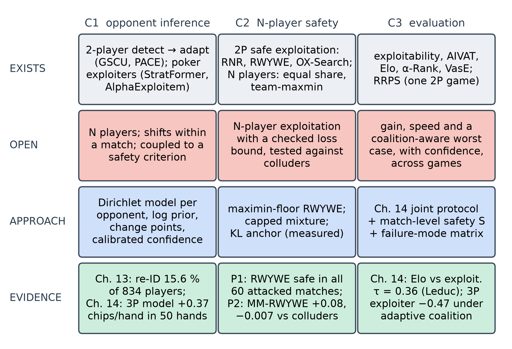
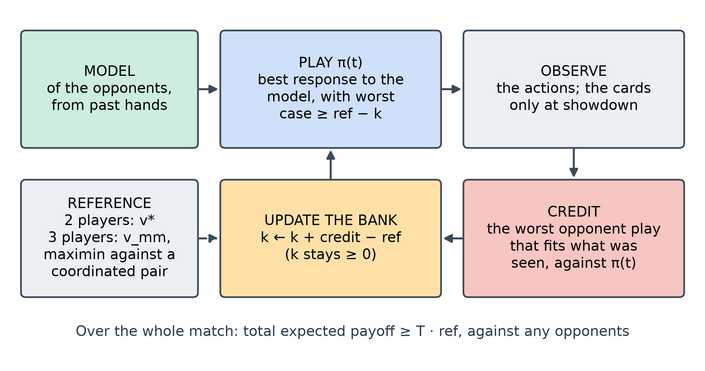
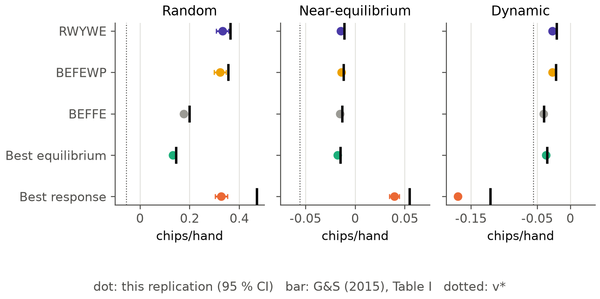
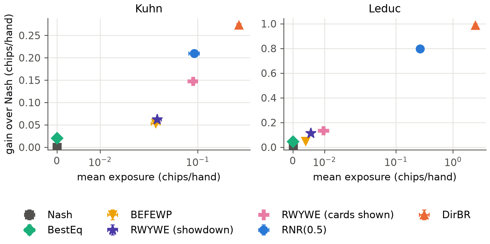
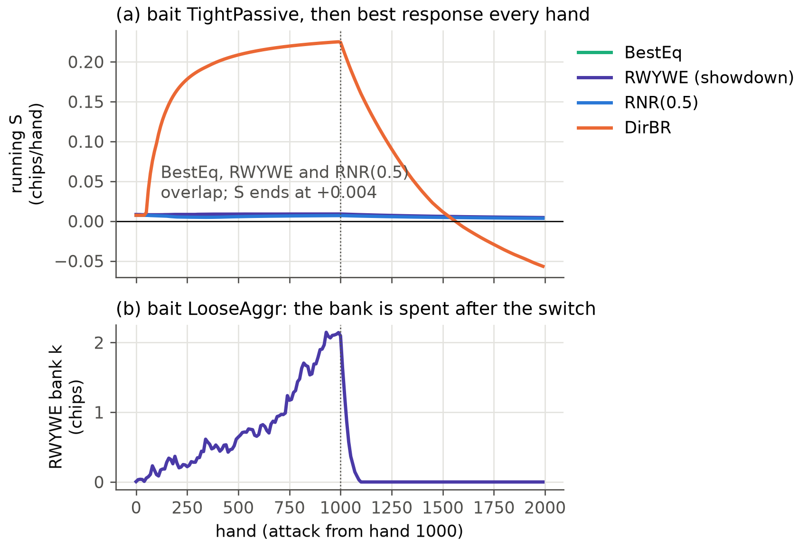
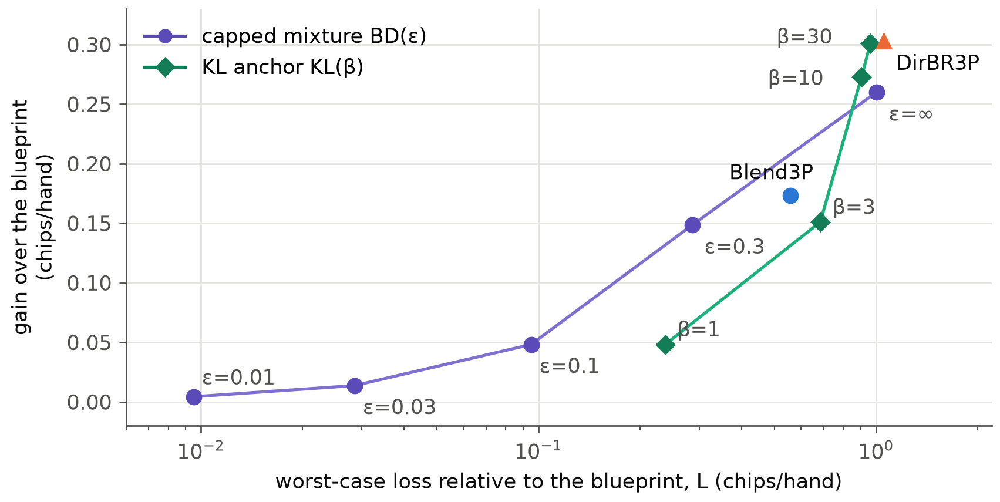
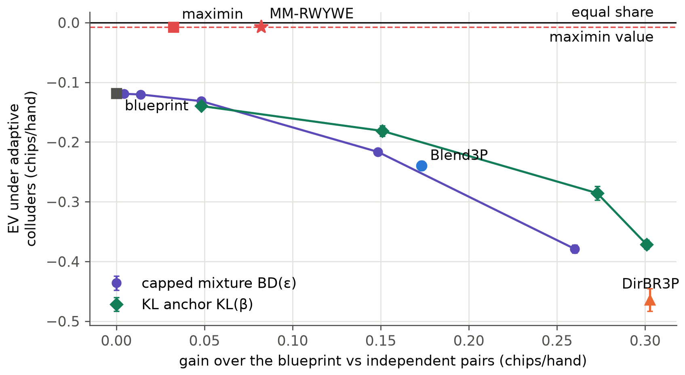

<!--
OFFICIAL PhD TITLE (keep consistent across all documents):
EN: Research on the possibilities for applying Artificial Intelligence in computer games
BG: Изследване на възможностите за приложение на изкуствения интелект в компютърни игри
-->
---
title: "Chapter 15 Summary — Research Frontier Mapping and Contribution Design"
subtitle: "Research on the possibilities for applying Artificial Intelligence in computer games"
author: "Alexander Andreev"
date: "September 2026"
lang: en
vars:
  research_focus: "Adaptive Strategy Learning in Multi-Agent Imperfect-Information Environments"
---

# Chapter 15 — Research Frontier Mapping and Contribution Design

This chapter turns the toolbox of the fourteen chapters before it into a research programme. For each of the three
intended contributions it asks what already exists, what is still open, what the thesis will do,
what evidence shows that it can be done, and what could go wrong. The answers become design
documents, experiment specifications and a publication plan.

The chapter also runs two feasibility pilots. The first implements Ganzfried and Sandholm's safe
exploitation algorithm RWYWE[^gs2015], checks it against their published results, and measures it
with Chapter 14's evaluation protocol; it is the two-player baseline that Chapter 8 lacked. The
second is a first three-player run of the thesis's central experiment: exploitation with a bounded
loss, tested against colluding opponents. **All experimental numbers were measured** on
reproducible runs, with at least five seeds, and are exact wherever the game allows. They are
feasibility evidence for the designs, not the contributions' results. Where a run contradicted
what I expected, the expectation is kept and set against what happened.

**Where this sits in the thesis.** This chapter closes the preparatory programme and opens
Chapters II–IV. It keeps Chapter I's goal, research questions and thesis statement (§ 1.7) and
says where it refines them.

---

## From a learning programme to a research programme

A frontier map is a survey of claimed ground. The April 2026 plan drew one from memory; the
September check found other work near two of its three flags. The plan's first
gap, "no unified detect → adapt framework", is contradicted by GSCU, which switches between a
greedy and a conservative policy against switching opponents in Kuhn poker[^gscu], and by recent
heads-up poker agents that exploit opponents while staying near
equilibrium[^stratformer][^alphaexploitem]. The third gap, "no framework combines exploitability
and ranking", is contradicted by the repeated rock–paper–scissors benchmark, which scores
population return and exploitability together[^rrps]. Only the second gap, exploitation with a
checked loss bound beyond two players, stands at its core, but two of its supporting claims were
wrong. Equal share, each player's fair fraction of the total, provably cannot be secured against
opponents who play different strategies[^equalshare]. And piKL anchors play to an
imitation-learned *human* policy, not to an equilibrium[^pikl][^dilpikl].

The map fixes the level at which each contribution may be claimed. It also sharpens Chapter I's
research questions without changing their subject. RQ1 now asks for inference that is
*calibrated*, because the second contribution sizes its deviation by the model's confidence. RQ2
now names two kinds of bound: one relative to a baseline, and one absolute against a coordinated
pair. RQ3 now asks for safety over the whole match as well as per hand. The thesis statement
stands. Its "predefined, empirically verified bound" now has a precise meaning. In small games a
bound is either exact by construction or checked by exhaustive enumeration; in larger ones it is
estimated with a stated budget.

---

## Contribution 1 — within-match opponent inference

**What exists.** Online opponent modelling with a conservative fallback works in two-player games,
including poker[^gscu][^stratformer][^alphaexploitem], and inside depth-limited search with the
model given in advance[^milec2025]. In three-player Kuhn poker, opponent modelling beats the
equilibrium strategies, but with no safety criterion[^ganzfried2024].

**What is open.** Online inference in N-player imperfect-information games that handles strategy
shifts *within* a match and is coupled to an explicit safety criterion and a common evaluation
protocol. C1 therefore does not claim the detect–adapt loop itself. It claims the loop's extension
to more players and to shifts within a match, together with its coupling to C2 and C3.

**The thesis's approach.** A Dirichlet model per opponent information set (Chapters 7 and 14), a
type prior learned from Chapter 13's styles, change detection that combines several signals and
forgets old data partially (a detector tuned on Kuhn fires on stationary Leduc opponents), and a
confidence with measured calibration, which C2 uses to size its deviation.

**Evidence of feasibility.** Adaptation speed and recovery after a switch were measured in
Section 14.5, and the three-player model's gain against independent pairs in Section 14.7. Real
logs carry the information the model needs: an embedding recognises a player on unseen days 15.6 %
of the time among 834 (chance 0.12 %), and 66 % of players reach a confident online type within
500 hands (Chapter 13).

**Main risk.** The two-player methods may be extended to N players first; the mitigation is to
publish the N-player, within-match, safety-coupled evaluation in 2027.

---

## Contribution 2 — exploitation with a checked loss bound beyond two players

**What exists.** Safe exploitation has a mature two-player theory, from restricted Nash
responses[^johanson2007] and gift-based safety[^gs2015] to adaptation safety in
OX-Search[^oxsearch] and certified per-deployment guarantees[^lihuang2026]; all of it rests on the
two-player minimax value. With three or more players, team-maxmin values guarantee a payoff against
a coordinated coalition[^celli2018] but were classed as very conservative; equal share is
unattainable against heterogeneous opponents[^equalshare]; baseline-relative regret bounds the loss
against a comparator, not in the worst case[^mueller2025]. Exploitation in three-player poker has
been shown without any loss bound[^ganzfried2024].

**What is open (no counter-example found).** Exploiting sub-optimal opponents in N-player
imperfect-information games while bounding the loss relative to a baseline, and testing that bound
against colluding opponents.

**The non-claim.** C2 claims no general N-player safety theorem. It is empirical and works in
small games. Each bound it uses is either exact by construction or checked exactly by enumeration,
and in larger games it will be estimated with a stated budget. Equal share is a reference line in
its figures, never a guarantee: a colluding pair is exactly the heterogeneous case in which equal
share cannot be secured.

**The thesis's approach.** Three deviation rules on one opponent model, each tested exactly in
three-player Kuhn:

1. **A maximin-floor bank.** Ganzfried and Sandholm remark that their method "applies
   straightforwardly" to multiplayer games if the minimax value is replaced by the maximin
   value[^gs2015]. The thesis takes the maximin value against a *coordinated* pair: the
   team-maxmin value. The idea is theirs; the coordinated-pair floor, the exact checks and the
   tests against colluders are the contribution.
2. **A capped mixture.** The agent mixes the blueprint and a best response to its model so that its
   worst-case loss relative to the blueprint, over all opponent pairs including colluding ones,
   stays below ε in every hand.
3. **A KL anchor.** Play stays close to the blueprint in the KL sense, with the pull set by the
   model's confidence. This is the thesis's own proposal, not piKL; it has no a-priori bound, so
   its loss is only measured.

The two kinds of bound answer different questions, and an analogy helps to keep them apart. A
trader who promises "never to end the year below a fixed floor, whatever the market does" gives an
absolute bound. That is the maximin-floor bank: with three players, the floor is what the seat can
guarantee even if the other two act as one. A trader who promises "never to do much worse than
the index fund would have done in the same market" gives a relative bound. That is the capped
mixture, with the blueprint as the index fund. The relative promise is easy to keep and easy to
check, but it is worth only as much as the index: if the blueprint itself is robbed by colluders,
staying close to it is small comfort. The absolute promise needs the maximin value, which the
September check classed as very conservative. Pilot 2 measures both.

**Evidence of feasibility.** The two pilots below. **Main risks.** Exact checks do not scale, so
three-player Leduc will need a learned coalition exploiter, calibrated on three-player Kuhn. The
baseline itself is unsafe against colluders (Section 14.7), so every result is reported both
relative to the blueprint and in absolute terms.

---

## Contribution 3 — a joint evaluation protocol

**What exists.** Evaluation is well developed along separate axes (Section 14.1); one benchmark
combines population return with exploitability, for one two-player game[^rrps].

**What is open.** A protocol that reports gain, adaptation speed and recovery, and worst-case or
coalition-aware robustness, with confidence bounds, applied unchanged across several
imperfect-information games including N-player ones. The claim is framed as "existing evaluation
breaks in these settings, and the protocol catches what it misses", never as a new toolkit.

**The thesis's approach.** Chapter 14's protocol (Section 14.5), extended by one readout,
match-level safety S: the mean over the match of the agent's expected payoff minus its safety
reference. That is Ganzfried and Sandholm's definition of safety, and Pilot 1 shows why per-hand
readouts alone misjudge an agent that banks gains.

**How the three fit together.** C1 turns observations into a model *and* a confidence. C2
decides how far that confidence may move the agent from its safe baseline, under a stated bound.
C3 measures gain, speed, recovery and loss together, which is the only way C1 and C2 can be
claimed at all. The two-player versions (Chapters 7, 8 and 14, and this chapter's RWYWE) are the
reference points for every N-player result.

**Evidence of feasibility.** The failure modes of existing evaluation reproduced in Section 14.8.
**Main risk.** Reviewers may call it a combination of known metrics. The answer is to lead with the
failures that each existing metric misses.

---

## Pilot 1 — RWYWE, the two-player baseline

Chapter 8 imposed its safety floor on every hand: the strategy must guarantee the game value v* in
each hand. The September review found that this is only Ganzfried and Sandholm's baseline, the
*best equilibrium* against the opponent model. Their algorithms define safety over the repeated
game, as at least v* per hand in expectation over the match, and deviate beyond equilibrium by
risking only gifts the opponent has already given[^gs2015]. RWYWE ("risk what you've won in
expectation") keeps a bank k. It plays the best response to its model among strategies whose worst
case is at least v* − k. After each hand it credits the least that strategy could have earned
against any opponent play consistent with what was observed, and adds that credit minus v* to the
bank. In poker the opponent's play off the observed path, and its card when it is not shown down,
must be assumed adversarial[^gs2015]. The bank never goes negative, and summing over hands gives
the guarantee: total expected payoff ≥ T·v* against any opponent.

**Does the implementation reproduce the paper?** The paper's Kuhn experiment was replicated with
400 opponents per class instead of 40,000. The safety result reproduces exactly. Against dynamic
opponents, which play randomly for 100 hands and then best-respond to the agent's current strategy
every hand, all four safe algorithms stay above v* in 400 of 400 matches, while the model-based
best response falls to −0.170 against v* = −0.056. The orderings reproduce as well; the safe
algorithms' levels are 0.001–0.033 chips/hand below the published ones. The best-response row does
not reproduce (0.328 against 0.470), and three readings of the paper's "random" opponents leave
the gap open.

The replication also caught a subtle defect: against a model that looks like an equilibrium, the
LP solver returned an equilibrium that never bluffs the Jack and never bets the King, poor against
slightly deviating opponents. A second LP stage now breaks ties toward the blueprint; without it
the safe algorithms lose a further 0.002–0.046 chips/hand.

**What does RWYWE buy under the joint protocol?** RWYWE was run next to Chapter 14's agents, over
10 seeds and both seats, with gift accounting that uses the opponent's card only at showdown or, as
the paper assumes, always.

RWYWE is a real improvement on Chapter 8's baseline. Its gain over the blueprint is +0.062 ±
0.002 chips/hand on Kuhn and +0.113 ± 0.001 on Leduc, 3.1 and 2.4 times the best equilibrium's
(+0.020 and +0.047), and none of its 120 attacked matches ends below v*. The guarantee is
expensive, however. The restricted Nash response RNR(0.5), which has no guarantee, gains +0.210 on
Kuhn and +0.797 on Leduc, and under these particular attacks fell below v* in only 1 match of 120,
by 0.0007. The unconstrained best responder DirBR fell below in 52 of 120.

The bottleneck is the pessimism of the accounting. With cards used only at showdown, RWYWE's bank
after 1,000 bait hands was 0.01 chips against the TightPassive bait on Kuhn and 0.01–0.02 against
every Leduc bait: everything the opponent did not visibly do must be assumed to be a nemesis, so most gifts
cannot be *proved*. When cards are always shown, the bank reaches 8.5 chips against LooseAggr on
Kuhn and the gain more than doubles, to +0.148; on Leduc, with 468 information sets per player, it
rises only to +0.134. Detecting gifts inside a hand, which the paper describes but did not
test[^gs2015], is the obvious next step.

The teaching attack also exposes a gap in the protocol. Under the LooseAggr bait RWYWE banked 2.19
chips by hand 1,000 and spent them against the attacker within about a hundred hands. Chapter 14's
per-hand teaching-loss readout charges that spending to the agent as unsafe play, yet over the
match RWYWE stays above v*, with S = +0.112 ± 0.025. Per-hand exposure is the right readout for
agents with a fixed deviation rule; for an agent that banks gains, safety is a property of the
whole match. This is why C3 now reports S as well.

---

## Pilot 2 — three players, a coordinated pair and two kinds of bound

With three players there is no game value, so the reference for safety has to be chosen. The
pilot tries both kinds named in RQ2.

**The absolute reference: the team-maxmin value.** The maximin value of each seat of three-player
Kuhn against a coordinated pair was computed exactly (method in the report). The seat values are −0.038, −0.027 and +0.042, a seat average of
−0.0076 chips/hand, only 0.0076 below equal share (zero, since the game is zero-sum). The
blueprint's own coalition value averages −0.119. I expected the "very conservative" gap that the
literature check describes. In this game it is not there: each seat's maximin value is within
0.006–0.011 of the blueprint's self-play value. The finding covers one tiny game and changes
nothing in the gap wording.

**Four agent families**, maximin-floor RWYWE, the capped mixture BD(ε), the KL anchor KL(β) and
baselines (the blueprint, the stationary maximin strategy, Chapter 14's unbounded exploiter
DirBR3P), played seven independent opponent pairs, a fixed colluding pair (the exact coalition
best response to the blueprint) and an adaptive colluding pair, which baits for 1,000 hands and then
plays the exact coalition best response to the agent's *current* policy. Five seeds, all three
seats, exact payoffs per hand.

**Every bound held when checked exactly.** For the capped mixture, the worst-case loss of every
policy in force stayed at or below ε (for example 0.095 at ε = 0.1), and the realised per-hand loss
never exceeded ε under the adaptive colluders. For the maximin-floor agent, the match-level safety
relative to the maximin value was non-negative in all 135 matches (minimum +0.003), and the
coalition value of its policy never fell more than 5·10⁻⁷ below its floor.

**What the bounds buy.** The capped mixture trades about half a chip of gain for each chip of
allowed loss up to ε = 0.3: +0.048 at ε = 0.1 and +0.149 at ε = 0.3, against the unbounded
exploiter's +0.303. The pre-registered hope of 25 % of the unbounded gain at ε = 0.1 was not met
(16 %), because the best response to the model can lose about 0.6 chips/hand relative to the
blueprint, so a small cap allows only a small step towards it. The KL anchor was worse than the
mixture at equal worst-case loss up to about 0.7, which also contradicts its hypothesis.

The second figure changes the picture. Measured by what an adaptive coalition actually takes, the
KL anchor is the better relative rule: at a similar gain, KL(10) keeps −0.286 chips/hand under the
adaptive colluders, the uncapped mixture −0.379 and DirBR3P −0.464. The two robustness readouts,
worst-case loss relative to a baseline and absolute exposure to a coalition, rank the rules
differently, so C3's protocol must report both. And the relative bounds are only as good as the
baseline, which itself loses 0.119 to colluders. The absolute family avoids this: the
maximin-floor agent gains +0.082 over the blueprint against independent pairs (+0.063 with
showdown-only accounting), 27 % of the unbounded exploiter's gain. Under the adaptive colluders it
keeps −0.007, within 0.007 of equal share, where the blueprint gets −0.119.

**What the pilot does not show.** Anything beyond one tiny game, with exact checks that do not
scale, five seeds, one opponent model and one adaptive attacker. The only guarantee involved is Ganzfried and Sandholm's argument transposed to a
coordinated pair. What it does show is that the kind of result C2 aims at can be produced and
checked: exploitation of weak opponents with a loss criterion verified exactly against colluding
ones.

---

## The experiment plan and the publication pipeline

Six experiments, fully specified in the design folder, carry the contributions into Chapters II–IV.

| Experiment | Question | Testbeds | Stage |
|---|---|---|---|
| 1.1 | within-match inference, calibrated | Kuhn, Leduc, 3P Kuhn, 3P Leduc | II–III |
| 1.2 | the same model on real hand histories | public iPoker hands (Chapter 13) | III |
| 2.0 | two-player baseline (RWYWE) | Kuhn, Leduc | done (Pilot 1) |
| 2.1 | N-player bounded exploitation | 3P Kuhn (exact), 3P Leduc (budgeted) | II–III |
| 2.2 | coalition-aware response to colluders | 3P Kuhn, 3P Leduc | III |
| 3.1 | the protocol across games | four games | III–IV |

: The experiment plan (specifications in `implementation/step15/design/experiments.md`).

Experiment 2.2 replaces the plan's So Long Sucker experiment: a planted alliance there costs a
focal baseline only 0.8–1.9 percentage points of win rate (Chapter 14), and about 99.5 % of random
games in that engine end in deadlock (Chapter 11).

The individual study plan asks for an article at the end of each stage; the pipeline maps six
papers onto Chapters II–IV. The first is the joint evaluation protocol of Chapter 14, with this
chapter's RWYWE result as the case that requires match-level safety: it is the yardstick every
later paper uses, its results are exact and complete with no data-access risk, and it carries the
thesis's framing. The target is the IEEE Conference on Games 2027, full papers due 1 March 2027.
The AAMAS 2027 main track (papers due 8 October 2026) was considered as a stretch option and is not
pursued, since Chapter I is due in the same weeks. The flagship paper on safety beyond two players
follows Experiment 2.1 in 2027. The remaining four cover Chapter 13's hand-history pipeline,
within-match inference, coalition-aware exploitation and a cross-game journal version of the
protocol.

---

## Honest notes, limitations, and where this hands off

**What did not, and why it matters.** Three predictions failed and are kept as stated: the capped
mixture did not reach a quarter of the unbounded gain at ε = 0.1, the KL anchor did not beat it at
equal worst-case loss, and the team-maxmin value was not very conservative. One discrepancy is unresolved: the best-response row of the replication. Two things were
caught by checks rather than by luck: the LP tie-breaking defect, and a degenerate LP face on
which the maximin program cycled until an acceptance tolerance was added.

**Limitations.** These are toy games, and the exact worst cases exist only because the games are
tiny. The opponent model and the attack schedules are Chapter 14's. With the realistic accounting, RWYWE's Leduc bank stayed near
zero, so its Leduc result measures the accounting's pessimism more than exploitation. Venue dates
marked as estimates must be confirmed, and the degree's national publication requirements were not
checked here.

**Connections.** The chapter builds on Chapters 7, 8, 11, 13 and 14. Chapter I uses the frontier
map and the refined research questions; Chapter II formalises the two kinds of bound; Chapter III
builds the scaled agent and the coalition-aware response; Chapter IV runs the protocol across
games.

---

## Key takeaways for the thesis synthesis

- **The contributions are claimed at the level the literature allows**: N-player within-match
  inference (C1), a checked loss criterion beyond two players with no general theorem (C2), and a
  joint protocol that catches what existing measures miss (C3).
- **The two-player baseline exists now.** RWYWE gains 2.4–3.1 times the best equilibrium's gain and
  stays safe in all 120 attacked matches, but reaches only 14–30 % of an unguaranteed restricted
  Nash response; proving gifts is the bottleneck.
- **Safety of a gift-banking agent is a property of the match** (S = +0.112), so C3 adds
  match-level safety.
- **With three players both kinds of bound can be enforced and checked exactly.** The
  maximin-floor bank gains +0.082 and keeps −0.007 under adaptive colluders (blueprint −0.119).
- **Relative and absolute robustness disagree.** The KL anchor loses to the capped mixture on the
  relative worst case but keeps much more against an adaptive coalition.
- **The first publication is the protocol paper**, for IEEE CoG 2027 (1 March 2027); AAMAS 2027
  was considered and is not pursued.

<!-- Source footnotes. Verified entries from deliverables/finalReview/lit_gaps.md and
     lit_evaluation.md (2026-09-24); Ganzfried & Sandholm (2015) read in full for this chapter
     (authors' PDF, 2026-09-25). See implementation/step15/EXECUTION_NOTES.md. -->

[^gs2015]: Ganzfried, S. & Sandholm, T. (2015). "Safe Opponent Exploitation." *ACM Transactions on Economics and Computation* 3(2), Article 8. DOI 10.1145/2716322 — safety over the repeated game (Def. 4.1); RWYWE, BEFFE and BEFEWP (§ 6); extensive-form updates (§ 8); multiplayer games with the maximin value (§ 2.3); Kuhn experiments (§ 9, Table I).

[^gscu]: Fu, H., Tian, Y., Yu, H., Liu, W., Wu, S., Xiong, J., Wen, Y., Li, K., Xing, J., Fu, Q. & Yang, W. (2022). "Greedy when Sure and Conservative when Uncertain about the Opponents." *ICML*, PMLR 162, 6829–6848.

[^stratformer]: Caen, A., Winands, M. H. M. & Soemers, D. J. N. J. (2026). "StratFormer: Adaptive Opponent Modeling and Exploitation in Imperfect-Information Games." *Computers and Games 2026* (accepted); arXiv:2604.25796.

[^alphaexploitem]: Murgoci, V., Spaan, M. & Oren, Y. (2026). "AlphaExploitem: Going beyond the Nash Equilibrium in Poker by Learning to Exploit Suboptimal Play." *arXiv:2605.09150* (preprint).

[^rrps]: Lanctot, M., Schultz, J., Burch, N., Smith, M. O., Hennes, D., Anthony, T. & Pérolat, J. (2023). "Population-based Evaluation in Repeated Rock-Paper-Scissors as a Benchmark for Multiagent Reinforcement Learning." *Transactions on Machine Learning Research*; arXiv:2303.03196.

[^equalshare]: Ge, J., Wang, Y., Li, W. & Jin, C. (2025). "Securing Equal Share: A Principled Approach for Learning Multiplayer Symmetric Games." *ICML*, 18989–19010; arXiv:2406.04201 — equal share cannot be secured against opponents playing different strategies (Prop. 4.1).

[^pikl]: Jacob, A. P., Wu, D. J., Farina, G., Lerer, A., Hu, H., Bakhtin, A., Andreas, J. & Brown, N. (2022). "Modeling Strong and Human-Like Gameplay with KL-Regularized Search." *ICML*; arXiv:2112.07544.

[^dilpikl]: Bakhtin, A., Wu, D. J., Lerer, A., Gray, J., Jacob, A. P., Farina, G., Miller, A. H. & Brown, N. (2023). "Mastering the Game of No-Press Diplomacy via Human-Regularized Reinforcement Learning and Planning." *ICLR*; arXiv:2210.05492.

[^milec2025]: Milec, D., Kovařík, V. & Lisý, V. (2025). "Adapting Beyond the Depth Limit: Counter Strategies in Large Imperfect Information Games." *AAMAS* (extended abstract), 2675–2677; arXiv:2501.10464.

[^ganzfried2024]: Ganzfried, S., Wang, K. A. & Chiswick, M. (2024). "Opponent Modeling in Multiplayer Imperfect-Information Games." *Proc. DAI '24*, 39–45. DOI 10.1145/3719545.3721108.

[^johanson2007]: Johanson, M., Zinkevich, M. & Bowling, M. (2007). "Computing Robust Counter-Strategies." *NIPS 2007* — restricted Nash response.

[^oxsearch]: Ge, Z., Xu, Z., Ding, T., Meng, L., An, B., Li, W. & Gao, Y. (2024). "Safe and Robust Subgame Exploitation in Imperfect Information Games." *ICML*, PMLR 235, 15255–15270.

[^lihuang2026]: Li, B. & Huang, L. (2026). "Agents that Certify their Own Exploits: Confidence-Scheduled Restricted Responses for Safe Opponent Exploitation." *arXiv:2607.28520* (preprint).

[^celli2018]: Celli, A. & Gatti, N. (2018). "Computational Results for Extensive-Form Adversarial Team Games." *AAAI* 32(1). DOI 10.1609/aaai.v32i1.11462; see also Zhang, Y., An, B. & Černý, J. (2021). "Computing Ex Ante Coordinated Team-Maxmin Equilibria in Zero-Sum Multiplayer Extensive-Form Games." *AAAI* 35(6), 5813–5821.

[^mueller2025]: Müller, A., Schneider, J., Skoulakis, S., Viano, L. & Cevher, V. (2025). "Best of Both Worlds: Regret Minimization versus Minimax Play." *ICML*; arXiv:2502.11673.
