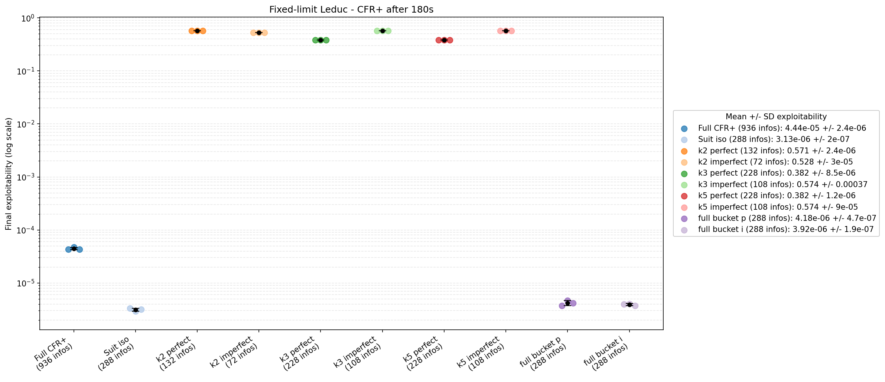

# Step 04 CFR+ Abstraction Experiment Results

This report summarizes the timed CFR+ abstraction experiment in
`implementation/step04/phase4/day07_cfrplus_panels.py`.

## Experiment Setup

- Algorithm: CFR+ with regret flooring and linear strategy averaging.
- Training budget: 180 seconds of training time per configuration.
- Repetitions: 3 runs per configuration, using seeds 1, 2, and 3.
- Metric: final exploitability after the 180-second training budget.
- Evaluation: each abstraction is evaluated in its own full game family.
- Raw results:
  - `phase4/.day07_cfrplus_results.json`
  - `phase4/.day07_cfrplus_results.csv`

The seed variance is small because CFR+ is deterministic. Seeds mainly
affect bucket construction where k-means is used, and otherwise mostly
capture minor wall-clock iteration-count differences.

## Figures

### Fixed-limit Leduc

### Mini no-limit Leduc

### Extended Leduc

## Fixed-limit Leduc Results

| Configuration | Info sets | Mean exploitability | Std. dev. | Mean iterations |
|---|---:|---:|---:|---:|
| Full CFR+ | 936 | 4.44217e-05 | 2.42e-06 | 2654.7 |
| Suit iso | 288 | 3.13253e-06 | 2.01e-07 | 14185.0 |
| k2 perfect | 132 | 0.571029 | 2.38e-06 | 11399.0 |
| k2 imperfect | 72 | 0.528437 | 2.97e-05 | 11708.0 |
| k3 perfect | 228 | 0.382288 | 8.47e-06 | 11043.3 |
| k3 imperfect | 108 | 0.574311 | 0.000368 | 11475.3 |
| k5 perfect | 228 | 0.382285 | 1.21e-06 | 11185.3 |
| k5 imperfect | 108 | 0.574192 | 8.96e-05 | 11358.3 |
| full bucket p | 288 | 4.18244e-06 | 4.70e-07 | 10806.3 |
| full bucket i | 288 | 3.92444e-06 | 1.95e-07 | 11266.7 |

The lossless suit-isomorphic abstraction is the strongest fixed-limit
result. It reduces the game from 936 to 288 information sets and reaches
lower exploitability than full CFR+ under the same wall-clock budget
because it completes many more CFR+ iterations.

The full-bucket variants behave like the suit-isomorphic abstraction,
which is expected: once every rank/post-flop case has its own bucket, the
remaining compression is effectively suit isomorphism.

The lossy bucket abstractions have persistent exploitability. More CFR+
iterations do not close the gap, which indicates abstraction error rather
than insufficient solving time. In this small Leduc setting, `k5` matches
`k3` because the post-flop hand-strength distributions collapse into
three effective shapes.

## Mini No-limit Leduc Results

| Configuration | Info sets | Mean exploitability | Std. dev. | Mean iterations |
|---|---:|---:|---:|---:|
| Full mini-NL | 4,704 | 0.00691681 | 7.50e-05 | 438.7 |
| Action abs | 936 | 0.672845 | 1.30e-05 | 2338.0 |

The full mini no-limit game is much larger than fixed-limit Leduc, but
CFR+ still drives exploitability below 0.01 in 180 seconds. The
action-abstracted strategy trains many more iterations because the tree
is smaller, but its final exploitability remains high. This is a strong
signal that the restricted action set and deployment translator dominate
the error.

This panel should be interpreted as an action-abstraction result, not a
card-abstraction result.

## Extended Leduc Results

| Configuration | Info sets | Mean exploitability | Std. dev. | Mean iterations |
|---|---:|---:|---:|---:|
| Full extended | 10,304 | 0.0271505 | 0.00161 | 111.0 |
| Suit iso | 2,968 | 0.00125990 | 0.000103 | 671.3 |
| Suit + action | 504 | 4.69614 | 3.47e-05 | 4144.7 |
| Suit + action + buckets | 108 | 4.73447 | 2.87e-05 | 3693.7 |

Extended Leduc confirms the value of lossless suit abstraction at a
larger scale. The full game reaches mean exploitability 0.027 after 180
seconds, while suit isomorphism reaches 0.00126 with the same training
budget. The reason is computational: the lossless abstraction reduces
the information-set count by about 71% and allows roughly six times more
CFR+ iterations.

The action-abstracted Extended configurations are highly exploitable
under the current deployment mapping. The result is useful as a failure
case: aggressive action abstraction can dominate the benefit from
smaller game size.

## Main Conclusions

1. Lossless abstraction is clearly beneficial under fixed wall-clock
   budgets. Suit isomorphism improves convergence in both fixed-limit
   and Extended Leduc without introducing abstraction error.

2. Lossy card bucketing has visible and persistent exploitability in
   standard Leduc. The smaller tree solves faster, but the final strategy
   remains exploitable because information has been merged.

3. Action abstraction is the riskiest abstraction family in these
   experiments. In both mini no-limit and Extended Leduc, the reduced
   action set trains faster but produces high exploitability when
   evaluated in the full action game.

4. Three-minute runs are enough to separate the main effects. The
   lossless abstractions reach near-zero exploitability; lossy bucket and
   action abstractions remain high after many more iterations.

## Limitations

- CFR+ is deterministic, so three seeds do not represent independent
  stochastic training runs for most configurations.
- Bucket variance is limited by the small number of Leduc hand-strength
  shapes.
- The action-abstraction results depend on the current translator and
  deployment semantics.
- Extended Leduc action-abstraction exploitability should be treated as
  a diagnostic failure mode, not as a final architecture result.
