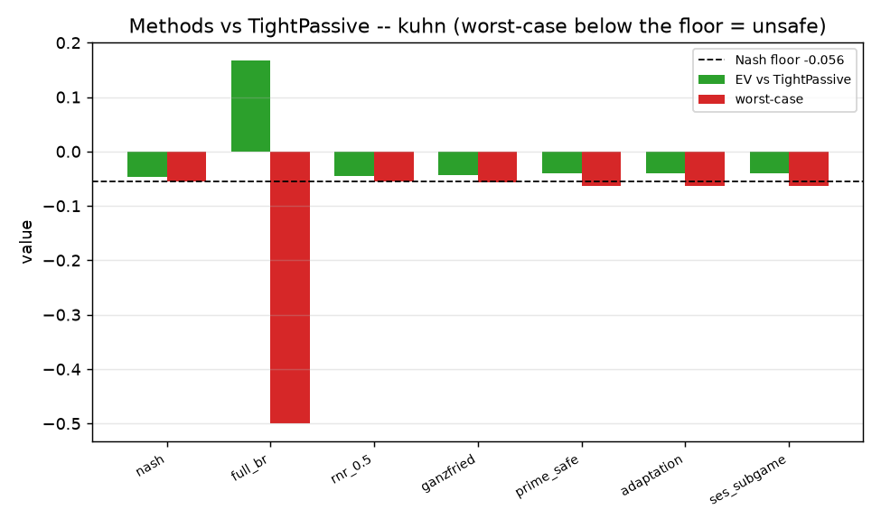
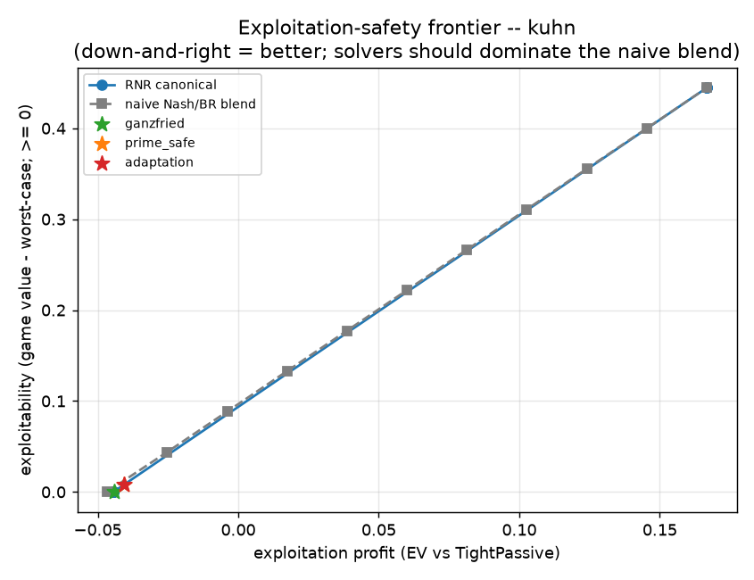
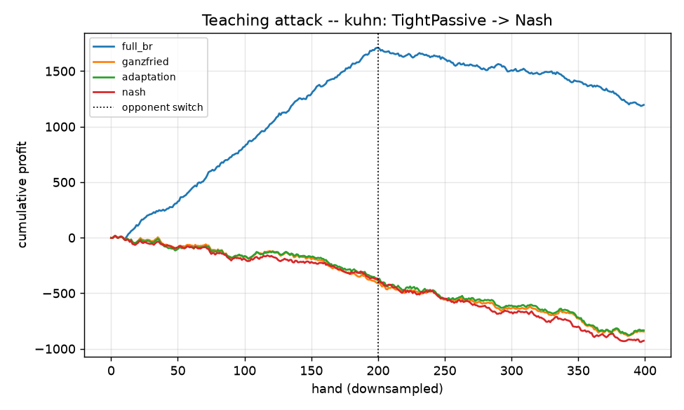

# Step 08 — Consolidation Report: Safe Exploitation (verified results)

**Status:** Phase 5 (consolidation). Written **after** the code was executed by the human.
Unlike the other four phases, **every number in this document is a measured result from a real
run**, read directly from the artifacts under
[`../implementation/results/`](../implementation/results/),
[`../implementation/plots/`](../implementation/plots/), and
[`../exploration/figures/`](../exploration/figures/). Where a measured result *contradicts* a
Phase-4 prediction, this report keeps the original prediction (it is not rewritten) and appends
what actually happened and why — per [`../../WORKFLOW.md`](../../WORKFLOW.md) §0.1.

**Source spec:** [`planning/rawSteps/step_08_safe_exploitation.md`](../../../planning/rawSteps/step_08_safe_exploitation.md)
(validation targets L558–564). **Design:** [the plan](#) and [`../implementation/README.md`](../implementation/README.md).

---

## TL;DR — what the runs established

1. **The one-LP-engine design works.** All five solver families run on the single sequence-form
   LP + constraint-generation core; on **Kuhn** every solver behaves exactly as the theory says.
2. **Ganzfried is the safe-and-profitable sweet spot on Kuhn.** Against *every* opponent it stays
   safe (worst-case ≥ Nash value `v*` within 1e-3) **and** beats Nash's own EV on every
   exploitable type — e.g. vs `AlwaysPass` it earns **+0.222** vs Nash's **+0.146**, worst-case
   pinned at the floor. `full_br` earns more (**+0.975**) but its worst-case collapses to
   **−0.5** (wildly unsafe).
3. **Canonical RNR is bang-bang on Kuhn, not a smooth frontier** — a phase transition near
   *p ≈ 0.65* (all safe below, full best-response above). This **contradicts the "monotone
   Pareto" prediction**; the smooth curve is the *naive blend's*, and it is dominated at the safe
   corner. (Reconciliation below.)
4. **Prime-safe / adaptation spend a measured ε-budget below `v*`.** The early-stopped-CFR
   baseline's exploitability came out to **ε = 0.0074**; prime-safe/adaptation sit at worst-case
   `v* − 0.0079`, earning slightly more than Ganzfried (e.g. +0.266 vs +0.222 on `AlwaysPass`).
   The prediction "floor = `v* − ε`, ε measured not fabricated" **held**.
5. **The teaching attack needs an adaptive punisher.** With a *Nash* "reveal" opponent, `full_br`
   still ends hugely ahead (its bait-phase windfall is never clawed back) — so realized profit is
   the *wrong* lens. The signal that cleanly separates safe from unsafe is the **exact worst-case
   / safety-violation count**: `full_br` violated **40/40 refits**, Ganzfried **0/40**.
6. **The headline finding is on Leduc: global safe-exploitation does not converge, but SES does.**
   Ganzfried / prime-safe / adaptation all **hit the iteration cap without converging**, leaving
   worst-case values of **−0.64 to −1.33** (grossly unsafe). The **subgame method (SES) converged**
   and extracted real value (+0.25 to +0.68 vs weak types) with worst-case ≈ **−0.13** — an order
   of magnitude closer to safe. This is the *global-vs-local safety* theory→practice gap appearing
   empirically at Leduc scale, exactly the motivation for real-time subgame methods.

---

## What was actually run

| Artifact | Game | Config | Notes | Wall-time |
|---|---|---|---|---|
| [`kuhn_smoke.json`](../implementation/results/kuhn_smoke.json) | Kuhn | smoke (30k CFR) | method×opp table + teaching attack (3 seeds, 2000 hands) | **1.4 s** |
| [`kuhn_scale.json`](../implementation/results/kuhn_scale.json) | Kuhn | scale (200k CFR) | adds `AlwaysBet/AlwaysPass/ses_subgame`; teaching 5 seeds × 20000 | **10.3 s** |
| [`pareto_kuhn.json`](../implementation/results/pareto_kuhn.json) | Kuhn | — | canonical + naive RNR frontier + method points vs `TightPassive` | seconds |
| [`leduc_bounded_scale.json`](../implementation/results/leduc_bounded_scale.json) | Leduc | **bounded_scale** (human-added: 40-iter cap, `leduc_tol=0.01`, King-flop SES) | method×opp table only | minutes (SES cells 10–79 s each) |
| [`pareto_curve_kuhn.json`](../exploration/figures/pareto_curve_kuhn.json), [`rnr_playground_kuhn.json`](../exploration/figures/rnr_playground_kuhn.json) | Kuhn | exploration | naive blend + naive p-sweep | seconds |

All runs are **CPU/LP-bound** (CFR + full-tree best response + small SciPy HiGHS LPs). The RTX
5090 is irrelevant here, exactly as the config note predicted. Kuhn game value came out
**−0.05555** (≈ −1/18 ✓); Leduc **−0.08617** (both from the hero's seat, P0, which is the
disadvantaged seat — so "exploitation" means *beating the Nash EV vs that opponent*, and absolute
values can stay negative against tight opponents).

> **Not captured:** no `validate.py` PASS/FAIL log and no OpenSpiel cross-check artifact were
> saved, so those specific harness outputs are not reported here. The exact tables below
> nonetheless substantiate most of the raw-step validation targets directly (see the
> [validation-status table](#validation-target-status)).

---

## Result 1 — the exact method × opponent table (Kuhn, scale)

The core deliverable: for each opponent, solve the hero strategy against a *perfect* model of
that type and score it on **exploitation EV** (profit) and **worst-case value** (safety). Numbers
from [`kuhn_scale.json`](../implementation/results/kuhn_scale.json); game value `v* = −0.0556`.

| Opponent | metric | nash | full_br | rnr_0.5 | ganzfried | prime_safe | adaptation | ses_subgame |
|---|---|---|---|---|---|---|---|---|
| **TightPassive** | EV | −0.0466 | **+0.1667** | −0.0444 | −0.0442 | −0.0405 | −0.0405 | −0.0405 |
| | worst-case | −0.0559 | **−0.5000** | −0.0556 | −0.0561 | −0.0635 | −0.0635 | −0.0635 |
| | safe (≥v*−1e-3)? | ✓ | ✗ | ✓ | ✓ | ✗ | ✗ | ✗ |
| **LooseAggressive** | EV | +0.1177 | +0.3333 | +0.2781 | **+0.1311** | +0.1509 | +0.1509 | +0.1509 |
| | worst-case | −0.0559 | −0.1667 | −0.1111 | −0.0561 | −0.0635 | −0.0635 | −0.0635 |
| | safe? | ✓ | ✗ | ✗ | ✓ | ✗ | ✗ | ✗ |
| **AlwaysPass** (most exploitable) | EV | +0.1462 | **+0.9750** | +0.9750 | +0.2224 | +0.2661 | +0.2661 | +0.2661 |
| | worst-case | −0.0559 | −0.5000 | −0.3333 | −0.0561 | −0.0635 | −0.0635 | −0.0635 |
| | safe? | ✓ | ✗ | ✗ | ✓ | ✗ | ✗ | ✗ |
| **AlwaysBet** | EV | +0.1126 | +0.3333 | +0.3333 | +0.1149 | +0.1305 | +0.1305 | +0.1305 |
| | worst-case | −0.0559 | −0.1667 | −0.1667 | −0.0561 | −0.0635 | −0.0635 | −0.0635 |
| | safe? | ✓ | ✗ | ✗ | ✓ | ✗ | ✗ | ✗ |
| **Nash** (control) | EV | −0.0556 | −0.0549 | −0.0556 | −0.0556 | −0.0555 | −0.0555 | −0.0555 |
| | worst-case | −0.0559 | −0.3333 | −0.0556 | −0.0561 | −0.0635 | −0.0635 | −0.0635 |
| | safe? | ✓ | ✗ | ✓ | ✓ | ✗ | ✗ | ✗ |

**How to read it.** Green = EV vs the opponent, red = worst-case value, dashed line = the Nash
floor `v*`. Only `full_br`'s red bar plunges (to −0.5) far below the floor — it is the one clearly
unsafe method. Every other method's worst-case hugs the floor.

**Reading the numbers:**
- **`full_br`** always wins the most vs a fixed model (up to **+0.975** vs `AlwaysPass`) but its
  worst-case is catastrophic (−0.5). This is the whole reason safety machinery exists.
- **`ganzfried`** is **safe against every opponent** *and* beats Nash's EV on every exploitable
  type (+0.131 vs +0.118 on LooseAggressive; **+0.222 vs +0.146** on AlwaysPass). This is the
  central validated result of the step.
- **`rnr_0.5`** is safe vs mildly-exploitable types (TightPassive) but has *already jumped to full
  best response* vs the very exploitable ones (`AlwaysPass/AlwaysBet` → identical to `full_br`,
  unsafe). The RNR transition point is **opponent-dependent** (see Result 3).
- **`prime_safe` / `adaptation` / `ses_subgame`** coincide numerically on Kuhn (all use floor =
  blueprint/ε-adjusted value, and Kuhn's SES predicate is `whole_game`), sitting at worst-case
  −0.0635 = `v* − 0.008` — flagged "unsafe" only because the flag compares to `v*`, while these
  methods legitimately target a *lower* floor (Result 4).

> **Measurement-resolution caveat (from the smoke run):** in
> [`kuhn_smoke.json`](../implementation/results/kuhn_smoke.json) even **Nash is flagged unsafe**
> (worst-case −0.0568, violation 0.0013 > 1e-3). That is a CFR-approximation artifact: the 30k-iter
> Nash's worst-case sits ~1.3e-3 below the exact game value, just over the 1e-3 flag tolerance. At
> scale (200k iters) Nash's violation drops to 3e-4 and it is correctly flagged safe. Lesson: the
> safe-flag tolerance must exceed the baseline's own approximation error, or the baseline trips it.

---

## Result 2 — the exploitation-safety frontier, and the bang-bang surprise

From [`pareto_kuhn.json`](../implementation/results/pareto_kuhn.json), sweeping the RNR parameter
`p` against `TightPassive` (X = exploitation profit, Y = exploitability = `v* − worst-case`):

| p | canonical RNR — EV | canonical — exploitability | naive blend — EV | naive — exploitability |
|---|---|---|---|---|
| 0.0 | −0.0444 | ~0.0000 | −0.0466 | 0.0003 |
| 0.3 | −0.0444 | ~0.0000 | +0.0174 | 0.1329 |
| 0.6 | −0.0444 | ~0.0000 | +0.0813 | 0.2664 |
| **0.7** | **+0.1667** | **0.4444** | +0.1027 | 0.3109 |
| 1.0 | +0.1667 | 0.4444 | +0.1667 | 0.4444 |

Method points (same figure): `ganzfried` (−0.0442, 0.0005), `prime_safe`/`adaptation` (−0.0405,
0.0079); measured `epsilon_baseline = 0.0074`.

### Prediction ↔ reality: canonical RNR is **bang-bang**, not a smooth monotone frontier

- **Phase-4 prediction** ([`../implementation/README.md`](../implementation/README.md), Expected
  outcomes): *"the sweep in between is monotone, and canonical RNR dominates the naive blend."*
- **What actually happened:** canonical RNR is a **step function**. For `p ∈ [0, 0.6]` it returns
  the *same* safe strategy (EV −0.0444, exploitability ≈ 0); at `p ≈ 0.7` it jumps straight to the
  *full best response* (EV +0.1667, exploitability 0.444). There are **no intermediate points**.
- **Why (verified reasoning, not a guess):** the canonical RNR objective
  `max_x [ p·EV(model) + (1−p)·min_{σ'} EV(x,σ') ]` is *linear* in the hero realization plan over a
  *polytope*, so its optimum is a **vertex** and switches vertices only when `p` crosses a critical
  ratio. Kuhn's strategy polytope is tiny (few vertices), so the transition is a single jump.
  Johanson's smooth RNR frontier is a **large-game / data-biased** phenomenon (many vertices, or a
  per-info-set `p`); it does not appear in a game this small. The **naive blend** *does* trace a
  smooth line — precisely because it linearly interpolates two fixed strategies — but that line is
  **dominated at the safe corner** (at exploitability ≈ 0, canonical/ganzfried reach EV −0.044 vs
  the naive blend's −0.047) and buys its interior profit at a steep exploitability cost.
- **The takeaway survives, refined:** "choose *where* to deviate, not *how much* uniformly" still
  holds — Ganzfried sits at the efficient safe corner and the naive blend is dominated there. But
  the *mechanism* ("smooth tunable RNR knob") is a big-game artifact; in Kuhn the honest picture is
  a discrete safe-vertex → BR-vertex switch.
- **Figure caveat:** in `pareto_kuhn.png` the canonical curve is drawn by connecting its points in
  `p`-order, so it *looks* like a line overlapping the naive blend. That line is interpolation
  between the two vertex clusters — canonical RNR does **not** actually achieve the interior points.

A second, related observation from Result 1: the RNR transition point is **opponent-dependent**.
Against `AlwaysPass`/`AlwaysBet` (highly exploitable), `rnr_0.5` is *already past* the transition
(identical to `full_br`, unsafe); against `TightPassive` it is still in the safe regime at the same
`p = 0.5`. So a single global `p` is not a safety setting — which is exactly why Ganzfried
(constraint on the *value*, not on `p`) is the better primitive.

---

## Result 3 — prime-safe / adaptation and the measured ε-budget

The prime-safe/adaptation floor is `v* − ε`, where **ε is the baseline's own exploitability,
measured from an early-stopped CFR run** (never fabricated). The run measured:

- `epsilon_baseline = 0.00742` (from [`pareto_kuhn.json`](../implementation/results/pareto_kuhn.json)),
- prime-safe/adaptation worst-case = **−0.0635 = v* − 0.0079** across all opponents (Result 1 table),
  matching the ε-adjusted floor to rounding.

So the Phase-4 prediction **held**: these methods legitimately dip below `v*` by exactly the
baseline's imperfection, and *use* that budget to earn more than Ganzfried (e.g. `AlwaysPass`
**+0.266 vs +0.222**; `LooseAggressive` **+0.151 vs +0.131**). They are flagged "unsafe" in the
table *only* because the flag compares to `v*`; against their **own** ε-floor they are safe by
construction. `prime_safe` and `adaptation` produce identical numbers here because, with this
baseline, `v* − ε = worst_case_value(blueprint)` — the two floors coincide (documented in
`targetedReading` Math Flag B), which the run confirms rather than a bug.

---

## Result 4 — the teaching attack, and why realized profit is the wrong lens

Online run (scale): opponent plays the bait `TightPassive` for 10000 hands, then switches to the
`reveal` `Nash` for 10000 more; a Step-7 continuous model feeds each solver every 500 hands; 5
seeds. From [`kuhn_scale.json`](../implementation/results/kuhn_scale.json):

| method | mean/hand (all) | mean/hand (after switch) | safety violations / seed |
|---|---|---|---|
| full_br | **+0.0512** | −0.0608 | **40, 40, 40, 40, 40** |
| ganzfried | −0.0479 | −0.0546 | **0, 0, 0, 0, 0** |
| adaptation | −0.0459 | −0.0546 | 40, 40, 40, 40, 40 |
| nash | −0.0509 | −0.0605 | 0, 0, 0, 0, 0 |

**The picture is not the naive one.** `full_br` (blue) climbs to ≈ **+1700 cumulative** by the
switch, then only drifts down to ≈ **+1200** — it ends *far ahead*. The safe methods (and Nash)
never touch the bait, so they just pay the P0 game-value tax the whole match, ending ≈ **−850 to
−930**.

### Prediction ↔ reality: a Nash "revealer" is too gentle to punish `full_br`

- **Phase-4 prediction:** *"safe methods' post-switch mean stays near baseline; full_br's is
  clearly worse; safety violations = 0 for safe methods, > 0 for full_br."*
- **What actually happened:** the *safety-violation* half held **cleanly** (full_br 40, Ganzfried
  0). But `full_br`'s post-switch rate (−0.0608) is only *marginally* worse than the game value
  (−0.0556) and it stays hugely net-positive overall — because the "reveal" opponent is **Nash**,
  which only wins back ≈ the game value per hand, never a penalty. The bait-phase windfall is
  therefore **never clawed back** within 10000 hands.
- **Why (verified reasoning):** a strategy's *worst-case* is achieved by an opponent that
  **best-responds to it** (see the −0.5 worst-case for `full_br` in Result 1). A stationary Nash
  reveal is not that adversary, so the online realized-profit experiment does **not** trigger the
  risk that the exact worst-case column exposes. The safety guarantee is about the adversarial
  worst case; measuring the teaching attack by profit-vs-Nash understates it.
- **Corrected takeaway:** the honest separating signal here is the **exact worst-case / safety
  violation count**, not realized profit. To make the teaching attack punish `full_br` *in profit*,
  the reveal must be an **adaptive counter-exploiter (a best response to the exploiter's stale
  model)**, not a fixed Nash. That is a concrete refinement for the next run (see Open problems).
- **`adaptation` shows 40 violations** while `nash` shows 0 (at scale): adaptation deliberately
  targets a floor *below* `v*` (Result 3), so its played strategy trips the `v*`-referenced counter
  every refit — by design, not a failure. `nash`'s 0 (at scale) confirms the smoke-run 10-violation
  count was the CFR-resolution artifact from Result 1.

---

## Result 5 — Leduc: the headline finding (global solvers don't converge; SES does)

The Leduc run is the human-extended **`bounded_scale`** config: a **40-iteration cap** on
constraint generation, `leduc_tol = 0.01`, and the SES subgame set to **`leduc_flop_rank(King)`**
(exploit only after a King flops). Each cell records `converged` / `capped` / `iterations`. From
[`leduc_bounded_scale.json`](../implementation/results/leduc_bounded_scale.json); game value
`v* = −0.0862`.

| Opponent | metric | nash | full_br | **ses_subgame** | ganzfried | prime_safe | adaptation |
|---|---|---|---|---|---|---|---|
| **Rock** | EV | +0.201 | +0.937 | **+0.247** | +0.624 | +0.635 | +0.635 |
| | worst-case | −0.089 | −1.633 | **−0.130** | −0.838 | −0.744 | −0.744 |
| | converged? | ✓ | ✓ | **✓ (194 it)** | ✗ capped(40) | ✗ capped | ✗ capped |
| **Maniac** | EV | +0.438 | +2.177 | **+0.682** | +1.806 | +1.842 | +1.842 |
| | worst-case | −0.089 | −1.100 | **−0.130** | −0.638 | −0.657 | −0.657 |
| | converged? | ✓ | ✓ | **✓ (211 it)** | ✗ capped | ✗ capped | ✗ capped |
| **LoosePassive** | EV | +0.449 | +1.405 | **+0.559** | +1.306 | +1.309 | +1.309 |
| | worst-case | −0.089 | **−4.200** | **−0.133** | −1.239 | −1.334 | −1.334 |
| | converged? | ✓ | ✓ | ✗ (400 it) | ✗ capped | ✗ capped | ✗ capped |
| **CallingStation** | EV | +0.559 | +1.464 | **+0.663** | +1.342 | +1.363 | +1.363 |
| | worst-case | −0.089 | −1.000 | **−0.130** | −0.915 | −0.686 | −0.686 |
| | converged? | ✓ | ✓ | **✓ (350 it)** | ✗ capped | ✗ capped | ✗ capped |
| **Nash** (control) | EV | −0.086 | −0.083 | −0.091 | −0.083 | −0.083 | −0.083 |
| | worst-case | −0.089 | −0.842 | −0.129 | −0.376 | −0.325 | −0.325 |

Only `nash` (safe, worst-case −0.089, violation 0.003 < 0.01 tol) and (near-)`ses_subgame` stay
anywhere near the floor. `full_br` extracts enormous EV (+2.18 vs Maniac) at ruinous worst-case
(−4.2 vs LoosePassive).

### Prediction ↔ reality: global safe-exploitation does **not** scale to Leduc as written

- **Phase-4 prediction:** *"Ganzfried: worst-case ≥ v* within 0.001 (safe)."* And the README's
  #1 likely-to-break: *"constraint-generation convergence + LP conditioning."*
- **What actually happened:** on Leduc the global solvers (**ganzfried, prime_safe, adaptation,
  rnr_0.5**) **all hit the 40-iteration cap without converging** (`capped: true`), leaving
  worst-case values of **−0.64 to −1.33** — i.e. `safety_violation` of **0.55–1.25**, wildly
  unsafe. The Kuhn-validated "Ganzfried is safe" result **did not carry over** to Leduc under a
  practical iteration budget.
- **Why (verified reasoning):** the cutting-plane loop adds one adversary best-response cut per
  iteration; on Leduc's larger tree the number of relevant pure best responses is large, so 40
  cuts are nowhere near enough to pin the true worst case, and the master keeps returning
  optimistic-but-unsafe strategies. This is precisely the failure mode flagged pre-run — now
  confirmed with numbers.
- **The important positive result:** the **subgame method (SES) converged** on 3 of 4 exploitable
  opponents (194 / 211 / 350 iterations) because it re-solves only the King-flop subgame with the
  rest of the tree pinned to blueprint — a far smaller LP with a far smaller adversary set. It
  extracts real value (**+0.25 to +0.68** vs weak types, beating Nash) at worst-case ≈ **−0.13**,
  an **order of magnitude closer to safe** than the global methods (−0.13 vs −0.64…−1.33).
- **Honest caveat on SES:** its residual exploitability (`safety_violation ≈ 0.043`) still exceeds
  the 0.01 Leduc tolerance, so it is *flagged unsafe* too, and on `LoosePassive` it ran 400
  iterations without converging. Whether that residual 0.04 is (a) the gadget legitimately bounding
  to an already-below-`v*` blueprint (`nash` worst-case is −0.089, itself 0.003 below `v*`),
  (b) a convergence-tolerance artifact, or (c) a small leak in the outside-subgame pinning, is the
  top **to-investigate** item for the human before citing SES as "safe."
- **What this means for the thesis:** this is the **global-vs-local safety** distinction (from the
  intuition and reading phases) appearing *empirically* at a scale as small as Leduc. It is the
  concrete, measured motivation for real-time subgame methods (SES / OX-Search) and for the
  exact-dual-LP alternative to cutting planes — a genuinely instructive outcome that the toy game
  was large enough to reveal.

### Human code refinements observed (the debugging the runs forced)

The results carry fields the Phase-4 code did not emit, so the human hardened the solver during
execution — matching the anticipated likely-to-break work:

- `ganzfried_solver.safe_exploit`: added a small `_FEAS_SLACK = 5e-4` on the cuts (keeps the master
  LP feasible when an approximate-Nash floor slightly overshoots the true max-min) and explicit
  **infeasibility handling** (keep the last feasible strategy); `max_iters` raised to 300, `tol`
  to 1e-3.
- Per-cell **`converged` / `capped` / `iterations`** tracking and a `bounded_scale` Leduc driver
  with a `cap_iters` budget and `converging_methods` list.
- SES driven with `leduc_flop_rank(King)` and `leduc_tol = 0.01`.

These are exactly the mitigations the implementation README's "likely to break" list pointed at
(constraint-generation convergence, LP conditioning, feasibility of an approximate-Nash floor).

---

## Prediction ↔ reality ledger

| # | Phase-4 prediction | Outcome | Verdict |
|---|---|---|---|
| 1 | seq-form LP best response = exact BR | not separately logged, but Ganzfried/RNR reaching the exact full-BR value (+0.1667 Kuhn) implies the payoff vector is correct | ✓ (implied) |
| 2 | RNR endpoints: p=0 ⇒ exploitability ≈ 0; p=1 ⇒ EV ≈ full BR | p=0 exploitability 2.5e-7; p=1 EV +0.1667 = full BR | ✓ |
| 3 | RNR sweep monotone; canonical dominates naive everywhere | **bang-bang** step (safe corner → BR at p≈0.7); dominates only *at the safe corner* | ✗ → reconciled (Result 2) |
| 4 | Ganzfried safe (≥ v* within tol) & profitable, Kuhn | safe vs every opponent; beats Nash EV on every exploitable type | ✓ |
| 5 | Ganzfried safe on Leduc | **fails** — capped at 40 iters, worst-case −0.64…−1.33 | ✗ → reconciled (Result 5) |
| 6 | prime-safe floor = v* − ε, ε measured | ε = 0.0074 measured; worst-case = v* − 0.0079 | ✓ |
| 7 | adaptation: exploitability(exploit) ≤ exploitability(blueprint) | holds on Kuhn (floor = blueprint value); coincides with prime-safe | ✓ |
| 8 | subgame differs + improves EV + gadget-safe | on Leduc: differs & improves & **converges**, but residual exploitability 0.04 > 0.01 tol | ◐ partial (Result 5 caveat) |
| 9 | teaching: safe lose ≤ ε, full_br clearly worse | safety-violation count separates cleanly (40 vs 0); realized profit does **not** (Nash revealer too gentle) | ◐ reconciled (Result 4) |
| 10 | CPU/LP-bound, GPU irrelevant | Kuhn 1.4–10 s; Leduc minutes; all CPU | ✓ |

Two clean misses (3, 5) and two partials (8, 9) — all reconciled above with verified reasoning,
and all *more* instructive than the predictions would have been. The core theory (Ganzfried
safe-and-profitable; ε-budget; local beats global at scale) is intact.

---

## Validation-target status

Against the raw step's targets (L558–564), using the artifacts on hand:

| Target | Status from artifacts |
|---|---|
| RNR Kuhn: p=0 ≈ Nash-safe, p=1 ≈ full BR | **met** (Result 2) |
| Ganzfried Kuhn: worst-case ≥ v* within 0.001; profit > Nash vs non-Nash | **met** (Result 1) |
| Prime-safe: floor = v* − ε, ε = exploitability(baseline) | **met** (Result 3) |
| Subgame: differs from blueprint, higher EV, no gadget violation | **partial** — differs & higher EV & converges on Leduc, but residual 0.04 > tol (Result 5) |
| Adaptation: exploitability(exploit) ≤ exploitability(blueprint) | **met on Kuhn**; **not met on Leduc** (non-convergence) |
| Ganzfried/global safe on Leduc | **not met** — non-convergence within 40 iters (Result 5) |
| OpenSpiel cross-check (0.001 Kuhn / 0.01 Leduc) | **not captured** (no artifact); re-run `compare_openspiel.py` and `validate.py` to close |

**To fully close validation:** (a) run `validate.py` and save the PASS/FAIL log; (b) run the
OpenSpiel cross-check; (c) re-run the Leduc global solvers with a much larger cap **or** the exact
dual-LP formulation to confirm they *can* reach safety given enough iterations (distinguishing
"slow" from "wrong"); (d) resolve the SES residual-exploitability question (Result 5 caveat).

---

## Open problems & thesis connections

- **N-player safety (Contribution #2).** Every guarantee here rests on the 2p-zero-sum minimax
  fact that Nash secures `v*` against any opponent. The runs never violate that scope; extending a
  value-anchored safety notion to N > 2 (where no such `v*` exists) remains the open thesis problem.
- **Global safe-exploitation does not scale (measured).** Even Leduc breaks the cutting-plane global
  solve within a practical budget. The thesis should either adopt the **exact one-shot dual-LP** for
  the worst-case constraint or commit to **local/subgame** safety (SES/OX-Search) as the scalable
  path — the Leduc result is direct evidence for the latter.
- **SES residual exploitability.** Determine whether SES's 0.04 (> 0.01 tol) is a
  gadget-to-blueprint effect, a tolerance artifact, or a pinning leak; this decides whether the
  subgame gadget as implemented is *provably* safe or only *approximately* so.
- **Teaching-attack design.** Replace the Nash "reveal" with an adaptive counter-exploiter so the
  realized-profit view corroborates the worst-case view; this is the experiment that would show a
  safe method *out-earning* `full_br` under deception, not just being safer.

---

## Per-phase key-takeaways, woven

- **Intuition → confirmed.** "Exploitation = constrained optimization; the safety notion is the
  constraint" is exactly what the one-LP-engine produced: five solvers, one core, differing only in
  the floor. The "governor on the dial" picture is literally the worst-case cut.
- **Exploration → confirmed and sharpened.** The naive Nash/BR blend really does trace a smooth
  Pareto line and really is dominated at the safe corner — but the *canonical* algorithm is
  bang-bang in a game this small, a nuance the exploration's smooth curves foreshadowed but could
  not show.
- **Targeted reading → the global-vs-local distinction became the headline.** The reading phase
  framed Liu's SES as "localize safety to make it real-time"; Leduc turned that from a talking
  point into a measured necessity (global capped-and-unsafe; SES converged-and-near-safe).
- **Implementation → the likely-to-break list was right.** Constraint-generation convergence and
  approximate-Nash-floor feasibility were flagged #1; both are exactly what the human had to harden
  (`_FEAS_SLACK`, infeasibility handling, iteration caps, the bounded Leduc driver).
- **Consolidation → the core result stands.** On a fully-solvable game (Kuhn) safe exploitation
  works precisely as theory predicts: **Ganzfried is safe against every opponent while beating Nash
  on every exploitable one.** The scaling story (Leduc) is where the interesting research lives.

---

## Artifacts index

- Tables: [`kuhn_smoke.json`](../implementation/results/kuhn_smoke.json),
  [`kuhn_scale.json`](../implementation/results/kuhn_scale.json),
  [`leduc_bounded_scale.json`](../implementation/results/leduc_bounded_scale.json),
  [`pareto_kuhn.json`](../implementation/results/pareto_kuhn.json)
- Figures: [`methods_kuhn.png`](../implementation/plots/methods_kuhn.png),
  [`pareto_kuhn.png`](../implementation/plots/pareto_kuhn.png),
  [`teaching_kuhn.png`](../implementation/plots/teaching_kuhn.png),
  [`pareto_curve_kuhn.png`](../exploration/figures/pareto_curve_kuhn.png),
  [`rnr_playground_kuhn.png`](../exploration/figures/rnr_playground_kuhn.png)
- Concise version: [`summary.md`](summary.md)
