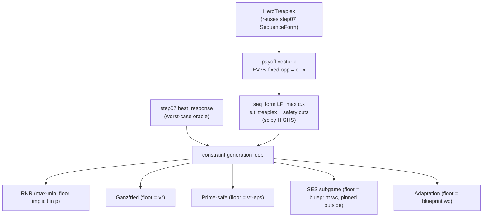

# Step 08 — Implementation: Safe Exploitation

Phase 4 of Step 08. The full build: **one sequence-form LP engine** and the **five
safe-exploitation solver families** on top of it, a safety checker + exploitation metrics,
the Step-7→Step-8 online pipeline, a teaching-attack stress test, an exact tournament, plots,
and a validation harness.

> **Written, not run.** Per [`../../workflow.md`](../../workflow.md), the agent wrote this code
> but did **not** execute it. Every "expected outcome" below is a **prediction / target to
> verify**, sourced from the raw step's Validation section
> ([`step_08_safe_exploitation.md`](../../../planning/rawSteps/step_08_safe_exploitation.md)
> L558–564) or from theory — never a claimed measurement. `consolidation/` is deliberately
> absent; write it after you have run this.

Everything **reuses Step 07's validated modules** (engines, exact best response, CFR Nash,
policy currency, opponent zoo, the `SequenceForm` treeplex) via [`deps.py`](deps.py). Nothing
foundational is re-implemented.

---

## The one idea

Every method here is the same optimization with a different safety constraint:

```
maximize   EV(hero vs opponent model)        # linear in the hero realization plan x:  c . x
subject to worst_case_value(hero) >= floor   # a minimax/safety constraint (per method)
and        x is a valid strategy             # sequence-form treeplex flow constraints
```

We solve the safety constraint by **constraint generation (double-oracle)**: solve the LP,
read the hero policy, call Step 07's **exact best response** as the worst-case opponent oracle,
and if the worst case is below the floor add the linear cut `c(adversary)·x ≥ floor` and
re-solve. The *floor* is the only thing that changes between methods.



---

## Module map (→ raw-step lines)

| Module | Role | Raw step |
|--------|------|----------|
| [`deps.py`](deps.py) | Path bootstrap onto Step 07's modules (append, so Step 08's same-named files shadow). | §6 workflow |
| [`seq_form.py`](seq_form.py) | **The new primitive.** `HeroTreeplex`: payoff vector, treeplex flow, `solve` (HiGHS LP with cuts + pins), realization plans, read-back to a policy. | L638 [P6] |
| [`safety_checker.py`](safety_checker.py) | `worst_case_value`, `exploitability`, `is_safe`, `safety_margin`, `game_value`. | L407–411 |
| [`exploitation_metrics.py`](exploitation_metrics.py) | `exploitation_value` (profit), `safety_violation`. | L412–415 |
| [`ganzfried_solver.py`](ganzfried_solver.py) | The **shared constraint-generation core** `safe_exploit(...)`; Ganzfried = floor `v*`. | L444–456 |
| [`rnr_solver.py`](rnr_solver.py) | Canonical RNR (max-min cutting-plane LP) **and** the naive p-blend, flagged. | L432–441 |
| [`prime_safe.py`](prime_safe.py) | Jeary prime-safe: floor `v*−ε`, ε measured from an early-stopped CFR baseline. | L470–479 |
| [`adaptation_safety.py`](adaptation_safety.py) | Ge: `is_adaptation_safe` checker + solver (floor = blueprint worst-case) + comparison. | L493–508 |
| [`subgame_exploit_solver.py`](subgame_exploit_solver.py) | SES gadget: pin outside-subgame play to blueprint, re-solve the subgame under the gadget floor. | L481–491 |
| [`pareto.py`](pareto.py) | Exploitation-safety frontier per method. | L397, L552 |
| [`pipeline.py`](pipeline.py) | Online Step-7 model → Step-8 solver → act loop; safety-violation tracking. | L512–516 |
| [`teaching_attack.py`](teaching_attack.py) | Deceptive opponent (bait → reveal); safe methods bounded. | L527–530, L537 |
| [`tournament.py`](tournament.py) | Exact method × opponent table + teaching attack; writes `results/`. | L517–525, L554 |
| [`plotting.py`](plotting.py) | Pareto frontier + method bars + teaching-attack curves (guarded). | L551–552 |
| [`config.py`](config.py) | `smoke` / `scale` sizing + the CPU/LP-bound compute note (GPU irrelevant). | §7 workflow |
| [`compare_openspiel.py`](compare_openspiel.py) | Mapping-free NashConv(uniform) cross-check of the BR engine (+ solved-strategy mapping TODO). | L533–536, L564 |
| [`validate.py`](validate.py) | PASS/FAIL harness against the raw-step targets. | L558–564 |

---

## How to verify (runbook)

Run from **this** folder (`implementation/step08/implementation/`). Requires Python 3.10+,
`numpy`, and `scipy` (the LP solver). `matplotlib` and `open_spiel` are optional.

```bash
# 0. dependencies
pip install numpy scipy            # matplotlib + open_spiel optional

# 1. module self-tests (each file has one; cheap sanity that APIs line up)
python seq_form.py                 # LP best response must equal step07's exact BR
python safety_checker.py
python exploitation_metrics.py
python ganzfried_solver.py
python rnr_solver.py
python prime_safe.py
python adaptation_safety.py
python subgame_exploit_solver.py   # Leduc; ~1-3 min
python pipeline.py

# 2. the validation harness (the real correctness gate)
python validate.py                 # prints PASS/FAIL/SKIP per raw-step target

# 3. the experiments (produce results/ + plots/)
python pareto.py --config smoke
python tournament.py --config smoke
python compare_openspiel.py        # SKIPs cleanly if OpenSpiel absent

# 4. scale up once smoke passes
python tournament.py --config scale
```

---

## Expected outcomes (PREDICTIONS — verify by running)

From the raw step's validation targets (L558–564). These are what *should* happen; `validate.py`
reports what *actually* happens.

- **seq-form LP ≡ exact BR.** `HeroTreeplex.full_best_response` must equal Step 07's
  `best_response_value` to < 1e-6 on Kuhn (both seats). If not, the LP/treeplex wiring is wrong
  and nothing downstream is trustworthy.
- **RNR endpoints.** Canonical RNR at `p=0` → exploitability ≈ 0 (it reduces to the maximin =
  Nash-safe); at `p=1` → exploitation value ≈ full best-response value. The sweep in between is
  monotone, and **canonical RNR dominates the naive blend** (more profit at equal exploitability).
- **Ganzfried.** Worst-case value ≥ Nash value `v*` within 0.001 (safe), and exploitation value
  ≥ Nash's EV vs the same opponent (profitable) for exploitable types; profit ≈ 0 vs Nash itself.
- **Prime-safe.** Measured ε(baseline) > 0 (the early-stopped CFR baseline is genuinely
  imperfect); the exploit's worst-case ≥ `v*−ε`; and the prime-safe floor numerically equals the
  baseline's own worst-case value.
- **Adaptation safety.** `exploitability(exploit) ≤ exploitability(blueprint)` for the solved
  strategy; and adaptation permits ≥ the exploitation Ganzfried does (weaker floor).
- **Subgame (Leduc).** The subgame solution differs from the blueprint inside the subgame,
  achieves ≥ EV vs the target, and never violates the gadget (worst-case ≥ blueprint worst-case).
- **Teaching attack.** Safe methods' post-switch mean stays near the Nash baseline (bounded loss);
  `full_br`'s is clearly worse; safety violations = 0 for safe methods, > 0 for `full_br`.
- **OpenSpiel.** NashConv(uniform) matches OpenSpiel within 0.001 (Kuhn) / 0.01 (Leduc) —
  validating the BR engine every safety number rests on.

---

## Likely to break (and where to look first)

- **Constraint-generation convergence.** The double-oracle loop (`safe_exploit`) assumes the
  inner best response finds a *strict* violator each iteration; near the floor, floating-point
  slack can stall it. Symptoms: `safe=False` with `iterations` hitting `max_iters`. Fixes: bump
  `tol`, raise `max_iters`, or (exact alternative) replace the loop with a one-shot dual-LP that
  encodes the worst-case constraint directly. This is the **#1 thing to watch**.
- **LP conditioning / degeneracy.** HiGHS can return a valid-but-degenerate vertex; the
  read-back `behavioral_table` divides by the parent realization weight and falls back to uniform
  at unreached info sets — fine for EV but can make a *printed* strategy look odd at zero-reach
  nodes. Compare `worst_case_value` (exact) rather than the table when in doubt.
- **Subgame predicate must be downward-closed.** `subgame_exploit` pins outside-subgame
  sequences to blueprint realization weights; if the predicate is *not* monotone along play
  (e.g. an ad-hoc info-set filter), a pinned descendant can sit below a freed ancestor and the
  LP becomes infeasible or wrong. The provided Leduc `round >= k` predicates are safe; new ones
  need the same property. (Kuhn's `whole_game` is a degenerate subgame == full adaptation solve.)
- **RNR canonical vs naive.** They are different algorithms (flagged loudly in `rnr_solver.py`).
  If the "RNR" curve looks like a plain blend, you are plotting the naive one.
- **Prime-safe ε provenance.** ε is *measured* from an early-stopped CFR baseline, never
  fabricated. If ε ≈ 0, the baseline trained too long — lower `epsilon_baseline_iters`. (Step 04's
  abstracted strategy is the "real" motivation but lives on an incompatible engine; we stay
  self-contained on purpose.)
- **Leduc runtime.** Bigger LP + full-tree BR each constraint-generation iteration. Keep Kuhn as
  the smoke default; for Leduc, raise `refit_every` / shorten `hands` in the online pipeline.
- **Same-named modules.** Step 08 ships `config/tournament/plotting/validate/compare_openspiel`
  that collide with Step 07's. `deps.py` **appends** Step 07 to `sys.path` so Step 08's own copies
  win; always run from this folder (or invoke the script directly) so its dir is `sys.path[0]`.

---

## Static self-review (what I'd check first on a real run)

- **Seat conventions.** All metrics are seat-aware via `seat_order`; the exploration/tournament
  default `hero=0` carries Kuhn's −1/18. Confirm the `hero=1` path (used in `seq_form._selftest`)
  also matches exact BR.
- **Payoff-vector correctness.** The whole step rides on `EV = c·x`. The `seq_form` self-test
  cross-checks `max c·x` against Step 07's exact BR for both seats and both games — this is the
  single most important sanity gate; run it first.
- **Floor equalities.** Prime-safe floor `v*−ε` should equal the baseline's worst-case; SES and
  adaptation both use `worst_case_value(blueprint)`. If prime-safe and a blueprint-based
  adaptation give the *same* number, that's expected when baseline == blueprint (documented in
  `targetedReading` Math Flag B), not a bug.
- **Cut validity.** Each generated cut is the payoff vector against a *specific* adversary BR; it
  is a valid lower bound on the true worst case. If a "safe" result still fails `is_safe`, the cut
  set is under-generated — check the loop's break condition and `tol`.
- **No fabricated numbers.** Every metric in the docs is labeled a prediction; the only ground
  truth is what `validate.py` prints on your machine.

---

## Key takeaways for the final summary

- **One LP engine, five constraints.** `seq_form.HeroTreeplex` + `ganzfried_solver.safe_exploit`
  are the whole backbone; RNR / Ganzfried / prime-safe / SES / adaptation differ only in the
  floor (and, for SES, in pinning play outside a subgame). This is the raw step's thesis made
  code: *exploitation = constrained optimization; the safety notion is the constraint.*
- **Best response is the worst-case oracle.** Step 07's exact BR powers both the objective
  (payoff vector) and the safety constraint (double-oracle cuts) — reuse, not reinvention.
- **Canonical RNR ≠ naive blend**, and the LP solvers dominate the blend on the Pareto frontier —
  the payoff of choosing *where* to deviate. Flagged explicitly per the workflow's "don't guess"
  rule.
- **The safety hierarchy is real and measurable:** Ganzfried (≥ v*) needs perfect Nash;
  prime-safe (≥ v*−ε) handles imperfect baselines with a *measured* ε; adaptation (≤ blueprint
  exploitability) is the practical, achievable one. Adaptation neutralizes the teaching attack.
- **Everything is 2-player zero-sum.** The safety floor exists because a Nash strategy guarantees
  `v*` against any opponent (minimax). That anchor vanishes for N > 2 — the explicit open problem
  this step hands to Contribution #2. Nothing here silently pretends otherwise.
- **Verify, don't trust.** The code is written to be *run and checked*; `validate.py` is the gate,
  and the numbers become real only after the human runs it.
