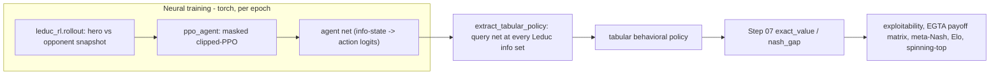

# Step 10 — Implementation: PBT League for Leduc + Evolutionary Game Theory

> Phase 4 of Step 10. The full, **unexecuted** implementation (WORKFLOW §0: *write everything,
> run nothing here*). Every number below is a **prediction / target to verify**, never a
> measured result. Built on the raw step's implementation plan
> ([`step_10_population_training_evo_gt.md`](../../../planning/rawSteps/step_10_population_training_evo_gt.md), L332–491).

Two halves:

1. **Evolutionary-GT analysis (exact, numpy):** replicator dynamics, the spinning-top
   transitive/cyclic decomposition, and the four canonical games — the *theory* lens.
2. **A neural PBT League on Leduc (torch) with exact evaluation:** AlphaStar-style roles +
   PBT + freezing, evaluated by EGTA / Elo / diversity — the *engineering* lens.

---

## The core design: neural training, exact evaluation

The league **trains** neural PPO agents by Leduc self-play rollouts, but **every reported
number** (exploitability, the empirical meta-game, meta-Nash, Elo, spinning-top ratio) is
computed **exactly**: each trained net is queried at every Leduc information set and turned into
a **tabular behavioral policy** ([`leduc_rl.extract_tabular_policy`](leduc_rl.py)), which is then
fed to Step 07's exact engine. So training is the only source of stochasticity; the metrics are
ground truth. Validity rests on Leduc's **perfect recall** (the same assumption behind Step 09's
`mixture_behavioral_policy`).



---

## Reused foundations (imported, never copied — WORKFLOW §6)

[`deps.py`](deps.py) appends **both** Step 09's and Step 07's `implementation/` to `sys.path`.
Step 10's own same-named modules (`config`, `evaluation`, `tournament`, `plotting`, `validate`)
shadow the prior steps' because the script directory is `sys.path[0]`.

- **Step 07** — [`engines.py`](../../step07/implementation/engines.py) (`make_game`, the exact
  Leduc engine via a safe `importlib` loader), [`best_response.py`](../../step07/implementation/best_response.py)
  (`exact_value`, `nash_gap`), [`nash.py`](../../step07/implementation/nash.py) (`solve_nash_cached`
  — the CFR ~0-exploitability reference), [`policies.py`](../../step07/implementation/policies.py)
  (`tabular_policy`, `uniform_policy`, `materialize`, `sample_action`).
- **Step 09** — [`psro.py`](../../step09/implementation/psro.py) (`PSRO`, `mixture_behavioral_policy`),
  [`meta_nash.py`](../../step09/implementation/meta_nash.py) (`solve_meta_nash` zero-sum LP),
  [`matrix_games.py`](../../step09/implementation/matrix_games.py) (PD + Stag Hunt reused by
  `evo_games`), [`learners.py`](../../step09/implementation/learners.py) (`torch_available` /
  `require_torch` lazy torch guard).

---

## Module map (→ raw-step line ranges)

| Module | 🔴/🟡/🟢 | What it is | raw |
|---|---|---|---|
| [`deps.py`](deps.py) | 🟢 | `sys.path` bootstrap for Step 09 + Step 07 | §6 |
| [`evo_games.py`](evo_games.py) | 🔴 | RPS + Hawk-Dove (new) + PD/Stag Hunt (reused); analytic ESS refs | L118-145, L353-405 |
| [`replicator.py`](replicator.py) | 🔴 | single/two-population replicator dynamics, ESS test, convergence/orbit | L353-380 |
| [`spinning_top.py`](spinning_top.py) | 🔴 | transitive+cyclic decomposition (**Hodge**, w/ SVD caveat), transitive ratio | L383-405 |
| [`leduc_rl.py`](leduc_rl.py) | 🔴 | info-state encoder, rollout, **net→tabular** extraction | L408-438 |
| [`ppo_agent.py`](ppo_agent.py) | 🔴 | masked episodic clipped-PPO + PBT explore/exploit primitives | L341-349, L408-438 |
| [`league.py`](league.py) | 🔴 | the 3-role PBT League: matchmaking, freezing, PBT step | L207-231, L408-438 |
| [`elo.py`](elo.py) | 🟡 | Elo ratings from exact expected scores (the meta-game readout) | L187-192, L346 |
| [`egta.py`](egta.py) | 🔴 | empirical game, meta-Nash, meta-Nash exploitability vs best individual | L269-297, L441-463 |
| [`diversity.py`](diversity.py) | 🟡 | effective population size, behavioral clustering, exploit coverage | L465-472 |
| [`config.py`](config.py) | 🟢 | `smoke` (CPU) / `scale` (5090) + `RUNTIME_NOTES` | L438 |
| [`evaluation.py`](evaluation.py) | 🟢 | the four suite runners (replicator / spinning-top / league / baselines) | L475-484 |
| [`tournament.py`](tournament.py) | 🟢 | runs suites, prints tables, writes `results/<config>_results.json` | L467-484 |
| [`plotting.py`](plotting.py) | 🟢 | guarded matplotlib: phase portraits, transitive ratios, exploitability curves | — |
| [`validate.py`](validate.py) | 🔴/🟢 | PASS/FAIL harness for the validation targets | L486-492 |

🔴 = core / thesis-relevant, 🟡 = supporting, 🟢 = infrastructure.

---

## Runbook (you run this — nothing was run here)

From this folder (`implementation/step10/implementation/`), Python 3.10+:

```bash
# 0. per-module self-tests (fast sanity; numpy-only ones run without torch)
python evo_games.py
python replicator.py
python spinning_top.py
python leduc_rl.py           # torch optional (uniform-net path works without training)
python ppo_agent.py          # SKIPs if torch absent
python egta.py
python diversity.py
python elo.py
python league.py             # SKIPs if torch absent (smoke: 3 epochs)

# 1. the validation harness (the real correctness gate)
python validate.py

# 2. the full tournament + plots
python tournament.py --config smoke        # fast; add --only replicator spinning_top for numpy-only
python tournament.py --config scale        # 100+ league epochs (raw L438); needs time / a GPU
python plotting.py --config smoke          # optional PNGs from the results JSON + config
```

- **Dependencies:** `numpy` (+ `scipy` for the exact meta-Nash LP; a numpy fictitious-play
  fallback exists), `torch` for the neural league/self-play (guarded — the exact suites always
  run), `matplotlib` optional for plots.
- **Artifacts:** `results/<config>_results.json`, `plots/*.png`, and `_cache/` (CFR Nash tables,
  via Step 07). All created on first run.

---

## Expected outcomes — **PREDICTIONS to verify** (WORKFLOW §0)

- **Replicator:** PD → all-Defect; Hawk-Dove → \(p(\text{Hawk})=0.5\); RPS → orbit (never
  converges); Stag Hunt → two basins by initial condition.
- **Spinning top:** RPS transitive ratio ≈ **0** (100% cyclic, **Hodge**); pure-skill ≈ **1**;
  the PSRO-Leduc meta-game clearly transitive (ratio well above 0). *(The raw-step rank-1 SVD
  would report ≈0.707 on RPS — see the [`spinning_top.py`](spinning_top.py) NOTE for why we use
  Hodge instead.)*
- **League:** main-agent exploitability **decreases** over epochs; the exploiters keep pressure
  on (nonzero exploit coverage); more than one policy stays active in the meta-Nash.
- **EGTA:** the population's **meta-Nash exploitability ≤ the best single agent's**
  exploitability (mixing beats any one policy).
- **Comparison on Leduc:** CFR Nash ≈ **0** (the floor); PSRO low after ~12–20 rounds; the
  league's meta-Nash exploitability *comparable in order* to PSRO (neural agents on a modest
  budget won't match exact PSRO — treat "comparable" as a trend, not equality); single self-play
  the weakest / most variable.

---

## Likely to break (called out for the runner)

- **`deps.py` name-shadowing.** Step 09's `psro.py` does `import deps`, which resolves to **Step
  10's** `deps.py` (script dir is `sys.path[0]`). That's intended — Step 10's `deps` appends both
  Step 07 (for `best_response`/`policies`) and Step 09 (for `meta_nash`). If you see
  `ModuleNotFoundError: meta_nash`/`best_response` while importing `psro`, the bootstrap didn't
  run first.
- **Neural-league cost & variance at `scale`.** 100+ epochs of Leduc self-play is the expensive
  part; the "exploitability decreases" curve is a *prediction*, not a guarantee — Leduc is small
  and mostly transitive, so gains over plain self-play may be modest (echoing Step 09's
  slow-Leduc-PSRO finding). A GPU helps the PPO updates, not the exact eval.
- **Leduc info-state encoder & net→tabular extraction.** The encoder must produce distinct
  features for distinct info sets, and `extract_tabular_policy` must cover **every** info set
  (both seats). Validity rests on Leduc perfect recall. If exploitability looks wrong, check the
  encoder (`leduc_rl.encode_info_set`) first.
- **Spinning-top decomposition choice.** If someone swaps in the SVD variant, the RPS validation
  will "fail" at ≈0.707 — that's the SVD artifact, not a bug in RPS. Keep the Hodge default.
- **scipy absent.** `solve_meta_nash` falls back to fictitious play (slower, approximate);
  meta-Nash exploitability may be marginally noisier.
- **Action masking + entropy.** Illegal-action logits use a *finite* `-1e9` (not `-inf`) so
  `0 * (-1e9)` stays finite in the entropy term — do not change to `-inf`.

---

## Static self-review (what I'd check first if a number looks off)

- **Zero-sum antisymmetry** of `egta.symmetric_payoff_matrix` (M ≈ −Mᵀ) — a broken sign here
  poisons meta-Nash, Elo, and the spinning top at once.
- **`extract_tabular_policy` coverage:** does `materialize` over both seats hit the same info-set
  count as `solve_nash` reports for Leduc?
- **Masked log-probs consistency:** `ppo_agent.act` (sampling) and `ppo_agent.update`
  (recompute) must both mask with the same `-1e9`, else the PPO ratio is wrong.
- **PFSP direction:** weights should be *higher* for opponents that **beat** the agent
  (`(1 - winrate)^p`), not lower.
- **Replicator renormalization:** the discrete Euler step leaves the simplex slightly; the
  defensive renormalize is intended (the RPS orbit may drift a hair but must not converge).
- **Elo transitivity assumption:** near-equal ratings in a cyclic population is *correct*, not a
  bug.

---

## Key takeaways for the final summary

- **The bridge that makes this trustworthy:** neural training + exact tabular evaluation via
  Step 07's engine — no Monte-Carlo noise in any reported metric.
- **Evolutionary GT is the diagnostic layer:** replicator dynamics (convergence vs cycling) and
  the spinning-top ratio (skill vs RPS) tell you *whether* population methods can work on a game
  before you spend compute.
- **The league is artificial selection:** three roles + freezing + PFSP keep the population
  diverse; exploiters are the population-level analog of Step 7/8 opponent modeling + safe
  exploitation — but with only heuristic safety (Contribution-#2 gap).
- **EGTA meta-Nash exploitability is the evaluation metric** (Contribution #3): the multi-agent
  generalization of exploitability, predicted ≤ the best individual agent.
- **Leduc is mostly transitive**, so expect the league to help modestly here and to matter far
  more on Step 11's cyclic FFA games — a prediction the spinning-top ratio will settle.
