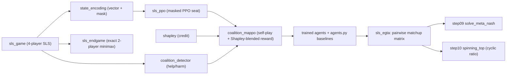

# Step 11 — Implementation: Coalition-Aware Multi-Agent Training for So Long Sucker

> Phase 4 of Step 11. The full, **unexecuted** implementation (WORKFLOW §0: *write everything, run
> nothing here*). Every number below is a **prediction / target to verify**, never a measured
> result. Built on the raw step's implementation plan
> ([`step_11_coalition_formation_ffa.md`](../../../planning/rawSteps/step_11_coalition_formation_ffa.md),
> L333-561).

Two halves:

1. **The exact / torch-free core (numpy):** a native SLS engine + a 2-player endgame minimax
   oracle, the coalition detector (help/harm), the Shapley machinery, and the EGTA projected
   meta-game + spinning-top decomposition. These run without torch and carry all correctness
   checks except the training comparison.
2. **The neural coalition-aware trainer (torch):** a masked episodic PPO per seat, trained by
   4-player self-play with a **Shapley-blended reward**, compared against the sparse baseline.

---

## The one architectural shift from Steps 7-10 (why there is no exploitability here)

Steps 7-10 evaluated **2-player** games EXACTLY (net → tabular → Step 07 best response →
exploitability). **SLS is 4-player FFA**: raw L320-329 states Nash / exploitability are both
intractable and strategically meaningless. So:

- there is **no exact best-response oracle and no exploitability number** for the 4-player game;
- evaluation is **empirical** — win-rate vs random, coalition scores, the EGTA payoff tensor, and
  the spinning-top ratio on a **projected pairwise** matrix;
- the **only** exact anchor is the **2-player endgame** ([`sls_endgame.py`](sls_endgame.py)),
  solved by minimax (pending the De Carufel & Jerade theorem cross-check flagged in the endgame
  module and the reading summary).



---

## Reused foundations (imported, never copied — WORKFLOW §6)

[`deps.py`](deps.py) appends **Step 10's** and **Step 09's** `implementation/` to `sys.path`;
Step 11's own same-named modules (`config`, `evaluation`, `tournament`, `plotting`, `validate`)
shadow the prior steps' because the script directory is `sys.path[0]`.

- **Step 10** — [`spinning_top.py`](../../step10/implementation/spinning_top.py)
  (`transitive_ratio`, `cyclic_ratio`, `spinning_top_decomposition` — the **Hodge** split on the
  projected pairwise matrix).
- **Step 09** — [`meta_nash.py`](../../step09/implementation/meta_nash.py) (`solve_meta_nash` on
  that matrix), [`learners.py`](../../step09/implementation/learners.py) (`torch_available` /
  `require_torch`).

**Not reused:** Step 07 (no exact solver applies to N=4); Step 09/10 PPO (one-step / 2-player) —
`sls_ppo.py` is new (sequential, variable-length, masked, 4-player). Step 10's `egta.py` is *not*
imported (it is 2-player-specific); `sls_egta.py` uses `meta_nash` + `spinning_top` directly.

---

## Module map (→ raw-step line ranges; 🔴 core/thesis, 🟡 support, 🟢 infra)

| Module | 🔴/🟡/🟢 | What it is | raw |
|---|---|---|---|
| [`deps.py`](deps.py) | 🟢 | `sys.path` bootstrap for Step 10 + Step 09 | §6 |
| [`sls_game.py`](sls_game.py) | 🟡 | native SLS engine (chips, piles, capture, elimination); `MoveEvent` log | L354-382, L547 |
| [`sls_endgame.py`](sls_endgame.py) | 🔴 | exact 2-player endgame minimax + optimal-play consistency check | L195-207, L382, L557 |
| [`state_encoding.py`](state_encoding.py) | 🟡 | egocentric feature vector + fixed action space + legal mask | L354-382 |
| [`coalition_detector.py`](coalition_detector.py) | 🔴 | help/harm matrices → coalition scores, timeline, hand-crafted-log check | L384-424, L548 |
| [`shapley.py`](shapley.py) | 🔴 | exact + MC Shapley; win-prob & proxy coalition values; reference games | L114-159, L322-323, L427-465, L549 |
| [`sls_ppo.py`](sls_ppo.py) | 🔴 | masked episodic clipped-PPO for one seat + policy adapter | L467-499 |
| [`coalition_mappo.py`](coalition_mappo.py) | 🔴 | 4-agent self-play with Shapley-blended reward (`α·sparse + (1-α)·shapley`) | L467-499, L550 |
| [`sls_egta.py`](sls_egta.py) | 🔴 | 4-player payoff tensor → pairwise projection → meta-Nash + spinning-top | L501-529, L551-552 |
| [`agents.py`](agents.py) | 🟡 | baselines: random, greedy-capture, fixed-ally, betrayer | L106-110, L349, L533-538 |
| [`config.py`](config.py) | 🟢 | `smoke` (CPU) / `scale` (5090) + `RUNTIME_NOTES` | §7, L438, L495 |
| [`evaluation.py`](evaluation.py) | 🟢 | the five suite runners (env / detector / shapley / training / egta) | L556-561 |
| [`tournament.py`](tournament.py) | 🟢 | runs suites, prints the comparison table, writes `results/<config>_results.json` | L533-538 |
| [`plotting.py`](plotting.py) | 🟢 | guarded matplotlib: coalition timeline, Shapley attribution, spinning-top, coalition graph | L540-544 |
| [`validate.py`](validate.py) | 🔴/🟢 | PASS/FAIL harness for the validation targets | L556-561 |

---

## Runbook (you run this — nothing was run here)

From this folder (`implementation/step11/implementation/`), Python 3.10+:

```bash
# 0. per-module self-tests (fast; numpy-only ones run without torch)
python sls_game.py
python sls_endgame.py          # exact 2-player minimax (keep chips small)
python state_encoding.py
python coalition_detector.py
python shapley.py
python agents.py
python sls_egta.py             # baseline pool -> pairwise matrix -> spinning top + meta-Nash
python sls_ppo.py              # SKIPs if torch absent
python coalition_mappo.py      # SKIPs if torch absent (tiny 16-game smoke)

# 1. the validation harness (the real correctness gate)
python validate.py --config smoke                 # add --no-training to skip the torch check
python validate.py --config smoke --no-training    # numpy-only: checks 1,2,3,5

# 2. the full tournament + plots
python tournament.py --config smoke                 # env+detector+shapley+training+egta
python tournament.py --config smoke --only env detector shapley egta   # torch-free subset
python tournament.py --config scale                 # 6000-game training (raw L495); ~1.5-2.5 h
python plotting.py --config smoke                   # optional PNGs from the results JSON + a sample game
```

- **Dependencies:** `numpy` (+ `scipy` for the exact meta-Nash LP and the core-feasibility LP — a
  fictitious-play fallback exists for meta-Nash); `torch` for the neural trainer (guarded — every
  other suite runs without it); `matplotlib` optional for plots.
- **Artifacts:** `results/<config>_results.json`, `plots/*.png`. Created on first run.

---

## How to verify — pass/fail thresholds (targets, framed per WORKFLOW §0)

| # | Check | Target | Source |
|---|---|---|---|
| 1 | SLS env | 2-player endgame matches exact minimax (0 mismatches); all random games terminate; rewards zero-sum | raw L557 |
| 2 | Coalition detection | planted cooperating pair `{0,1}` is the strongest detected pair | raw L558 |
| 3 | Shapley | glove `=(2/3,1/6,1/6)`, majority `=(1/3,1/3,1/3)`; symmetric SLS credit spread `<0.15`; asymmetric strong-pair credit `>` weak-pair | raw L559 |
| 4 | Coalition-aware training | Shapley agents' mean coalition score `>` sparse agents' (winning is *secondary*) | raw L560 |
| 5 | Spinning top | SLS projected meta-game **cyclic** dominates (cyclic_ratio `>` transitive_ratio, i.e. cyclic component `>50%`) | raw L561 |

---

## Expected outcomes — **PREDICTIONS to verify** (WORKFLOW §0)

- **Env.** Random games terminate in tens of turns; a fair chunk may end by the `max_turns`
  tie-break rather than true last-player-standing (a modeling simplification — see `sls_game.py`
  NOTEs). The 2-player endgame minimax is self-consistent; **whether it matches De Carufel &
  Jerade's theorems is still to be checked against the paper.**
- **Detector.** On the planted log the `{0,1}` score is clearly the largest; on *random* self-play
  the matrix is near-zero noise (no structure).
- **Shapley.** Reference games hit the exact values; symmetric SLS credit ≈ `[0.25]*4`; asymmetric
  `[8,8,1,1]` concentrates credit on P0,P1 with `v({0,1})≈1`.
- **Coalition-aware training (the headline).** Shapley-reward agents should show a **higher mean
  coalition score** than sparse agents (raw L560) — the primary success signal. Win-rate-vs-random
  may or may not improve (secondary); do not over-read it.
- **Spinning top (the Step-10 hand-off).** SLS's projected meta-game should be **cyclic-heavy**
  (cyclic_ratio well above transitive_ratio), confirming FFA coalition dynamics are non-transitive
  (raw L561) — the opposite of Leduc's mostly-transitive meta-game in Step 10.

---

## Likely to break (called out for the runner)

- **SLS rule simplifications vs the paper.** `sls_game.py` flags three simplifications
  (`# NOTE (a) capturer-plays-next`, `(b) empty-hand skip`, `(c) max_turns tie-break`). If endgame
  outcomes disagree with De Carufel & Jerade, reconcile these **first** — the mismatch is far more
  likely a rule gap than a solver bug (WORKFLOW §0.1).
- **Endgame tree size.** `optimal_winner` is exhaustive minimax; it is only tractable for SMALL
  chip counts. Keep `endgame_chips` at 2 (smoke) / 3 (scale). Bumping it can blow up memory/time.
- **`MAX_PILES` cap in `state_encoding`.** If a game ever exceeds `MAX_PILES=10` live piles, extra
  piles are not addressable and the `new-pile` action slot could collide. Unlikely at 4×7 SLS; if
  you see odd masking, raise `MAX_PILES`.
- **Shapley-credit is a PROXY in training.** `coalition_mappo` uses `proxy_coalition_values` (a
  synergy-weighted sum of critic value estimates), **not** the true counterfactual win-probability
  (too costly per game). If coalition scores do not separate Shapley from sparse, this proxy is the
  first suspect — try the rollout-based value (used in `validate.py`'s Shapley check) at lower
  frequency, or tune `alpha`.
- **Monte-Carlo noise in the Shapley check.** `symmetric_spread < 0.15` can flake at low
  `shapley_rollouts`; raise it before declaring a FAIL.
- **`solve_meta_nash` without scipy.** Falls back to fictitious play (approximate); the spinning-top
  ratio itself is scipy-free, so check 5 is unaffected, but the meta-Nash mixture may be noisier.
- **Self-play cost at `scale`.** SLS rollouts are pure-Python/CPU-bound; the 5090 accelerates only
  the PPO minibatch math. If the 6000-game train dominates, lower `train_games` — the Shapley >
  sparse coalition-score direction should appear well before then.
- **Masked-logits sentinel.** Illegal logits use finite `-1e9` (not `-inf`) so `0*(-1e9)` in the
  entropy term stays finite (Step 10 lesson). Do not change to `-inf`.

---

## Static self-review (what I checked by reading — could not run anything)

- **Import graph resolves.** Every intra-step import (`sls_game`, `state_encoding`,
  `coalition_detector`, `shapley`, `sls_ppo`, `coalition_mappo`, `sls_egta`, `agents`,
  `evaluation`) plus the two reused modules (`spinning_top` from Step 10, `meta_nash`/`learners`
  from Step 09 via `deps.py`) are defined and named consistently. `deps` is imported before any
  Step-09/10 name in `sls_ppo`, `coalition_mappo`, `sls_egta`.
- **torch is only touched lazily.** `learners` imports torch inside functions; `sls_ppo`/
  `coalition_mappo` import cleanly without torch and only fail on *instantiation*; every torch
  path (`run_training_comparison`, the two `_selftest`s) guards with `torch_available()` and SKIPs.
  So checks 1,2,3,5 and all numpy self-tests run torch-free.
- **Action encoding round-trips.** `move_to_action_index` ∘ `action_index_to_move` is the identity
  on legal actions, and every legal engine action sets exactly one mask bit (asserted in
  `state_encoding._selftest`).
- **Reward is zero-sum.** `winner_rewards` sums to 0; the Shapley blend centers the credit
  (`credit - credit.mean()`) so `α·sparse + (1-α)·centered` stays zero-sum — checked by hand.
- **Engine terminates.** Each capture strictly kills one chip and non-capturing play is bounded by
  chips-in-hand, so the tree is finite; `max_turns` + a tie-break guarantees termination even in a
  deadlock. The `sls_game._selftest` asserts termination + zero-sum over 20 random games.
- **Shapley correctness.** The weight-form `exact_shapley` and the permutation `mc_shapley` agree
  in expectation; the two reference games (glove, majority) are exact unit checks; `shapley_credit`
  reuses the same value dict to avoid recomputation.
- **Antisymmetry into the spinning top.** `pairwise_matchup_matrix` fills `M[i][j]=m, M[j][i]=-m`,
  so `spinning_top` receives a genuinely antisymmetric matrix (its Hodge ratio then obeys
  `t²+c²≈1`, as in Step 10).
- **Most likely to actually break on first run:** the SLS *rule* fidelity (endgame vs the paper)
  and whether the *proxy* Shapley signal is strong enough to separate the coalition scores — both
  are flagged above and are genuine, not-yet-verifiable risks.

---

## Key takeaways for the final summary

- **A native, terminating SLS engine with an exact 2-player anchor** is the reusable testbed; its
  rule simplifications are explicitly flagged for reconciliation with De Carufel & Jerade.
- **Coalition detection = opponent modeling on a new observation space** (help/harm from chip
  placement) — Contribution #1 lifted to social structure; it fires cleanly on planted logs.
- **Shapley credit adapted to a competitive game** (coalition value = win-probability, exact for
  N=4) is the dense signal; the training trainer blends it with the sparse outcome, and the
  primary success metric is the **coalition score**, not win rate (raw L560).
- **Evaluation is empirical, not exploitability-based** (Contribution #3): the EGTA payoff tensor
  projected to a pairwise matrix, read with Step 10's spinning-top — predicted **cyclic-heavy**,
  the FFA counterpart to Leduc's transitive meta-game.
- **The thesis gap crystallizes** (Contribution #2): with an empty core (coalitions inherently
  unstable) and no Nash baseline, the "safe" strategy in N-player FFA must be behavioral/
  population-based (piKL) — the open problem this step frames but does not solve.
